# PWNOS：2.0

下载地址：https://download.vulnhub.com/pwnos/pWnOS_v2.0.7z

## 实战演练

靶机的IP为静态地址10.10.10.100

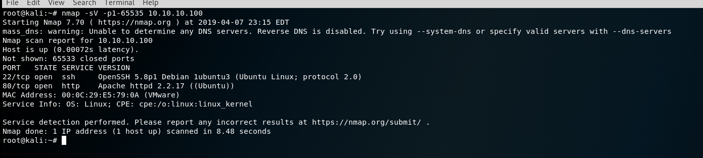

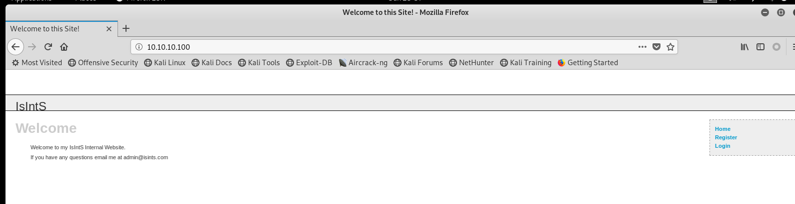

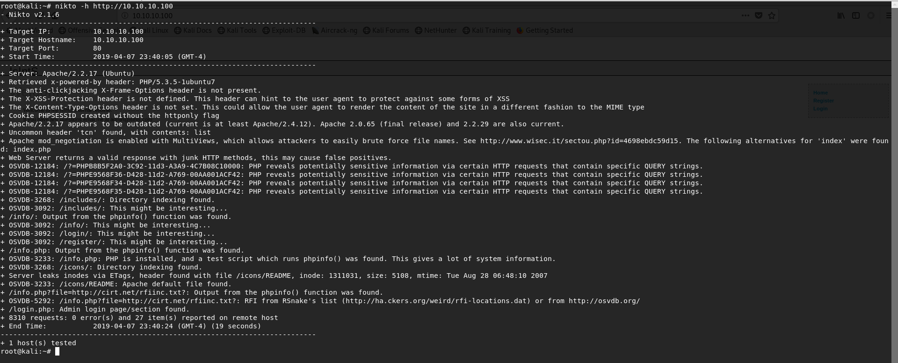

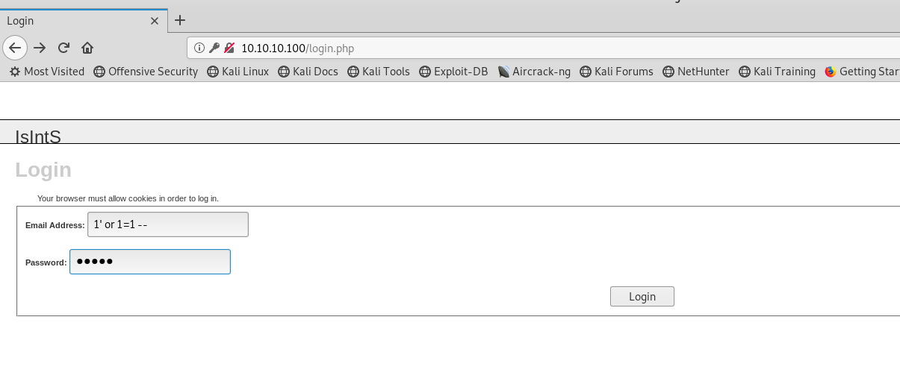

这里面有注入漏洞，sqlmap跑一下

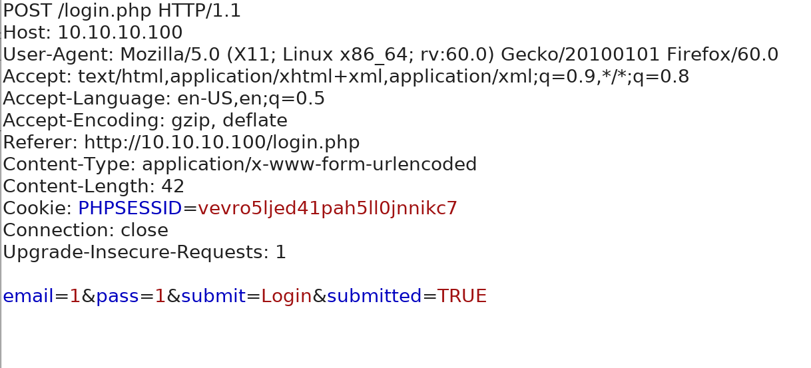

注入漏洞

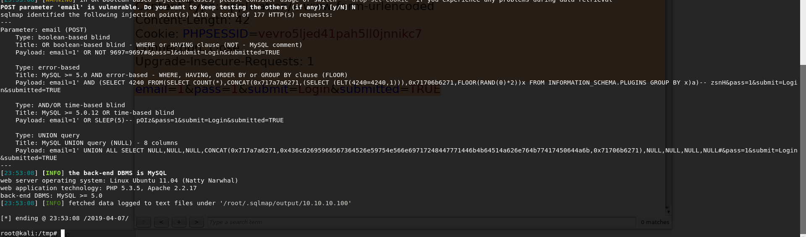

写入反弹shell

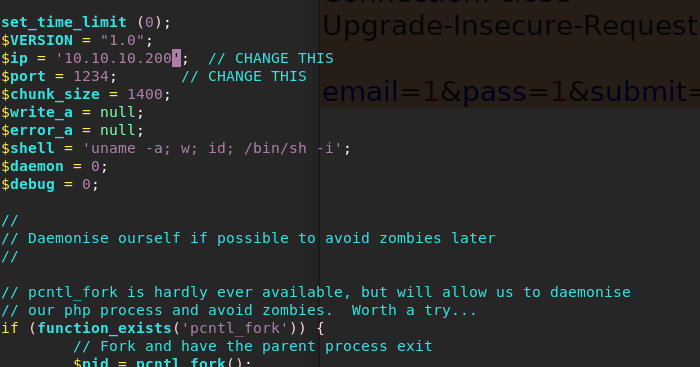

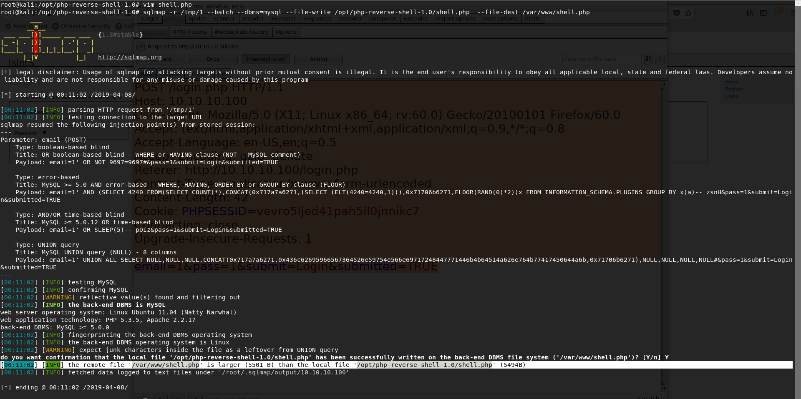

nc监听

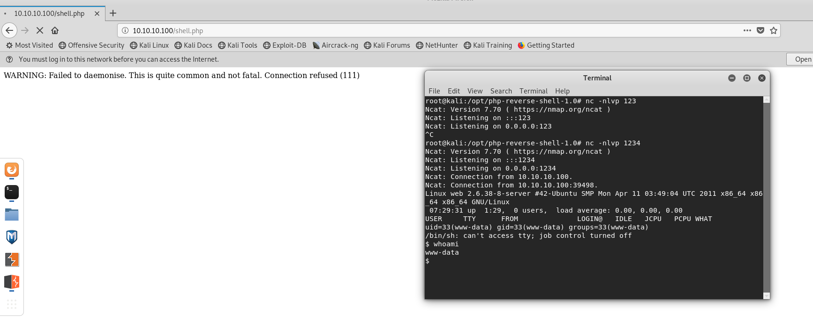

查找密码，找到了这个密码不能登录

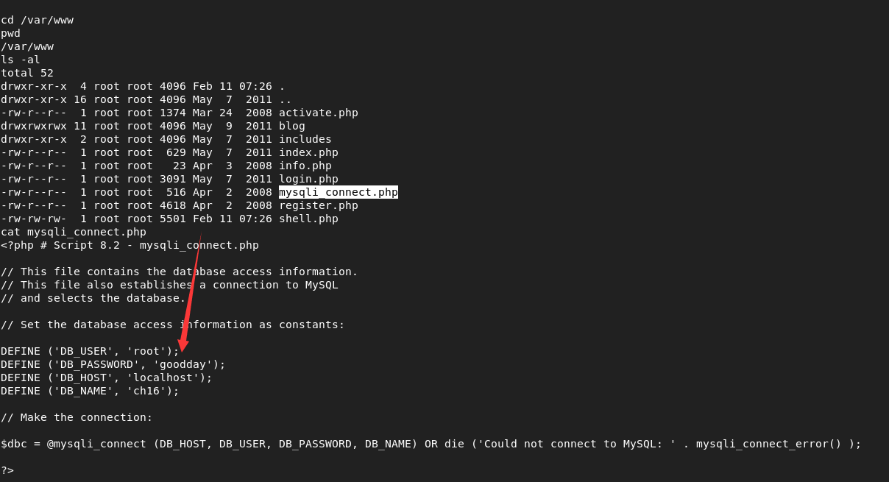

找到了这个密码，可以登录

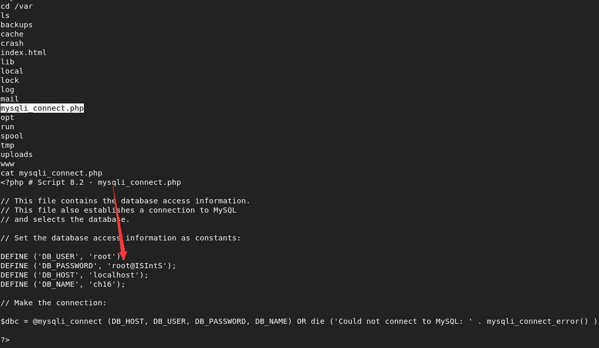

另外一种思路

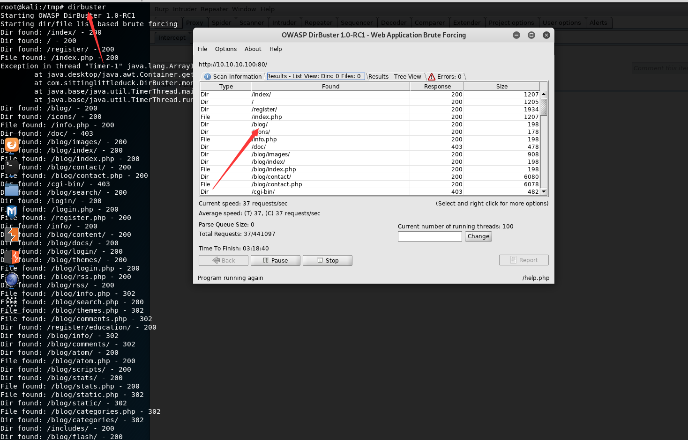

blog系统版本

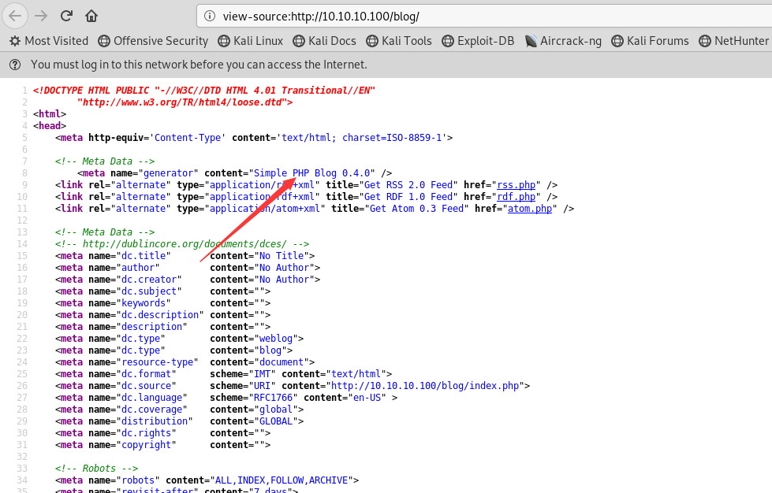

查找漏洞的版本

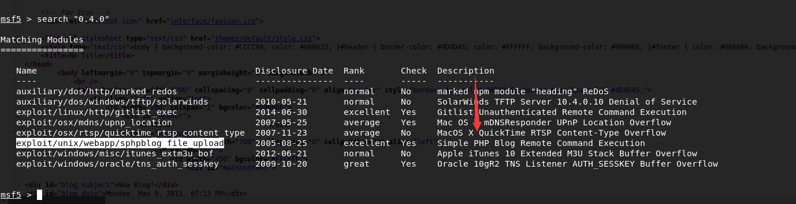

使用exp

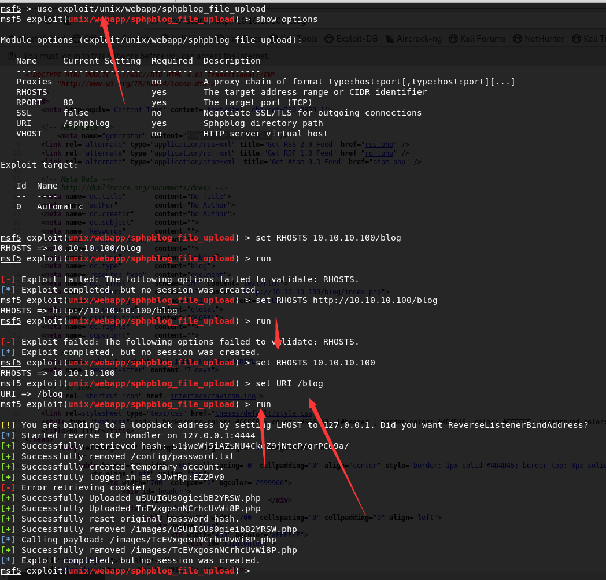

不知道为什么没有生成cookie，就这样把。。。
