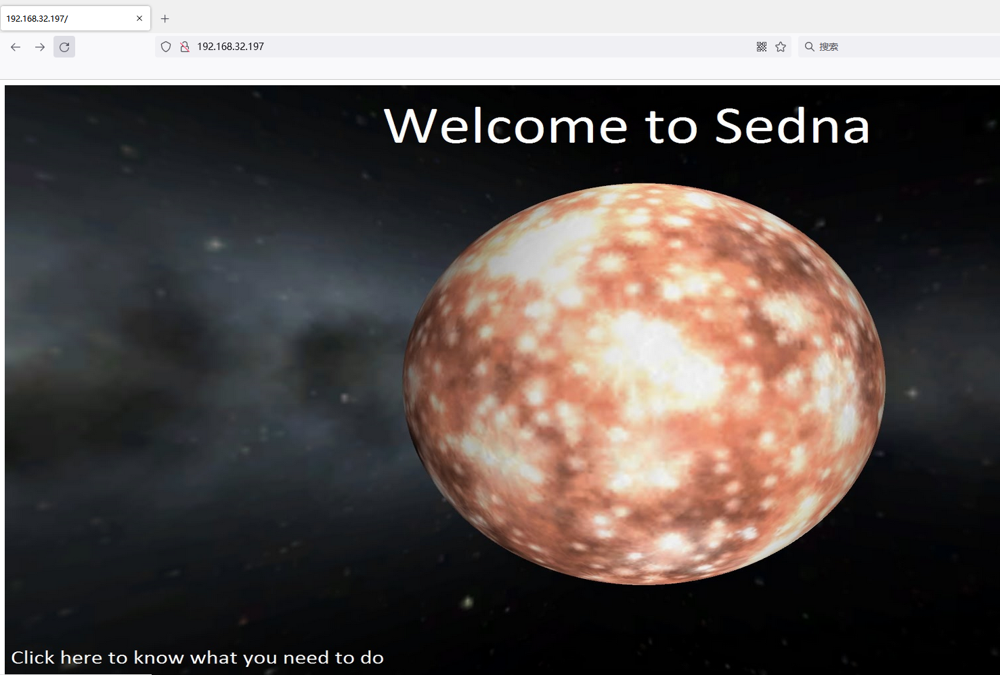
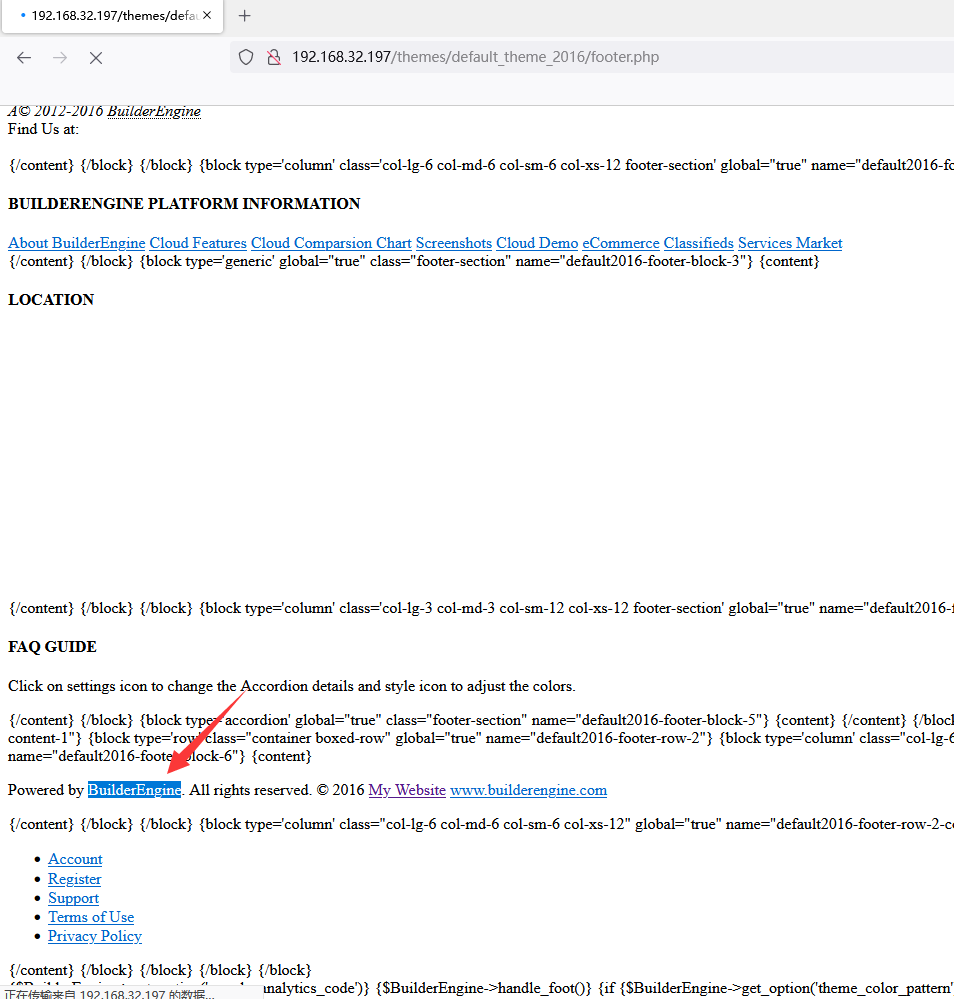
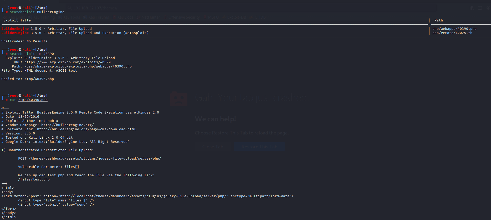
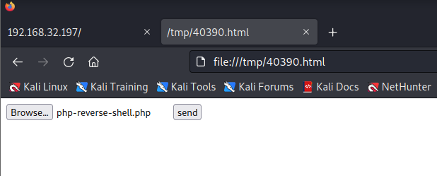
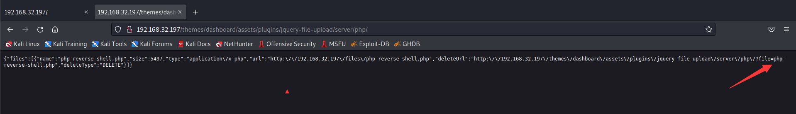
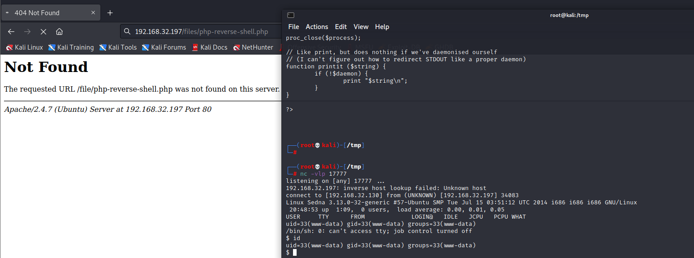
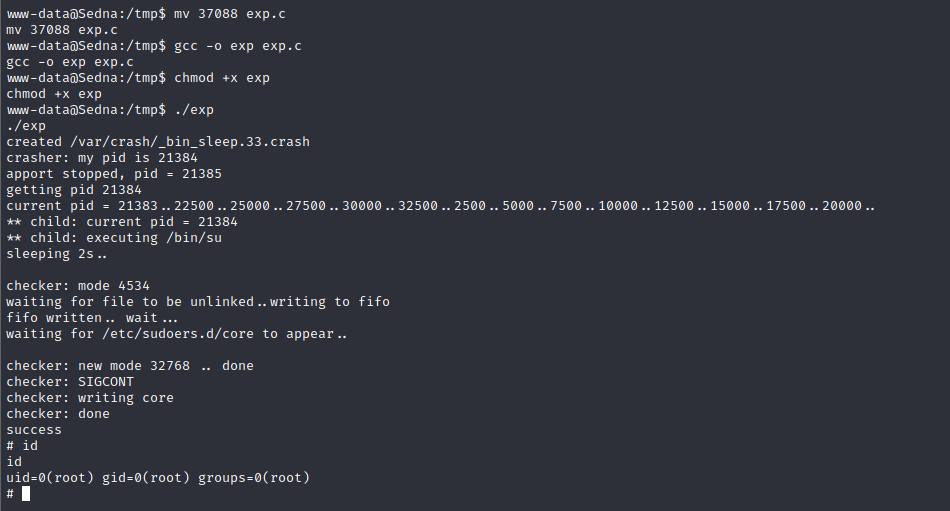

# Sedna

> https://download.vulnhub.com/hackfest2016/Sedna.ova

靶场IP：`192.168.32.197`

扫描对外端口服务

```
┌──(root💀kali)-[/tmp]
└─# nmap -p 1-65535 -sV 192.168.32.197
Starting Nmap 7.92 ( https://nmap.org ) at 2022-09-02 03:56 EDT
Nmap scan report for 192.168.32.197
Host is up (0.0017s latency).
Not shown: 65523 closed tcp ports (reset)
PORT      STATE SERVICE     VERSION
22/tcp    open  ssh         OpenSSH 6.6.1p1 Ubuntu 2ubuntu2 (Ubuntu Linux; protocol 2.0)
53/tcp    open  domain      ISC BIND 9.9.5-3 (Ubuntu Linux)
80/tcp    open  http        Apache httpd 2.4.7 ((Ubuntu))
110/tcp   open  pop3        Dovecot pop3d
111/tcp   open  rpcbind     2-4 (RPC #100000)
139/tcp   open  netbios-ssn Samba smbd 3.X - 4.X (workgroup: WORKGROUP)
143/tcp   open  imap        Dovecot imapd (Ubuntu)
445/tcp   open  netbios-ssn Samba smbd 3.X - 4.X (workgroup: WORKGROUP)
993/tcp   open  ssl/imaps?
995/tcp   open  ssl/pop3s?
8080/tcp  open  http        Apache Tomcat/Coyote JSP engine 1.1
48824/tcp open  status      1 (RPC #100024)
MAC Address: 00:0C:29:0E:11:4D (VMware)
Service Info: Host: SEDNA; OS: Linux; CPE: cpe:/o:linux:linux_kernel

Service detection performed. Please report any incorrect results at https://nmap.org/submit/ .
Nmap done: 1 IP address (1 host up) scanned in 17.71 seconds

```

访问80端口



爆破web目录

```
┌──(root💀kali)-[/tmp]
└─# dirb http://192.168.32.197                       

-----------------
DIRB v2.22    
By The Dark Raver
-----------------

START_TIME: Fri Sep  2 04:25:23 2022
URL_BASE: http://192.168.32.197/
WORDLIST_FILES: /usr/share/dirb/wordlists/common.txt

-----------------

GENERATED WORDS: 4612                                                          

---- Scanning URL: http://192.168.32.197/ ----
==> DIRECTORY: http://192.168.32.197/blocks/                                                                                                                                                                                                
==> DIRECTORY: http://192.168.32.197/files/                                                                                                                                                                                                 
+ http://192.168.32.197/index.html (CODE:200|SIZE:101)                                                                                                                                                                                      
==> DIRECTORY: http://192.168.32.197/modules/                                                                                                                                                                                               
+ http://192.168.32.197/robots.txt (CODE:200|SIZE:36)                                                                                                                                                                                       
+ http://192.168.32.197/server-status (CODE:403|SIZE:294)                                                                                                                                                                                   
==> DIRECTORY: http://192.168.32.197/system/                                                                                                                                                                                                
==> DIRECTORY: http://192.168.32.197/themes/                                                                                                                                                                                                
                                                                                                                                                                                                                                            
---- Entering directory: http://192.168.32.197/blocks/ ----
(!) WARNING: Directory IS LISTABLE. No need to scan it.                        
    (Use mode '-w' if you want to scan it anyway)
                                                                                                                                                                                                                                            
---- Entering directory: http://192.168.32.197/files/ ----
(!) WARNING: Directory IS LISTABLE. No need to scan it.                        
    (Use mode '-w' if you want to scan it anyway)
                                                                                                                                                                                                                                            
---- Entering directory: http://192.168.32.197/modules/ ----
(!) WARNING: Directory IS LISTABLE. No need to scan it.                        
    (Use mode '-w' if you want to scan it anyway)
                                                                                                                                                                                                                                            
---- Entering directory: http://192.168.32.197/system/ ----
==> DIRECTORY: http://192.168.32.197/system/core/                                                                                                                                                                                           
==> DIRECTORY: http://192.168.32.197/system/database/                                                                                                                                                                                       
==> DIRECTORY: http://192.168.32.197/system/fonts/                                                                                                                                                                                          
==> DIRECTORY: http://192.168.32.197/system/helpers/                                                                                                                                                                                        
+ http://192.168.32.197/system/index.html (CODE:200|SIZE:142)                                                                                                                                                                               
==> DIRECTORY: http://192.168.32.197/system/language/                                                                                                                                                                                       
==> DIRECTORY: http://192.168.32.197/system/libraries/                                                                                                                                                                                      
                                                                                                                                                                                                                                            
---- Entering directory: http://192.168.32.197/themes/ ----
(!) WARNING: Directory IS LISTABLE. No need to scan it.                        
    (Use mode '-w' if you want to scan it anyway)
                                                                                                                                                                                                                                            
---- Entering directory: http://192.168.32.197/system/core/ ----
==> DIRECTORY: http://192.168.32.197/system/core/compat/                                                                                                                                                                                    
+ http://192.168.32.197/system/core/index.html (CODE:200|SIZE:142)                                                                                                                                                                          
                                                                                                                                                                                                                                            
---- Entering directory: http://192.168.32.197/system/database/ ----
==> DIRECTORY: http://192.168.32.197/system/database/drivers/                                                                                                                                                                               
+ http://192.168.32.197/system/database/index.html (CODE:200|SIZE:142)                                                                                                                                                                      
                                                                                                                                                                                                                                            
---- Entering directory: http://192.168.32.197/system/fonts/ ----
+ http://192.168.32.197/system/fonts/index.html (CODE:200|SIZE:142)                                                                                                                                                                         
                                                                                                                                                                                                                                            
---- Entering directory: http://192.168.32.197/system/helpers/ ----
+ http://192.168.32.197/system/helpers/index.html (CODE:200|SIZE:142)                                                                                                                                                                       
                                                                                                                                                                                                                                            
---- Entering directory: http://192.168.32.197/system/language/ ----
==> DIRECTORY: http://192.168.32.197/system/language/english/                                                                                                                                                                               
+ http://192.168.32.197/system/language/index.html (CODE:200|SIZE:142)                                                                                                                                                                      
                                                                                                                                                                                                                                            
---- Entering directory: http://192.168.32.197/system/libraries/ ----
+ http://192.168.32.197/system/libraries/index.html (CODE:200|SIZE:142)                                                                                                                                                                     
                                                                                                                                                                                                                                            
---- Entering directory: http://192.168.32.197/system/core/compat/ ----
+ http://192.168.32.197/system/core/compat/index.html (CODE:200|SIZE:142)                                                                                                                                                                   
                                                                                                                                                                                                                                            
---- Entering directory: http://192.168.32.197/system/database/drivers/ ----
+ http://192.168.32.197/system/database/drivers/index.html (CODE:200|SIZE:142)                                                                                                                                                              
==> DIRECTORY: http://192.168.32.197/system/database/drivers/mssql/                                                                                                                                                                         
==> DIRECTORY: http://192.168.32.197/system/database/drivers/mysql/                                                                                                                                                                         
==> DIRECTORY: http://192.168.32.197/system/database/drivers/odbc/                                                                                                                                                                          
                                                                                                                                                                                                                                            
---- Entering directory: http://192.168.32.197/system/language/english/ ----
+ http://192.168.32.197/system/language/english/index.html (CODE:200|SIZE:142)                                                                                                                                                              
                                                                                                                                                                                                                                            
---- Entering directory: http://192.168.32.197/system/database/drivers/mssql/ ----
+ http://192.168.32.197/system/database/drivers/mssql/index.html (CODE:200|SIZE:142)                                                                                                                                                        
                                                                                                                                                                                                                                            
---- Entering directory: http://192.168.32.197/system/database/drivers/mysql/ ----
+ http://192.168.32.197/system/database/drivers/mysql/index.html (CODE:200|SIZE:142)                                                                                                                                                        
                                                                                                                                                                                                                                            
---- Entering directory: http://192.168.32.197/system/database/drivers/odbc/ ----
+ http://192.168.32.197/system/database/drivers/odbc/index.html (CODE:200|SIZE:142)                                                                                                                                                         
                                                                                                                                                                                                                                            
-----------------
END_TIME: Fri Sep  2 04:26:32 2022
DOWNLOADED: 64568 - FOUND: 16

```

找到BuilderEngine的web框架。



发现一个未授权文件上传漏洞



复制html，修改localhost地址为靶场IP,浏览器本地访问



可以看到已经上传成功



访问：http://192.168.32.197/files/php-reverse-shell.php。连接反弹shell



```
python -c 'import pty;pty.spawn("/bin/bash")'
```

使用CVE-2015-1325漏洞进行提权



使用CVE-2015-1328进行提权


