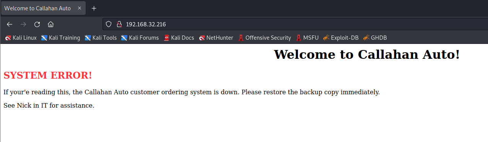

# TOMMY BOY: 1

> https://download.vulnhub.com/tommyboy/TommyBoy1dot0.ova

靶场IP：`192.168.32.216`

扫描对外端口服务

```
┌──(root💀kali)-[/tmp]
└─# nmap -p 1-65535 -sV  192.168.32.216                                                                                                                                                                                                
Starting Nmap 7.92 ( https://nmap.org ) at 2022-09-08 05:40 EDT
Nmap scan report for 192.168.32.216
Host is up (0.00066s latency).
Not shown: 65531 closed tcp ports (reset)
PORT      STATE SERVICE VERSION
22/tcp    open  ssh     OpenSSH 7.2p2 Ubuntu 4ubuntu1 (Ubuntu Linux; protocol 2.0)
80/tcp    open  http    Apache httpd 2.4.18 ((Ubuntu))
8008/tcp  open  http    Apache httpd 2.4.18 ((Ubuntu))
65534/tcp open  ftp     ProFTPD
MAC Address: 00:0C:29:A5:C1:85 (VMware)
Service Info: OS: Linux; CPE: cpe:/o:linux:linux_kernel

Service detection performed. Please report any incorrect results at https://nmap.org/submit/ .
Nmap done: 1 IP address (1 host up) scanned in 17.85 seconds

```

访问80端口



访问8008端口

