# Troll 1

> https://download.vulnhub.com/tr0ll/Tr0ll.rar

靶场IP：`192.168.32.172`

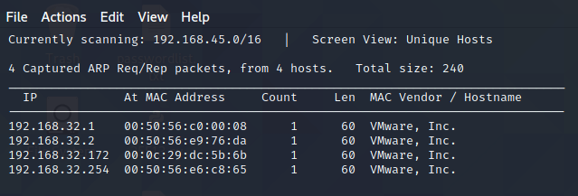

扫描对外端口

```
┌──(root💀kali)-[~/Desktop]
└─# nmap -p 1-65535 192.168.32.172                                                                                                                                                                                                     
Starting Nmap 7.92 ( https://nmap.org ) at 2022-07-17 21:56 EDT
Nmap scan report for 192.168.32.172
Host is up (0.0023s latency).
Not shown: 65532 closed tcp ports (reset)
PORT   STATE SERVICE
21/tcp open  ftp
22/tcp open  ssh
80/tcp open  http
MAC Address: 00:0C:29:DC:5B:6B (VMware)

Nmap done: 1 IP address (1 host up) scanned in 6.64 seconds
                                                                      
```

匿名登录FTP

```
┌──(root💀kali)-[~/Desktop]
└─# ftp 192.168.32.172                                                                                                                                                                                                                 
Connected to 192.168.32.172.
220 (vsFTPd 3.0.2)
Name (192.168.32.172:root): anonymous 
331 Please specify the password.
Password:
230 Login successful.
Remote system type is UNIX.
Using binary mode to transfer files.
ftp> dir
200 PORT command successful. Consider using PASV.
150 Here comes the directory listing.
-rwxrwxrwx    1 1000     0            8068 Aug 10  2014 lol.pcap
226 Directory send OK.
ftp> get lol.pcap
local: lol.pcap remote: lol.pcap
200 PORT command successful. Consider using PASV.
150 Opening BINARY mode data connection for lol.pcap (8068 bytes).
226 Transfer complete.
8068 bytes received in 0.01 secs (667.0256 kB/s)

```

分析数据包，找到一个单词`sup3rs3cr3tdirlol`和一个文件`secret_stuff.txt`

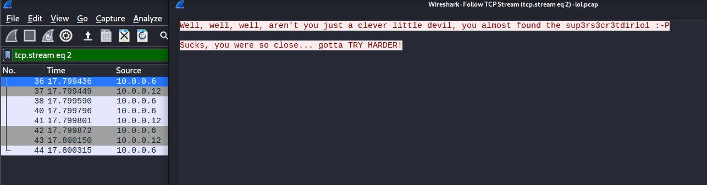

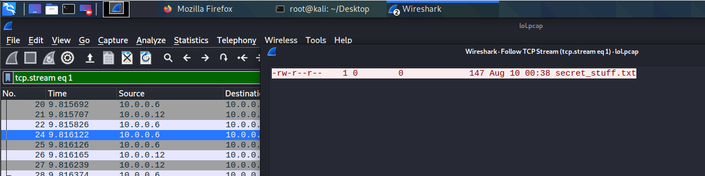

访问80端口


扫描目录

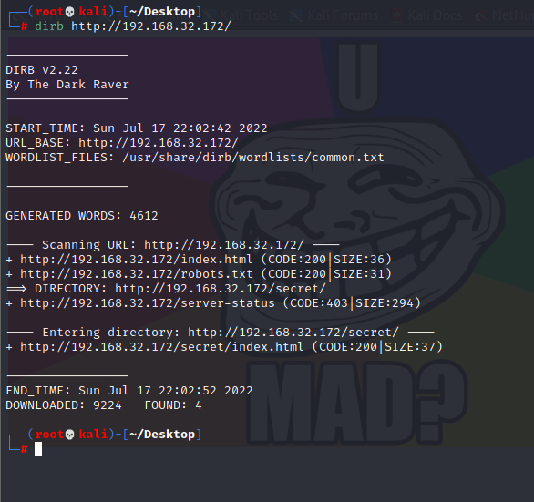

访问`secret`目录，没啥用

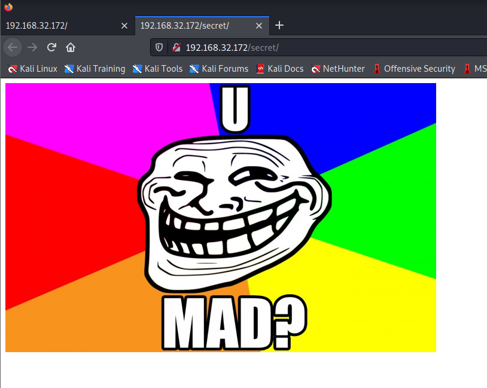

根据数据包的信息访问

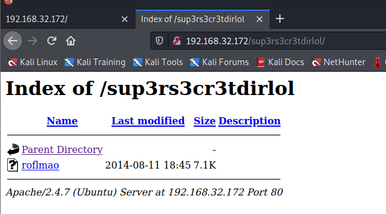

分析`roflmao`文件

```
┌──(root💀kali)-[~/Downloads]
└─# file roflmao      
roflmao: ELF 32-bit LSB executable, Intel 80386, version 1 (SYSV), dynamically linked, interpreter /lib/ld-linux.so.2, for GNU/Linux 2.6.24, BuildID[sha1]=5e14420eaa59e599c2f508490483d959f3d2cf4f, not stripped

```

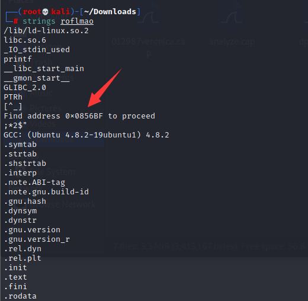

访问`0x0856BF`目录

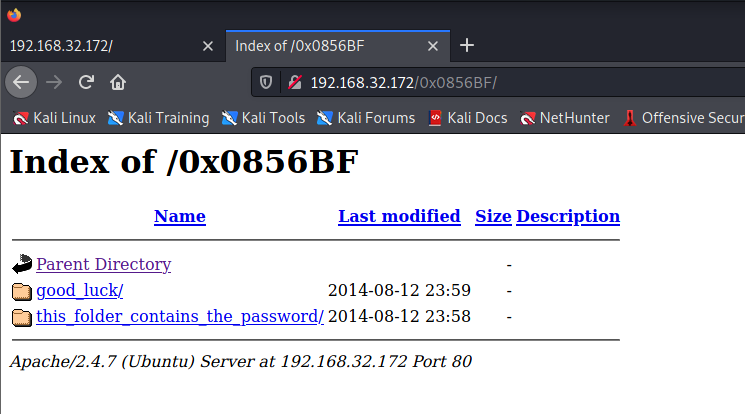

访问目录

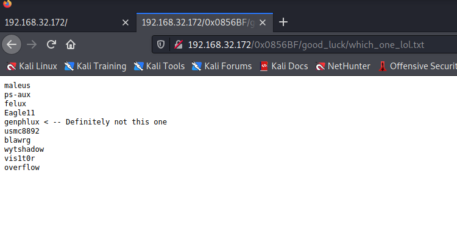

提示说这个目录包括密码，但是直接点击`Pass.txt`，没有密码

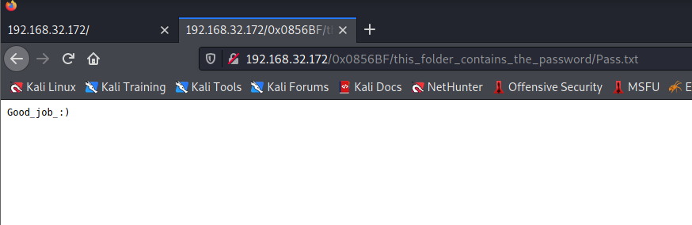

爆破密码`overflow/Pass.txt`

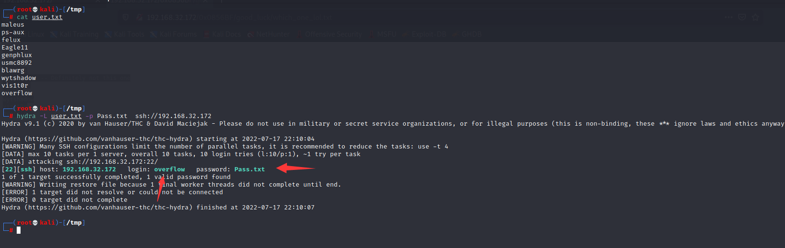

ssh登录

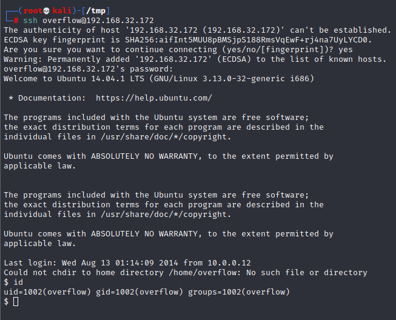

使用CVE-2015-1328进行提权


