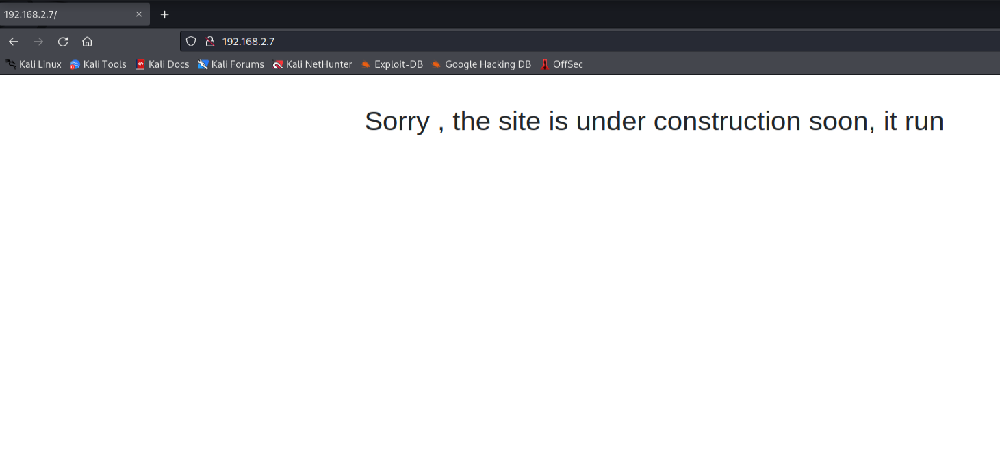
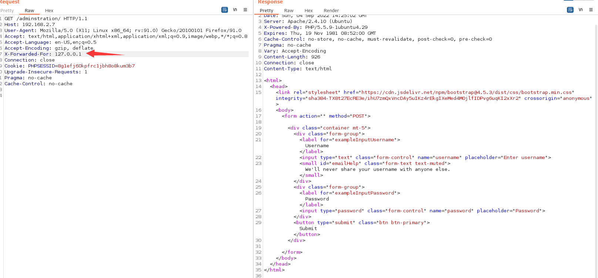
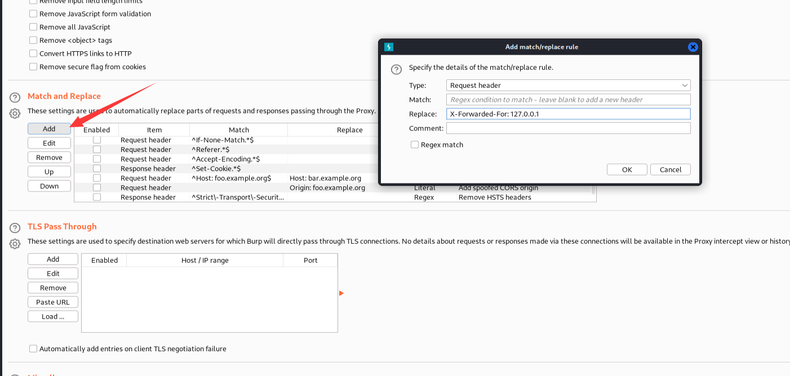
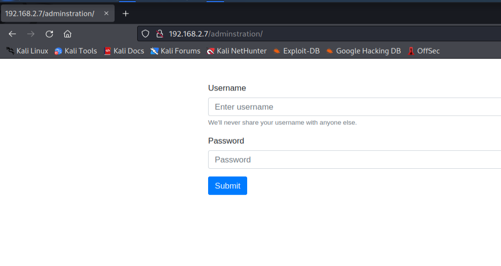
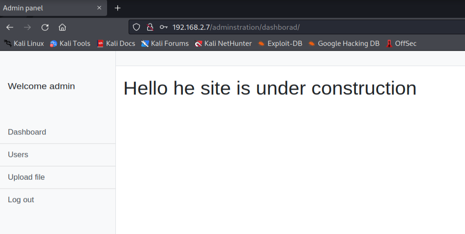
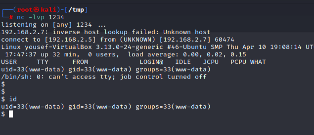

# Y0usef

> https://download.vulnhub.com/y0usef/y0usef.ova

靶场IP ：`192.168.2.7`

扫描对外端口

```
┌──(root㉿kali)-[/opt]
└─# nmap -p1-65535 -sV 192.168.2.7
Starting Nmap 7.92 ( https://nmap.org ) at 2022-09-04 10:17 EDT
Nmap scan report for 192.168.2.7
Host is up (0.00047s latency).
Not shown: 65533 closed tcp ports (reset)
PORT   STATE SERVICE VERSION
22/tcp open  ssh     OpenSSH 6.6.1p1 Ubuntu 2ubuntu2.13 (Ubuntu Linux; protocol 2.0)
80/tcp open  http    Apache httpd 2.4.10 ((Ubuntu))
MAC Address: 08:00:27:76:77:A3 (Oracle VirtualBox virtual NIC)
Service Info: OS: Linux; CPE: cpe:/o:linux:linux_kernel

Service detection performed. Please report any incorrect results at https://nmap.org/submit/ .
Nmap done: 1 IP address (1 host up) scanned in 8.04 seconds
                                                            
```

浏览器访问80端口



暴力破解目录

```
┌──(root㉿kali)-[/opt]
└─# gobuster dir -u http://192.168.2.7/ -w  /opt/raft-large-words.txt  -t 50 |grep 301
/.html.printable      (Status: 403) [Size: 301]
/adminstration        (Status: 301) [Size: 318] [--> http://192.168.2.7/adminstration/]
```

我发现了一个 Host Header 漏洞，没有浪费我们让我们打开 burp 套件并添加一个 `X-Forwarded-For: 127.0.0.1` 请求头。



> 如果应用程序信任 X-Forwarded-For 之类的 HTTP 请求标头来准确指定连接客户端的远程 IP 地址，则恶意客户端可以欺骗其 IP 地址。



这样放数据包过去就可以显示页面



使用`admin/admin`登录



上传反弹shell


反弹成功



使用`cve-2015-1328`进行提权


