# digitalworld.local: DEVELOPMENT

> https://download.vulnhub.com/digitalworld/devt-improved.7z

靶场IP：`192.168.32.200`

扫描对外端口

```
┌──(root💀kali)-[/tmp]
└─# nmap -p 1-65535 -sV  192.168.32.200                                                                                                                                                                                                
Starting Nmap 7.92 ( https://nmap.org ) at 2022-09-05 00:00 EDT
Nmap scan report for 192.168.32.200
Host is up (0.00064s latency).
Not shown: 65530 closed tcp ports (reset)
PORT     STATE SERVICE     VERSION
113/tcp  open  ident?
139/tcp  open  netbios-ssn Samba smbd 3.X - 4.X (workgroup: WORKGROUP)
445/tcp  open  netbios-ssn Samba smbd 3.X - 4.X (workgroup: WORKGROUP)
2222/tcp open  ssh         OpenSSH 7.6p1 Ubuntu 4 (Ubuntu Linux; protocol 2.0)
8080/tcp open  http-proxy  IIS 6.0

```

访问8080端口，我们得到了一些关于 `html_pages` 的线索。它可以是任何目录或网页。

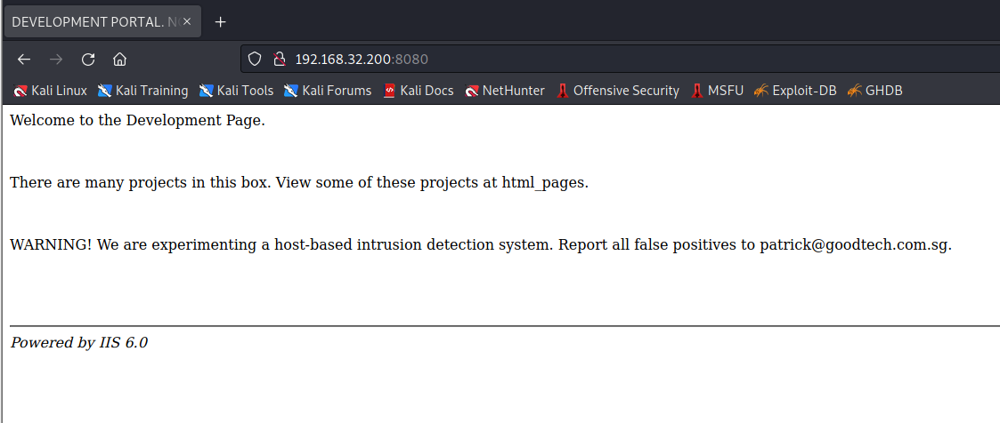

让我们深入研究源代码。在这里，他们正在谈论一些开发秘密页面，并且提到了`Patrick`，他可能是用户

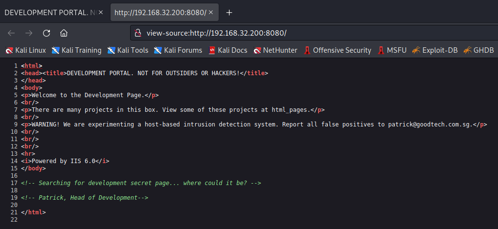

现在继续让我们浏览前面提到的网页 html_pages。在这里，我们可以再次看到一些 html 文件，其中" *development.html"*可能是我们感兴趣的。

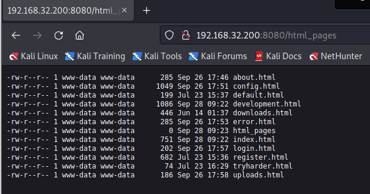

当您访问 development.html 时，您会发现`hackersecretpage`的提及似乎没有其他用处。

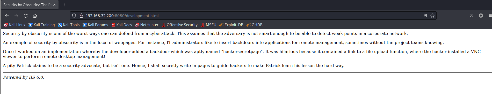

我们再次浏览了相同的源代码，发现"`./developmentsecretpage`。这似乎是我们的秘密页面。

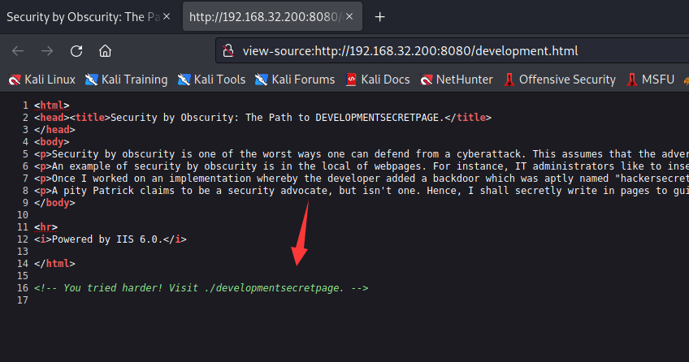

如果您访问该页面，它将确认是开发机密页面和一个名为"`Patrick`"的 PHP 文件链接。

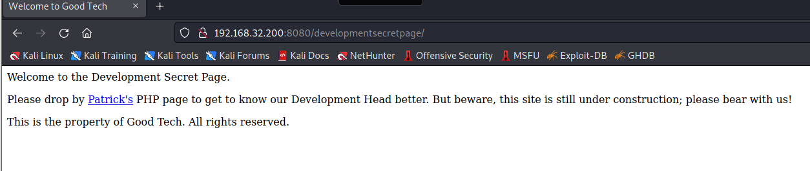

如果我们访问文件链接，它会打开一个页面，其中包含另一个名为"Sitemap"的文件。

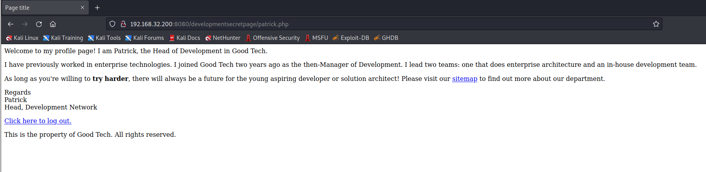

当我们访问 /sitemap.php 时，我们点击了嵌入的链接，上面写着"点击这里注销"，原来是登录页面。

```
http://192.168.32.200:8080/developmentsecretpage/sitemap.php?logout=1
```

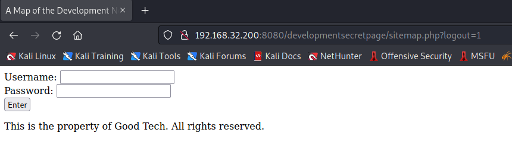

我们刚刚尝试了用户名和密码的随机登录凭据`admin`和 `1234`，这是成功的。

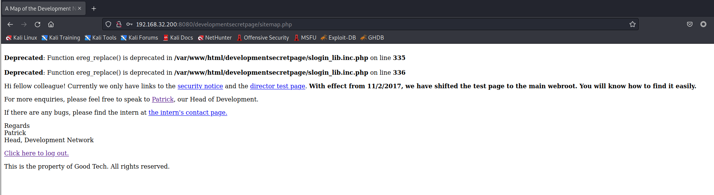

在这里，我们在页面顶部收到一条错误消息。所以我们在谷歌上搜索了一下。 我们在 Exploit-db 上发现了一个名为`/[path]/slog_users.txt`的漏洞利用，它容易受到 RFI 的攻击。参考 CVE 代码：2008-5762/63。

```
192.168.32.200:8080/developmentsecretpage/slog_users.txt
```

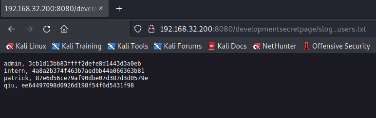

解密哈希后，我们分别获得`intern`、`Patrick` 和 `qiu` 的明文密码，但没有获得 Admin 的密码。

```
intern:12345678900987654321
patrick:P@ssw0rd25
qiu:qiu
```

使用`intern`用户登录SSH。

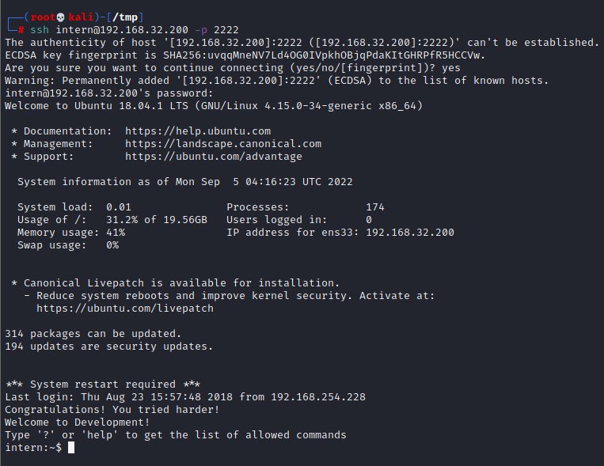

我们获得了受限 shell 的访问权限，我们只能在其中运行管理员允许的少数命令。

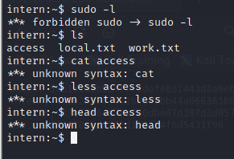

因此，要导入正确的 tty shell，我们可以使用以下命令导入`/bin/bash`：

```
echo os.system('/bin/bash')
```

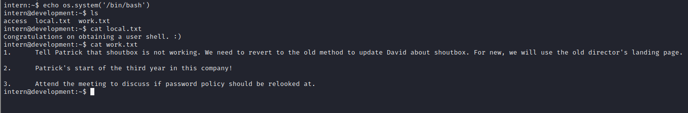

切换到`patrick`用户，并且查看sudo列表

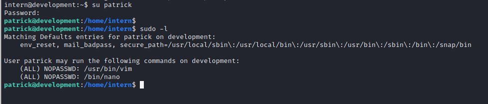

提权

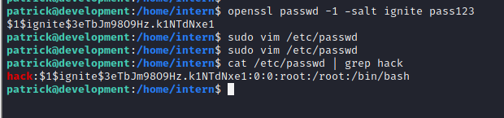

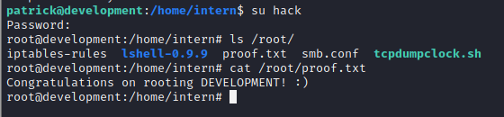